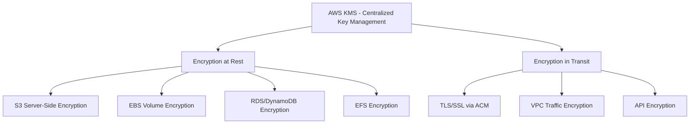

# How to Implement Encryption Everywhere on AWS

Author: [nawazdhandala](https://github.com/nawazdhandala)

Tags: AWS, Security, Encryption, KMS, Best Practices

Description: A comprehensive guide to implementing encryption at rest and in transit across all AWS services using KMS, ACM, and service-native encryption features.

---

If there's one security practice that should be non-negotiable in your AWS environment, it's encryption. Every piece of data you store should be encrypted at rest. Every byte of data that moves between services should be encrypted in transit. No exceptions.

The good news is that AWS makes this relatively painless. The bad news is that it's still optional in most cases - you have to turn it on. Let's walk through how to encrypt everything.

## The Encryption Landscape on AWS

AWS offers encryption at multiple levels, and understanding which to use where is the first step.



## Setting Up AWS KMS Properly

KMS is the foundation of your encryption strategy. Before encrypting anything, you need well-organized keys with proper access controls.

This Terraform configuration creates a KMS key structure suitable for a production environment.

```hcl
# Primary encryption key for application data
resource "aws_kms_key" "app_data" {
  description             = "Encryption key for application data"
  deletion_window_in_days = 30
  enable_key_rotation     = true  # Automatic annual rotation
  multi_region            = false

  policy = jsonencode({
    Version = "2012-10-17"
    Statement = [
      {
        Sid    = "KeyAdministration"
        Effect = "Allow"
        Principal = {
          AWS = "arn:aws:iam::${data.aws_caller_identity.current.account_id}:role/SecurityAdminRole"
        }
        Action = [
          "kms:Create*",
          "kms:Describe*",
          "kms:Enable*",
          "kms:List*",
          "kms:Put*",
          "kms:Update*",
          "kms:Revoke*",
          "kms:Disable*",
          "kms:Get*",
          "kms:Delete*",
          "kms:TagResource",
          "kms:UntagResource",
          "kms:ScheduleKeyDeletion",
          "kms:CancelKeyDeletion"
        ]
        Resource = "*"
      },
      {
        Sid    = "KeyUsage"
        Effect = "Allow"
        Principal = {
          AWS = "arn:aws:iam::${data.aws_caller_identity.current.account_id}:role/ApplicationRole"
        }
        Action = [
          "kms:Encrypt",
          "kms:Decrypt",
          "kms:ReEncrypt*",
          "kms:GenerateDataKey*",
          "kms:DescribeKey"
        ]
        Resource = "*"
      },
      {
        # Allow AWS services to use the key
        Sid    = "AllowServiceUsage"
        Effect = "Allow"
        Principal = {
          AWS = "arn:aws:iam::${data.aws_caller_identity.current.account_id}:root"
        }
        Action = [
          "kms:Encrypt",
          "kms:Decrypt",
          "kms:ReEncrypt*",
          "kms:GenerateDataKey*",
          "kms:CreateGrant"
        ]
        Resource = "*"
        Condition = {
          StringEquals = {
            "kms:ViaService" = [
              "s3.${var.region}.amazonaws.com",
              "rds.${var.region}.amazonaws.com",
              "ebs.${var.region}.amazonaws.com"
            ]
          }
        }
      }
    ]
  })
}

resource "aws_kms_alias" "app_data" {
  name          = "alias/app-data-key"
  target_key_id = aws_kms_key.app_data.key_id
}
```

Separate your key administration from key usage. The people who manage keys shouldn't be the same people who encrypt and decrypt data. This separation of duties is a fundamental security principle.

## Encrypting S3 - The Complete Picture

S3 encryption goes beyond just enabling server-side encryption. You need to enforce it via bucket policies and block unencrypted uploads.

This configuration ensures that every object in the bucket must be encrypted, and enforces HTTPS for all access.

```yaml
AWSTemplateFormatVersion: '2010-09-09'
Resources:
  EncryptedBucket:
    Type: AWS::S3::Bucket
    Properties:
      BucketEncryption:
        ServerSideEncryptionConfiguration:
          - ServerSideEncryptionByDefault:
              SSEAlgorithm: aws:kms
              KMSMasterKeyID: !Ref DataKey
            BucketKeyEnabled: true  # Reduces KMS API calls and costs
      PublicAccessBlockConfiguration:
        BlockPublicAcls: true
        BlockPublicPolicy: true
        IgnorePublicAcls: true
        RestrictPublicBuckets: true

  # Policy that denies unencrypted uploads and non-HTTPS access
  BucketPolicy:
    Type: AWS::S3::BucketPolicy
    Properties:
      Bucket: !Ref EncryptedBucket
      PolicyDocument:
        Statement:
          # Deny uploads without encryption
          - Sid: DenyUnencryptedObjectUploads
            Effect: Deny
            Principal: "*"
            Action: s3:PutObject
            Resource: !Sub "${EncryptedBucket.Arn}/*"
            Condition:
              StringNotEquals:
                s3:x-amz-server-side-encryption: aws:kms
          # Deny non-HTTPS requests
          - Sid: DenyInsecureTransport
            Effect: Deny
            Principal: "*"
            Action: "s3:*"
            Resource:
              - !GetAtt EncryptedBucket.Arn
              - !Sub "${EncryptedBucket.Arn}/*"
            Condition:
              Bool:
                aws:SecureTransport: false
```

The `BucketKeyEnabled` setting is worth noting - it uses a bucket-level key to reduce the number of KMS API calls, which can save significant money at scale.

## Encrypting EBS Volumes by Default

Instead of remembering to encrypt each volume, enable default encryption at the account level.

This script enables default EBS encryption in all regions for your account.

```python
import boto3

def enable_default_ebs_encryption():
    """Enable default EBS encryption in all regions."""
    ec2_client = boto3.client('ec2')
    regions = [r['RegionName'] for r in ec2_client.describe_regions()['Regions']]

    for region in regions:
        ec2 = boto3.client('ec2', region_name=region)
        try:
            # Enable EBS encryption by default
            ec2.enable_ebs_encryption_by_default()

            # Optionally set a custom KMS key as the default
            # ec2.modify_ebs_default_kms_key_id(KmsKeyId='alias/ebs-default-key')

            status = ec2.get_ebs_encryption_by_default()
            print(f"{region}: EBS default encryption = {status['EbsEncryptionByDefault']}")
        except Exception as e:
            print(f"{region}: Error - {e}")

enable_default_ebs_encryption()
```

Once you enable this, every new EBS volume in that region will be automatically encrypted. Existing unencrypted volumes need to be migrated by creating an encrypted snapshot and then creating a new volume from it.

## Encrypting RDS Databases

RDS encryption must be enabled at creation time - you can't encrypt an existing unencrypted database in place.

This Terraform configuration creates an encrypted RDS instance with all the security bells and whistles.

```hcl
resource "aws_db_instance" "encrypted_db" {
  identifier     = "app-database"
  engine         = "postgres"
  engine_version = "15.4"
  instance_class = "db.r6g.large"

  # Encryption settings
  storage_encrypted = true
  kms_key_id        = aws_kms_key.app_data.arn

  # Network security
  db_subnet_group_name   = aws_db_subnet_group.private.name
  vpc_security_group_ids = [aws_security_group.database.id]
  publicly_accessible    = false

  # Force SSL connections
  parameter_group_name = aws_db_parameter_group.force_ssl.name

  # Automated backups (also encrypted with same key)
  backup_retention_period = 30
  backup_window           = "03:00-04:00"

  # Enable enhanced monitoring
  monitoring_interval = 60
  monitoring_role_arn = aws_iam_role.rds_monitoring.arn
}

# Parameter group that forces SSL
resource "aws_db_parameter_group" "force_ssl" {
  family = "postgres15"
  name   = "force-ssl-postgres15"

  parameter {
    name  = "rds.force_ssl"
    value = "1"
  }
}
```

## Encryption in Transit with ACM

AWS Certificate Manager provides free TLS certificates for use with AWS services. There's no reason not to use HTTPS everywhere.

This sets up an ALB with TLS termination using a free ACM certificate.

```hcl
# Request a certificate from ACM
resource "aws_acm_certificate" "app" {
  domain_name               = "app.example.com"
  subject_alternative_names = ["*.app.example.com"]
  validation_method         = "DNS"

  lifecycle {
    create_before_destroy = true
  }
}

# ALB HTTPS listener with modern TLS policy
resource "aws_lb_listener" "https" {
  load_balancer_arn = aws_lb.app.arn
  port              = 443
  protocol          = "HTTPS"
  ssl_policy        = "ELBSecurityPolicy-TLS13-1-2-2021-06"  # TLS 1.3
  certificate_arn   = aws_acm_certificate.app.arn

  default_action {
    type             = "forward"
    target_group_arn = aws_lb_target_group.app.arn
  }
}

# Redirect HTTP to HTTPS
resource "aws_lb_listener" "http_redirect" {
  load_balancer_arn = aws_lb.app.arn
  port              = 80
  protocol          = "HTTP"

  default_action {
    type = "redirect"
    redirect {
      port        = "443"
      protocol    = "HTTPS"
      status_code = "HTTP_301"
    }
  }
}
```

Always use the latest TLS policy available. Older policies support deprecated cipher suites that could be vulnerable.

## Enforcing Encryption with SCPs

If you're using AWS Organizations, Service Control Policies let you enforce encryption across all accounts. Nobody can skip encryption, period.

This SCP prevents launching unencrypted EC2 instances or creating unencrypted RDS databases.

```json
{
  "Version": "2012-10-17",
  "Statement": [
    {
      "Sid": "DenyUnencryptedEC2",
      "Effect": "Deny",
      "Action": "ec2:RunInstances",
      "Resource": "arn:aws:ec2:*:*:volume/*",
      "Condition": {
        "Bool": {
          "ec2:Encrypted": "false"
        }
      }
    },
    {
      "Sid": "DenyUnencryptedRDS",
      "Effect": "Deny",
      "Action": "rds:CreateDBInstance",
      "Resource": "*",
      "Condition": {
        "Bool": {
          "rds:StorageEncrypted": "false"
        }
      }
    }
  ]
}
```

## Auditing Your Encryption Posture

You can't manage what you can't measure. Use AWS Config to continuously check for unencrypted resources.

```python
import boto3

def find_unencrypted_resources():
    """Scan for common unencrypted resources."""
    results = {}

    # Check EBS volumes
    ec2 = boto3.client('ec2')
    volumes = ec2.describe_volumes(
        Filters=[{'Name': 'encrypted', 'Values': ['false']}]
    )
    results['unencrypted_ebs_volumes'] = len(volumes['Volumes'])

    # Check S3 buckets
    s3 = boto3.client('s3')
    buckets = s3.list_buckets()['Buckets']
    unencrypted_buckets = []
    for bucket in buckets:
        try:
            s3.get_bucket_encryption(Bucket=bucket['Name'])
        except s3.exceptions.ClientError:
            unencrypted_buckets.append(bucket['Name'])
    results['unencrypted_s3_buckets'] = len(unencrypted_buckets)

    # Check RDS instances
    rds = boto3.client('rds')
    instances = rds.describe_db_instances()
    unencrypted_rds = [
        db['DBInstanceIdentifier']
        for db in instances['DBInstances']
        if not db['StorageEncrypted']
    ]
    results['unencrypted_rds_instances'] = len(unencrypted_rds)

    for resource_type, count in results.items():
        status = "PASS" if count == 0 else "FAIL"
        print(f"[{status}] {resource_type}: {count}")

    return results

find_unencrypted_resources()
```

## The Bottom Line

Encryption everywhere isn't just a best practice - it's quickly becoming a regulatory requirement. With GDPR, HIPAA, SOC 2, and PCI-DSS all requiring encryption, implementing it from day one saves you from painful retrofitting later.

Start by enabling default EBS encryption and S3 bucket encryption account-wide. Then enforce it with SCPs so nobody can accidentally deploy unencrypted resources. Finally, audit continuously with AWS Config to catch anything that slips through.

For a broader view of how encryption fits into your security posture, check out our guide on [defense in depth on AWS](https://oneuptime.com/blog/post/defense-in-depth-aws/view) and [data protection best practices on AWS](https://oneuptime.com/blog/post/data-protection-best-practices-aws/view).
