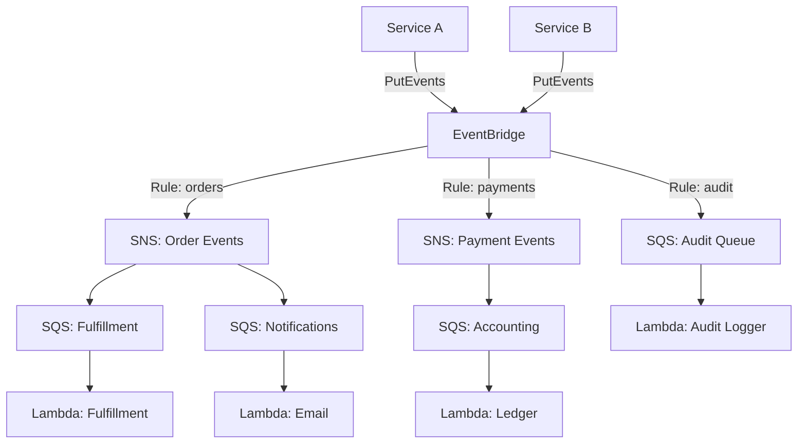

# How to Implement Event-Driven Architecture with SQS, SNS, and EventBridge

Author: [nawazdhandala](https://github.com/nawazdhandala)

Tags: AWS, SQS, SNS, EventBridge, Event-Driven Architecture

Description: A practical guide to building event-driven architectures on AWS using SQS, SNS, and EventBridge together for scalable, loosely coupled systems.

---

Event-driven architecture isn't a single pattern - it's a way of thinking about how services communicate. Instead of service A directly calling service B, service A publishes an event ("this thing happened"), and interested services react to it. This creates loose coupling, makes systems easier to scale, and lets you add new capabilities without touching existing code.

AWS gives you three core services for building event-driven systems: SQS for reliable message queuing, SNS for pub/sub fan-out, and EventBridge for intelligent event routing. Let's look at how to combine them effectively.

## The Architecture

A well-designed event-driven system on AWS typically layers these services together. EventBridge sits at the top as the event router, SNS handles fan-out to multiple consumers, and SQS provides reliable buffering for each consumer.



## Step 1: Define Your Event Schema

Good events are self-describing. They should contain enough information for consumers to act without calling back to the producer. Define a clear schema before writing any code.

This schema defines the standard event envelope for all events in your system.

```json
{
  "source": "com.myapp.orders",
  "detail-type": "Order Placed",
  "detail": {
    "order_id": "ORD-12345",
    "customer_id": "CUST-678",
    "items": [
      {
        "sku": "WIDGET-001",
        "quantity": 2,
        "price": 29.99
      }
    ],
    "total": 59.98,
    "currency": "USD",
    "placed_at": "2026-02-12T10:30:00Z"
  }
}
```

EventBridge uses the `source` and `detail-type` fields for routing, so choose meaningful values. I recommend using reverse-domain notation for sources and human-readable strings for detail types.

## Step 2: Set Up EventBridge as the Central Bus

EventBridge is your event router. Every service publishes events here, and rules determine where they go.

This code publishes an event to EventBridge from your order service.

```python
import boto3
import json
from datetime import datetime

events = boto3.client("events")

def publish_order_placed(order):
    """Publish an order placed event to EventBridge."""
    response = events.put_events(
        Entries=[
            {
                "Source": "com.myapp.orders",
                "DetailType": "Order Placed",
                "Detail": json.dumps({
                    "order_id": order["id"],
                    "customer_id": order["customer_id"],
                    "items": order["items"],
                    "total": order["total"],
                    "currency": "USD",
                    "placed_at": datetime.utcnow().isoformat()
                }),
                "EventBusName": "my-app-bus"
            }
        ]
    )

    # Check for failures
    if response["FailedEntryCount"] > 0:
        for entry in response["Entries"]:
            if "ErrorCode" in entry:
                print(f"Failed to publish: {entry['ErrorCode']}")

    return response
```

Create the custom event bus with Terraform.

```hcl
resource "aws_cloudwatch_event_bus" "app_bus" {
  name = "my-app-bus"
}

# Archive events for replay capability
resource "aws_cloudwatch_event_archive" "app_archive" {
  name             = "my-app-archive"
  event_source_arn = aws_cloudwatch_event_bus.app_bus.arn
  retention_days   = 90
}
```

## Step 3: Create EventBridge Rules

Rules determine which events go where. Each rule has an event pattern (what to match) and one or more targets (where to send matching events).

These Terraform resources route order events to an SNS topic and all events to an audit queue.

```hcl
# Route order events to SNS for fan-out
resource "aws_cloudwatch_event_rule" "order_events" {
  name           = "order-events"
  event_bus_name = aws_cloudwatch_event_bus.app_bus.name

  event_pattern = jsonencode({
    source      = ["com.myapp.orders"]
    detail-type = ["Order Placed", "Order Shipped", "Order Cancelled"]
  })
}

resource "aws_cloudwatch_event_target" "order_to_sns" {
  rule           = aws_cloudwatch_event_rule.order_events.name
  event_bus_name = aws_cloudwatch_event_bus.app_bus.name
  target_id      = "order-sns-target"
  arn            = aws_sns_topic.order_events.arn
}

# Route high-value orders to a special processing queue
resource "aws_cloudwatch_event_rule" "high_value_orders" {
  name           = "high-value-orders"
  event_bus_name = aws_cloudwatch_event_bus.app_bus.name

  event_pattern = jsonencode({
    source      = ["com.myapp.orders"]
    detail-type = ["Order Placed"]
    detail = {
      total = [{ numeric = [">", 1000] }]
    }
  })
}

# Send all events to audit queue
resource "aws_cloudwatch_event_rule" "audit_all" {
  name           = "audit-all-events"
  event_bus_name = aws_cloudwatch_event_bus.app_bus.name

  event_pattern = jsonencode({
    source = [{ prefix = "com.myapp" }]
  })
}

resource "aws_cloudwatch_event_target" "audit_to_sqs" {
  rule           = aws_cloudwatch_event_rule.audit_all.name
  event_bus_name = aws_cloudwatch_event_bus.app_bus.name
  target_id      = "audit-sqs-target"
  arn            = aws_sqs_queue.audit.arn
}
```

## Step 4: Set Up SNS for Fan-Out

When an event needs to reach multiple consumers, SNS handles the fan-out. Each consumer subscribes to the relevant topics.

```hcl
resource "aws_sns_topic" "order_events" {
  name = "order-events"
}

# Fulfillment service subscribes
resource "aws_sns_topic_subscription" "fulfillment" {
  topic_arn = aws_sns_topic.order_events.arn
  protocol  = "sqs"
  endpoint  = aws_sqs_queue.fulfillment.arn

  # Only receive Order Placed events
  filter_policy = jsonencode({
    detail-type = ["Order Placed"]
  })
}

# Notification service subscribes
resource "aws_sns_topic_subscription" "notifications" {
  topic_arn = aws_sns_topic.order_events.arn
  protocol  = "sqs"
  endpoint  = aws_sqs_queue.notifications.arn

  # Receive all order events
  filter_policy = jsonencode({
    detail-type = ["Order Placed", "Order Shipped", "Order Cancelled"]
  })
}
```

## Step 5: Buffer with SQS

Each consumer gets its own SQS queue. This provides several benefits: messages are retained if the consumer is down, you get automatic retries, and you can scale consumers independently.

This Terraform configuration sets up SQS queues with dead letter queues for each consumer.

```hcl
resource "aws_sqs_queue" "fulfillment" {
  name                       = "fulfillment-queue"
  visibility_timeout_seconds = 300
  message_retention_seconds  = 1209600  # 14 days

  redrive_policy = jsonencode({
    deadLetterTargetArn = aws_sqs_queue.fulfillment_dlq.arn
    maxReceiveCount     = 5
  })
}

resource "aws_sqs_queue" "fulfillment_dlq" {
  name                      = "fulfillment-dlq"
  message_retention_seconds = 1209600
}

resource "aws_sqs_queue" "notifications" {
  name                       = "notifications-queue"
  visibility_timeout_seconds = 60

  redrive_policy = jsonencode({
    deadLetterTargetArn = aws_sqs_queue.notifications_dlq.arn
    maxReceiveCount     = 3
  })
}

resource "aws_sqs_queue" "notifications_dlq" {
  name = "notifications-dlq"
}

resource "aws_sqs_queue" "audit" {
  name                       = "audit-queue"
  visibility_timeout_seconds = 60
}
```

## Step 6: Build Consumers

Each consumer is a Lambda function triggered by its SQS queue.

This Lambda function processes order events from the fulfillment queue.

```python
import json

def fulfillment_handler(event, context):
    """Process orders for fulfillment."""
    for record in event["Records"]:
        # SQS wraps the SNS message, which wraps the EventBridge event
        sns_message = json.loads(record["body"])
        eb_event = json.loads(sns_message["Message"])

        order = eb_event["detail"]
        print(f"Fulfilling order {order['order_id']}")

        # Reserve inventory for each item
        for item in order["items"]:
            reserve_inventory(item["sku"], item["quantity"])

        # Create shipping label
        create_shipping_label(order)

def notification_handler(event, context):
    """Send notifications for order events."""
    for record in event["Records"]:
        sns_message = json.loads(record["body"])
        eb_event = json.loads(sns_message["Message"])

        event_type = eb_event["detail-type"]
        order = eb_event["detail"]

        if event_type == "Order Placed":
            send_email(
                order["customer_id"],
                "Order Confirmation",
                f"Your order {order['order_id']} has been placed!"
            )
        elif event_type == "Order Shipped":
            send_email(
                order["customer_id"],
                "Order Shipped",
                f"Your order {order['order_id']} is on its way!"
            )
```

## Step 7: Event Replay

One of EventBridge's best features is event replay. If you archive your events, you can replay them later - useful for debugging, populating new services, or recovering from failures.

```bash
# Start a replay of all order events from the last 24 hours
aws events start-replay \
  --replay-name "order-replay-20260212" \
  --event-source-arn "arn:aws:events:us-east-1:123456789:event-bus/my-app-bus" \
  --destination '{"Arn":"arn:aws:events:us-east-1:123456789:event-bus/my-app-bus"}' \
  --event-start-time "2026-02-11T00:00:00Z" \
  --event-end-time "2026-02-12T00:00:00Z"
```

## Error Handling Strategy

In an event-driven system, you need a clear strategy for handling failures at each layer.

**EventBridge**: Events that don't match any rule are silently dropped. Use a catch-all rule to an archive or audit queue.

**SNS**: Failed deliveries go to the subscription's DLQ. Always configure one.

**SQS**: Messages that can't be processed after the max receive count go to the queue's DLQ. Monitor your DLQs actively.

For monitoring this entire pipeline, check out our guide on [monitoring SNS with CloudWatch](https://oneuptime.com/blog/post/monitor-sns-cloudwatch/view).

## Wrapping Up

Event-driven architecture with SQS, SNS, and EventBridge gives you a powerful, scalable foundation for microservices. EventBridge handles intelligent routing, SNS provides fan-out, and SQS buffers messages for reliable processing. The key is layering them correctly: publish to EventBridge, route to SNS topics, fan out to SQS queues, and consume with Lambda. Start with clear event schemas, add dead letter queues everywhere, and monitor your system end to end.
