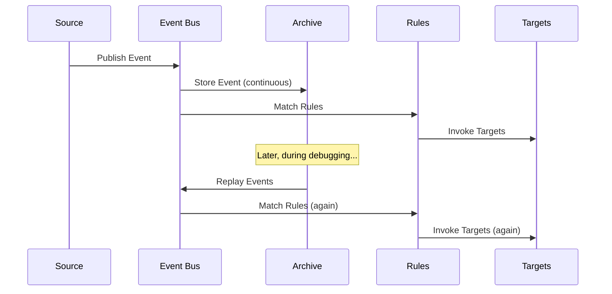

# Use EventBridge Archive and Replay for Event Debugging

Author: [nawazdhandala](https://github.com/nawazdhandala)

Tags: AWS, EventBridge, Debugging, Serverless

Description: Learn how to use Amazon EventBridge archive and replay to capture, store, and replay events for debugging, testing, and disaster recovery.

---

When something goes wrong in an event-driven system, the first question is always "what events came through?" If those events are gone - consumed by Lambda and never stored - you're stuck guessing. EventBridge Archive and Replay solves this by recording events as they flow through your bus and letting you replay them later.

It's like having a DVR for your event stream. You can rewind, look at what happened, and even replay events to test fixes.

## How Archive and Replay Works

An archive continuously captures events from an event bus. You define what events to capture using event patterns (just like rules). Events are stored in the archive with a configurable retention period. When you need to debug or recover, you create a replay that re-sends those archived events back to the bus.



## Creating an Archive

Let's create an archive that captures all events on a custom bus.

This creates an archive with 90-day retention:

```bash
aws events create-archive \
  --archive-name orders-archive \
  --event-source-arn arn:aws:events:us-east-1:123456789:event-bus/orders-bus \
  --retention-days 90 \
  --description "Archive of all order events for debugging"
```

To capture only specific events, add an event pattern:

```bash
aws events create-archive \
  --archive-name failed-orders-archive \
  --event-source-arn arn:aws:events:us-east-1:123456789:event-bus/orders-bus \
  --retention-days 180 \
  --event-pattern '{
    "source": ["orders.service"],
    "detail-type": ["OrderFailed", "PaymentFailed", "FulfillmentFailed"]
  }' \
  --description "Archive of failed order events for post-mortem analysis"
```

This way you're only paying to store the events you actually need for debugging.

## Checking Archive Status

After creating an archive, verify it's actively capturing events.

This shows the current state of your archive:

```bash
aws events describe-archive --archive-name orders-archive
```

The output includes the archive state (ENABLED, DISABLED, CREATING), event count, size in bytes, and retention configuration. Give it a few minutes after creation to start showing event counts.

## Replaying Events

When you need to re-process events - maybe after deploying a bug fix or adding a new consumer - create a replay.

This replays all events from a 2-hour window:

```bash
aws events start-replay \
  --replay-name debug-replay-2026-02-12 \
  --event-source-arn arn:aws:events:us-east-1:123456789:event-bus/orders-bus \
  --destination '{
    "Arn": "arn:aws:events:us-east-1:123456789:event-bus/orders-bus"
  }' \
  --event-start-time 2026-02-12T10:00:00Z \
  --event-end-time 2026-02-12T12:00:00Z \
  --description "Replaying events during the incident window"
```

Replayed events are sent back to the same bus (or a different one) and processed by your rules as if they were new events. The events include a `replay-name` field so you can distinguish replayed events from live events.

## Filtering Replayed Events

During a replay, you might not want every rule to fire. Maybe you only want your fixed Lambda function to process the replayed events, not the notification function that already ran.

Create a rule that only matches replayed events:

```json
{
  "source": ["orders.service"],
  "detail-type": ["OrderCreated"],
  "replay-name": ["debug-replay-2026-02-12"]
}
```

And modify your existing rules to ignore replays:

```json
{
  "source": ["orders.service"],
  "detail-type": ["OrderCreated"],
  "replay-name": [{ "exists": false }]
}
```

This way, replayed events only hit the rules you intend.

## Replay to a Different Bus

For safety, replay to a staging or debug bus instead of your production bus. This lets you test without affecting live traffic.

First, create a debug bus with its own rules:

```bash
# Create a debug bus
aws events create-event-bus --name debug-bus

# Create a rule that logs everything
aws events put-rule \
  --name log-all-debug \
  --event-bus-name debug-bus \
  --event-pattern '{"source": [{"prefix": ""}]}'

aws events put-targets \
  --rule log-all-debug \
  --event-bus-name debug-bus \
  --targets '[{
    "Id": "debug-logger",
    "Arn": "arn:aws:lambda:us-east-1:123456789:function:debug-logger"
  }]'
```

Then replay to that bus:

```bash
aws events start-replay \
  --replay-name safe-debug-replay \
  --event-source-arn arn:aws:events:us-east-1:123456789:event-bus/orders-bus \
  --destination '{
    "Arn": "arn:aws:events:us-east-1:123456789:event-bus/debug-bus"
  }' \
  --event-start-time 2026-02-12T10:00:00Z \
  --event-end-time 2026-02-12T12:00:00Z
```

## Debugging Workflow

Here's a practical debugging workflow using archive and replay.

The debug logger Lambda captures and formats events for analysis:

```javascript
// debugLogger.js - Logs replayed events with full context
const { DynamoDBClient } = require('@aws-sdk/client-dynamodb');
const { DynamoDBDocumentClient, PutCommand } = require('@aws-sdk/lib-dynamodb');

const ddbClient = DynamoDBDocumentClient.from(new DynamoDBClient({}));

exports.handler = async (event) => {
  // Log the full event for analysis
  console.log('Replayed event:', JSON.stringify(event, null, 2));

  // Store in DynamoDB for querying
  await ddbClient.send(new PutCommand({
    TableName: 'DebugEvents',
    Item: {
      eventId: event.id,
      source: event.source,
      detailType: event['detail-type'],
      time: event.time,
      detail: event.detail,
      replayName: event['replay-name'] || 'live',
      analyzedAt: new Date().toISOString()
    }
  }));

  // Check for the specific issue we're debugging
  if (event.detail.status === 'failed') {
    console.error('FOUND FAILED EVENT:', {
      orderId: event.detail.orderId,
      error: event.detail.error,
      timestamp: event.time
    });
  }
};
```

## Managing Archive Costs

Archives cost money for storage, so be strategic about what you archive and how long you keep it.

This script lists all archives and their sizes:

```bash
# List all archives with their sizes
aws events list-archives \
  --query 'Archives[].{Name:ArchiveName,State:State,Events:EventCount,SizeBytes:SizeBytes,Retention:RetentionDays}' \
  --output table
```

Cost optimization tips:
- Use event patterns to archive only the events you'd actually need for debugging
- Set shorter retention periods for high-volume, low-value events
- Set longer retention for critical business events
- Regularly review archive sizes and adjust patterns

## SAM Template for Archive Setup

This template creates a complete archive and replay infrastructure:

```yaml
AWSTemplateFormatVersion: '2010-09-09'
Transform: AWS::Serverless-2016-10-31

Resources:
  OrdersBus:
    Type: AWS::Events::EventBus
    Properties:
      Name: orders-bus

  # Archive all events
  AllEventsArchive:
    Type: AWS::Events::Archive
    Properties:
      ArchiveName: orders-all-events
      SourceArn: !GetAtt OrdersBus.Arn
      RetentionDays: 30
      Description: All order events for short-term debugging

  # Archive failures with longer retention
  FailureArchive:
    Type: AWS::Events::Archive
    Properties:
      ArchiveName: orders-failures
      SourceArn: !GetAtt OrdersBus.Arn
      RetentionDays: 365
      EventPattern:
        detail:
          status:
            - failed
            - error
      Description: Failed order events for long-term analysis

  # Debug bus for safe replays
  DebugBus:
    Type: AWS::Events::EventBus
    Properties:
      Name: orders-debug-bus

  DebugLoggerFunction:
    Type: AWS::Serverless::Function
    Properties:
      Handler: debugLogger.handler
      Runtime: nodejs20.x
      Events:
        DebugEvents:
          Type: EventBridgeRule
          Properties:
            EventBusName: !Ref DebugBus
            Pattern:
              source:
                - prefix: ""
```

## Replays for Disaster Recovery

Beyond debugging, replay is a disaster recovery tool. If a Lambda function was broken during an outage window, you can fix it and replay the missed events to catch up. This only works if your event consumers are idempotent - processing the same event twice should produce the same result. Make sure your Lambda functions check for duplicate processing using event IDs or order IDs before making changes.

## Monitoring Replays

Track replay progress through the console or CLI:

```bash
aws events describe-replay --replay-name debug-replay-2026-02-12
```

This shows the replay state (STARTING, RUNNING, COMPLETED, CANCELLED, FAILED), number of events replayed, and timing information. For ongoing monitoring of your EventBridge setup, see our post on [setting up EventBridge rules](https://oneuptime.com/blog/post/2026-02-12-eventbridge-rules-event-driven-architecture/view).

## Wrapping Up

Archive and replay turn EventBridge from a fire-and-forget system into one with full event history. You can debug production issues by looking at the exact events that caused problems. You can test fixes by replaying those events against your updated code. And you can recover from outages by replaying missed events. The key is setting up archives before you need them - you can't replay events that weren't captured.
