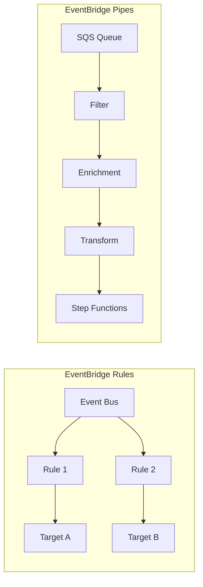

# Use EventBridge Pipes for Point-to-Point Integrations

Author: [nawazdhandala](https://github.com/nawazdhandala)

Tags: AWS, EventBridge, Serverless, Integration

Description: Learn how to use Amazon EventBridge Pipes to create point-to-point integrations between AWS services with filtering, enrichment, and transformation.

---

EventBridge rules are great for fan-out - one event, multiple targets. But sometimes you need a simpler pattern: read from one source, optionally transform the data, and send it to one target. That's exactly what EventBridge Pipes does.

Think of Pipes as a serverless conveyor belt. Data comes in from a source, passes through optional filtering and enrichment steps, and arrives at a destination. No custom code needed for the common cases.

## How Pipes Differ from Rules

EventBridge Rules match events on a bus and route them to targets. Pipes connect a source directly to a target without needing an event bus at all. Pipes can read from SQS queues, DynamoDB streams, Kinesis streams, Kafka topics, and other event sources that Rules can't.



The pipe has four stages: Source, Filtering, Enrichment, and Target. Only Source and Target are required.

## Creating a Basic Pipe

Let's start with a simple pipe that reads from an SQS queue and triggers a Lambda function.

This creates a pipe connecting SQS to Lambda:

```bash
aws pipes create-pipe \
  --name sqs-to-lambda-pipe \
  --source arn:aws:sqs:us-east-1:123456789:orders-queue \
  --target arn:aws:lambda:us-east-1:123456789:function:process-order \
  --role-arn arn:aws:iam::123456789:role/PipeRole \
  --source-parameters '{
    "SqsQueueParameters": {
      "BatchSize": 10,
      "MaximumBatchingWindowInSeconds": 30
    }
  }'
```

The pipe automatically polls the SQS queue, batches messages, and invokes the Lambda function. No Lambda trigger configuration needed - the pipe handles all of that.

## Supported Sources

Pipes can read from these event sources:

- **SQS** - Standard and FIFO queues
- **DynamoDB Streams** - Table change events
- **Kinesis Data Streams** - Real-time data streams
- **Amazon MSK** - Managed Kafka topics
- **Self-managed Kafka** - Your own Kafka clusters
- **Amazon MQ** - RabbitMQ and ActiveMQ brokers

Each source type has its own configuration options.

This creates a pipe from a DynamoDB stream:

```json
{
  "Name": "dynamodb-to-stepfunctions-pipe",
  "Source": "arn:aws:dynamodb:us-east-1:123456789:table/Orders/stream/2026-01-01T00:00:00.000",
  "SourceParameters": {
    "DynamoDBStreamParameters": {
      "StartingPosition": "LATEST",
      "BatchSize": 5,
      "MaximumBatchingWindowInSeconds": 10,
      "MaximumRetryAttempts": 3,
      "OnPartialBatchItemFailure": "AUTOMATIC_BISECT"
    }
  },
  "Target": "arn:aws:states:us-east-1:123456789:stateMachine:ProcessOrderChanges",
  "RoleArn": "arn:aws:iam::123456789:role/PipeRole"
}
```

## Adding Filtering

Not every message from the source needs to reach the target. Filters let you skip irrelevant events before they hit your target, saving you invocations and cost.

This filter only passes through order events with a total over $100:

```bash
aws pipes create-pipe \
  --name filtered-orders-pipe \
  --source arn:aws:sqs:us-east-1:123456789:orders-queue \
  --target arn:aws:lambda:us-east-1:123456789:function:process-high-value \
  --role-arn arn:aws:iam::123456789:role/PipeRole \
  --source-parameters '{
    "SqsQueueParameters": {
      "BatchSize": 10
    },
    "FilterCriteria": {
      "Filters": [
        {
          "Pattern": "{ \"body\": { \"total\": [{ \"numeric\": [\">\", 100] }] } }"
        }
      ]
    }
  }'
```

For DynamoDB streams, you can filter on the type of change:

```json
{
  "FilterCriteria": {
    "Filters": [
      {
        "Pattern": "{\"eventName\": [\"INSERT\", \"MODIFY\"], \"dynamodb\": {\"NewImage\": {\"status\": {\"S\": [\"completed\"]}}}}"
      }
    ]
  }
}
```

This only processes new or modified items where the status is "completed".

## Adding Enrichment

The enrichment step calls an external service to add data to each event before it reaches the target. This is where Pipes really shines - you can augment events with additional context without writing a full Lambda pipeline.

Enrichment sources can be Lambda functions, Step Functions, API Gateway endpoints, or API destinations.

This pipe enriches SQS messages with customer data from a Lambda function:

```json
{
  "Name": "enriched-orders-pipe",
  "Source": "arn:aws:sqs:us-east-1:123456789:orders-queue",
  "SourceParameters": {
    "SqsQueueParameters": {
      "BatchSize": 1
    }
  },
  "Enrichment": "arn:aws:lambda:us-east-1:123456789:function:enrich-with-customer-data",
  "EnrichmentParameters": {
    "InputTemplate": "{\"customerId\": <$.body.customerId>, \"orderId\": <$.body.orderId>}"
  },
  "Target": "arn:aws:states:us-east-1:123456789:stateMachine:FulfillOrder",
  "RoleArn": "arn:aws:iam::123456789:role/PipeRole"
}
```

The enrichment Lambda receives a simplified input and returns enriched data:

```javascript
// enrichWithCustomerData.js - Adds customer details to the event
const { DynamoDBClient } = require('@aws-sdk/client-dynamodb');
const { DynamoDBDocumentClient, GetCommand } = require('@aws-sdk/lib-dynamodb');

const ddbClient = DynamoDBDocumentClient.from(new DynamoDBClient({}));

exports.handler = async (events) => {
  // Enrichment receives an array of events
  const enriched = [];

  for (const event of events) {
    const customer = await ddbClient.send(new GetCommand({
      TableName: 'Customers',
      Key: { customerId: event.customerId }
    }));

    enriched.push({
      ...event,
      customerName: customer.Item?.name,
      customerEmail: customer.Item?.email,
      customerTier: customer.Item?.tier || 'standard'
    });
  }

  return enriched;
};
```

## Target Input Transformation

Before events reach the target, you can transform them to match the target's expected format.

This transforms the enriched event into the format Step Functions expects:

```json
{
  "TargetParameters": {
    "StepFunctionStateMachineParameters": {
      "InvocationType": "FIRE_AND_FORGET"
    },
    "InputTemplate": "{\"orderId\": <$.orderId>, \"customer\": {\"name\": <$.customerName>, \"email\": <$.customerEmail>, \"tier\": <$.customerTier>}, \"total\": <$.total>}"
  }
}
```

## Supported Targets

Pipes support many target types:

- **Lambda** - Function invocation
- **Step Functions** - Start execution
- **SQS** - Send message
- **SNS** - Publish notification
- **EventBridge** - Put event on a bus
- **Kinesis** - Put record
- **ECS** - Run task
- **API Gateway** - HTTP request
- **API Destinations** - External HTTP endpoints
- **CloudWatch Logs** - Log group

## CloudFormation Template

Here's a complete CloudFormation template for a pipe with all stages.

This creates a fully configured pipe with filtering, enrichment, and transformation:

```yaml
AWSTemplateFormatVersion: '2010-09-09'

Resources:
  OrderQueue:
    Type: AWS::SQS::Queue
    Properties:
      QueueName: order-events

  EnrichmentFunction:
    Type: AWS::Lambda::Function
    Properties:
      FunctionName: enrich-order
      Runtime: nodejs20.x
      Handler: index.handler
      Role: !GetAtt EnrichmentRole.Arn
      Code:
        ZipFile: |
          exports.handler = async (events) => {
            return events.map(e => ({
              ...e,
              enrichedAt: new Date().toISOString(),
              priority: e.total > 1000 ? 'high' : 'normal'
            }));
          };

  OrderPipe:
    Type: AWS::Pipes::Pipe
    Properties:
      Name: order-processing-pipe
      RoleArn: !GetAtt PipeRole.Arn
      Source: !GetAtt OrderQueue.Arn
      SourceParameters:
        SqsQueueParameters:
          BatchSize: 5
          MaximumBatchingWindowInSeconds: 30
        FilterCriteria:
          Filters:
            - Pattern: '{"body": {"status": ["confirmed"]}}'
      Enrichment: !GetAtt EnrichmentFunction.Arn
      Target: !GetAtt ProcessingStateMachine.Arn
      TargetParameters:
        StepFunctionStateMachineParameters:
          InvocationType: FIRE_AND_FORGET

  PipeRole:
    Type: AWS::IAM::Role
    Properties:
      AssumeRolePolicyDocument:
        Version: '2012-10-17'
        Statement:
          - Effect: Allow
            Principal:
              Service: pipes.amazonaws.com
            Action: sts:AssumeRole
      Policies:
        - PolicyName: PipePolicy
          PolicyDocument:
            Version: '2012-10-17'
            Statement:
              - Effect: Allow
                Action:
                  - sqs:ReceiveMessage
                  - sqs:DeleteMessage
                  - sqs:GetQueueAttributes
                Resource: !GetAtt OrderQueue.Arn
              - Effect: Allow
                Action: lambda:InvokeFunction
                Resource: !GetAtt EnrichmentFunction.Arn
              - Effect: Allow
                Action: states:StartExecution
                Resource: !GetAtt ProcessingStateMachine.Arn
```

## When to Use Pipes vs Rules

Use Pipes when you have a single source and single target, when your source isn't an event bus (SQS, DynamoDB Streams, Kinesis), or when you need the enrichment step. Use Rules when you need fan-out to multiple targets or when your events are already on an EventBridge bus.

For more on EventBridge rules, see our post on [setting up EventBridge rules for event-driven architecture](https://oneuptime.com/blog/post/eventbridge-rules-event-driven-architecture/view).

## Monitoring Pipes

Pipes publish metrics to CloudWatch including `Invocations`, `ExecutionFailed`, `ExecutionThrottled`, and `IngestionRate`. Set up alarms on failure metrics to catch problems early.

## Wrapping Up

EventBridge Pipes fills the gap between simple point-to-point integrations and full event bus architectures. The built-in filtering and enrichment stages handle common patterns that previously required custom Lambda glue code. If you're building a pipeline that reads from one source, optionally transforms the data, and writes to one destination, Pipes is probably the simplest way to do it.
