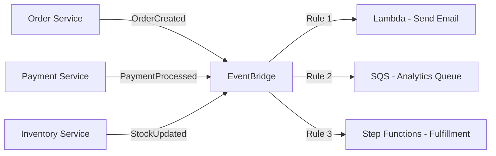

# Set Up EventBridge Rules for Event-Driven Architecture

Author: [nawazdhandala](https://github.com/nawazdhandala)

Tags: AWS, EventBridge, Event-Driven Architecture, Serverless

Description: Learn how to set up Amazon EventBridge rules to build loosely coupled, event-driven architectures with pattern matching and multiple targets.

---

Event-driven architecture is one of those patterns that sounds complicated in theory but feels natural once you start building. Instead of services calling each other directly, they publish events. Other services subscribe to the events they care about. The result is loose coupling, independent scaling, and systems that are much easier to extend.

Amazon EventBridge is the glue that makes this work on AWS. It's a serverless event bus that routes events from sources to targets based on rules you define. Let's set it up.

## How EventBridge Works

EventBridge has three core concepts: events, rules, and targets.

An event is a JSON object that describes something that happened. A rule matches events using patterns. A target is what happens when a rule matches - it could be a Lambda function, SQS queue, Step Functions state machine, or any of 20+ supported targets.



## Creating Your First Rule

Let's start with a simple rule that triggers a Lambda function when an order is created.

First, put an event on the default event bus:

```javascript
// publishEvent.js - Publishes a custom event to EventBridge
const { EventBridgeClient, PutEventsCommand }
  = require('@aws-sdk/client-eventbridge');

const ebClient = new EventBridgeClient({});

async function publishOrderCreated(order) {
  await ebClient.send(new PutEventsCommand({
    Entries: [
      {
        Source: 'orders.service',
        DetailType: 'OrderCreated',
        Detail: JSON.stringify({
          orderId: order.id,
          customerId: order.customerId,
          items: order.items,
          total: order.total,
          createdAt: new Date().toISOString()
        })
      }
    ]
  }));
}
```

Now create a rule that matches this event:

```bash
aws events put-rule \
  --name order-created-rule \
  --event-pattern '{
    "source": ["orders.service"],
    "detail-type": ["OrderCreated"]
  }' \
  --description "Matches all OrderCreated events from the orders service"
```

Then add a Lambda function as the target:

```bash
aws events put-targets \
  --rule order-created-rule \
  --targets '[{
    "Id": "send-confirmation-email",
    "Arn": "arn:aws:lambda:us-east-1:123456789:function:send-confirmation"
  }]'
```

Don't forget to grant EventBridge permission to invoke your Lambda:

```bash
aws lambda add-permission \
  --function-name send-confirmation \
  --statement-id eventbridge-invoke \
  --action lambda:InvokeFunction \
  --principal events.amazonaws.com \
  --source-arn arn:aws:events:us-east-1:123456789:rule/order-created-rule
```

## Event Pattern Matching

Event patterns are the heart of EventBridge rules. They define which events a rule cares about. Patterns use a declarative JSON format that matches against event fields.

### Matching by source and detail-type

This is the most common pattern - matching events from a specific service:

```json
{
  "source": ["orders.service"],
  "detail-type": ["OrderCreated", "OrderUpdated"]
}
```

This matches events from `orders.service` with either the `OrderCreated` or `OrderUpdated` detail type.

### Matching on event content

You can match on fields inside the `detail` object:

```json
{
  "source": ["orders.service"],
  "detail-type": ["OrderCreated"],
  "detail": {
    "total": [{ "numeric": [">=", 1000] }],
    "items": {
      "category": ["electronics"]
    }
  }
}
```

This matches orders of $1,000 or more that contain electronics items.

### Prefix matching

Match values that start with a specific string:

```json
{
  "source": [{ "prefix": "orders" }],
  "detail": {
    "region": [{ "prefix": "us-" }]
  }
}
```

### Anything-but matching

Match everything except specific values:

```json
{
  "detail": {
    "status": [{ "anything-but": ["draft", "cancelled"] }]
  }
}
```

### Exists matching

Check if a field exists or doesn't exist:

```json
{
  "detail": {
    "couponCode": [{ "exists": true }],
    "giftWrap": [{ "exists": false }]
  }
}
```

## Multiple Targets

A single rule can trigger up to five targets. This is powerful for fan-out scenarios.

This rule sends order events to three different targets:

```bash
aws events put-targets \
  --rule order-created-rule \
  --targets '[
    {
      "Id": "send-email",
      "Arn": "arn:aws:lambda:us-east-1:123456789:function:send-confirmation"
    },
    {
      "Id": "update-analytics",
      "Arn": "arn:aws:sqs:us-east-1:123456789:analytics-queue"
    },
    {
      "Id": "start-fulfillment",
      "Arn": "arn:aws:states:us-east-1:123456789:stateMachine:FulfillOrder",
      "RoleArn": "arn:aws:iam::123456789:role/EventBridgeStepFunctionsRole"
    }
  ]'
```

One event triggers an email, updates analytics, and starts the fulfillment process. Each target is independent - if the email function fails, the other targets still execute.

## Input Transformation

You don't always want to send the entire event to every target. Input transformers let you reshape the data.

This transforms the event before sending it to the target:

```bash
aws events put-targets \
  --rule order-created-rule \
  --targets '[{
    "Id": "send-email",
    "Arn": "arn:aws:lambda:us-east-1:123456789:function:send-email",
    "InputTransformer": {
      "InputPathsMap": {
        "orderId": "$.detail.orderId",
        "customerId": "$.detail.customerId",
        "total": "$.detail.total"
      },
      "InputTemplate": "{ \"to\": <customerId>, \"subject\": \"Order Confirmation\", \"orderId\": <orderId>, \"total\": <total> }"
    }
  }]'
```

The `InputPathsMap` extracts values from the event. The `InputTemplate` shapes the output. This way your Lambda function receives exactly the data it needs, nothing more.

## Scheduled Rules

EventBridge isn't just for custom events - it can also trigger on a schedule. This replaces CloudWatch Events scheduled rules.

This runs a cleanup function every hour:

```bash
aws events put-rule \
  --name hourly-cleanup \
  --schedule-expression "rate(1 hour)" \
  --description "Runs cleanup every hour"
```

You can use cron expressions for more precise scheduling:

```bash
aws events put-rule \
  --name daily-report \
  --schedule-expression "cron(0 9 * * ? *)" \
  --description "Runs daily report at 9 AM UTC"
```

For more advanced scheduling, check out our post on [using EventBridge Scheduler for cron and one-time events](https://oneuptime.com/blog/post/2026-02-12-eventbridge-scheduler-cron-one-time-events/view).

## SAM Template Example

Here's a complete SAM template that sets up an event-driven architecture:

```yaml
AWSTemplateFormatVersion: '2010-09-09'
Transform: AWS::Serverless-2016-10-31

Resources:
  # Lambda that publishes events
  OrderFunction:
    Type: AWS::Serverless::Function
    Properties:
      Handler: createOrder.handler
      Runtime: nodejs20.x
      Policies:
        - EventBridgePutEventsPolicy:
            EventBusName: default

  # Lambda triggered by order events
  EmailFunction:
    Type: AWS::Serverless::Function
    Properties:
      Handler: sendEmail.handler
      Runtime: nodejs20.x
      Events:
        OrderCreated:
          Type: EventBridgeRule
          Properties:
            Pattern:
              source:
                - orders.service
              detail-type:
                - OrderCreated

  # Lambda triggered by high-value orders
  HighValueFunction:
    Type: AWS::Serverless::Function
    Properties:
      Handler: highValueAlert.handler
      Runtime: nodejs20.x
      Events:
        HighValueOrder:
          Type: EventBridgeRule
          Properties:
            Pattern:
              source:
                - orders.service
              detail-type:
                - OrderCreated
              detail:
                total:
                  - numeric:
                      - ">="
                      - 10000
```

## Testing Rules

Testing event patterns before deploying is crucial. Use the `test-event-pattern` CLI command.

This checks if an event matches your pattern:

```bash
aws events test-event-pattern \
  --event-pattern '{
    "source": ["orders.service"],
    "detail-type": ["OrderCreated"],
    "detail": { "total": [{ "numeric": [">=", 1000] }] }
  }' \
  --event '{
    "source": "orders.service",
    "detail-type": "OrderCreated",
    "detail": { "orderId": "123", "total": 1500 }
  }'
```

If the event matches, you get `{ "Result": true }`.

## Wrapping Up

EventBridge rules are the foundation of event-driven architecture on AWS. Define your event patterns carefully, use input transformers to decouple producers from consumers, and take advantage of multiple targets for fan-out. The result is a system where services communicate through events instead of direct calls, making each service easier to develop, deploy, and scale independently.
