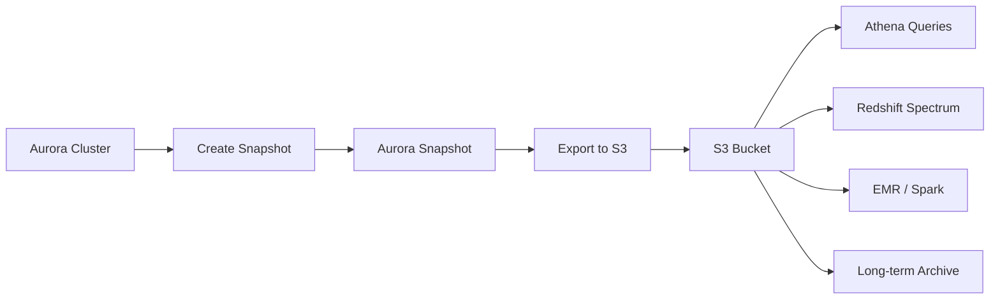

# How to Export Aurora Snapshots to S3

Author: [nawazdhandala](https://github.com/nawazdhandala)

Tags: AWS, Aurora, S3, Snapshots, Backup

Description: A complete guide to exporting Aurora database snapshots to Amazon S3 in Apache Parquet format for analytics, long-term archival, and data lake integration.

---

Aurora snapshots are great for database recovery, but they live inside the RDS ecosystem. What if you want to analyze that data in Athena, load it into Redshift, or just keep a long-term archive in S3? That's exactly what Aurora snapshot export does - it takes your snapshot data and writes it to S3 in Apache Parquet format, which is perfect for analytics workloads.

Let's walk through the entire process from start to finish.

## What Snapshot Export Does

When you export a snapshot to S3, Aurora doesn't just dump a raw database file. It converts the data into Apache Parquet format, which is a columnar storage format designed for analytics. This means you can immediately query the exported data using Amazon Athena, Amazon Redshift Spectrum, or any other tool that reads Parquet files.

The export process runs in the background and doesn't affect your running cluster at all. It reads from the snapshot, not the live database.



## Prerequisites

You'll need:
- An Aurora snapshot (manual or automated)
- An S3 bucket for the export destination
- A KMS key for encrypting the exported data
- An IAM role that grants Aurora access to the S3 bucket and KMS key

## Step 1: Create the S3 Bucket

If you don't already have a destination bucket, create one:

```bash
# Create the S3 bucket for snapshot exports
aws s3 mb s3://my-aurora-exports --region us-east-1

# Enable versioning for safety
aws s3api put-bucket-versioning \
  --bucket my-aurora-exports \
  --versioning-configuration Status=Enabled
```

## Step 2: Create or Identify a KMS Key

The exported data must be encrypted. You can use the default `aws/s3` key or create a custom one:

```bash
# Create a custom KMS key for snapshot exports
aws kms create-key \
  --description "Key for Aurora snapshot exports" \
  --key-usage ENCRYPT_DECRYPT \
  --origin AWS_KMS

# Create an alias for easy reference
aws kms create-alias \
  --alias-name alias/aurora-export-key \
  --target-key-id <key-id-from-above>
```

## Step 3: Set Up the IAM Role

Aurora needs an IAM role to write to S3 and use the KMS key. Here's the complete setup:

Create the trust policy:

```bash
# Create the trust policy file
cat > export-trust-policy.json << 'JSONEOF'
{
  "Version": "2012-10-17",
  "Statement": [
    {
      "Effect": "Allow",
      "Principal": {
        "Service": "export.rds.amazonaws.com"
      },
      "Action": "sts:AssumeRole"
    }
  ]
}
JSONEOF

# Create the role
aws iam create-role \
  --role-name AuroraSnapshotExportRole \
  --assume-role-policy-document file://export-trust-policy.json
```

Create and attach the permissions policy:

```bash
# Create the permissions policy file
cat > export-permissions.json << 'JSONEOF'
{
  "Version": "2012-10-17",
  "Statement": [
    {
      "Effect": "Allow",
      "Action": [
        "s3:PutObject",
        "s3:GetObject",
        "s3:ListBucket",
        "s3:DeleteObject",
        "s3:GetBucketLocation"
      ],
      "Resource": [
        "arn:aws:s3:::my-aurora-exports",
        "arn:aws:s3:::my-aurora-exports/*"
      ]
    },
    {
      "Effect": "Allow",
      "Action": [
        "kms:Encrypt",
        "kms:Decrypt",
        "kms:ReEncrypt*",
        "kms:GenerateDataKey*",
        "kms:CreateGrant",
        "kms:DescribeKey"
      ],
      "Resource": "arn:aws:kms:us-east-1:123456789012:key/your-kms-key-id"
    }
  ]
}
JSONEOF

# Attach the policy to the role
aws iam put-role-policy \
  --role-name AuroraSnapshotExportRole \
  --policy-name AuroraExportPermissions \
  --policy-document file://export-permissions.json
```

## Step 4: Create the Snapshot (If Needed)

If you don't already have a snapshot, create one:

```bash
# Create a manual snapshot of your Aurora cluster
aws rds create-db-cluster-snapshot \
  --db-cluster-identifier my-aurora-cluster \
  --db-cluster-snapshot-identifier my-export-snapshot-20260212

# Wait for the snapshot to complete
aws rds wait db-cluster-snapshot-available \
  --db-cluster-snapshot-identifier my-export-snapshot-20260212
```

## Step 5: Start the Export

Now you can kick off the export. You can export the entire snapshot or specific databases/tables.

Export the full snapshot:

```bash
# Export the entire snapshot to S3
aws rds start-export-task \
  --export-task-identifier my-snapshot-export-20260212 \
  --source-arn arn:aws:rds:us-east-1:123456789012:cluster-snapshot:my-export-snapshot-20260212 \
  --s3-bucket-name my-aurora-exports \
  --s3-prefix aurora/full-export/ \
  --iam-role-arn arn:aws:iam::123456789012:role/AuroraSnapshotExportRole \
  --kms-key-id arn:aws:kms:us-east-1:123456789012:key/your-kms-key-id
```

Export only specific tables (much faster for large databases):

```bash
# Export only the users and orders tables
aws rds start-export-task \
  --export-task-identifier my-partial-export-20260212 \
  --source-arn arn:aws:rds:us-east-1:123456789012:cluster-snapshot:my-export-snapshot-20260212 \
  --s3-bucket-name my-aurora-exports \
  --s3-prefix aurora/partial-export/ \
  --iam-role-arn arn:aws:iam::123456789012:role/AuroraSnapshotExportRole \
  --kms-key-id arn:aws:kms:us-east-1:123456789012:key/your-kms-key-id \
  --export-only "mydb.users" "mydb.orders"
```

## Step 6: Monitor the Export

Exports can take a while for large databases. Monitor the progress:

```bash
# Check export task status
aws rds describe-export-tasks \
  --export-task-identifier my-snapshot-export-20260212 \
  --query 'ExportTasks[0].{Status:Status,PercentProgress:PercentProgress,TotalExtractedDataInGB:TotalExtractedDataInGB,FailureCause:FailureCause}'
```

You can also list all export tasks:

```bash
# List all export tasks and their statuses
aws rds describe-export-tasks \
  --query 'ExportTasks[*].{ID:ExportTaskIdentifier,Status:Status,Progress:PercentProgress,Size:TotalExtractedDataInGB}'  \
  --output table
```

## Querying Exported Data with Athena

Once the export is complete, you can query it immediately with Athena. First, create a Glue Crawler or manually define the table.

Here's a manual table definition for Athena:

```sql
-- Create an Athena table pointing to the exported Parquet data
CREATE EXTERNAL TABLE aurora_export.users (
    id BIGINT,
    email STRING,
    name STRING,
    created_at TIMESTAMP,
    status STRING
)
STORED AS PARQUET
LOCATION 's3://my-aurora-exports/aurora/full-export/mydb/users/'
TBLPROPERTIES ('parquet.compression'='SNAPPY');

-- Query the exported data
SELECT status, COUNT(*) as user_count
FROM aurora_export.users
GROUP BY status
ORDER BY user_count DESC;
```

## Automating Exports

For regular data lake ingestion, you'll want to automate the export process. Here's a Lambda function that triggers an export whenever a snapshot is created:

```python
import boto3
import json
from datetime import datetime

def lambda_handler(event, context):
    """
    Triggered by RDS snapshot creation events via EventBridge.
    Automatically exports the snapshot to S3.
    """
    rds = boto3.client('rds')

    # Extract snapshot details from the event
    snapshot_arn = event['detail']['SourceArn']
    snapshot_id = event['detail']['SourceIdentifier']

    # Generate a unique export task ID
    timestamp = datetime.now().strftime('%Y%m%d-%H%M%S')
    export_id = f"auto-export-{timestamp}"

    print(f"Starting export for snapshot: {snapshot_id}")

    try:
        response = rds.start_export_task(
            ExportTaskIdentifier=export_id,
            SourceArn=snapshot_arn,
            S3BucketName='my-aurora-exports',
            S3Prefix=f'aurora/automated/{timestamp}/',
            IamRoleArn='arn:aws:iam::123456789012:role/AuroraSnapshotExportRole',
            KmsKeyId='arn:aws:kms:us-east-1:123456789012:key/your-kms-key-id'
        )

        print(f"Export started: {export_id}")
        return {
            'statusCode': 200,
            'body': json.dumps({
                'exportTaskId': export_id,
                'status': response['Status']
            })
        }
    except Exception as e:
        print(f"Export failed: {str(e)}")
        raise
```

Set up the EventBridge rule to trigger this Lambda:

```bash
# Create an EventBridge rule for snapshot creation events
aws events put-rule \
  --name aurora-snapshot-export-trigger \
  --event-pattern '{
    "source": ["aws.rds"],
    "detail-type": ["RDS DB Cluster Snapshot Event"],
    "detail": {
      "EventID": ["RDS-EVENT-0075"]
    }
  }'

# Add the Lambda function as the target
aws events put-targets \
  --rule aurora-snapshot-export-trigger \
  --targets "Id=ExportLambda,Arn=arn:aws:lambda:us-east-1:123456789012:function:aurora-export-trigger"
```

## Cost Considerations

Snapshot exports have two cost components:

- **Export processing** - You pay per GB of snapshot data processed
- **S3 storage** - Standard S3 storage costs for the exported Parquet files

The Parquet format is typically much smaller than the raw database storage because of columnar compression. A 500 GB database might export to 100-200 GB of Parquet files depending on data types and compression.

## Wrapping Up

Exporting Aurora snapshots to S3 bridges the gap between your operational database and your analytics infrastructure. The Parquet format makes the data immediately queryable with Athena, Redshift Spectrum, or Spark. Automate the process with EventBridge and Lambda, and you've got a hands-off pipeline from Aurora to your data lake.

For more on managing your Aurora infrastructure, check out how [Aurora cloning](https://oneuptime.com/blog/post/2026-02-12-aurora-cloning-for-fast-database-copies/view) can help you create quick copies for testing, or how to [configure Aurora endpoints](https://oneuptime.com/blog/post/2026-02-12-configure-aurora-endpoints-writer-reader-custom/view) for optimal traffic routing.
