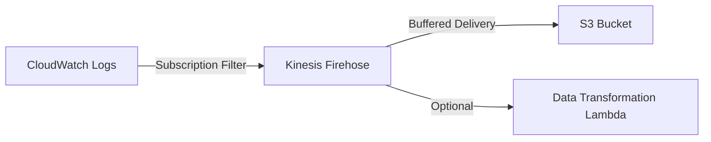

# How to Export CloudWatch Logs to S3

Author: [nawazdhandala](https://github.com/nawazdhandala)

Tags: AWS, CloudWatch, S3, Logging, Cost Optimization

Description: Step-by-step guide to exporting CloudWatch Logs to S3 for long-term archival, cost optimization, and integration with analytics tools like Athena and Spark.

---

CloudWatch Logs is great for real-time monitoring and short-term analysis. But storing logs in CloudWatch indefinitely gets expensive fast. S3 is significantly cheaper for long-term storage, and once your logs are in S3, you can query them with Athena, process them with Spark, or archive them to Glacier for compliance.

There are two ways to get logs from CloudWatch to S3: one-time export tasks and continuous streaming via subscription filters. This post covers both approaches.

## Cost Comparison

Let's put the cost savings in perspective. As of early 2026, CloudWatch Logs charges about $0.50 per GB for ingestion and $0.03 per GB per month for storage. S3 Standard costs about $0.023 per GB per month, and S3 Glacier Instant Retrieval costs about $0.004 per GB per month.

If you're storing 1 TB of logs for a year:
- CloudWatch Logs: ~$360/year for storage alone
- S3 Standard: ~$276/year
- S3 Glacier Instant Retrieval: ~$48/year

The savings add up quickly at scale. The strategy is simple: keep recent logs in CloudWatch for real-time analysis, and export older logs to S3.

## Method 1: One-Time Export Tasks

Export tasks let you copy a time range of log data from a log group to an S3 bucket. This is useful for backups, compliance snapshots, or migrating historical data.

### Set up the S3 bucket

First, create a bucket with the right permissions:

```bash
# Create the bucket for log exports
aws s3 mb s3://my-cloudwatch-log-exports --region us-east-1
```

The bucket needs a policy that allows CloudWatch Logs to write to it:

```json
{
  "Version": "2012-10-17",
  "Statement": [
    {
      "Sid": "AllowCloudWatchLogsExport",
      "Effect": "Allow",
      "Principal": {
        "Service": "logs.us-east-1.amazonaws.com"
      },
      "Action": "s3:GetBucketAcl",
      "Resource": "arn:aws:s3:::my-cloudwatch-log-exports",
      "Condition": {
        "StringEquals": {
          "aws:SourceAccount": "123456789012"
        }
      }
    },
    {
      "Sid": "AllowCloudWatchLogsPut",
      "Effect": "Allow",
      "Principal": {
        "Service": "logs.us-east-1.amazonaws.com"
      },
      "Action": "s3:PutObject",
      "Resource": "arn:aws:s3:::my-cloudwatch-log-exports/*",
      "Condition": {
        "StringEquals": {
          "s3:x-amz-acl": "bucket-owner-full-control",
          "aws:SourceAccount": "123456789012"
        }
      }
    }
  ]
}
```

Apply the policy:

```bash
# Apply the bucket policy
aws s3api put-bucket-policy \
  --bucket my-cloudwatch-log-exports \
  --policy file://bucket-policy.json
```

### Create the export task

Now export the logs:

```bash
# Export the last 24 hours of logs to S3
aws logs create-export-task \
  --task-name "daily-api-logs-export" \
  --log-group-name "/myapp/production/api" \
  --from $(date -d '24 hours ago' +%s000) \
  --to $(date +%s000) \
  --destination "my-cloudwatch-log-exports" \
  --destination-prefix "logs/api/2026/02/12"
```

Check the status:

```bash
# Check export task status
aws logs describe-export-tasks \
  --task-id "task-id-from-previous-command"
```

Export tasks can take a while for large log groups. CloudWatch can only run one export task at a time per account, so don't try to export multiple log groups simultaneously.

### Automate daily exports

Use a Lambda function triggered by EventBridge to export logs daily:

```python
import boto3
import time
from datetime import datetime, timedelta

logs_client = boto3.client('logs')

def handler(event, context):
    """Export yesterday's logs to S3."""
    log_groups = [
        '/myapp/production/api',
        '/myapp/production/worker',
        '/aws/lambda/order-processor',
    ]

    yesterday = datetime.utcnow() - timedelta(days=1)
    from_time = int(yesterday.replace(hour=0, minute=0, second=0).timestamp() * 1000)
    to_time = int(yesterday.replace(hour=23, minute=59, second=59).timestamp() * 1000)
    date_prefix = yesterday.strftime('%Y/%m/%d')

    for log_group in log_groups:
        # Clean up the log group name for the S3 prefix
        group_name = log_group.strip('/').replace('/', '-')

        try:
            response = logs_client.create_export_task(
                taskName=f'daily-export-{group_name}-{date_prefix}',
                logGroupName=log_group,
                fromTime=from_time,
                to=to_time,
                destination='my-cloudwatch-log-exports',
                destinationPrefix=f'logs/{group_name}/{date_prefix}'
            )
            print(f"Started export for {log_group}: {response['taskId']}")

            # Wait for the task to complete before starting the next one
            # (only one export task can run at a time)
            wait_for_export(response['taskId'])

        except Exception as e:
            print(f"Failed to export {log_group}: {e}")

def wait_for_export(task_id):
    """Wait for an export task to complete."""
    while True:
        response = logs_client.describe_export_tasks(taskId=task_id)
        status = response['exportTasks'][0]['status']['code']
        if status in ('COMPLETED', 'FAILED', 'CANCELLED'):
            print(f"Export task {task_id} finished with status: {status}")
            return
        time.sleep(10)
```

## Method 2: Continuous Streaming with Subscription Filters

For real-time log delivery to S3, use a subscription filter that sends logs through Kinesis Data Firehose to S3. This is more complex to set up but gives you continuous, near-real-time delivery.



### Create a Kinesis Firehose delivery stream

```bash
# Create a Firehose delivery stream that writes to S3
aws firehose create-delivery-stream \
  --delivery-stream-name "cloudwatch-logs-to-s3" \
  --delivery-stream-type DirectPut \
  --s3-destination-configuration '{
    "RoleARN": "arn:aws:iam::123456789012:role/FirehoseToS3Role",
    "BucketARN": "arn:aws:s3:::my-cloudwatch-log-exports",
    "Prefix": "streaming-logs/!{timestamp:yyyy/MM/dd}/",
    "ErrorOutputPrefix": "streaming-errors/!{timestamp:yyyy/MM/dd}/!{firehose:error-output-type}/",
    "BufferingHints": {
      "SizeInMBs": 64,
      "IntervalInSeconds": 300
    },
    "CompressionFormat": "GZIP"
  }'
```

### Create the subscription filter

```bash
# Create a subscription filter that sends logs to Firehose
aws logs put-subscription-filter \
  --log-group-name "/myapp/production/api" \
  --filter-name "stream-to-s3" \
  --filter-pattern "" \
  --destination-arn "arn:aws:firehose:us-east-1:123456789012:deliverystream/cloudwatch-logs-to-s3" \
  --role-arn "arn:aws:iam::123456789012:role/CloudWatchToFirehoseRole"
```

An empty filter pattern (`""`) sends all log events. You can add a pattern to only stream specific events.

## Querying Exported Logs with Athena

Once your logs are in S3, you can query them with Athena. Create a table definition that matches your log format:

```sql
CREATE EXTERNAL TABLE cloudwatch_logs (
  timestamp string,
  level string,
  service string,
  message string,
  duration double,
  statusCode int
)
ROW FORMAT SERDE 'org.openx.data.jsonserde.JsonSerDe'
LOCATION 's3://my-cloudwatch-log-exports/streaming-logs/'
TBLPROPERTIES ('has_encrypted_data'='false');
```

Then query as you would any SQL table:

```sql
-- Find the most common errors in exported logs
SELECT message, COUNT(*) as occurrences
FROM cloudwatch_logs
WHERE level = 'ERROR'
  AND timestamp > '2026-02-01'
GROUP BY message
ORDER BY occurrences DESC
LIMIT 20;
```

## Lifecycle Policies for Cost Optimization

Set up S3 lifecycle policies to move older logs to cheaper storage tiers:

```bash
# Apply a lifecycle policy to transition logs to cheaper storage
aws s3api put-bucket-lifecycle-configuration \
  --bucket my-cloudwatch-log-exports \
  --lifecycle-configuration '{
    "Rules": [
      {
        "ID": "ArchiveOldLogs",
        "Status": "Enabled",
        "Filter": { "Prefix": "logs/" },
        "Transitions": [
          {
            "Days": 30,
            "StorageClass": "STANDARD_IA"
          },
          {
            "Days": 90,
            "StorageClass": "GLACIER_IR"
          },
          {
            "Days": 365,
            "StorageClass": "DEEP_ARCHIVE"
          }
        ],
        "Expiration": {
          "Days": 2555
        }
      }
    ]
  }'
```

This moves logs to Infrequent Access after 30 days, Glacier Instant Retrieval after 90 days, Deep Archive after a year, and deletes them after 7 years.

## Wrapping Up

Exporting CloudWatch Logs to S3 is a straightforward way to cut your logging costs while keeping data accessible for compliance and analytics. Use one-time export tasks for batch exports and historical backups. Use Firehose subscription filters for continuous streaming. And layer on S3 lifecycle policies and Athena for a complete long-term log management solution. For more on setting up the log subscription filters, see our post on [CloudWatch Log subscriptions](https://oneuptime.com/blog/post/cloudwatch-log-subscriptions/view).
