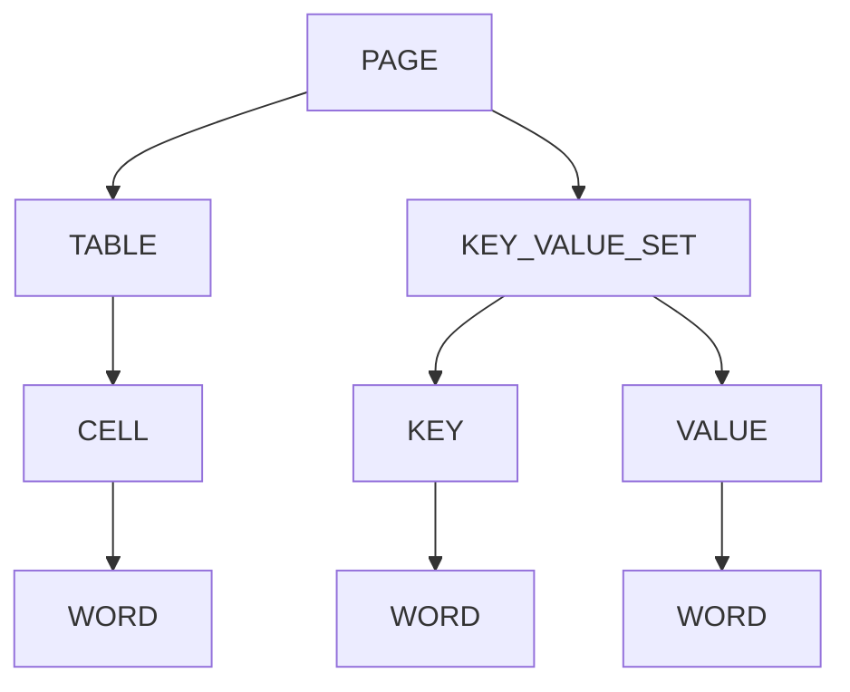

# How to Extract Tables and Forms with Amazon Textract

Author: [nawazdhandala](https://github.com/nawazdhandala)

Tags: AWS, Amazon Textract, Tables, Forms, Document Processing

Description: Deep dive into extracting and processing tables and key-value form pairs from documents using Amazon Textract with practical code examples.

---

Table and form extraction is where Textract really differentiates itself from basic OCR. Plenty of tools can read text off a page, but understanding that a bunch of numbers are organized in a table with headers, or that "Date of Birth" is a label paired with "1990-05-15" as its value - that's a different level of intelligence.

If you've worked with the basic Textract APIs already (see our [Textract document processing guide](https://oneuptime.com/blog/post/amazon-textract-document-processing/view)), this post goes deeper into table and form extraction specifically. We'll cover parsing the response structure, handling complex tables, and building reliable extraction pipelines.

## Understanding Textract's Block Model

Textract returns everything as "blocks" organized in a hierarchy. Understanding this hierarchy is key to extracting tables and forms correctly.



Every block has an ID, and blocks reference each other through relationships. A TABLE block has CHILD relationships pointing to CELL blocks. Each CELL has CHILD relationships pointing to WORD blocks. The trick is traversing these relationships to reconstruct the data.

## A Robust Table Extractor

Here's a complete table extraction utility that handles edge cases like merged cells and empty cells.

```python
import boto3
import json

textract = boto3.client('textract', region_name='us-east-1')

class TextractTableExtractor:
    """Extract tables from Textract responses with proper structure handling."""

    def __init__(self, blocks):
        self.blocks = {block['Id']: block for block in blocks}

    def get_tables(self):
        """Extract all tables as lists of lists."""
        tables = []

        for block_id, block in self.blocks.items():
            if block['BlockType'] == 'TABLE':
                table = self._extract_table(block)
                tables.append(table)

        return tables

    def _extract_table(self, table_block):
        """Extract a single table into a 2D array."""
        cells = {}
        max_row = 0
        max_col = 0

        # Collect all cells
        for rel in table_block.get('Relationships', []):
            if rel['Type'] == 'CHILD':
                for cell_id in rel['Ids']:
                    cell = self.blocks[cell_id]
                    if cell['BlockType'] == 'CELL':
                        row = cell['RowIndex']
                        col = cell['ColumnIndex']
                        max_row = max(max_row, row)
                        max_col = max(max_col, col)

                        text = self._get_text(cell)
                        confidence = cell['Confidence']

                        # Handle merged cells
                        row_span = cell.get('RowSpan', 1)
                        col_span = cell.get('ColumnSpan', 1)

                        cells[(row, col)] = {
                            'text': text,
                            'confidence': confidence,
                            'row_span': row_span,
                            'col_span': col_span,
                            'is_header': 'COLUMN_HEADER' in cell.get('EntityTypes', [])
                        }

        # Build the 2D array
        table = []
        for r in range(1, max_row + 1):
            row_data = []
            for c in range(1, max_col + 1):
                cell_info = cells.get((r, c), {'text': '', 'confidence': 0})
                row_data.append(cell_info['text'])
            table.append(row_data)

        return table

    def _get_text(self, block):
        """Get text content from a block by following CHILD relationships."""
        words = []
        for rel in block.get('Relationships', []):
            if rel['Type'] == 'CHILD':
                for child_id in rel['Ids']:
                    child = self.blocks[child_id]
                    if child['BlockType'] == 'WORD':
                        words.append(child['Text'])
                    elif child['BlockType'] == 'SELECTION_ELEMENT':
                        words.append('[X]' if child['SelectionStatus'] == 'SELECTED' else '[ ]')
        return ' '.join(words)

    def get_tables_as_dicts(self):
        """Extract tables as lists of dictionaries using the first row as headers."""
        tables = self.get_tables()
        dict_tables = []

        for table in tables:
            if len(table) < 2:
                continue

            headers = [h.strip() for h in table[0]]
            rows = []
            for row in table[1:]:
                row_dict = {}
                for i, cell in enumerate(row):
                    if i < len(headers) and headers[i]:
                        row_dict[headers[i]] = cell.strip()
                rows.append(row_dict)

            dict_tables.append(rows)

        return dict_tables

# Usage
def extract_tables_from_document(bucket, key):
    """Extract all tables from a document."""
    response = textract.analyze_document(
        Document={'S3Object': {'Bucket': bucket, 'Name': key}},
        FeatureTypes=['TABLES']
    )

    extractor = TextractTableExtractor(response['Blocks'])

    # Get as 2D arrays
    tables = extractor.get_tables()
    for i, table in enumerate(tables):
        print(f"\nTable {i + 1} ({len(table)} rows):")
        for row in table:
            print(f"  {' | '.join(row)}")

    # Get as dictionaries
    dict_tables = extractor.get_tables_as_dicts()
    for i, table in enumerate(dict_tables):
        print(f"\nTable {i + 1} as dicts:")
        for row in table[:3]:  # Show first 3 rows
            print(f"  {json.dumps(row, indent=2)}")

    return tables, dict_tables

tables, dict_tables = extract_tables_from_document('docs', 'invoice.pdf')
```

## A Robust Form Extractor

Form extraction requires careful handling of the key-value relationships.

```python
class TextractFormExtractor:
    """Extract key-value pairs from Textract form analysis."""

    def __init__(self, blocks):
        self.blocks = {block['Id']: block for block in blocks}

    def get_forms(self):
        """Extract all key-value pairs from the document."""
        key_value_pairs = []

        for block_id, block in self.blocks.items():
            if (block['BlockType'] == 'KEY_VALUE_SET' and
                'KEY' in block.get('EntityTypes', [])):

                key_text = self._get_text(block)
                value_text, value_confidence = self._get_value(block)

                key_value_pairs.append({
                    'key': key_text.strip().rstrip(':'),
                    'value': value_text.strip(),
                    'key_confidence': block['Confidence'],
                    'value_confidence': value_confidence,
                    'key_geometry': block.get('Geometry', {})
                })

        return key_value_pairs

    def get_forms_as_dict(self):
        """Get form fields as a simple dictionary."""
        pairs = self.get_forms()
        return {p['key']: p['value'] for p in pairs if p['key']}

    def _get_value(self, key_block):
        """Find the value block associated with a key block."""
        for rel in key_block.get('Relationships', []):
            if rel['Type'] == 'VALUE':
                for value_id in rel['Ids']:
                    value_block = self.blocks[value_id]
                    text = self._get_text(value_block)
                    return text, value_block['Confidence']
        return '', 0

    def _get_text(self, block):
        """Get text from a block's CHILD words."""
        words = []
        for rel in block.get('Relationships', []):
            if rel['Type'] == 'CHILD':
                for child_id in rel['Ids']:
                    child = self.blocks[child_id]
                    if child['BlockType'] == 'WORD':
                        words.append(child['Text'])
                    elif child['BlockType'] == 'SELECTION_ELEMENT':
                        words.append(
                            'SELECTED' if child['SelectionStatus'] == 'SELECTED'
                            else 'NOT_SELECTED'
                        )
        return ' '.join(words)

# Usage
def extract_forms_from_document(bucket, key):
    """Extract form fields from a document."""
    response = textract.analyze_document(
        Document={'S3Object': {'Bucket': bucket, 'Name': key}},
        FeatureTypes=['FORMS']
    )

    extractor = TextractFormExtractor(response['Blocks'])

    # Get detailed pairs
    pairs = extractor.get_forms()
    print("Form Fields:")
    for pair in pairs:
        print(f"  {pair['key']}: {pair['value']} "
              f"(confidence: {pair['key_confidence']:.1f}%)")

    # Get as simple dict
    form_dict = extractor.get_forms_as_dict()
    return form_dict

form_data = extract_forms_from_document('docs', 'application-form.png')
```

## Handling Multi-Page Documents

For PDFs with multiple pages, you need to use the async API and then organize results by page.

```python
import time

def extract_tables_multipage(bucket, key):
    """Extract tables from a multi-page PDF."""
    # Start async job
    response = textract.start_document_analysis(
        DocumentLocation={'S3Object': {'Bucket': bucket, 'Name': key}},
        FeatureTypes=['TABLES', 'FORMS']
    )
    job_id = response['JobId']

    # Wait for completion
    while True:
        result = textract.get_document_analysis(JobId=job_id)
        if result['JobStatus'] == 'SUCCEEDED':
            break
        elif result['JobStatus'] == 'FAILED':
            return None
        time.sleep(5)

    # Collect all blocks across pages
    all_blocks = result['Blocks']
    next_token = result.get('NextToken')

    while next_token:
        result = textract.get_document_analysis(
            JobId=job_id,
            NextToken=next_token
        )
        all_blocks.extend(result['Blocks'])
        next_token = result.get('NextToken')

    # Group blocks by page
    pages = {}
    for block in all_blocks:
        page_num = block.get('Page', 1)
        if page_num not in pages:
            pages[page_num] = []
        pages[page_num].append(block)

    # Extract tables from each page
    all_tables = {}
    for page_num, page_blocks in sorted(pages.items()):
        extractor = TextractTableExtractor(page_blocks)
        tables = extractor.get_tables()
        if tables:
            all_tables[page_num] = tables
            print(f"Page {page_num}: {len(tables)} table(s)")

    return all_tables
```

## Converting Tables to CSV and Pandas DataFrames

Once you've extracted tables, you'll often want them in more standard formats.

```python
import csv
from io import StringIO

def table_to_csv(table, output_file=None):
    """Convert an extracted table to CSV format."""
    if output_file:
        with open(output_file, 'w', newline='') as f:
            writer = csv.writer(f)
            for row in table:
                writer.writerow(row)
        print(f"Saved to {output_file}")
    else:
        output = StringIO()
        writer = csv.writer(output)
        for row in table:
            writer.writerow(row)
        return output.getvalue()

def table_to_dataframe(table):
    """Convert an extracted table to a pandas DataFrame."""
    import pandas as pd

    if not table or len(table) < 2:
        return pd.DataFrame()

    headers = table[0]
    data = table[1:]
    return pd.DataFrame(data, columns=headers)

# Usage
tables, _ = extract_tables_from_document('docs', 'financial-report.pdf')
if tables:
    # Save as CSV
    table_to_csv(tables[0], 'extracted_table.csv')

    # Convert to DataFrame
    df = table_to_dataframe(tables[0])
    print(df.head())
```

## Confidence Filtering

Not all extractions are equally reliable. Filter out low-confidence results.

```python
def filter_by_confidence(form_pairs, min_confidence=90):
    """Filter form extractions to only include high-confidence results."""
    high_confidence = []
    low_confidence = []

    for pair in form_pairs:
        avg_confidence = (pair['key_confidence'] + pair['value_confidence']) / 2
        if avg_confidence >= min_confidence:
            high_confidence.append(pair)
        else:
            low_confidence.append(pair)

    if low_confidence:
        print(f"Flagged {len(low_confidence)} low-confidence extractions for review:")
        for pair in low_confidence:
            print(f"  {pair['key']}: {pair['value']} "
                  f"(avg confidence: {(pair['key_confidence'] + pair['value_confidence'])/2:.1f}%)")

    return high_confidence, low_confidence
```

Getting reliable table and form extraction from messy real-world documents takes experimentation. Document quality varies wildly, and you'll want to build validation logic specific to your use case. For a complete document processing workflow that goes beyond extraction, check out our guide on [intelligent document processing with Textract](https://oneuptime.com/blog/post/amazon-textract-intelligent-document-processing/view).
