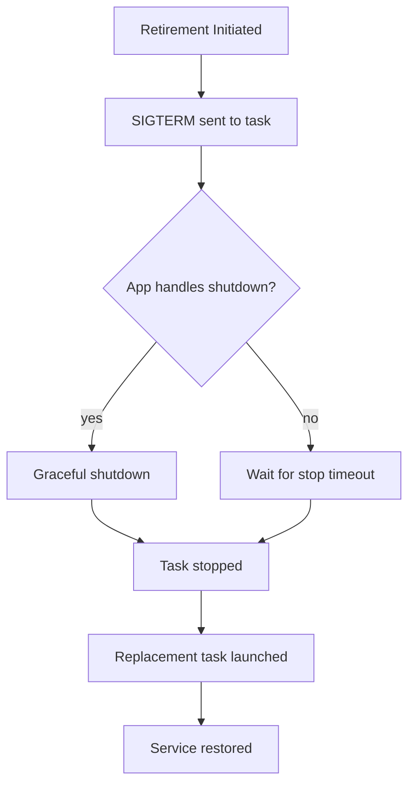

# How to Set Up Fargate Task Retirement Notifications

Author: [nawazdhandala](https://github.com/nawazdhandala)

Tags: AWS, ECS, Fargate, Monitoring, EventBridge

Description: Learn how to set up automated notifications for Fargate task retirements so you can track infrastructure changes and respond to unexpected task replacements.

---

Fargate occasionally retires tasks. This happens when AWS needs to update the underlying infrastructure - security patches, hardware maintenance, or capacity rebalancing. When a task is retired, Fargate launches a replacement automatically. Your service stays up, but the task gets a new IP address, loses any ephemeral storage data, and restarts from scratch.

Most of the time, this is invisible and harmless. But sometimes you need to know about it - for audit purposes, to correlate with application issues, or to understand why a long-running task suddenly restarted. Setting up retirement notifications gives you that visibility.

## How Task Retirement Works

When Fargate decides to retire a task, here's what happens:

1. AWS sends a retirement notification event (if you've set up notifications)
2. The task receives a SIGTERM signal
3. After the stop timeout (default 30 seconds), it receives SIGKILL
4. ECS launches a replacement task if the task belongs to a service
5. The new task registers with the load balancer and starts receiving traffic



The key thing to understand is that retirement is a normal Fargate operation. It's not an error. But without notifications, you might mistake it for an application crash.

## Setting Up EventBridge Rules

Fargate task state changes are published to Amazon EventBridge. You can create rules that match retirement events and route them to your notification targets.

### Step 1: Create an SNS Topic for Notifications

```bash
# Create the notification topic
aws sns create-topic \
  --name fargate-task-retirements

# Subscribe your email
aws sns subscribe \
  --topic-arn arn:aws:sns:us-east-1:123456789012:fargate-task-retirements \
  --protocol email \
  --notification-endpoint ops-team@company.com

# Or subscribe a Slack webhook via Lambda
aws sns subscribe \
  --topic-arn arn:aws:sns:us-east-1:123456789012:fargate-task-retirements \
  --protocol lambda \
  --notification-endpoint arn:aws:lambda:us-east-1:123456789012:function:slack-notifier
```

### Step 2: Create the EventBridge Rule

ECS publishes task state change events whenever a task stops. You can filter for retirement-specific events:

```bash
# Create an EventBridge rule for task state changes
aws events put-rule \
  --name fargate-task-retirement \
  --description "Capture Fargate task retirements" \
  --event-pattern '{
    "source": ["aws.ecs"],
    "detail-type": ["ECS Task State Change"],
    "detail": {
      "lastStatus": ["STOPPED"],
      "stopCode": ["TaskRetired"]
    }
  }'

# Add the SNS topic as a target
aws events put-targets \
  --rule fargate-task-retirement \
  --targets '[
    {
      "Id": "retirement-notifications",
      "Arn": "arn:aws:sns:us-east-1:123456789012:fargate-task-retirements",
      "InputTransformer": {
        "InputPathsMap": {
          "cluster": "$.detail.clusterArn",
          "taskArn": "$.detail.taskArn",
          "taskDef": "$.detail.taskDefinitionArn",
          "stopCode": "$.detail.stopCode",
          "stoppedReason": "$.detail.stoppedReason",
          "stoppedAt": "$.detail.stoppedAt",
          "group": "$.detail.group"
        },
        "InputTemplate": "\"Fargate Task Retired\\nCluster: <cluster>\\nService: <group>\\nTask: <taskArn>\\nTask Definition: <taskDef>\\nStop Code: <stopCode>\\nReason: <stoppedReason>\\nStopped At: <stoppedAt>\""
      }
    }
  ]'
```

The `InputTransformer` formats the notification into a readable message instead of dumping the entire raw JSON event.

## Broader Task Stop Monitoring

You might want to track all task stops, not just retirements. Different stop codes indicate different reasons:

| Stop Code | Meaning |
|-----------|---------|
| TaskRetired | Fargate infrastructure maintenance |
| TaskFailedToStart | Task couldn't start (image pull, etc.) |
| EssentialContainerExited | A container marked essential stopped |
| UserInitiated | Someone stopped the task manually |
| ServiceSchedulerInitiated | Service scaling event |
| SpotInterruption | Fargate Spot capacity reclaimed |

Here's a rule that captures all non-normal task stops:

```bash
# Catch all unexpected task stops
aws events put-rule \
  --name ecs-unexpected-task-stops \
  --description "Capture unexpected ECS task stops" \
  --event-pattern '{
    "source": ["aws.ecs"],
    "detail-type": ["ECS Task State Change"],
    "detail": {
      "lastStatus": ["STOPPED"],
      "stopCode": ["TaskRetired", "EssentialContainerExited", "TaskFailedToStart", "SpotInterruption"]
    }
  }'
```

## Processing Events with Lambda

For more sophisticated handling, route events to a Lambda function:

```python
# lambda_function.py - Process Fargate task retirement events
import json
import boto3
import os
from datetime import datetime

def lambda_handler(event, context):
    detail = event['detail']

    task_arn = detail['taskArn']
    cluster = detail['clusterArn'].split('/')[-1]
    stop_code = detail.get('stopCode', 'Unknown')
    stopped_reason = detail.get('stoppedReason', 'No reason provided')
    group = detail.get('group', 'Unknown')

    # Extract the service name from the group
    service_name = group.replace('service:', '') if group.startswith('service:') else group

    # Log the event for auditing
    print(json.dumps({
        'event_type': 'task_retirement',
        'cluster': cluster,
        'service': service_name,
        'task_arn': task_arn,
        'stop_code': stop_code,
        'reason': stopped_reason,
        'timestamp': datetime.utcnow().isoformat()
    }))

    # Send to Slack
    slack_webhook = os.environ.get('SLACK_WEBHOOK_URL')
    if slack_webhook:
        import urllib.request

        message = {
            'text': f':warning: *Fargate Task Retired*\n'
                    f'*Cluster:* {cluster}\n'
                    f'*Service:* {service_name}\n'
                    f'*Reason:* {stopped_reason}\n'
                    f'*Task:* `{task_arn.split("/")[-1]}`'
        }

        req = urllib.request.Request(
            slack_webhook,
            data=json.dumps(message).encode('utf-8'),
            headers={'Content-Type': 'application/json'}
        )
        urllib.request.urlopen(req)

    # Optionally track retirement frequency in CloudWatch
    cloudwatch = boto3.client('cloudwatch')
    cloudwatch.put_metric_data(
        Namespace='Custom/ECS',
        MetricData=[
            {
                'MetricName': 'TaskRetirements',
                'Dimensions': [
                    {'Name': 'ClusterName', 'Value': cluster},
                    {'Name': 'ServiceName', 'Value': service_name}
                ],
                'Value': 1,
                'Unit': 'Count'
            }
        ]
    )

    return {'statusCode': 200}
```

Deploy this Lambda and add it as a target:

```bash
# Add Lambda as an EventBridge target
aws events put-targets \
  --rule fargate-task-retirement \
  --targets '[
    {
      "Id": "retirement-lambda",
      "Arn": "arn:aws:lambda:us-east-1:123456789012:function:task-retirement-handler"
    }
  ]'

# Grant EventBridge permission to invoke the Lambda
aws lambda add-permission \
  --function-name task-retirement-handler \
  --statement-id eventbridge-invoke \
  --action lambda:InvokeFunction \
  --principal events.amazonaws.com \
  --source-arn arn:aws:events:us-east-1:123456789012:rule/fargate-task-retirement
```

## Tracking Retirement Frequency

Once you're publishing retirement count metrics, set up a dashboard to track retirement frequency over time:

```bash
# Create an alarm for unusual retirement frequency
aws cloudwatch put-metric-alarm \
  --alarm-name "high-task-retirement-rate" \
  --namespace "Custom/ECS" \
  --metric-name TaskRetirements \
  --dimensions Name=ClusterName,Value=production \
  --statistic Sum \
  --period 3600 \
  --threshold 10 \
  --comparison-operator GreaterThanThreshold \
  --evaluation-periods 1 \
  --alarm-actions "arn:aws:sns:us-east-1:123456789012:ops-alerts"
```

This alerts you if more than 10 tasks are retired in a single hour, which could indicate a larger infrastructure event.

## Making Your Application Retirement-Ready

Since retirements are inevitable, your application should handle them gracefully:

1. **Handle SIGTERM.** When Fargate retires a task, it sends SIGTERM. Your application should catch this signal and shut down cleanly:

```javascript
// Handle graceful shutdown in Node.js
process.on('SIGTERM', async () => {
  console.log('Received SIGTERM - starting graceful shutdown');

  // Stop accepting new requests
  server.close();

  // Finish in-flight requests
  // Close database connections
  // Flush buffers

  console.log('Graceful shutdown complete');
  process.exit(0);
});
```

2. **Set an appropriate stop timeout.** The default is 30 seconds. If your application needs more time to drain connections:

```json
{
  "containerDefinitions": [
    {
      "name": "app",
      "stopTimeout": 120
    }
  ]
}
```

3. **Don't rely on ephemeral state.** Since retirement destroys ephemeral storage, any state that matters should be stored externally (database, S3, EFS).

4. **Use health check grace periods.** After a replacement task starts, give it time to initialize before the load balancer starts sending traffic.

## CloudFormation Setup

If you manage your infrastructure as code, here's the CloudFormation template for the complete notification setup:

```yaml
Resources:
  RetirementTopic:
    Type: AWS::SNS::Topic
    Properties:
      TopicName: fargate-task-retirements

  RetirementRule:
    Type: AWS::Events::Rule
    Properties:
      Name: fargate-task-retirement
      EventPattern:
        source:
          - aws.ecs
        detail-type:
          - "ECS Task State Change"
        detail:
          lastStatus:
            - STOPPED
          stopCode:
            - TaskRetired
      Targets:
        - Arn: !Ref RetirementTopic
          Id: retirement-sns

  TopicPolicy:
    Type: AWS::SNS::TopicPolicy
    Properties:
      Topics:
        - !Ref RetirementTopic
      PolicyDocument:
        Statement:
          - Effect: Allow
            Principal:
              Service: events.amazonaws.com
            Action: sns:Publish
            Resource: !Ref RetirementTopic
```

## Wrapping Up

Fargate task retirements are a normal part of running containers on managed infrastructure. They're not a problem to solve, but they are something you should be aware of. Setting up notifications lets you correlate application issues with infrastructure events, maintain audit trails, and track retirement patterns over time.

The setup is straightforward: an EventBridge rule matching task retirement events, routed to SNS or Lambda. Once it's in place, you'll never be surprised by a task restart again. For broader monitoring, see our guide on [monitoring ECS tasks with CloudWatch metrics](https://oneuptime.com/blog/post/2026-02-12-monitor-ecs-tasks-cloudwatch-metrics/view).
