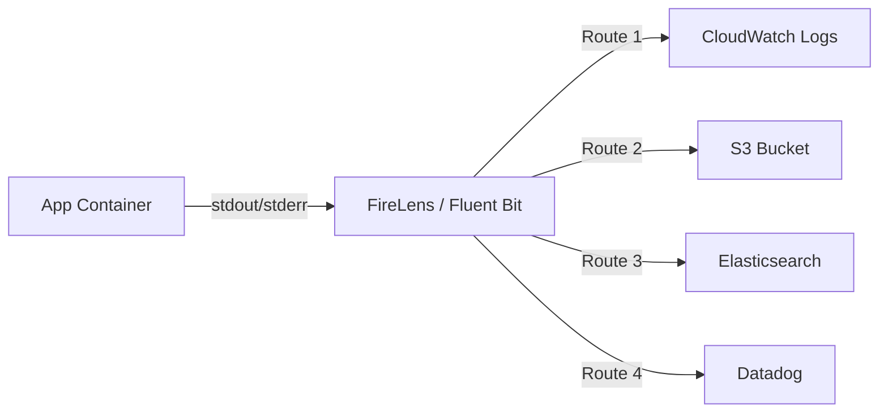

# How to Use FireLens for ECS Log Routing

Author: [nawazdhandala](https://github.com/nawazdhandala)

Tags: AWS, ECS, FireLens, Logging, Fluent Bit

Description: Learn how to use FireLens with Fluent Bit to route ECS container logs to multiple destinations like CloudWatch, S3, Elasticsearch, and Datadog.

---

CloudWatch Logs is the default logging destination for ECS tasks, and it works fine for basic use cases. But once you need to send logs to multiple destinations, filter them, transform them, or route them to third-party services, you'll want something more flexible. That's where FireLens comes in.

FireLens is an ECS-native log routing layer that uses either Fluent Bit or Fluentd as a sidecar container. It intercepts your application's stdout/stderr output and routes it wherever you need - CloudWatch, S3, Elasticsearch, Datadog, Splunk, or any destination supported by Fluent Bit plugins.

## How FireLens Works

Instead of using the `awslogs` log driver to send logs directly to CloudWatch, FireLens injects a Fluent Bit sidecar container into your task. Your application container's log driver is set to `awsfirelens`, which sends all stdout/stderr to the Fluent Bit container. Fluent Bit then processes and forwards the logs based on your configuration.



The key advantage is that your application doesn't need to know about any of this. It just logs to stdout, and FireLens handles the rest.

## Basic Setup

Let's start with a simple FireLens configuration that sends logs to CloudWatch. Here's a task definition with the Fluent Bit sidecar.

```json
{
  "family": "web-app-with-firelens",
  "networkMode": "awsvpc",
  "requiresCompatibilities": ["FARGATE"],
  "cpu": "512",
  "memory": "1024",
  "executionRoleArn": "arn:aws:iam::123456789:role/ecsTaskExecutionRole",
  "taskRoleArn": "arn:aws:iam::123456789:role/app-task-role",
  "containerDefinitions": [
    {
      "name": "log-router",
      "image": "public.ecr.aws/aws-observability/aws-for-fluent-bit:stable",
      "essential": true,
      "firelensConfiguration": {
        "type": "fluentbit"
      },
      "logConfiguration": {
        "logDriver": "awslogs",
        "options": {
          "awslogs-group": "/ecs/firelens-router",
          "awslogs-region": "us-east-1",
          "awslogs-stream-prefix": "firelens"
        }
      },
      "memoryReservation": 50
    },
    {
      "name": "app",
      "image": "123456789.dkr.ecr.us-east-1.amazonaws.com/app:latest",
      "essential": true,
      "portMappings": [
        { "containerPort": 8080, "protocol": "tcp" }
      ],
      "logConfiguration": {
        "logDriver": "awsfirelens",
        "options": {
          "Name": "cloudwatch_logs",
          "region": "us-east-1",
          "log_group_name": "/ecs/web-app",
          "log_stream_prefix": "app-",
          "auto_create_group": "true"
        }
      }
    }
  ]
}
```

Notice two things: the log router container uses `awslogs` for its own logs (so you can debug FireLens issues), and the app container uses `awsfirelens` as its log driver.

## Sending Logs to Multiple Destinations

The real power of FireLens is routing logs to multiple places simultaneously. You do this with a custom Fluent Bit config file.

First, create the config file and store it in your image or in S3.

```ini
# custom-fluent-bit.conf
[SERVICE]
    Flush         1
    Grace         30
    Log_Level     info
    Parsers_File  parsers.conf

# Send all logs to CloudWatch
[OUTPUT]
    Name              cloudwatch_logs
    Match             *
    region            us-east-1
    log_group_name    /ecs/web-app
    log_stream_prefix app-
    auto_create_group true

# Also send error logs to a separate log group
[OUTPUT]
    Name              cloudwatch_logs
    Match             *
    region            us-east-1
    log_group_name    /ecs/web-app-errors
    log_stream_prefix error-
    auto_create_group true
    log_key           log
    # Only forward logs containing "ERROR"
    Regex             log ERROR

# Archive all logs to S3
[OUTPUT]
    Name              s3
    Match             *
    region            us-east-1
    bucket            my-logs-bucket
    total_file_size   50M
    upload_timeout    60s
    s3_key_format     /logs/%Y/%m/%d/$TAG/%H-%M-%S
```

Reference this config in the FireLens container definition.

```json
{
  "name": "log-router",
  "image": "public.ecr.aws/aws-observability/aws-for-fluent-bit:stable",
  "essential": true,
  "firelensConfiguration": {
    "type": "fluentbit",
    "options": {
      "config-file-type": "s3",
      "config-file-value": "arn:aws:s3:::my-config-bucket/fluent-bit/custom-fluent-bit.conf"
    }
  }
}
```

## Terraform Configuration

Here's a complete Terraform example with multi-destination log routing.

```hcl
# Task definition with FireLens
resource "aws_ecs_task_definition" "app" {
  family                   = "web-app"
  network_mode             = "awsvpc"
  requires_compatibilities = ["FARGATE"]
  cpu                      = 512
  memory                   = 1024
  execution_role_arn       = aws_iam_role.execution.arn
  task_role_arn            = aws_iam_role.task.arn

  container_definitions = jsonencode([
    # Fluent Bit sidecar
    {
      name      = "log-router"
      image     = "public.ecr.aws/aws-observability/aws-for-fluent-bit:stable"
      essential = true

      firelensConfiguration = {
        type = "fluentbit"
        options = {
          "config-file-type"  = "s3"
          "config-file-value" = "arn:aws:s3:::${aws_s3_bucket.config.id}/fluent-bit.conf"
        }
      }

      logConfiguration = {
        logDriver = "awslogs"
        options = {
          "awslogs-group"         = aws_cloudwatch_log_group.firelens.name
          "awslogs-region"        = var.region
          "awslogs-stream-prefix" = "firelens"
        }
      }

      memoryReservation = 50
    },

    # Application container
    {
      name      = "app"
      image     = "${var.ecr_repo_url}:${var.image_tag}"
      essential = true

      portMappings = [
        { containerPort = 8080, protocol = "tcp" }
      ]

      logConfiguration = {
        logDriver = "awsfirelens"
        options = {
          "Name"              = "cloudwatch_logs"
          "region"            = var.region
          "log_group_name"    = "/ecs/web-app"
          "log_stream_prefix" = "app-"
          "auto_create_group" = "true"
        }
      }
    }
  ])
}
```

## IAM Permissions for FireLens

The task role (not execution role) needs permissions to write to whatever destinations Fluent Bit is sending logs to.

```hcl
# Task role permissions for log routing
resource "aws_iam_role_policy" "firelens_logging" {
  name = "firelens-logging"
  role = aws_iam_role.task.id

  policy = jsonencode({
    Version = "2012-10-17"
    Statement = [
      {
        Effect = "Allow"
        Action = [
          "logs:CreateLogGroup",
          "logs:CreateLogStream",
          "logs:PutLogEvents",
          "logs:DescribeLogStreams"
        ]
        Resource = "arn:aws:logs:*:*:*"
      },
      {
        Effect = "Allow"
        Action = [
          "s3:PutObject"
        ]
        Resource = "arn:aws:s3:::my-logs-bucket/*"
      }
    ]
  })
}

# Execution role needs S3 access for the config file
resource "aws_iam_role_policy" "config_access" {
  name = "firelens-config-access"
  role = aws_iam_role.execution.id

  policy = jsonencode({
    Version = "2012-10-17"
    Statement = [
      {
        Effect   = "Allow"
        Action   = ["s3:GetObject"]
        Resource = "arn:aws:s3:::${aws_s3_bucket.config.id}/fluent-bit.conf"
      },
      {
        Effect   = "Allow"
        Action   = ["s3:GetBucketLocation"]
        Resource = "arn:aws:s3:::${aws_s3_bucket.config.id}"
      }
    ]
  })
}
```

## Sending to Third-Party Services

FireLens supports many third-party logging services through Fluent Bit output plugins.

Sending to Datadog:

```ini
[OUTPUT]
    Name        datadog
    Match       *
    apikey      ${DD_API_KEY}
    Host        http-intake.logs.datadoghq.com
    TLS         on
    compress    gzip
    dd_service  web-app
    dd_source   ecs
    dd_tags     env:production,team:platform
```

Sending to Elasticsearch:

```ini
[OUTPUT]
    Name            es
    Match           *
    Host            search-my-domain.us-east-1.es.amazonaws.com
    Port            443
    Index           app-logs
    Type            _doc
    AWS_Auth        On
    AWS_Region      us-east-1
    tls             On
```

## Parsing and Filtering Logs

Fluent Bit can parse your log output and extract fields. If your application outputs JSON logs, Fluent Bit can parse them automatically.

```ini
# Enable JSON parsing in the FireLens configuration
[FILTER]
    Name         parser
    Match        *-firelens-*
    Key_Name     log
    Parser       json
    Reserve_Data On

# Filter out health check logs to reduce noise
[FILTER]
    Name   grep
    Match  *
    Exclude log GET /health
```

## Structured Logging

For the best experience with FireLens, your application should output structured JSON logs. This makes filtering and routing much easier.

```python
# Python structured logging example
import json
import sys

def log(level, message, **kwargs):
    entry = {
        "level": level,
        "message": message,
        "service": "web-app",
        **kwargs
    }
    print(json.dumps(entry), file=sys.stdout, flush=True)

log("info", "Request processed", path="/api/users", status=200, duration_ms=45)
log("error", "Database connection failed", error="timeout", retry_count=3)
```

With JSON logs and the parser filter, Fluent Bit can route based on log level or any other field.

## Troubleshooting

**Logs not appearing**: Check the Fluent Bit sidecar's own logs in CloudWatch. If it's crashing, you'll see the error there. Common issues include invalid config syntax and missing IAM permissions.

**High memory usage**: Fluent Bit buffers logs in memory by default. If your app produces a lot of logs, increase the `memoryReservation` for the sidecar and consider enabling filesystem buffering.

**Config file not loading**: Make sure the execution role has S3 access for the config file, and that the S3 path is correct.

FireLens adds a bit of complexity to your task definitions, but the flexibility it provides for log routing is worth it. Instead of being locked into CloudWatch, you can send logs anywhere and apply filters and transformations along the way. For monitoring the health of your logging pipeline itself, take a look at our guide on [monitoring AWS infrastructure](https://oneuptime.com/blog/post/aws-infrastructure-monitoring/view).
