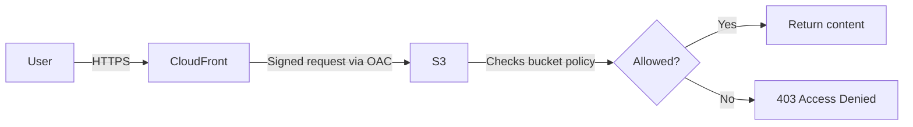

# How to Fix CloudFront '403 Access Denied' with S3 Origin

Author: [nawazdhandala](https://github.com/nawazdhandala)

Tags: AWS, CloudFront, S3, Security, Debugging

Description: Resolve CloudFront 403 Access Denied errors when using S3 as an origin, covering OAC configuration, bucket policies, object permissions, and default root object settings.

---

You've set up a CloudFront distribution with an S3 bucket as the origin, but all you get is a `403 Access Denied` XML response. This is one of the most common CloudFront + S3 issues, and it usually comes down to how CloudFront authenticates with S3. The permissions chain between CloudFront and S3 is fiddly, and getting even one piece wrong results in a 403.

## Understanding the Access Chain

When a user requests content through CloudFront, here's what happens:



CloudFront needs permission to read from S3. There are two mechanisms: Origin Access Control (OAC) which is the current recommendation, and the legacy Origin Access Identity (OAI). Let's cover both.

## Fix 1: Set Up Origin Access Control (OAC)

OAC is the recommended way to give CloudFront access to S3. It uses SigV4 signing and supports all S3 features including SSE-KMS.

First, create an OAC:

```bash
# Create an Origin Access Control
aws cloudfront create-origin-access-control \
    --origin-access-control-config '{
        "Name": "my-s3-oac",
        "Description": "OAC for S3 bucket",
        "SigningProtocol": "sigv4",
        "SigningBehavior": "always",
        "OriginAccessControlOriginType": "s3"
    }'
```

Then update your distribution to use it:

```bash
# Get current distribution config
aws cloudfront get-distribution-config --id E1234567890 > /tmp/dist-config.json
# Note the ETag from the response

# Edit the config to add OAC to the S3 origin:
# Set OriginAccessControlId to the OAC ID
# Remove any S3OriginConfig.OriginAccessIdentity if present
```

Now update the S3 bucket policy to allow CloudFront:

```json
{
    "Version": "2012-10-17",
    "Statement": [
        {
            "Sid": "AllowCloudFrontServicePrincipalReadOnly",
            "Effect": "Allow",
            "Principal": {
                "Service": "cloudfront.amazonaws.com"
            },
            "Action": "s3:GetObject",
            "Resource": "arn:aws:s3:::my-bucket/*",
            "Condition": {
                "StringEquals": {
                    "AWS:SourceArn": "arn:aws:cloudfront::123456789012:distribution/E1234567890"
                }
            }
        }
    ]
}
```

Apply the policy:

```bash
# Set the bucket policy
aws s3api put-bucket-policy \
    --bucket my-bucket \
    --policy file://bucket-policy.json
```

The `Condition` block ensures only your specific CloudFront distribution can access the bucket, not any CloudFront distribution.

## Fix 2: Legacy Origin Access Identity (OAI)

If you're using the older OAI setup, here's how to verify and fix it:

```bash
# Check if OAI is configured
aws cloudfront get-distribution-config --id E1234567890 \
    --query 'DistributionConfig.Origins.Items[0].S3OriginConfig'

# List existing OAIs
aws cloudfront list-cloud-front-origin-access-identities \
    --query 'CloudFrontOriginAccessIdentityList.Items[].{Id:Id,Comment:Comment}'
```

The bucket policy for OAI looks different:

```json
{
    "Version": "2012-10-17",
    "Statement": [
        {
            "Sid": "AllowCloudFrontOAI",
            "Effect": "Allow",
            "Principal": {
                "AWS": "arn:aws:iam::cloudfront:user/CloudFront Origin Access Identity E1234567890"
            },
            "Action": "s3:GetObject",
            "Resource": "arn:aws:s3:::my-bucket/*"
        }
    ]
}
```

## Fix 3: Bucket Policy Issues

Even with OAC or OAI configured, a conflicting bucket policy can block access. Check for explicit deny statements:

```bash
# Check the current bucket policy
aws s3api get-bucket-policy --bucket my-bucket --output text | python3 -m json.tool
```

Look for:
- Explicit `Deny` statements that override the `Allow`
- IP restriction conditions that block CloudFront's IPs
- VPC endpoint conditions that block non-VPC access
- Missing `s3:GetObject` permission (or only `s3:ListBucket`)

## Fix 4: S3 Block Public Access

S3 Block Public Access can interfere with CloudFront access, especially with older OAI configurations:

```bash
# Check block public access settings
aws s3api get-public-access-block --bucket my-bucket
```

For OAC, the block public access settings shouldn't cause issues because the CloudFront service principal isn't "public access." But for OAI, if you see issues, verify the bucket policy is correctly set up.

## Fix 5: Object-Level Permissions

Individual objects can have their own ACLs that override bucket-level permissions. If some objects work and others don't, check object-level ACLs:

```bash
# Check ACL on a specific object
aws s3api get-object-acl --bucket my-bucket --key index.html

# If objects were uploaded by a different account or with wrong ACL,
# you might need to re-upload them
aws s3 cp s3://my-bucket/index.html s3://my-bucket/index.html \
    --acl bucket-owner-full-control
```

Better yet, use bucket ownership controls to make the bucket owner own all objects:

```bash
# Enforce bucket owner ownership
aws s3api put-bucket-ownership-controls \
    --bucket my-bucket \
    --ownership-controls '{
        "Rules": [{"ObjectOwnership": "BucketOwnerEnforced"}]
    }'
```

## Fix 6: Default Root Object

If you get a 403 when accessing the root URL (e.g., `https://example.com/` instead of `https://example.com/index.html`), you might need to set a default root object:

```bash
# Check if a default root object is configured
aws cloudfront get-distribution-config --id E1234567890 \
    --query 'DistributionConfig.DefaultRootObject'
```

Set it:

```bash
# The distribution config needs DefaultRootObject set to "index.html"
# This only works for the root path (/), not subdirectories
```

Important: The default root object only works for the root path. Requesting `/about/` won't automatically serve `/about/index.html`. For that, you need CloudFront Functions or Lambda@Edge:

```javascript
// CloudFront Function to add index.html to directory requests
function handler(event) {
    var request = event.request;
    var uri = request.uri;

    // Check if URI ends with /
    if (uri.endsWith('/')) {
        request.uri += 'index.html';
    }
    // Check if URI doesn't have an extension (likely a directory)
    else if (!uri.includes('.')) {
        request.uri += '/index.html';
    }

    return request;
}
```

## Fix 7: S3 Origin Domain Name Format

Using the wrong S3 endpoint as the origin causes 403 errors. Use the bucket's regional endpoint:

```
# Correct S3 origin for CloudFront
my-bucket.s3.us-east-1.amazonaws.com

# Wrong - this is the website hosting endpoint
my-bucket.s3-website-us-east-1.amazonaws.com
```

If you're using S3 static website hosting, you need to use a custom origin (not an S3 origin) and you can't use OAC or OAI.

## Fix 8: KMS-Encrypted Objects

If your S3 objects are encrypted with SSE-KMS, the CloudFront service needs permission to use the KMS key. OAC supports this; OAI does not.

```json
{
    "Version": "2012-10-17",
    "Statement": [
        {
            "Effect": "Allow",
            "Principal": {
                "Service": "cloudfront.amazonaws.com"
            },
            "Action": "kms:Decrypt",
            "Resource": "*",
            "Condition": {
                "StringEquals": {
                    "AWS:SourceArn": "arn:aws:cloudfront::123456789012:distribution/E1234567890"
                }
            }
        }
    ]
}
```

Add this as a key policy statement on your KMS key.

For monitoring access patterns and catching 403 errors in production, set up [alerting on CloudFront error rates](https://oneuptime.com/blog/post/2026-02-13-aws-cloudwatch-alerting-best-practices/view) so you know when access issues start affecting users.

## Summary

CloudFront 403 errors with S3 origins almost always come down to permissions. Set up OAC (recommended over OAI), configure the bucket policy to allow the CloudFront service principal, check for conflicting deny statements, verify object-level permissions, set a default root object if needed, and make sure you're using the correct S3 endpoint format. For KMS-encrypted objects, add CloudFront permissions to the KMS key policy.
