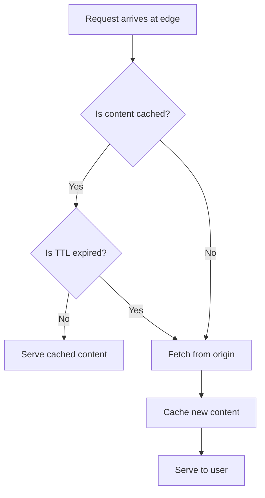

# How to Fix CloudFront Caching Stale Content

Author: [nawazdhandala](https://github.com/nawazdhandala)

Tags: AWS, CloudFront, CDN, Caching, Performance

Description: Fix CloudFront serving stale or outdated content by managing cache invalidations, cache policies, versioned URLs, and origin cache headers effectively.

---

You've updated your website or API, but CloudFront keeps serving the old version. Users are seeing outdated pages, old JavaScript bundles, or stale API responses. This is the classic CDN caching problem - CloudFront is doing exactly what it's supposed to do (caching content) but you need it to let go of the old stuff.

## Understanding Why CloudFront Caches

CloudFront caches content at edge locations to reduce latency and load on your origin. Once content is cached, it stays cached until the TTL expires or you explicitly invalidate it. The TTL can be controlled by:

1. Cache-Control headers from your origin
2. CloudFront's cache policy settings
3. The Minimum/Maximum/Default TTL settings in your cache behavior



## Quick Fix: Create an Invalidation

The fastest way to clear stale content is to create a cache invalidation:

```bash
# Invalidate specific files
aws cloudfront create-invalidation \
    --distribution-id E1234567890 \
    --paths "/index.html" "/css/styles.css" "/js/app.js"

# Invalidate everything under a path
aws cloudfront create-invalidation \
    --distribution-id E1234567890 \
    --paths "/images/*"

# Nuclear option: invalidate everything
aws cloudfront create-invalidation \
    --distribution-id E1234567890 \
    --paths "/*"
```

Check invalidation status:

```bash
# List recent invalidations
aws cloudfront list-invalidations --distribution-id E1234567890 \
    --query 'InvalidationList.Items[].{Id:Id,Status:Status,Created:CreateTime}'
```

Important caveats about invalidations:
- The first 1,000 paths per month are free. After that, $0.005 per path.
- Using `/*` counts as one path (so it's cheap to invalidate everything).
- Invalidations take a few minutes to propagate to all edge locations.
- They don't guarantee instant purging - some edge locations process faster than others.

## Better Approach: Cache-Control Headers

Instead of relying on invalidations, set proper Cache-Control headers on your origin. This gives you fine-grained control over how long content is cached.

For S3 objects:

```bash
# Set cache headers when uploading to S3
# HTML files: short cache, always revalidate
aws s3 cp index.html s3://my-bucket/index.html \
    --cache-control "public, max-age=300, must-revalidate"

# Static assets with hash in filename: cache forever
aws s3 cp app.a1b2c3d4.js s3://my-bucket/js/app.a1b2c3d4.js \
    --cache-control "public, max-age=31536000, immutable"

# API responses: no caching
aws s3 cp data.json s3://my-bucket/api/data.json \
    --cache-control "no-cache, no-store, must-revalidate"
```

For custom origins (like ALBs or API Gateway), set headers in your application:

```python
# Flask example: set cache headers per response
from flask import Flask, make_response

app = Flask(__name__)

@app.route('/api/data')
def api_data():
    response = make_response(get_data())
    # Don't cache API responses
    response.headers['Cache-Control'] = 'no-cache, no-store, must-revalidate'
    return response

@app.route('/assets/<path:filename>')
def static_assets(filename):
    response = make_response(get_asset(filename))
    # Cache static assets for 1 year
    response.headers['Cache-Control'] = 'public, max-age=31536000, immutable'
    return response
```

## Best Approach: Versioned URLs

The gold standard for static assets is to use content hashes or version numbers in filenames. When the content changes, the URL changes, and the cache issue disappears:

```
# Old version
/js/app.v1.2.3.js
/css/styles.abc123.css

# New version (different URL, so no cache conflict)
/js/app.v1.2.4.js
/css/styles.def456.css
```

Most modern build tools do this automatically:

```javascript
// webpack.config.js
module.exports = {
    output: {
        filename: '[name].[contenthash].js',
        path: '/dist'
    }
};
```

```javascript
// vite.config.js
export default {
    build: {
        rollupOptions: {
            output: {
                entryFileNames: 'assets/[name].[hash].js',
                chunkFileNames: 'assets/[name].[hash].js',
                assetFileNames: 'assets/[name].[hash].[ext]'
            }
        }
    }
};
```

With versioned URLs, you can set extremely long cache TTLs on assets (like 1 year) and never worry about stale content. The HTML file that references these assets has a short TTL, so it always gets the latest version with the correct asset URLs.

## CloudFront Cache Policy Configuration

CloudFront cache policies control what gets cached and for how long. Check your current settings:

```bash
# Get cache behavior settings
aws cloudfront get-distribution-config --id E1234567890 \
    --query 'DistributionConfig.DefaultCacheBehavior.{CachePolicyId:CachePolicyId,MinTTL:MinTTL,MaxTTL:MaxTTL,DefaultTTL:DefaultTTL}'

# Get the cache policy details
aws cloudfront get-cache-policy --id <policy-id> \
    --query 'CachePolicy.CachePolicyConfig.{Name:Name,MinTTL:MinTTL,MaxTTL:MaxTTL,DefaultTTL:DefaultTTL}'
```

Create a custom cache policy for more control:

```bash
# Create a cache policy that respects origin headers
aws cloudfront create-cache-policy \
    --cache-policy-config '{
        "Name": "CustomCachePolicy",
        "MinTTL": 0,
        "MaxTTL": 86400,
        "DefaultTTL": 300,
        "ParametersInCacheKeyAndForwardedToOrigin": {
            "EnableAcceptEncodingGzip": true,
            "EnableAcceptEncodingBrotli": true,
            "HeadersConfig": {
                "HeaderBehavior": "none"
            },
            "CookiesConfig": {
                "CookieBehavior": "none"
            },
            "QueryStringsConfig": {
                "QueryStringBehavior": "none"
            }
        }
    }'
```

Key settings:
- **MinTTL**: CloudFront won't cache for less than this, even if the origin says so
- **MaxTTL**: CloudFront won't cache for more than this, even if the origin says so
- **DefaultTTL**: Used when the origin doesn't send Cache-Control headers

## Cache Key Issues

Sometimes content appears stale because the cache key doesn't include something it should. For example, if your API returns different content based on a query parameter but CloudFront doesn't include query parameters in the cache key, all requests get the same cached response.

```bash
# If /api/data?page=1 and /api/data?page=2 should return different content,
# include query strings in the cache key via the cache policy
```

Similarly, if content varies by cookie or header, those need to be in the cache key.

## Automating Invalidations in CI/CD

For deployments, automate the invalidation:

```bash
#!/bin/bash
# deploy.sh - Deploy to S3 and invalidate CloudFront

BUCKET="my-website-bucket"
DISTRIBUTION_ID="E1234567890"

# Upload new files
aws s3 sync ./dist s3://$BUCKET --delete

# Invalidate HTML files (static assets use hashed filenames)
aws cloudfront create-invalidation \
    --distribution-id $DISTRIBUTION_ID \
    --paths "/index.html" "/about/index.html" "/contact/index.html"

# Wait for invalidation to complete
INVALIDATION_ID=$(aws cloudfront create-invalidation \
    --distribution-id $DISTRIBUTION_ID \
    --paths "/*" \
    --query 'Invalidation.Id' --output text)

aws cloudfront wait invalidation-completed \
    --distribution-id $DISTRIBUTION_ID \
    --id $INVALIDATION_ID

echo "Deployment complete and cache cleared"
```

For monitoring cache hit ratios and detecting when stale content is being served, set up [CloudFront monitoring](https://oneuptime.com/blog/post/aws-cloudwatch-alerting-best-practices/view) to track cache behavior metrics.

## Summary

CloudFront caching stale content is solved by three strategies, in order of preference: use versioned URLs for static assets (best), set proper Cache-Control headers on your origin (good), and use invalidations as a last resort (quick fix). Configure your cache policy's TTL settings to work with your origin's Cache-Control headers, and automate invalidations in your deployment pipeline for content that can't use versioned URLs.
