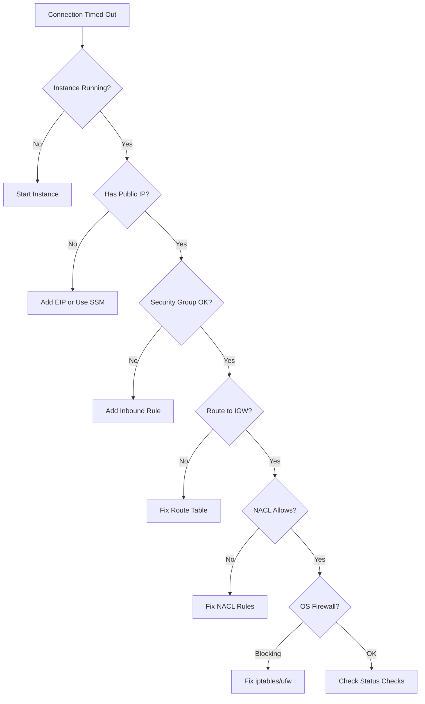

# How to Fix 'Connection Timed Out' When Connecting to EC2

Author: [nawazdhandala](https://github.com/nawazdhandala)

Tags: AWS, EC2, Networking, SSH, Troubleshooting

Description: Diagnose and fix connection timeout errors when trying to SSH or connect to EC2 instances, covering security groups, NACLs, routing, and instance-level issues.

---

You try to SSH into your EC2 instance and nothing happens. After a long wait, you get:

```
ssh: connect to host 54.123.45.67 port 22: Connection timed out
```

A connection timeout means your traffic isn't reaching the instance at all. Unlike "Connection refused" (which means traffic arrived but nothing is listening), a timeout means packets are being dropped somewhere between you and the instance.

Let's work through the possible causes from the outside in.

## Quick Checklist

Before diving deep, check these common issues first:

1. Is the instance running?
2. Are you using the right IP address?
3. Is the security group allowing your traffic?
4. Is the instance in a public subnet with an internet gateway?

```bash
# Check instance state and IP
aws ec2 describe-instances \
  --instance-ids i-1234567890abcdef0 \
  --query "Reservations[*].Instances[*].[State.Name,PublicIpAddress,PrivateIpAddress,SubnetId,VpcId]" \
  --output table
```

If the instance is in a `stopped` or `terminated` state, that's your problem. Start it.

## Fix 1: Security Group Rules

The most common cause. Your security group needs to allow inbound traffic on the port you're trying to connect to.

```bash
# Check the security group rules
aws ec2 describe-security-groups \
  --group-ids sg-abc123 \
  --query "SecurityGroups[*].IpPermissions[*].[IpProtocol,FromPort,ToPort,IpRanges]" \
  --output json
```

You need a rule that allows SSH (port 22) from your IP.

```bash
# Find your current public IP
curl -s ifconfig.me

# Add an inbound rule for SSH
aws ec2 authorize-security-group-ingress \
  --group-id sg-abc123 \
  --protocol tcp \
  --port 22 \
  --cidr YOUR_IP/32
```

Common security group mistakes:
- The rule allows 0.0.0.0/0 but your traffic goes through a NAT or VPN that changes your source IP
- You added the rule to the wrong security group
- You created an outbound rule instead of an inbound rule
- You used the wrong port (RDP is 3389, not 22)

## Fix 2: No Public IP or Elastic IP

If the instance doesn't have a public IP address, you can't reach it from the internet.

```bash
# Check for public IP
aws ec2 describe-instances \
  --instance-ids i-1234567890abcdef0 \
  --query "Reservations[0].Instances[0].PublicIpAddress"
```

If this returns null, you have a few options:

```bash
# Option 1: Allocate and associate an Elastic IP
aws ec2 allocate-address --domain vpc
# Note the AllocationId

aws ec2 associate-address \
  --instance-id i-1234567890abcdef0 \
  --allocation-id eipalloc-abc123

# Option 2: Use Session Manager instead of SSH (no public IP needed)
aws ssm start-session --target i-1234567890abcdef0
```

## Fix 3: Subnet Route Table

Your instance's subnet needs a route to the internet. For public subnets, this means a route to an Internet Gateway.

```bash
# Find the route table for the subnet
aws ec2 describe-route-tables \
  --filters Name=association.subnet-id,Values=subnet-abc123 \
  --query "RouteTables[*].Routes[*].[DestinationCidrBlock,GatewayId,NatGatewayId,State]" \
  --output table
```

You should see a route like:

```
Destination     Target              State
0.0.0.0/0       igw-abc123         active
```

If the `0.0.0.0/0` route points to a NAT Gateway instead of an Internet Gateway, the subnet is private. Instances in private subnets can reach the internet but can't be reached from the internet.

```bash
# Add an internet gateway route (if missing)
aws ec2 create-route \
  --route-table-id rtb-abc123 \
  --destination-cidr-block 0.0.0.0/0 \
  --gateway-id igw-abc123
```

## Fix 4: Network ACLs

Network ACLs (NACLs) are stateless firewalls at the subnet level. Unlike security groups, they have explicit deny rules and need both inbound and outbound rules.

```bash
# Check the NACL for the subnet
aws ec2 describe-network-acls \
  --filters Name=association.subnet-id,Values=subnet-abc123 \
  --query "NetworkAcls[*].[NetworkAclId,Entries]" \
  --output json
```

You need:
- An inbound rule allowing TCP port 22 from your IP (or 0.0.0.0/0)
- An outbound rule allowing TCP on ephemeral ports (1024-65535) to your IP

The default NACL allows all traffic, so this is usually only an issue if someone has created custom NACLs.

```bash
# Add inbound SSH rule
aws ec2 create-network-acl-entry \
  --network-acl-id acl-abc123 \
  --rule-number 100 \
  --protocol tcp \
  --port-range From=22,To=22 \
  --cidr-block 0.0.0.0/0 \
  --rule-action allow \
  --ingress

# Add outbound ephemeral ports rule
aws ec2 create-network-acl-entry \
  --network-acl-id acl-abc123 \
  --rule-number 100 \
  --protocol tcp \
  --port-range From=1024,To=65535 \
  --cidr-block 0.0.0.0/0 \
  --rule-action allow \
  --egress
```

## Fix 5: Instance-Level Firewall

The OS running on the instance might have its own firewall blocking connections.

If you can access the instance through Session Manager or the serial console, check:

```bash
# On Amazon Linux / CentOS / RHEL
sudo iptables -L -n
sudo firewall-cmd --list-all

# On Ubuntu / Debian
sudo ufw status
sudo iptables -L -n
```

If iptables is blocking SSH:

```bash
# Allow SSH
sudo iptables -A INPUT -p tcp --dport 22 -j ACCEPT
sudo iptables -A OUTPUT -p tcp --sport 22 -j ACCEPT

# On Ubuntu with ufw
sudo ufw allow 22/tcp
```

## Fix 6: SSH Service Not Running

If the SSH daemon isn't running, you'll get a timeout (if there's no firewall) or a connection refused.

Access the instance through Session Manager or the serial console.

```bash
# Check if sshd is running
sudo systemctl status sshd

# Start it if it's stopped
sudo systemctl start sshd
sudo systemctl enable sshd
```

## Fix 7: Instance Status Checks Failing

If the instance itself is unhealthy, it won't respond to connections.

```bash
# Check instance status
aws ec2 describe-instance-status \
  --instance-ids i-1234567890abcdef0 \
  --query "InstanceStatuses[*].[InstanceState.Name,SystemStatus.Status,InstanceStatus.Status]" \
  --output table
```

If either status check is failing, see our guide on [fixing EC2 instance status check failures](https://oneuptime.com/blog/post/2026-02-12-fix-ec2-instance-status-check-failed/view).

## Fix 8: VPN or Corporate Network Blocking

If you're on a corporate network or VPN, your outbound traffic to port 22 might be blocked. Test this:

```bash
# Test if port 22 is reachable
nc -zv 54.123.45.67 22 -w 5

# If that times out, try from a different network
# Or use Session Manager which goes over HTTPS (port 443)
aws ssm start-session --target i-1234567890abcdef0
```

## Diagnostic Flow

Here's a systematic approach when you hit a connection timeout.



## Using EC2 Instance Connect as Alternative

If SSH is giving you trouble, EC2 Instance Connect lets you push a temporary SSH key.

```bash
# Push a temporary key and connect
aws ec2-instance-connect send-ssh-public-key \
  --instance-id i-1234567890abcdef0 \
  --instance-os-user ec2-user \
  --ssh-public-key file://~/.ssh/id_rsa.pub

# Then SSH normally within 60 seconds
ssh ec2-user@54.123.45.67
```

## Summary

Connection timeouts to EC2 instances are almost always a networking issue between your computer and the instance. Work through the layers: security groups, subnet routing, NACLs, public IP, and OS-level firewalls. The `--debug` approach here is to verify each layer from the outside in. If all else fails, use AWS Session Manager - it bypasses all of these networking issues by going through the SSM agent over HTTPS.
