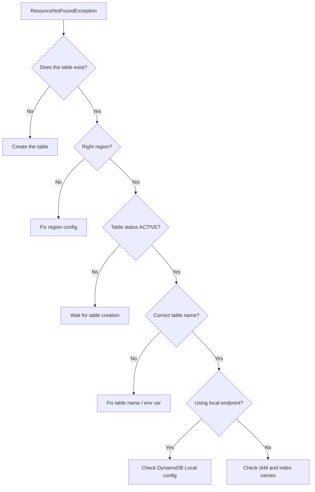

# How to Fix DynamoDB 'ResourceNotFoundException' Errors

Author: [nawazdhandala](https://github.com/nawazdhandala)

Tags: AWS, DynamoDB, Debugging, Cloud Infrastructure

Description: Troubleshoot and resolve DynamoDB ResourceNotFoundException errors caused by missing tables, wrong regions, incorrect index names, and endpoint misconfigurations.

---

Nothing kills a deployment faster than a `ResourceNotFoundException` from DynamoDB. You know the table exists - you just created it - but DynamoDB insists it can't find it. This error means DynamoDB looked for a resource (table, index, backup, or stream) and came up empty. Let's figure out why.

## The Usual Suspects

Before diving into each cause, here's a quick diagnostic flowchart to narrow things down:



## Wrong Region

This is the number one cause. DynamoDB tables are regional resources. If you created your table in `us-east-1` but your application is configured for `us-west-2`, DynamoDB will tell you it can't find the table.

Check your current configuration:

```python
import boto3

# Print the region your client is using
client = boto3.client('dynamodb')
print(f"Current region: {client.meta.region_name}")

# List tables in this region to verify
response = client.list_tables()
print(f"Tables in {client.meta.region_name}: {response['TableNames']}")
```

If the table isn't in the list, either you're in the wrong region or the table doesn't exist yet. Fix it by explicitly setting the region:

```python
# Explicitly specify the correct region
dynamodb = boto3.resource('dynamodb', region_name='us-east-1')
table = dynamodb.Table('MyTable')
```

For Lambda functions, this often happens when the function is deployed in a different region than the table. Check your environment variables and deployment configuration.

## Table Still Being Created

DynamoDB table creation isn't instant. After calling `create_table`, the table goes through a `CREATING` status before becoming `ACTIVE`. If you try to use the table during this window, you'll get a `ResourceNotFoundException`.

```python
# Wait for the table to become active before using it
import boto3

dynamodb = boto3.resource('dynamodb')
table = dynamodb.Table('NewTable')

# This blocks until the table is ACTIVE
print("Waiting for table to become active...")
table.wait_until_exists()
print(f"Table status: {table.table_status}")
```

If you're using CloudFormation or Terraform, this is usually handled automatically because the resource dependency system waits for creation to complete. But in scripts or custom provisioning code, you need to handle it yourself.

```bash
# AWS CLI: wait for table to be active
aws dynamodb wait table-exists --table-name MyTable
echo "Table is now active"
```

## Table Name Mismatch

This sounds obvious, but it happens constantly - especially when table names include environment prefixes or suffixes. Maybe your table is called `prod-orders` but your code references `orders`.

```python
import os

# Use environment variables for table names
# so they match across environments
TABLE_NAME = os.environ.get('ORDERS_TABLE', 'dev-orders')

dynamodb = boto3.resource('dynamodb')
table = dynamodb.Table(TABLE_NAME)
```

Check what tables actually exist:

```bash
# List all tables in the current region
aws dynamodb list-tables --output table

# Search for a specific pattern
aws dynamodb list-tables --query 'TableNames[?contains(@, `orders`)]'
```

## Global Secondary Index Not Found

If you're querying a Global Secondary Index (GSI), the index name must match exactly. Also, GSIs have their own creation process - they might still be in `CREATING` status even if the table itself is `ACTIVE`.

```python
# Verify the index exists and is active
response = client.describe_table(TableName='Orders')
for gsi in response['Table'].get('GlobalSecondaryIndexes', []):
    print(f"Index: {gsi['IndexName']}, Status: {gsi['IndexStatus']}")
```

When querying, make sure you're using the exact index name:

```python
# Query using the correct index name
response = table.query(
    IndexName='StatusDateIndex',  # Must match exactly
    KeyConditionExpression='#s = :status',
    ExpressionAttributeNames={'#s': 'status'},
    ExpressionAttributeValues={':status': 'pending'}
)
```

## DynamoDB Local Misconfiguration

If you're using DynamoDB Local for development, the endpoint URL must be configured correctly. Without it, the SDK will try to reach the real DynamoDB service, where your local tables obviously don't exist.

```python
# Connecting to DynamoDB Local
dynamodb = boto3.resource(
    'dynamodb',
    endpoint_url='http://localhost:8000',  # Don't forget this
    region_name='us-east-1',               # Still needed, even for local
    aws_access_key_id='dummy',             # Can be anything for local
    aws_secret_access_key='dummy'
)
```

A common mistake is setting the endpoint URL in some code paths but not others. Use a configuration module to centralize this:

```python
# config.py - centralized DynamoDB configuration
import os
import boto3

def get_dynamodb_resource():
    """Returns DynamoDB resource configured for current environment."""
    endpoint = os.environ.get('DYNAMODB_ENDPOINT')

    kwargs = {
        'region_name': os.environ.get('AWS_REGION', 'us-east-1')
    }

    if endpoint:
        # Local development
        kwargs['endpoint_url'] = endpoint
        kwargs['aws_access_key_id'] = 'local'
        kwargs['aws_secret_access_key'] = 'local'

    return boto3.resource('dynamodb', **kwargs)
```

## Table Was Deleted

Sometimes the table really was deleted - maybe by a CI/CD pipeline, a cleanup script, or someone running Terraform destroy. Check CloudTrail to find out:

```bash
# Check CloudTrail for table deletion events
aws cloudtrail lookup-events \
    --lookup-attributes AttributeKey=EventName,AttributeValue=DeleteTable \
    --max-results 10 \
    --query 'Events[].{Time:EventTime,User:Username,Resource:Resources[0].ResourceName}'
```

## Backup and Stream Errors

`ResourceNotFoundException` also appears when you reference a backup or stream ARN that doesn't exist:

```python
# List existing backups for a table
response = client.list_backups(
    TableName='Orders',
    BackupType='ALL'
)

for backup in response.get('BackupSummaries', []):
    print(f"Backup: {backup['BackupName']}, ARN: {backup['BackupArn']}")
```

## Prevention Strategies

The best defense against `ResourceNotFoundException` is to validate resources exist before using them. Here's a simple helper:

```python
def table_exists(table_name, region='us-east-1'):
    """Check if a DynamoDB table exists and is active."""
    client = boto3.client('dynamodb', region_name=region)
    try:
        response = client.describe_table(TableName=table_name)
        return response['Table']['TableStatus'] == 'ACTIVE'
    except client.exceptions.ResourceNotFoundException:
        return False

# Use it in your application startup
if not table_exists('Orders'):
    raise RuntimeError("Orders table not found. Check region and table name.")
```

Setting up monitoring for these errors is just as important. You don't want to discover a missing table from user complaints. CloudWatch metrics on `UserErrors` for your DynamoDB tables, combined with [proper alerting](https://oneuptime.com/blog/post/2026-02-13-aws-cloudwatch-alerting-best-practices/view), will help you catch issues before they affect users.

## Summary

When you see `ResourceNotFoundException` from DynamoDB, start with the basics: verify the table exists, verify you're pointing at the right region, and verify the table name matches exactly. Then check for edge cases like GSI status, DynamoDB Local configuration, and recently deleted tables. These simple checks resolve the issue in the vast majority of cases.
