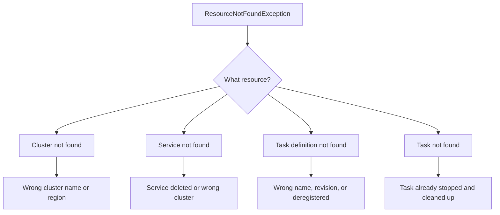

# How to Fix ECS 'ResourceNotFoundException' Errors

Author: [nawazdhandala](https://github.com/nawazdhandala)

Tags: AWS, ECS, Debugging, Containers

Description: Troubleshoot and resolve ECS ResourceNotFoundException errors caused by missing clusters, services, task definitions, and incorrect ARN references.

---

The `ResourceNotFoundException` from ECS means you're referencing something that doesn't exist - a cluster, service, task definition, or container instance that ECS can't find. It's a straightforward error in concept, but tracking down exactly which resource is missing and why can take some digging.

## Common Causes

Here's a quick breakdown of what's usually going on:



## Missing Cluster

The most common scenario is pointing at a cluster that doesn't exist. Maybe the cluster name is misspelled, or you're looking in the wrong region.

```bash
# List all clusters in the current region
aws ecs list-clusters

# Check if a specific cluster exists
aws ecs describe-clusters --clusters my-cluster \
    --query 'clusters[0].{Name:clusterName,Status:status,ActiveServices:activeServicesCount}'
```

If the cluster doesn't show up, verify your region:

```bash
# Check what region you're configured for
aws configure get region

# List clusters in a specific region
aws ecs list-clusters --region us-west-2
```

A subtle issue: if you're using the default cluster (named "default"), it doesn't exist until you create it. ECS doesn't auto-create clusters.

```bash
# Create the default cluster if it doesn't exist
aws ecs create-cluster --cluster-name default
```

## Missing Service

Services live inside clusters. If you ask for a service in the wrong cluster, you'll get `ResourceNotFoundException`.

```bash
# List services in a cluster
aws ecs list-services --cluster my-cluster

# Describe a specific service
aws ecs describe-services \
    --cluster my-cluster \
    --services my-service \
    --query 'services[0].{Name:serviceName,Status:status,DesiredCount:desiredCount}'
```

If the service was recently deleted, it won't show up in `list-services` by default. Deleted services are retained for a short period in an INACTIVE state:

```bash
# Include inactive services in the listing
aws ecs describe-services \
    --cluster my-cluster \
    --services my-service \
    --include TAGS \
    --query 'services[0].status'
```

## Missing Task Definition

Task definitions use a family:revision format like `my-app:42`. If you reference a specific revision that doesn't exist, or a family that was never registered, you'll get this error.

```bash
# List all task definition families
aws ecs list-task-definition-families --status ACTIVE

# List all revisions of a specific family
aws ecs list-task-definitions --family-prefix my-app

# Describe a specific revision
aws ecs describe-task-definition --task-definition my-app:42
```

Task definitions can be deregistered but not deleted. A deregistered task definition can still be used to run tasks, but new services and deployments should use active revisions.

```bash
# Check if a task definition was deregistered
aws ecs describe-task-definition \
    --task-definition my-app:42 \
    --query 'taskDefinition.status'
```

Common mistakes:
- Using the family name without a revision number (works fine, uses the latest ACTIVE revision)
- Using a full ARN from a different region or account
- Referencing a revision that was never registered

## Missing Task

Individual tasks are ephemeral. Once a task stops, ECS retains its information for about 1 hour (for tasks that are part of a service) or until the stopped task limit is reached. After that, `describe-tasks` will return `ResourceNotFoundException`.

```bash
# List running tasks
aws ecs list-tasks --cluster my-cluster --desired-status RUNNING

# List recently stopped tasks
aws ecs list-tasks --cluster my-cluster --desired-status STOPPED
```

If you need to reference historical tasks, you should be storing that information yourself - either through CloudWatch Events (EventBridge) or through your own logging.

```python
import boto3

# Set up EventBridge to capture task state changes
events = boto3.client('events')

# This rule captures all ECS task state changes
events.put_rule(
    Name='ecs-task-state-change',
    EventPattern="""{
        "source": ["aws.ecs"],
        "detail-type": ["ECS Task State Change"]
    }""",
    State='ENABLED'
)
```

## Capacity Provider Issues

If you're using capacity providers and reference one that doesn't exist or isn't associated with your cluster:

```bash
# List capacity providers associated with a cluster
aws ecs describe-clusters \
    --clusters my-cluster \
    --query 'clusters[0].capacityProviders'

# List all available capacity providers
aws ecs describe-capacity-providers \
    --query 'capacityProviders[].{Name:name,Status:status}'
```

## API Calls and ARN Formats

Some ECS API calls accept both short names and full ARNs. But if you're passing an ARN, it must be correct:

```python
import boto3

ecs = boto3.client('ecs')

# These are both valid
ecs.describe_services(
    cluster='my-cluster',
    services=['my-service']  # Short name
)

ecs.describe_services(
    cluster='my-cluster',
    services=['arn:aws:ecs:us-east-1:123456789012:service/my-cluster/my-service']  # Full ARN
)
```

If you mix up the ARN format (like using a task ARN where a service ARN is expected), you'll get `ResourceNotFoundException`.

The new ARN format includes the cluster name:
```
arn:aws:ecs:region:account:service/cluster-name/service-name
```

The old format didn't:
```
arn:aws:ecs:region:account:service/service-name
```

Make sure your account is opted in to the new ARN format:

```bash
# Check current ARN settings
aws ecs list-account-settings --effective-settings \
    --query 'settings[?name==`serviceLongArnFormat`]'
```

## IAM and Permissions

Sometimes what looks like a `ResourceNotFoundException` is actually an access issue. If your IAM permissions don't allow you to see a resource, some API calls return "not found" instead of "access denied." This is a security practice to prevent information leakage.

```json
{
    "Version": "2012-10-17",
    "Statement": [
        {
            "Effect": "Allow",
            "Action": [
                "ecs:DescribeClusters",
                "ecs:DescribeServices",
                "ecs:DescribeTasks",
                "ecs:DescribeTaskDefinition",
                "ecs:ListClusters",
                "ecs:ListServices",
                "ecs:ListTasks"
            ],
            "Resource": "*"
        }
    ]
}
```

## Prevention and Monitoring

Validate resource existence in your deployment scripts before attempting operations:

```python
def ensure_cluster_exists(cluster_name, region='us-east-1'):
    """Verify ECS cluster exists before deploying."""
    ecs = boto3.client('ecs', region_name=region)
    response = ecs.describe_clusters(clusters=[cluster_name])

    if not response['clusters'] or response['clusters'][0]['status'] != 'ACTIVE':
        raise ValueError(f"Cluster '{cluster_name}' not found or not active in {region}")

    return response['clusters'][0]
```

Set up [monitoring and alerting](https://oneuptime.com/blog/post/2026-02-13-aws-cloudwatch-alerting-best-practices/view) for your ECS deployments so you catch resource issues immediately, not during an incident at 2 AM.

## Summary

ECS `ResourceNotFoundException` means you're referencing a cluster, service, task, or task definition that doesn't exist. Start by verifying you're in the right region, then check the exact name or ARN. Stopped tasks are cleaned up quickly, task definitions can be deregistered, and services must be in the correct cluster. Validate resources exist before operating on them in your deployment scripts.
