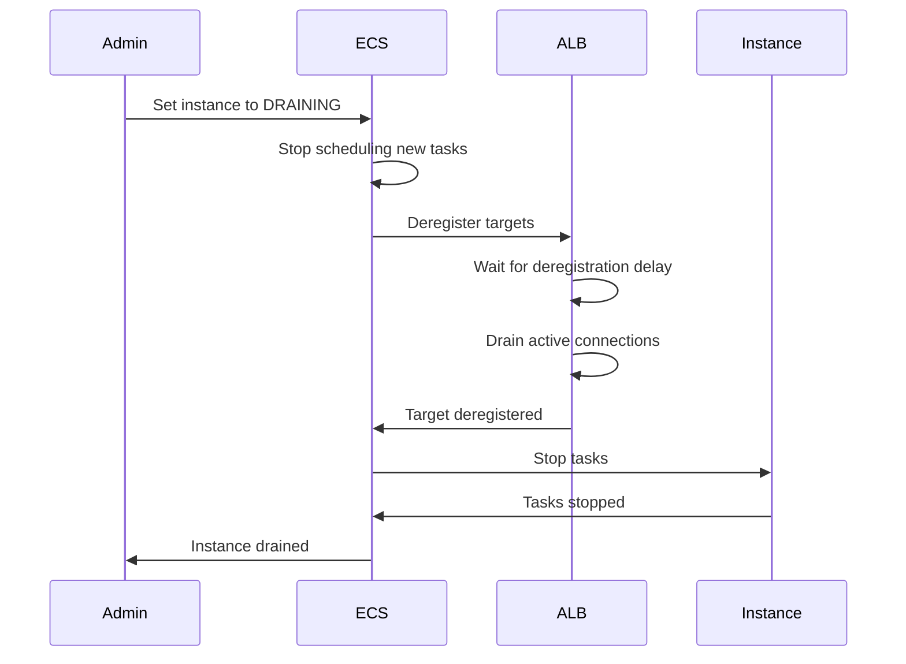

# How to Fix ECS Service Stuck in 'Draining' State

Author: [nawazdhandala](https://github.com/nawazdhandala)

Tags: AWS, ECS, Containers, Load Balancing, Debugging

Description: Resolve ECS services and container instances stuck in draining state due to target group deregistration delays, long-running connections, and load balancer configurations.

---

When an ECS container instance enters the "DRAINING" state, ECS stops placing new tasks on it and starts removing existing tasks. This is normal behavior during cluster scaling, instance replacement, or manual draining. But sometimes things get stuck. Tasks won't drain, the instance stays in DRAINING forever, and your deployment or scaling operation hangs.

Let's understand why this happens and how to fix it.

## What Draining Actually Does

When a container instance is set to DRAINING:

1. ECS stops scheduling new tasks on it
2. For service tasks, ECS starts replacement tasks on other instances
3. Tasks connected to load balancers enter a deregistration process
4. Once all tasks have stopped or been moved, the instance can be terminated

The process looks like this:



## Target Group Deregistration Delay

The most common reason draining takes a long time is the target group deregistration delay. By default, this is set to 300 seconds (5 minutes). During this time, the load balancer stops sending new connections but waits for existing connections to finish.

Check your target group's deregistration delay:

```bash
# Check the deregistration delay setting
aws elbv2 describe-target-group-attributes \
    --target-group-arn arn:aws:elasticloadbalancing:us-east-1:123456789012:targetgroup/my-tg/abc123 \
    --query 'Attributes[?Key==`deregistration_delay.timeout_seconds`]'
```

If you don't need to wait that long, reduce it:

```bash
# Reduce deregistration delay to 30 seconds
aws elbv2 modify-target-group-attributes \
    --target-group-arn arn:aws:elasticloadbalancing:us-east-1:123456789012:targetgroup/my-tg/abc123 \
    --attributes Key=deregistration_delay.timeout_seconds,Value=30
```

For services that handle short-lived HTTP requests, 30 seconds is usually plenty. For WebSocket connections or long-polling, you might need more time.

## Long-Running Connections Preventing Drain

If your service handles long-lived connections (like WebSockets, gRPC streams, or persistent HTTP connections), these connections won't close until the deregistration delay expires or the client disconnects.

You can configure connection draining behavior:

```bash
# Enable connection termination when deregistration delay expires
aws elbv2 modify-target-group-attributes \
    --target-group-arn <target-group-arn> \
    --attributes Key=deregistration_delay.connection_termination.enabled,Value=true
```

This forcefully closes connections when the delay period ends instead of waiting indefinitely.

## Tasks Not Stopping

Sometimes the issue isn't the drain itself but that tasks won't stop. ECS sends a SIGTERM to the container, then waits for `stopTimeout` before sending SIGKILL.

Check your task definition's stop timeout:

```json
{
    "containerDefinitions": [
        {
            "name": "app",
            "image": "my-app:latest",
            "stopTimeout": 30
        }
    ]
}
```

The default `stopTimeout` is 30 seconds for Fargate and 30 seconds for EC2 launch type (configurable via ECS agent). If your application doesn't handle SIGTERM properly, it'll hang until the timeout.

Make sure your application handles SIGTERM:

```python
# Python example: handle SIGTERM gracefully
import signal
import sys

def handle_sigterm(signum, frame):
    print("Received SIGTERM, shutting down gracefully...")
    # Close database connections, finish current requests, etc.
    cleanup()
    sys.exit(0)

signal.signal(signal.SIGTERM, handle_sigterm)
```

```javascript
// Node.js example: handle SIGTERM
process.on('SIGTERM', () => {
    console.log('Received SIGTERM, shutting down gracefully...');
    server.close(() => {
        console.log('Server closed');
        process.exit(0);
    });

    // Force exit after 10 seconds if graceful shutdown fails
    setTimeout(() => {
        console.error('Forced shutdown after timeout');
        process.exit(1);
    }, 10000);
});
```

## Minimum Healthy Percent Blocking Drain

If your service has `minimumHealthyPercent: 100` and there aren't enough container instances to run all the tasks, ECS can't drain the instance because it can't place replacement tasks anywhere.

```bash
# Check service deployment configuration
aws ecs describe-services \
    --cluster my-cluster \
    --services my-service \
    --query 'services[0].deploymentConfiguration'
```

Lower the minimum healthy percent temporarily:

```bash
# Allow the service to temporarily reduce task count during draining
aws ecs update-service \
    --cluster my-cluster \
    --service my-service \
    --deployment-configuration minimumHealthyPercent=50,maximumPercent=200
```

## Capacity Issues

ECS needs somewhere to place the replacement tasks. If all other instances are full, or if there aren't enough instances to absorb the tasks, draining stalls.

```bash
# Check available capacity in the cluster
aws ecs describe-clusters \
    --clusters my-cluster \
    --query 'clusters[0].{RegisteredInstances:registeredContainerInstancesCount,RunningTasks:runningTasksCount,PendingTasks:pendingTasksCount}'
```

For auto-scaling clusters, make sure your capacity provider can scale up:

```bash
# Check the auto-scaling group's current and max capacity
aws autoscaling describe-auto-scaling-groups \
    --auto-scaling-group-names my-ecs-asg \
    --query 'AutoScalingGroups[0].{Current:DesiredCapacity,Max:MaxSize,Min:MinSize}'
```

## Force Draining

If you've waited long enough and the instance is still draining, you can force stop the remaining tasks:

```bash
# List tasks still running on the draining instance
aws ecs list-tasks \
    --cluster my-cluster \
    --container-instance <container-instance-id> \
    --desired-status RUNNING

# Force stop a specific task
aws ecs stop-task \
    --cluster my-cluster \
    --task <task-arn> \
    --reason "Force stop during drain"
```

For all tasks on an instance:

```bash
# Stop all tasks on a specific container instance
TASKS=$(aws ecs list-tasks \
    --cluster my-cluster \
    --container-instance <container-instance-id> \
    --desired-status RUNNING \
    --query 'taskArns[]' --output text)

for task in $TASKS; do
    aws ecs stop-task --cluster my-cluster --task "$task" --reason "Force drain"
done
```

## Monitoring Drain Progress

Keep an eye on what's happening during the drain:

```bash
# Watch the container instance status and running task count
aws ecs describe-container-instances \
    --cluster my-cluster \
    --container-instances <container-instance-id> \
    --query 'containerInstances[0].{Status:status,RunningTasks:runningTasksCount,PendingTasks:pendingTasksCount}'
```

For production environments, set up [automated monitoring](https://oneuptime.com/blog/post/2026-02-13-aws-cloudwatch-alerting-best-practices/view) to track how long instances stay in draining state. If it consistently takes more than a few minutes, something in your architecture needs attention.

## Summary

ECS services get stuck draining usually because of target group deregistration delays, long-lived connections, applications not handling SIGTERM, or insufficient capacity for replacement tasks. Reduce the deregistration delay, implement proper signal handling, ensure enough cluster capacity, and use the minimum healthy percent setting to allow temporary task count reduction during drains. If all else fails, force stop the remaining tasks.
