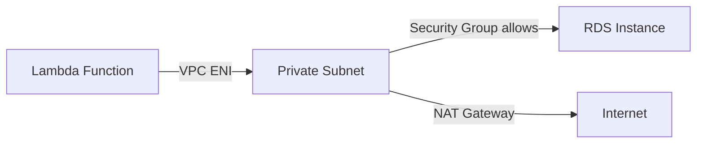

# How to Fix Lambda 'ECONNREFUSED' When Accessing RDS in VPC

Author: [nawazdhandala](https://github.com/nawazdhandala)

Tags: AWS, Lambda, RDS, VPC, Networking, Troubleshooting

Description: Resolve ECONNREFUSED errors when Lambda functions try to connect to RDS databases inside a VPC, including security group and subnet configuration.

---

Your Lambda function tries to connect to an RDS database and throws:

```
Error: connect ECONNREFUSED 10.0.1.45:3306
```

or

```
OperationalError: (2003, "Can't connect to MySQL server on 'my-db.abc123.us-east-1.rds.amazonaws.com' (110)")
```

This is a networking issue. Your Lambda function can't reach your RDS instance. The most common reason is that they're not in the same VPC, or the security groups aren't configured to allow traffic between them. Let's fix it.

## Understanding the Problem

By default, Lambda functions run outside of any VPC. They have internet access but can't reach resources inside your VPC (like RDS instances in private subnets). When Lambda tries to connect to the RDS private IP address, there's simply no network path.

Here's what the architecture should look like:



## Step 1: Put Lambda in the Same VPC as RDS

First, find out where your RDS instance lives:

```bash
# Get RDS instance VPC and subnet details
aws rds describe-db-instances \
  --db-instance-identifier my-database \
  --query 'DBInstances[0].{VpcId:DBSubnetGroup.VpcId,Subnets:DBSubnetGroup.Subnets[*].SubnetIdentifier,SecurityGroups:VpcSecurityGroups[*].VpcSecurityGroupId,Endpoint:Endpoint}'
```

Now configure your Lambda to use the same VPC. You need at least two subnets (for high availability) and a security group:

```bash
# Create a security group for Lambda
LAMBDA_SG=$(aws ec2 create-security-group \
  --group-name lambda-rds-access \
  --description "Security group for Lambda to access RDS" \
  --vpc-id vpc-0abc123 \
  --query 'GroupId' \
  --output text)

echo "Lambda security group: $LAMBDA_SG"

# Configure Lambda to use the VPC
aws lambda update-function-configuration \
  --function-name my-function \
  --vpc-config SubnetIds=subnet-0abc123,subnet-0def456,SecurityGroupIds=$LAMBDA_SG
```

Use private subnets for Lambda. If Lambda needs internet access (to call external APIs), those subnets must have a NAT Gateway in their route table.

## Step 2: Configure Security Groups

This is where most people get stuck. The RDS security group must allow inbound traffic from the Lambda security group.

```bash
# Get the RDS security group ID
RDS_SG=$(aws rds describe-db-instances \
  --db-instance-identifier my-database \
  --query 'DBInstances[0].VpcSecurityGroups[0].VpcSecurityGroupId' \
  --output text)

echo "RDS security group: $RDS_SG"

# Allow inbound traffic from Lambda's security group to RDS
# For MySQL (port 3306):
aws ec2 authorize-security-group-ingress \
  --group-id $RDS_SG \
  --protocol tcp \
  --port 3306 \
  --source-group $LAMBDA_SG

# For PostgreSQL (port 5432):
# aws ec2 authorize-security-group-ingress \
#   --group-id $RDS_SG \
#   --protocol tcp \
#   --port 5432 \
#   --source-group $LAMBDA_SG
```

The key here is using `--source-group` to reference the Lambda security group, not a specific IP address. This way, any Lambda function with that security group can access RDS.

## Step 3: Verify Lambda Has VPC Permissions

Lambda needs IAM permissions to create network interfaces in your VPC:

```bash
# Attach the VPC execution role policy
aws iam attach-role-policy \
  --role-name my-lambda-role \
  --policy-arn arn:aws:iam::aws:policy/service-role/AWSLambdaVPCAccessExecutionRole
```

This grants:
- `ec2:CreateNetworkInterface`
- `ec2:DescribeNetworkInterfaces`
- `ec2:DeleteNetworkInterface`

Without these permissions, Lambda can't create the ENI (Elastic Network Interface) it needs to connect to the VPC.

## Step 4: Test the Connection

After configuring everything, test with a simple function:

```python
import pymysql
import os

def lambda_handler(event, context):
    try:
        connection = pymysql.connect(
            host=os.environ['DB_HOST'],
            user=os.environ['DB_USER'],
            password=os.environ['DB_PASSWORD'],
            database=os.environ['DB_NAME'],
            connect_timeout=5
        )
        with connection.cursor() as cursor:
            cursor.execute("SELECT 1")
            result = cursor.fetchone()
        connection.close()
        return {'statusCode': 200, 'body': f'Connected! Result: {result}'}
    except Exception as e:
        return {'statusCode': 500, 'body': f'Connection failed: {str(e)}'}
```

## Common Pitfalls

### Pitfall 1: Lambda in Public Subnets

Don't put Lambda in public subnets. Even though your RDS might be accessible from public subnets, Lambda functions in public subnets don't get a public IP address and can't access the internet. Always use private subnets with a NAT Gateway for internet access.

### Pitfall 2: Wrong Subnets

Lambda must be in subnets that can route to the RDS subnets. If RDS is in `subnet-A` and `subnet-B`, Lambda should ideally be in the same subnets, or at least in subnets within the same VPC with proper routing.

```bash
# Verify subnets are in the same VPC
aws ec2 describe-subnets \
  --subnet-ids subnet-0abc123 subnet-0def456 \
  --query 'Subnets[*].{SubnetId:SubnetId,VpcId:VpcId,AZ:AvailabilityZone,CIDR:CidrBlock}'
```

### Pitfall 3: DNS Resolution

If you're using the RDS endpoint hostname (not the IP), make sure DNS resolution works in your VPC:

```bash
# Check VPC DNS settings
aws ec2 describe-vpc-attribute \
  --vpc-id vpc-0abc123 \
  --attribute enableDnsSupport

aws ec2 describe-vpc-attribute \
  --vpc-id vpc-0abc123 \
  --attribute enableDnsHostnames
```

Both should be `true`.

### Pitfall 4: RDS Not Publicly Accessible

If your RDS instance has `PubliclyAccessible` set to `false` (which is recommended), it can only be accessed from within the VPC. This is exactly why Lambda needs to be in the VPC too.

```bash
aws rds describe-db-instances \
  --db-instance-identifier my-database \
  --query 'DBInstances[0].PubliclyAccessible'
```

## Using RDS Proxy (Recommended)

For Lambda-to-RDS connections, RDS Proxy is highly recommended. It handles connection pooling, which is critical because Lambda can create hundreds of concurrent connections during traffic spikes.

```bash
# Create an RDS Proxy
aws rds create-db-proxy \
  --db-proxy-name my-proxy \
  --engine-family MYSQL \
  --auth '[{"AuthScheme":"SECRETS","SecretArn":"arn:aws:secretsmanager:us-east-1:123456789012:secret:my-db-creds","IAMAuth":"DISABLED"}]' \
  --role-arn arn:aws:iam::123456789012:role/rds-proxy-role \
  --vpc-subnet-ids subnet-0abc123 subnet-0def456 \
  --vpc-security-group-ids $RDS_SG
```

Then point your Lambda function at the proxy endpoint instead of the RDS endpoint directly.

## Debugging Checklist

When you get ECONNREFUSED from Lambda to RDS:

1. Is Lambda in the same VPC as RDS? Check `VpcConfig`
2. Does the RDS security group allow inbound from Lambda's security group?
3. Does Lambda's IAM role have `AWSLambdaVPCAccessExecutionRole`?
4. Are Lambda's subnets in the same VPC as RDS?
5. Is the RDS endpoint hostname resolving? (Check VPC DNS settings)
6. Is the RDS instance running and available?
7. Are you connecting to the right port? (3306 for MySQL, 5432 for PostgreSQL)

Monitor your Lambda-to-RDS connections with [OneUptime](https://oneuptime.com/blog/post/2026-02-06-aws-cloudwatch-logs-exporter-opentelemetry-collector/view) to catch connection issues before they cascade into user-facing errors. Database connectivity problems are one of the most common causes of production incidents, and early detection makes all the difference.
