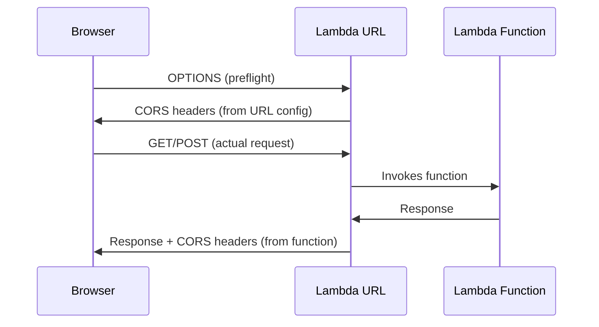

# How to Fix Lambda Function URL CORS Issues

Author: [nawazdhandala](https://github.com/nawazdhandala)

Tags: AWS, Lambda, CORS, Serverless, Web Development

Description: Fix CORS errors when calling Lambda Function URLs from web browsers by configuring CORS headers correctly in both Lambda settings and function response.

---

Lambda Function URLs give you a simple HTTP endpoint for your Lambda function without needing API Gateway. But when you call that URL from a web browser, you'll likely hit a CORS error:

```
Access to fetch at 'https://abc123.lambda-url.us-east-1.on.aws/'
from origin 'https://myapp.com' has been blocked by CORS policy
```

The fix involves two things: configuring CORS on the Function URL itself AND returning CORS headers in your function's response. Let's walk through both.

## Understanding the Two CORS Layers

Lambda Function URLs have a built-in CORS configuration that handles preflight (OPTIONS) requests automatically. But your function also needs to include CORS headers in its actual response. This trips up a lot of people because they configure one but not the other.



## Step 1: Configure CORS on the Function URL

First, set up CORS on the Function URL itself. This handles preflight OPTIONS requests:

```bash
# Update Function URL CORS configuration
aws lambda update-function-url-config \
  --function-name my-function \
  --cors '{
    "AllowOrigins": ["https://myapp.com"],
    "AllowMethods": ["GET", "POST", "PUT", "DELETE"],
    "AllowHeaders": ["Content-Type", "Authorization"],
    "ExposeHeaders": ["x-custom-header"],
    "MaxAge": 3600,
    "AllowCredentials": false
  }'
```

If you haven't created a Function URL yet:

```bash
# Create a Function URL with CORS
aws lambda create-function-url-config \
  --function-name my-function \
  --auth-type NONE \
  --cors '{
    "AllowOrigins": ["https://myapp.com"],
    "AllowMethods": ["GET", "POST", "PUT", "DELETE"],
    "AllowHeaders": ["Content-Type", "Authorization"],
    "MaxAge": 3600,
    "AllowCredentials": false
  }'
```

For development, you can allow all origins:

```bash
aws lambda update-function-url-config \
  --function-name my-function \
  --cors '{
    "AllowOrigins": ["*"],
    "AllowMethods": ["*"],
    "AllowHeaders": ["*"],
    "MaxAge": 86400
  }'
```

## Step 2: Return CORS Headers in Your Function Response

This is the part people miss. Even with CORS configured on the Function URL, your Lambda function must return CORS headers in its response for non-preflight requests.

### Python Example

```python
import json

CORS_HEADERS = {
    'Access-Control-Allow-Origin': 'https://myapp.com',
    'Access-Control-Allow-Headers': 'Content-Type,Authorization',
    'Access-Control-Allow-Methods': 'GET,POST,PUT,DELETE,OPTIONS'
}

def lambda_handler(event, context):
    # Handle the actual request
    try:
        body = json.loads(event.get('body', '{}'))
        result = process_request(body)

        return {
            'statusCode': 200,
            'headers': CORS_HEADERS,
            'body': json.dumps(result)
        }
    except Exception as e:
        return {
            'statusCode': 500,
            'headers': CORS_HEADERS,
            'body': json.dumps({'error': str(e)})
        }

def process_request(body):
    return {'message': 'Hello from Lambda!', 'data': body}
```

### Node.js Example

```javascript
const CORS_HEADERS = {
  'Access-Control-Allow-Origin': 'https://myapp.com',
  'Access-Control-Allow-Headers': 'Content-Type,Authorization',
  'Access-Control-Allow-Methods': 'GET,POST,PUT,DELETE,OPTIONS',
};

exports.handler = async (event) => {
  try {
    const body = JSON.parse(event.body || '{}');
    const result = await processRequest(body);

    return {
      statusCode: 200,
      headers: CORS_HEADERS,
      body: JSON.stringify(result),
    };
  } catch (error) {
    return {
      statusCode: 500,
      headers: CORS_HEADERS,
      body: JSON.stringify({ error: error.message }),
    };
  }
};

async function processRequest(body) {
  return { message: 'Hello from Lambda!', data: body };
}
```

## Handling Multiple Origins

If you need to support multiple origins (like production and staging), you can dynamically set the `Access-Control-Allow-Origin` header:

```python
import json

ALLOWED_ORIGINS = [
    'https://myapp.com',
    'https://staging.myapp.com',
    'http://localhost:3000'
]

def lambda_handler(event, context):
    # Get the request origin
    headers = event.get('headers', {})
    origin = headers.get('origin', '')

    # Set CORS origin dynamically
    cors_origin = origin if origin in ALLOWED_ORIGINS else ALLOWED_ORIGINS[0]

    response_headers = {
        'Access-Control-Allow-Origin': cors_origin,
        'Access-Control-Allow-Headers': 'Content-Type,Authorization',
        'Access-Control-Allow-Methods': 'GET,POST,PUT,DELETE,OPTIONS',
        'Vary': 'Origin'  # Important for caching
    }

    try:
        body = json.loads(event.get('body', '{}'))
        result = {'message': 'Success', 'data': body}

        return {
            'statusCode': 200,
            'headers': response_headers,
            'body': json.dumps(result)
        }
    except Exception as e:
        return {
            'statusCode': 500,
            'headers': response_headers,
            'body': json.dumps({'error': str(e)})
        }
```

When doing this, make sure to update the Function URL CORS config to include all origins too:

```bash
aws lambda update-function-url-config \
  --function-name my-function \
  --cors '{
    "AllowOrigins": ["https://myapp.com", "https://staging.myapp.com", "http://localhost:3000"],
    "AllowMethods": ["GET", "POST", "PUT", "DELETE"],
    "AllowHeaders": ["Content-Type", "Authorization"],
    "MaxAge": 3600
  }'
```

## Common Mistakes

### Mistake 1: AllowCredentials with Wildcard Origin

You can't use `AllowCredentials: true` with `AllowOrigins: ["*"]`. The browser will reject it. If you need credentials (cookies, auth headers), you must specify exact origins:

```bash
# This WILL NOT work
aws lambda update-function-url-config \
  --function-name my-function \
  --cors '{"AllowOrigins": ["*"], "AllowCredentials": true}'

# This WILL work
aws lambda update-function-url-config \
  --function-name my-function \
  --cors '{"AllowOrigins": ["https://myapp.com"], "AllowCredentials": true}'
```

### Mistake 2: Forgetting CORS Headers on Error Responses

When your function throws an error, you still need CORS headers. Otherwise, the browser blocks the error response and your frontend can't even read the error message:

```python
# Bad: No CORS headers on error
try:
    result = do_something()
    return {'statusCode': 200, 'headers': CORS_HEADERS, 'body': json.dumps(result)}
except Exception:
    return {'statusCode': 500, 'body': 'Error'}  # Browser can't read this!

# Good: CORS headers on ALL responses
try:
    result = do_something()
    return {'statusCode': 200, 'headers': CORS_HEADERS, 'body': json.dumps(result)}
except Exception as e:
    return {'statusCode': 500, 'headers': CORS_HEADERS, 'body': json.dumps({'error': str(e)})}
```

### Mistake 3: Content-Type Not in AllowedHeaders

If your frontend sends `Content-Type: application/json`, that header must be in `AllowHeaders`:

```bash
aws lambda update-function-url-config \
  --function-name my-function \
  --cors '{"AllowOrigins": ["*"], "AllowHeaders": ["Content-Type", "Authorization"]}'
```

## Testing CORS

Test your setup with curl to simulate browser behavior:

```bash
FUNCTION_URL="https://abc123.lambda-url.us-east-1.on.aws"

# Test preflight request
curl -v -X OPTIONS $FUNCTION_URL \
  -H "Origin: https://myapp.com" \
  -H "Access-Control-Request-Method: POST" \
  -H "Access-Control-Request-Headers: Content-Type"

# Test actual request
curl -v -X POST $FUNCTION_URL \
  -H "Origin: https://myapp.com" \
  -H "Content-Type: application/json" \
  -d '{"test": true}'
```

Check that the response includes `Access-Control-Allow-Origin` in both cases.

## Quick Reference

Here's a complete working setup:

```bash
# 1. Create the function
aws lambda create-function \
  --function-name my-api \
  --runtime python3.12 \
  --handler lambda_function.lambda_handler \
  --role arn:aws:iam::123456789012:role/lambda-role \
  --zip-file fileb://function.zip

# 2. Create Function URL with CORS
aws lambda create-function-url-config \
  --function-name my-api \
  --auth-type NONE \
  --cors '{"AllowOrigins":["https://myapp.com"],"AllowMethods":["GET","POST"],"AllowHeaders":["Content-Type"],"MaxAge":3600}'

# 3. Add resource policy for public access
aws lambda add-permission \
  --function-name my-api \
  --statement-id FunctionURLPublicAccess \
  --action lambda:InvokeFunctionUrl \
  --principal "*" \
  --function-url-auth-type NONE
```

For monitoring your Lambda Function URLs and catching CORS misconfigurations in production, [OneUptime](https://oneuptime.com/blog/post/2026-02-06-aws-cloudwatch-logs-exporter-opentelemetry-collector/view) can alert you to elevated error rates before your users start complaining.
