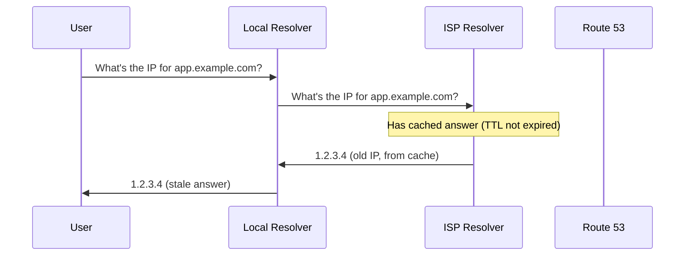

# How to Fix Route 53 DNS Propagation Delays

Author: [nawazdhandala](https://github.com/nawazdhandala)

Tags: AWS, Route 53, DNS, Networking

Description: Understand and troubleshoot Route 53 DNS propagation delays including TTL management, resolver caching, health check timing, and verification techniques.

---

You've made a DNS change in Route 53, but the world hasn't caught up yet. Some users see the old IP, some see the new one, and your monitoring is going haywire. DNS propagation delays are inherent to how DNS works, but there are specific things you can do to minimize them and verify that changes are actually rolling out.

## How DNS Propagation Works

When you change a DNS record in Route 53, the change takes effect in the Route 53 authoritative name servers within about 60 seconds. But that's not the same as every user seeing the change. Between your users and Route 53, there's a chain of caching DNS resolvers, each holding onto the old answer for the duration of the TTL (Time to Live).



The cached answers won't be refreshed until the TTL expires. This is by design - DNS caching reduces load and latency. But it means changes aren't instant.

## Verify the Change in Route 53

Before blaming propagation, confirm the change actually took effect in Route 53:

```bash
# Check the record directly from Route 53 name servers
aws route53 list-resource-record-sets \
    --hosted-zone-id Z1234567890 \
    --query "ResourceRecordSets[?Name=='app.example.com.']"
```

You can also query Route 53's authoritative servers directly:

```bash
# Find your hosted zone's name servers
aws route53 get-hosted-zone \
    --id Z1234567890 \
    --query 'DelegationSet.NameServers'

# Query one of them directly
dig @ns-123.awsdns-45.com app.example.com
```

If the authoritative server returns the new value, the change is live in Route 53. The delay is downstream caching.

## Understanding and Managing TTL

TTL is the key factor in propagation speed. It tells resolvers how long to cache the answer.

```bash
# Check the current TTL of a record
dig app.example.com +noall +answer
# The number in the second column is the remaining TTL in seconds
```

### Pre-Change TTL Reduction

The best strategy for fast propagation is to lower the TTL before making changes. If your TTL is currently 3600 (1 hour), resolvers will cache the old answer for up to an hour after you make the change.

Here's the playbook:

```bash
# Step 1: Lower TTL to 60 seconds (do this well before the actual change)
aws route53 change-resource-record-sets \
    --hosted-zone-id Z1234567890 \
    --change-batch '{
        "Changes": [{
            "Action": "UPSERT",
            "ResourceRecordSet": {
                "Name": "app.example.com",
                "Type": "A",
                "TTL": 60,
                "ResourceRecords": [{"Value": "1.2.3.4"}]
            }
        }]
    }'

# Step 2: Wait for the OLD TTL duration (e.g., 1 hour if it was 3600)
# This ensures all caches have refreshed and now respect the shorter TTL

# Step 3: Make the actual change
aws route53 change-resource-record-sets \
    --hosted-zone-id Z1234567890 \
    --change-batch '{
        "Changes": [{
            "Action": "UPSERT",
            "ResourceRecordSet": {
                "Name": "app.example.com",
                "Type": "A",
                "TTL": 60,
                "ResourceRecords": [{"Value": "5.6.7.8"}]
            }
        }]
    }'

# Step 4: Once confirmed, raise TTL back to normal
```

### Alias Records and TTL

Route 53 Alias records don't have a configurable TTL. They inherit the TTL from the target resource. For example, Alias records pointing to an ALB use a TTL of 60 seconds.

```bash
# Alias records - TTL is determined by the target
aws route53 change-resource-record-sets \
    --hosted-zone-id Z1234567890 \
    --change-batch '{
        "Changes": [{
            "Action": "UPSERT",
            "ResourceRecordSet": {
                "Name": "app.example.com",
                "Type": "A",
                "AliasTarget": {
                    "HostedZoneId": "Z35SXDOTRQ7X7K",
                    "DNSName": "my-alb-123456.us-east-1.elb.amazonaws.com",
                    "EvaluateTargetHealth": true
                }
            }
        }]
    }'
```

## Verifying Propagation

Use multiple methods to check propagation status:

```bash
# Check from different DNS resolvers
dig @8.8.8.8 app.example.com       # Google DNS
dig @1.1.1.1 app.example.com       # Cloudflare DNS
dig @208.67.222.222 app.example.com # OpenDNS

# Check the remaining TTL at each resolver
dig @8.8.8.8 app.example.com +noall +answer +ttlid
```

You can also use Route 53's change status API to verify the change was applied:

```bash
# Check change status
aws route53 get-change --id /change/C1234567890
```

The status will be `PENDING` (still applying) or `INSYNC` (applied to all Route 53 name servers).

## Stubborn Resolver Caching

Some ISP resolvers don't respect TTL values and cache for longer. There's not much you can do about this except wait. Google DNS (8.8.8.8) and Cloudflare DNS (1.1.1.1) generally respect TTLs correctly.

If you have Google DNS resolvers caching old data, you can flush their cache:

```bash
# Flush Google's DNS cache for a specific domain
# Visit: https://dns.google/cache

# Flush Cloudflare's cache
# Visit: https://1.1.1.1/purge-cache/
```

## Negative Caching

If a record was queried before it existed, DNS resolvers cache the negative response (NXDOMAIN) for the duration of the SOA record's negative TTL. This means a newly created record might not be visible immediately.

```bash
# Check the SOA record's negative TTL
dig example.com SOA +noall +answer
# The last number in the SOA record is the negative cache TTL
```

If the negative TTL is high, new records take longer to appear. You can lower it:

```bash
# The negative TTL is the last value in the SOA record
# Default is often 900 seconds (15 minutes)
```

## Health Check Propagation

If you're using Route 53 health checks with failover routing, there's additional propagation delay. Health checks run every 10 or 30 seconds, and failover happens after 3 consecutive failures by default. That's 30-90 seconds of detection time, plus DNS propagation.

```bash
# Check health check status
aws route53 get-health-check-status --health-check-id abc123
```

## Monitoring DNS Changes

For critical DNS changes, set up monitoring to verify the change propagated:

```python
import dns.resolver
import time

def check_propagation(domain, expected_ip, resolvers):
    """Check if DNS change has propagated to given resolvers."""
    results = {}
    for resolver_ip in resolvers:
        resolver = dns.resolver.Resolver()
        resolver.nameservers = [resolver_ip]
        try:
            answers = resolver.resolve(domain, 'A')
            actual_ip = str(answers[0])
            results[resolver_ip] = {
                'ip': actual_ip,
                'propagated': actual_ip == expected_ip,
                'ttl': answers.rrset.ttl
            }
        except Exception as e:
            results[resolver_ip] = {'error': str(e)}

    return results

# Check multiple resolvers
resolvers = ['8.8.8.8', '1.1.1.1', '208.67.222.222']
results = check_propagation('app.example.com', '5.6.7.8', resolvers)
for resolver, result in results.items():
    print(f"{resolver}: {result}")
```

For a more comprehensive approach to monitoring DNS and infrastructure changes, check out [setting up proper alerting](https://oneuptime.com/blog/post/aws-cloudwatch-alerting-best-practices/view) to track propagation and catch issues before they affect users.

## Summary

DNS propagation delays are caused by resolver caching, not Route 53 slowness. Lower your TTL well before making changes, verify the change is live in Route 53's authoritative servers, and then wait for downstream caches to expire. Use multiple DNS resolvers to check propagation status, and consider Alias records for faster propagation of AWS resource endpoints.
