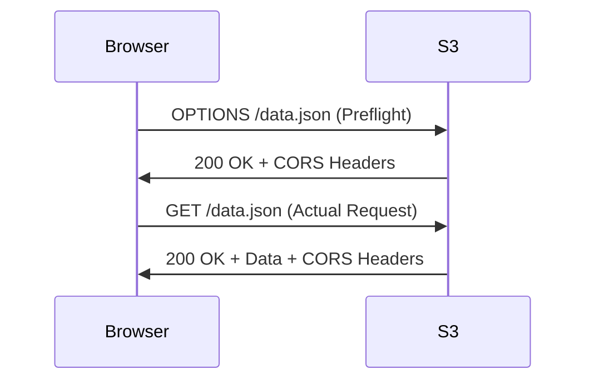

# How to Fix S3 CORS Errors in Browser Applications

Author: [nawazdhandala](https://github.com/nawazdhandala)

Tags: AWS, S3, CORS, Web Development, Troubleshooting

Description: Learn how to diagnose and fix CORS errors when accessing Amazon S3 objects from browser-based applications, with practical configuration examples.

---

If you've ever tried to load an image, font, or JSON file from an S3 bucket in a browser app, there's a good chance you've run into something like this:

```
Access to XMLHttpRequest at 'https://my-bucket.s3.amazonaws.com/data.json' from origin 'https://myapp.com' has been blocked by CORS policy.
```

It's one of those errors that looks straightforward but can waste hours of your time if you don't know exactly where to look. Let's walk through what CORS actually does, why S3 blocks your requests, and how to fix it properly.

## What Is CORS and Why Does S3 Care?

CORS stands for Cross-Origin Resource Sharing. Browsers enforce a security model where scripts on one domain can't freely access resources on another domain. When your app at `https://myapp.com` makes a fetch request to `https://my-bucket.s3.amazonaws.com`, the browser checks whether S3 has explicitly allowed that origin.

If S3 doesn't respond with the right CORS headers, the browser kills the request. This isn't S3 being difficult - it's the browser doing its job. S3 just needs to be told which origins are allowed.

## The Preflight Request Problem

For certain types of requests - those with custom headers, PUT/DELETE methods, or non-standard content types - the browser sends a preflight OPTIONS request before the actual request. This is where things often break. S3 needs to handle both the preflight and the actual request correctly.

Here's what the flow looks like:



If the preflight fails, the actual request never happens.

## Setting Up CORS on Your S3 Bucket

You can configure CORS through the AWS Console, CLI, or infrastructure as code. Let's cover the most common approaches.

### Using the AWS Console

Navigate to your bucket in the S3 console, click the "Permissions" tab, and scroll down to "Cross-origin resource sharing (CORS)". You'll need to add a JSON configuration.

Here's a configuration that allows GET requests from a specific origin:

```json
[
    {
        "AllowedHeaders": ["*"],
        "AllowedMethods": ["GET"],
        "AllowedOrigins": ["https://myapp.com"],
        "ExposeHeaders": ["ETag"],
        "MaxAgeSeconds": 3600
    }
]
```

Let me break down each field. `AllowedHeaders` controls which request headers the browser can send. `AllowedMethods` specifies which HTTP methods are permitted. `AllowedOrigins` lists the domains that can access your bucket. `ExposeHeaders` determines which response headers the browser can read. `MaxAgeSeconds` tells the browser how long to cache the preflight response.

### Using the AWS CLI

You can also set CORS configuration from the command line. First, create a JSON file with your CORS rules:

```json
{
    "CORSRules": [
        {
            "AllowedHeaders": ["*"],
            "AllowedMethods": ["GET", "PUT", "POST"],
            "AllowedOrigins": ["https://myapp.com", "https://staging.myapp.com"],
            "ExposeHeaders": ["ETag", "x-amz-request-id"],
            "MaxAgeSeconds": 3600
        }
    ]
}
```

Then apply it with the following command:

```bash
# Apply the CORS configuration to your bucket
aws s3api put-bucket-cors --bucket my-bucket --cors-configuration file://cors.json
```

To verify the configuration was applied correctly:

```bash
# Check the current CORS configuration on your bucket
aws s3api get-bucket-cors --bucket my-bucket
```

## Common Mistakes and How to Fix Them

### Mistake 1: Wildcard Origins in Production

Using `"AllowedOrigins": ["*"]` seems tempting, but it's a bad idea for production. It opens your bucket to requests from any website. If your bucket contains user data or private assets, this is a security risk.

Instead, list your specific origins:

```json
[
    {
        "AllowedHeaders": ["*"],
        "AllowedMethods": ["GET"],
        "AllowedOrigins": [
            "https://myapp.com",
            "https://www.myapp.com",
            "https://staging.myapp.com"
        ],
        "MaxAgeSeconds": 3600
    }
]
```

### Mistake 2: Forgetting to Include the Protocol

`myapp.com` is not the same as `https://myapp.com`. Origins must include the protocol. If you're testing locally, you need `http://localhost:3000` (with the port number).

### Mistake 3: Missing Methods

If your app uploads files to S3, you need PUT in `AllowedMethods`. If you're using presigned URLs for multipart uploads, you might need POST as well. Think about every HTTP method your application actually uses.

### Mistake 4: CloudFront Caching CORS Responses

If you put CloudFront in front of S3, CloudFront can cache the response without CORS headers. When a non-browser request hits CloudFront first, the cached response won't include CORS headers. Then when a browser request arrives, it gets the cached version without headers and fails.

The fix is to forward the `Origin` header through CloudFront. In your CloudFront distribution, add `Origin` to the cache key:

```json
{
    "HeadersConfig": {
        "HeaderBehavior": "whitelist",
        "Headers": {
            "Items": ["Origin", "Access-Control-Request-Headers", "Access-Control-Request-Method"]
        }
    }
}
```

### Mistake 5: Not Including AllowedHeaders

Some libraries add custom headers like `x-amz-*` headers for authentication or `Content-Type` for uploads. If you don't allow these headers, the preflight will fail. Using `"AllowedHeaders": ["*"]` is usually fine here since it only affects what headers the browser can send in the actual request.

## Debugging CORS Issues

When things aren't working, here's a systematic approach.

First, check the actual request in your browser's developer tools. Open the Network tab and look at the failed request. If you see a preflight OPTIONS request that returned an error, that's your problem.

You can also test CORS from the command line by simulating what the browser does:

```bash
# Simulate a CORS preflight request to S3
curl -X OPTIONS \
  -H "Origin: https://myapp.com" \
  -H "Access-Control-Request-Method: GET" \
  -H "Access-Control-Request-Headers: Content-Type" \
  -v https://my-bucket.s3.amazonaws.com/data.json
```

Look for these headers in the response:

```
Access-Control-Allow-Origin: https://myapp.com
Access-Control-Allow-Methods: GET
Access-Control-Allow-Headers: Content-Type
```

If these headers are missing, your CORS configuration isn't being applied. Double-check the bucket name, region, and that you're hitting the right endpoint.

## Multiple CORS Rules

You can have multiple CORS rules for different use cases. S3 evaluates them in order and uses the first match.

```json
[
    {
        "AllowedHeaders": ["*"],
        "AllowedMethods": ["GET"],
        "AllowedOrigins": ["*"],
        "MaxAgeSeconds": 86400
    },
    {
        "AllowedHeaders": ["*"],
        "AllowedMethods": ["GET", "PUT", "POST", "DELETE"],
        "AllowedOrigins": ["https://admin.myapp.com"],
        "ExposeHeaders": ["ETag", "x-amz-request-id"],
        "MaxAgeSeconds": 3600
    }
]
```

This setup allows anyone to read public assets but restricts write operations to your admin dashboard.

## CORS with Presigned URLs

If you're using presigned URLs for uploads, you still need CORS configured. The presigned URL handles authentication, but the browser still enforces CORS. A common pattern looks like this:

```javascript
// Generate a presigned URL on the server side
const command = new PutObjectCommand({
    Bucket: "my-bucket",
    Key: "uploads/photo.jpg",
    ContentType: "image/jpeg"
});

const presignedUrl = await getSignedUrl(s3Client, command, { expiresIn: 3600 });

// On the client side, upload directly to S3
const response = await fetch(presignedUrl, {
    method: "PUT",
    body: fileData,
    headers: {
        "Content-Type": "image/jpeg"
    }
});
```

For this to work, your CORS config needs to allow PUT from your app's origin and include `Content-Type` in allowed headers.

## Wrapping Up

CORS errors with S3 are almost always a configuration issue. The fix is usually straightforward - you just need to tell S3 which origins, methods, and headers to allow. Start with the specific configuration you need, test it with curl, and then verify in the browser.

If you're setting up monitoring for your S3-backed application, check out our guide on [monitoring AWS infrastructure](https://oneuptime.com/blog/post/2026-02-02-pulumi-aws-infrastructure/view) to catch issues before your users do.

Remember to keep your CORS configuration as restrictive as possible. Allow only the origins and methods you actually need, and review the configuration periodically as your application evolves.
