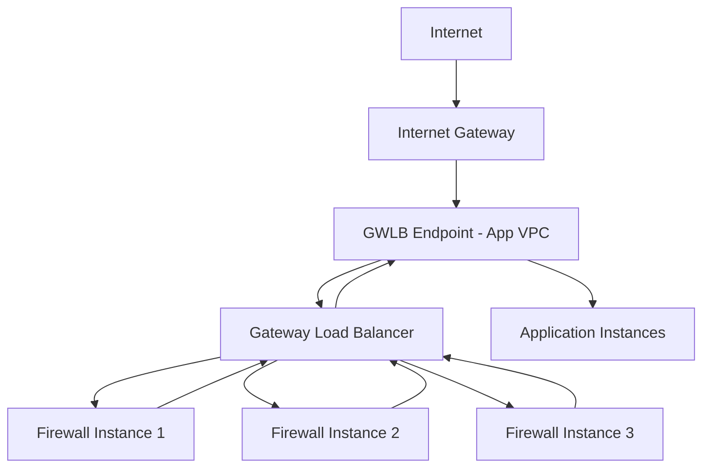

# How to Configure Gateway Load Balancer for Third-Party Appliances

Author: [nawazdhandala](https://github.com/nawazdhandala)

Tags: AWS, Gateway Load Balancer, Network Security, Firewall

Description: Learn how to deploy Gateway Load Balancer to transparently route traffic through third-party virtual appliances like firewalls, IDS/IPS, and packet inspection tools.

---

When you need to inspect all network traffic flowing in and out of your VPCs - for compliance, security, or regulatory reasons - you typically deploy third-party virtual appliances like firewalls, intrusion detection systems, or deep packet inspection tools. The challenge is inserting these appliances into the traffic path without disrupting your network architecture or creating bottlenecks.

Gateway Load Balancer (GWLB) solves this elegantly. It operates at Layer 3, transparently routing traffic through your appliance fleet using GENEVE encapsulation. The appliances see the original packets, do their inspection or filtering, and send them back. Your applications never know the appliances are there.

## How GWLB Works

GWLB uses a unique architecture with three components:



1. **Gateway Load Balancer**: Lives in the appliance VPC. Distributes traffic across appliance instances using GENEVE tunnels.
2. **GWLB Endpoint**: A VPC endpoint in your application VPC. This is where traffic enters and exits the inspection path.
3. **Target Group**: Contains your appliance instances, registered by IP or instance ID.

Traffic flow: Internet > IGW > Route to GWLB Endpoint > GWLB > Appliance > GWLB > GWLB Endpoint > Application.

## Setting Up the Appliance VPC

Start with the VPC where your appliance instances will run.

Create the appliance VPC and GWLB:

```bash
# Create the appliance VPC
aws ec2 create-vpc --cidr-block 10.100.0.0/16 --tag-specifications 'ResourceType=vpc,Tags=[{Key=Name,Value=appliance-vpc}]'

# Create subnets for the appliances
aws ec2 create-subnet \
  --vpc-id vpc-appliance001 \
  --cidr-block 10.100.1.0/24 \
  --availability-zone us-east-1a \
  --tag-specifications 'ResourceType=subnet,Tags=[{Key=Name,Value=appliance-az1}]'

aws ec2 create-subnet \
  --vpc-id vpc-appliance001 \
  --cidr-block 10.100.2.0/24 \
  --availability-zone us-east-1b \
  --tag-specifications 'ResourceType=subnet,Tags=[{Key=Name,Value=appliance-az2}]'
```

## Creating the Gateway Load Balancer

Create the GWLB and its target group:

```bash
# Create the GWLB target group
# Note: GWLB uses GENEVE protocol on port 6081
aws elbv2 create-target-group \
  --name "firewall-targets" \
  --protocol GENEVE \
  --port 6081 \
  --vpc-id vpc-appliance001 \
  --target-type instance \
  --health-check-protocol HTTP \
  --health-check-port 80 \
  --health-check-path /health

# Create the Gateway Load Balancer
aws elbv2 create-load-balancer \
  --name "security-gwlb" \
  --type gateway \
  --subnets subnet-appliance-az1 subnet-appliance-az2 \
  --tags Key=Purpose,Value=TrafficInspection

# Create the listener (GWLB listeners are simpler - just forward)
aws elbv2 create-listener \
  --load-balancer-arn arn:aws:elasticloadbalancing:us-east-1:123456789012:loadbalancer/gwy/security-gwlb/abc123 \
  --default-actions Type=forward,TargetGroupArn=arn:aws:elasticloadbalancing:us-east-1:123456789012:targetgroup/firewall-targets/def456

# Register appliance instances
aws elbv2 register-targets \
  --target-group-arn arn:aws:elasticloadbalancing:us-east-1:123456789012:targetgroup/firewall-targets/def456 \
  --targets Id=i-firewall01 Id=i-firewall02 Id=i-firewall03
```

## Creating the GWLB Endpoint Service

To use the GWLB from other VPCs, you need to create a VPC endpoint service.

Create the endpoint service:

```bash
# Create the VPC endpoint service
aws ec2 create-vpc-endpoint-service-configuration \
  --gateway-load-balancer-arns arn:aws:elasticloadbalancing:us-east-1:123456789012:loadbalancer/gwy/security-gwlb/abc123 \
  --acceptance-required \
  --tag-specifications 'ResourceType=vpc-endpoint-service,Tags=[{Key=Name,Value=security-inspection}]'

# Note the service name from the output - it looks like:
# com.amazonaws.vpce.us-east-1.vpce-svc-0123456789abcdef0
```

## Creating GWLB Endpoints in the Application VPC

In each application VPC, create GWLB endpoints and update route tables.

Create endpoints and configure routing:

```bash
# Create a GWLB endpoint in the application VPC
aws ec2 create-vpc-endpoint \
  --vpc-id vpc-app001 \
  --vpc-endpoint-type GatewayLoadBalancer \
  --service-name com.amazonaws.vpce.us-east-1.vpce-svc-0123456789abcdef0 \
  --subnet-ids subnet-app-az1

# Accept the endpoint connection (in the service owner account)
aws ec2 accept-vpc-endpoint-connections \
  --service-id vpce-svc-0123456789abcdef0 \
  --vpc-endpoint-ids vpce-0123456789abcdef0
```

Now update the route tables to direct traffic through the GWLB endpoint.

Configure route tables for traffic inspection:

```bash
# Internet Gateway route table - route ingress traffic to GWLB endpoint
aws ec2 create-route-table --vpc-id vpc-app001 --tag-specifications 'ResourceType=route-table,Tags=[{Key=Name,Value=igw-rtb}]'
aws ec2 associate-route-table --route-table-id rtb-igw --gateway-id igw-abc123

aws ec2 create-route \
  --route-table-id rtb-igw \
  --destination-cidr-block 10.0.1.0/24 \
  --vpc-endpoint-id vpce-0123456789abcdef0

# Application subnet route table - route egress traffic to GWLB endpoint
aws ec2 create-route \
  --route-table-id rtb-app \
  --destination-cidr-block 0.0.0.0/0 \
  --vpc-endpoint-id vpce-0123456789abcdef0

# GWLB endpoint subnet route table - route to internet gateway
aws ec2 create-route \
  --route-table-id rtb-gwlbe \
  --destination-cidr-block 0.0.0.0/0 \
  --gateway-id igw-abc123
```

## CloudFormation Template

Here's the full CloudFormation setup:

```yaml
AWSTemplateFormatVersion: '2010-09-09'
Description: Gateway Load Balancer for Third-Party Appliances

Parameters:
  ApplianceVpcId:
    Type: AWS::EC2::VPC::Id
  ApplianceSubnetIds:
    Type: List<AWS::EC2::Subnet::Id>
  AppVpcId:
    Type: AWS::EC2::VPC::Id
  AppSubnetId:
    Type: AWS::EC2::Subnet::Id

Resources:
  # GWLB in the appliance VPC
  GatewayLoadBalancer:
    Type: AWS::ElasticLoadBalancingV2::LoadBalancer
    Properties:
      Name: security-gwlb
      Type: gateway
      Subnets: !Ref ApplianceSubnetIds

  GWLBTargetGroup:
    Type: AWS::ElasticLoadBalancingV2::TargetGroup
    Properties:
      Name: firewall-targets
      Protocol: GENEVE
      Port: 6081
      VpcId: !Ref ApplianceVpcId
      TargetType: instance
      HealthCheckProtocol: HTTP
      HealthCheckPort: "80"
      HealthCheckPath: /health

  GWLBListener:
    Type: AWS::ElasticLoadBalancingV2::Listener
    Properties:
      LoadBalancerArn: !Ref GatewayLoadBalancer
      DefaultActions:
        - Type: forward
          TargetGroupArn: !Ref GWLBTargetGroup

  # Endpoint Service
  EndpointService:
    Type: AWS::EC2::VPCEndpointService
    Properties:
      GatewayLoadBalancerArns:
        - !Ref GatewayLoadBalancer
      AcceptanceRequired: false

  # GWLB Endpoint in the application VPC
  GWLBEndpoint:
    Type: AWS::EC2::VPCEndpoint
    Properties:
      VpcId: !Ref AppVpcId
      VpcEndpointType: GatewayLoadBalancer
      ServiceName: !Sub "com.amazonaws.vpce.${AWS::Region}.${EndpointService}"
      SubnetIds:
        - !Ref AppSubnetId

Outputs:
  GWLBEndpointId:
    Value: !Ref GWLBEndpoint
    Description: Use this endpoint ID in route tables
```

## Appliance Configuration

Your appliance instances need to support GENEVE encapsulation. Most commercial firewall vendors (Palo Alto, Fortinet, Check Point) have AMIs that support GWLB natively. For open-source solutions, you can use tools like `geneve-proxy` or configure Linux's native GENEVE support.

Example iptables-based appliance setup on Linux:

```bash
#!/bin/bash
# Basic Linux appliance setup for GWLB

# Enable IP forwarding
echo 1 > /proc/sys/net/ipv4/ip_forward

# Create GENEVE tunnel interface
ip link add geneve0 type geneve id 0 remote 0.0.0.0 dstport 6081
ip link set geneve0 up

# Simple passthrough (inspect-and-forward)
# Replace with your actual inspection logic
iptables -t mangle -A PREROUTING -i geneve0 -j ACCEPT
iptables -t mangle -A POSTROUTING -o geneve0 -j ACCEPT

# Health check endpoint
python3 -m http.server 80 &
```

In a real deployment, you'd replace the simple iptables rules with actual inspection logic - Suricata for IDS, iptables with advanced rules for firewalling, or a commercial appliance's built-in inspection engine.

## Flow Stickiness

GWLB maintains flow stickiness using 5-tuple hashing (source IP, destination IP, source port, destination port, protocol). This means all packets belonging to the same flow go to the same appliance instance. This is critical for stateful appliances like firewalls that need to see both directions of a connection.

You can verify flow distribution:

```bash
# Check target group health and active flow count
aws elbv2 describe-target-health \
  --target-group-arn arn:aws:elasticloadbalancing:us-east-1:123456789012:targetgroup/firewall-targets/def456
```

## Cross-AZ Considerations

Deploy GWLB endpoints in every availability zone where your applications run. If an AZ doesn't have a GWLB endpoint, traffic from that AZ can't be inspected (or won't route correctly).

GWLB supports cross-zone load balancing, which distributes traffic across appliances in all AZs even if the traffic enters from a single AZ. Enable it if your appliance fleet isn't evenly distributed:

```bash
aws elbv2 modify-load-balancer-attributes \
  --load-balancer-arn $GWLB_ARN \
  --attributes Key=load_balancing.cross_zone.enabled,Value=true
```

## Monitoring

Watch these CloudWatch metrics for GWLB health:

- **HealthyHostCount / UnhealthyHostCount**: Track appliance availability
- **ProcessedBytes**: Total traffic processed
- **NewFlowCount**: New connections per second
- **ActiveFlowCount**: Current active connections

Set up alarms for unhealthy hosts - if an appliance goes down and you're running at capacity, you could start dropping traffic.

For more on load balancing, see our guide on [ALB authentication](https://oneuptime.com/blog/post/alb-authentication-cognito-oidc/view).
