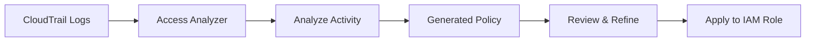

# How to Generate IAM Policies from Access Activity with Access Analyzer

Author: [nawazdhandala](https://github.com/nawazdhandala)

Tags: AWS, IAM, Security, Access Analyzer

Description: Learn how to use AWS IAM Access Analyzer to generate least-privilege IAM policies based on actual access activity from CloudTrail logs.

---

Writing IAM policies from scratch is tedious and error-prone. You either give too many permissions (a security risk) or too few (breaking your application). AWS IAM Access Analyzer solves this by looking at what your users and roles actually do, then generating policies that match real usage. It's one of the most underused features in the AWS security toolkit.

In this guide, we'll walk through the full process of generating policies from access activity, from enabling CloudTrail to reviewing and applying the generated policies.

## Prerequisites

Before you can generate policies with Access Analyzer, you need:

- An AWS account with administrative access
- CloudTrail enabled and logging API calls (we'll cover this briefly)
- At least 90 days of CloudTrail data for meaningful policy generation

If you haven't set up CloudTrail yet, check out our guide on [enabling AWS CloudTrail for API auditing](https://oneuptime.com/blog/post/enable-aws-cloudtrail-api-auditing/view).

## How Access Analyzer Policy Generation Works

Access Analyzer examines CloudTrail logs over a specified time window and identifies which AWS services and actions a role or user actually called. It then produces a least-privilege policy that covers exactly those actions - nothing more.



The generated policy won't include actions that were never used during the analysis period. That's both the strength and the limitation - if a role only runs certain tasks quarterly, you need to make sure your analysis window covers those periods.

## Step 1: Enable CloudTrail (If Not Already Done)

Access Analyzer needs CloudTrail data to work. Here's a quick check using the AWS CLI.

```bash
# List existing trails to see if CloudTrail is already configured
aws cloudtrail describe-trails --query 'trailList[*].{Name:Name,IsMultiRegion:IsMultiRegionTrail,IsLogging:HasCustomEventSelectors}'
```

If you don't have a trail, create one:

```bash
# Create a new trail that logs management events across all regions
aws cloudtrail create-trail \
  --name my-org-trail \
  --s3-bucket-name my-cloudtrail-bucket \
  --is-multi-region-trail \
  --enable-log-file-validation

# Start logging
aws cloudtrail start-logging --name my-org-trail
```

## Step 2: Create an Access Analyzer

You need an analyzer of type ACCOUNT or ORGANIZATION. Most teams start with ACCOUNT scope.

```bash
# Create an Access Analyzer for the current account
aws accessanalyzer create-analyzer \
  --analyzer-name my-account-analyzer \
  --type ACCOUNT
```

Verify it's active:

```bash
# Check the analyzer status
aws accessanalyzer list-analyzers \
  --query 'analyzers[*].{Name:name,Status:status,Type:type}'
```

## Step 3: Start Policy Generation

Now here's where it gets interesting. You pick a role and a time window, and Access Analyzer does the heavy lifting.

```bash
# Start policy generation for a specific IAM role
# This analyzes the last 90 days of CloudTrail activity
aws accessanalyzer start-policy-generation \
  --policy-generation-details '{
    "principalArn": "arn:aws:iam::123456789012:role/MyAppRole",
    "cloudTrailDetails": {
      "trails": [
        {
          "cloudTrailArn": "arn:aws:cloudtrail:us-east-1:123456789012:trail/my-org-trail",
          "regions": ["us-east-1"],
          "allRegions": false
        }
      ],
      "accessRole": "arn:aws:iam::123456789012:role/AccessAnalyzerMonitorServiceRole",
      "startTime": "2025-11-01T00:00:00Z",
      "endTime": "2026-02-01T00:00:00Z"
    }
  }'
```

This returns a job ID that you'll use to check progress.

## Step 4: Check the Generation Status

Policy generation can take anywhere from a few minutes to several hours depending on how much CloudTrail data needs processing.

```bash
# Check the status of policy generation using the job ID
aws accessanalyzer get-generated-policy \
  --job-id "job-id-from-previous-step" \
  --query 'jobDetails.status'
```

Possible statuses are IN_PROGRESS, SUCCEEDED, FAILED, and CANCELED.

## Step 5: Retrieve the Generated Policy

Once the job completes, pull down the generated policy.

```bash
# Get the generated policy document
aws accessanalyzer get-generated-policy \
  --job-id "job-id-from-previous-step" \
  --query 'generatedPolicyResult.generatedPolicies[*].policy' \
  --output text
```

The output will be a JSON policy document. Here's an example of what you might see for an application that reads from S3 and writes to DynamoDB:

```json
{
  "Version": "2012-10-17",
  "Statement": [
    {
      "Sid": "S3ReadAccess",
      "Effect": "Allow",
      "Action": [
        "s3:GetObject",
        "s3:ListBucket"
      ],
      "Resource": [
        "arn:aws:s3:::my-app-bucket",
        "arn:aws:s3:::my-app-bucket/*"
      ]
    },
    {
      "Sid": "DynamoDBWriteAccess",
      "Effect": "Allow",
      "Action": [
        "dynamodb:PutItem",
        "dynamodb:UpdateItem",
        "dynamodb:GetItem",
        "dynamodb:Query"
      ],
      "Resource": "arn:aws:dynamodb:us-east-1:123456789012:table/MyAppTable"
    }
  ]
}
```

Notice how the policy only includes the specific actions and resources that were actually used. No wildcards, no extra permissions.

## Step 6: Review and Refine

Don't just blindly apply the generated policy. There are a few things to check:

1. **Missing seasonal actions** - If a task only runs monthly or quarterly, it might not show up in the analysis window.
2. **Resource ARNs** - Access Analyzer sometimes includes specific resource ARNs. Consider whether you need slightly broader patterns.
3. **Service-linked roles** - Some actions might be performed by service-linked roles rather than your application role.

Here's a Python script that helps you compare the generated policy against the current policy:

```python
import json
import boto3

# Compare current vs generated policy to find removed permissions
def compare_policies(current_policy, generated_policy):
    current_actions = set()
    generated_actions = set()

    for stmt in current_policy.get("Statement", []):
        actions = stmt.get("Action", [])
        if isinstance(actions, str):
            actions = [actions]
        current_actions.update(actions)

    for stmt in generated_policy.get("Statement", []):
        actions = stmt.get("Action", [])
        if isinstance(actions, str):
            actions = [actions]
        generated_actions.update(actions)

    removed = current_actions - generated_actions
    added = generated_actions - current_actions

    print(f"Actions in current but NOT in generated (will be removed):")
    for action in sorted(removed):
        print(f"  - {action}")

    print(f"\nActions in generated but NOT in current (new):")
    for action in sorted(added):
        print(f"  + {action}")

# Load both policies and compare
with open("current_policy.json") as f:
    current = json.load(f)

with open("generated_policy.json") as f:
    generated = json.load(f)

compare_policies(current, generated)
```

## Step 7: Apply the Policy

After reviewing, apply the refined policy to your IAM role.

```bash
# Create a new policy version with the generated policy
aws iam create-policy-version \
  --policy-arn arn:aws:iam::123456789012:policy/MyAppPolicy \
  --policy-document file://generated_policy.json \
  --set-as-default
```

I'd recommend applying this in a staging environment first. Monitor CloudTrail for any AccessDenied events for a week or two before rolling it out to production.

## Using the Console

If you prefer the AWS Console, the workflow is even simpler:

1. Go to IAM > Roles > Select your role
2. Click "Generate policy" in the Access Advisor tab
3. Select your CloudTrail trail and time range
4. Wait for generation to complete
5. Review the suggested policy
6. Click "Create and attach policy"

## Automating Policy Generation

For teams managing dozens of roles, you can automate this with a Lambda function that runs monthly.

```python
import boto3
from datetime import datetime, timedelta

# Lambda function to auto-generate policies for all roles
def lambda_handler(event, context):
    iam = boto3.client("iam")
    analyzer = boto3.client("accessanalyzer")

    # Get all roles with a specific tag
    roles = iam.list_roles()["Roles"]

    for role in roles:
        # Skip service-linked roles
        if role["Path"].startswith("/aws-service-role/"):
            continue

        end_time = datetime.utcnow()
        start_time = end_time - timedelta(days=90)

        try:
            response = analyzer.start_policy_generation(
                policyGenerationDetails={
                    "principalArn": role["Arn"],
                    "cloudTrailDetails": {
                        "trails": [{
                            "cloudTrailArn": "arn:aws:cloudtrail:us-east-1:123456789012:trail/my-org-trail",
                            "allRegions": True
                        }],
                        "accessRole": "arn:aws:iam::123456789012:role/AccessAnalyzerMonitorServiceRole",
                        "startTime": start_time.isoformat() + "Z",
                        "endTime": end_time.isoformat() + "Z"
                    }
                }
            )
            print(f"Started generation for {role['RoleName']}: {response['jobId']}")
        except Exception as e:
            print(f"Failed for {role['RoleName']}: {str(e)}")
```

## Common Pitfalls

**Not enough data**: If a role has been active for less than a few weeks, the generated policy might miss important actions. Wait until you have at least 90 days of data.

**Cross-region activity**: Make sure your CloudTrail trail covers all regions where the role operates. A single-region trail will miss actions in other regions.

**Overly specific resources**: Sometimes the generated policy references specific resource IDs (like a particular Lambda function ARN). You may want to use wildcards for resources that get recreated during deployments.

## Monitoring After Applying

After applying a tighter policy, keep an eye on access denied errors. You can set up a CloudWatch alarm or use [OneUptime](https://oneuptime.com/blog/post/enable-aws-cloudtrail-api-auditing/view) to monitor for these events and get alerted before users are impacted.

Access Analyzer policy generation is one of the most practical ways to move toward least-privilege access. It takes the guesswork out of policy writing and gives you a solid starting point based on real usage data. Combined with regular reviews and automated monitoring, it forms a strong foundation for your IAM security posture.
