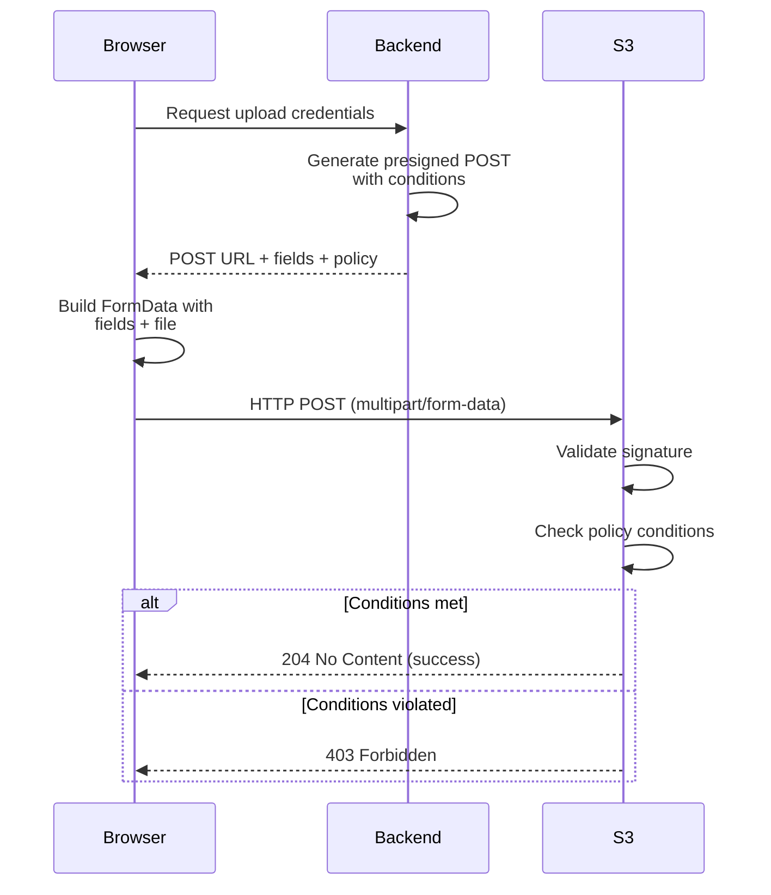

# How to Generate Presigned POST Requests for S3 Uploads

Author: [nawazdhandala](https://github.com/nawazdhandala)

Tags: AWS, S3, Presigned POST, File Upload, Security

Description: Learn how to generate presigned POST requests for S3 uploads with fine-grained conditions on file size, content type, and metadata.

---

Presigned PUT URLs let users upload files directly to S3, but they're limited. You can't enforce file size limits, restrict content types effectively, or require specific metadata. Presigned POST requests solve all of these problems by letting you define conditions that the upload must satisfy. If any condition fails, S3 rejects the upload entirely.

This is the approach you want for user-facing upload forms, especially in web applications.

## Presigned PUT vs. Presigned POST

Here's the key difference:

**Presigned PUT**: Simple, single file upload. The URL encodes exactly one operation on one key. Limited control over what gets uploaded.

**Presigned POST**: Form-based upload with a policy document. You can enforce conditions on file size, content type, key prefix, metadata, and more. The upload uses HTTP POST with multipart/form-data encoding.

For more on presigned PUT URLs, see our post on [generating presigned URLs for temporary S3 access](https://oneuptime.com/blog/post/2026-02-12-generate-presigned-urls-temporary-s3-access/view).

## Generating a Basic Presigned POST

Here's the simplest example - a presigned POST that allows uploading a single file.

```python
import boto3
import json

s3 = boto3.client('s3')

# Generate presigned POST data
post = s3.generate_presigned_post(
    Bucket='my-upload-bucket',
    Key='user-uploads/${filename}',  # ${filename} is replaced by actual filename
    ExpiresIn=3600  # 1 hour
)

print("URL:", post['url'])
print("Fields:", json.dumps(post['fields'], indent=2))
```

The response includes a `url` and `fields` dict. The fields must be included in the POST request as form fields.

## Adding Conditions

The real power of presigned POST is conditions. Here's a comprehensive example.

```python
import boto3
import json

s3 = boto3.client('s3')

# Generate presigned POST with conditions
post = s3.generate_presigned_post(
    Bucket='my-upload-bucket',
    Key='uploads/user-42/${filename}',
    Fields={
        'Content-Type': 'image/jpeg',        # Set default content type
        'x-amz-meta-uploaded-by': 'user-42', # Custom metadata
    },
    Conditions=[
        # File size between 1KB and 10MB
        ['content-length-range', 1024, 10485760],
        # Content type must start with image/
        ['starts-with', '$Content-Type', 'image/'],
        # Key must start with this prefix
        ['starts-with', '$key', 'uploads/user-42/'],
        # Require the metadata field
        {'x-amz-meta-uploaded-by': 'user-42'},
    ],
    ExpiresIn=900  # 15 minutes
)

# Print the form data needed for the upload
print("POST URL:", post['url'])
print("\nForm fields:")
for key, value in post['fields'].items():
    print(f"  {key}: {value}")
```

## Available Conditions

Here are the conditions you can enforce:

| Condition | Syntax | Description |
|-----------|--------|-------------|
| Exact match | `{"field": "value"}` | Field must exactly match value |
| Starts with | `["starts-with", "$field", "prefix"]` | Field must start with prefix |
| Content length | `["content-length-range", min, max]` | File size in bytes |
| Any value | `["starts-with", "$field", ""]` | Field can be anything |

## Using Presigned POST in a Web Application

Here's a complete example with a Flask backend and HTML frontend.

Backend (Flask):

```python
from flask import Flask, jsonify, request
import boto3

app = Flask(__name__)
s3 = boto3.client('s3')

BUCKET = 'my-upload-bucket'
MAX_FILE_SIZE = 5 * 1024 * 1024  # 5MB

@app.route('/api/upload-credentials', methods=['GET'])
def get_upload_credentials():
    """Generate presigned POST credentials for the frontend."""
    user_id = request.args.get('user_id', 'anonymous')

    post = s3.generate_presigned_post(
        Bucket=BUCKET,
        Key=f'uploads/{user_id}/${{filename}}',
        Fields={
            'x-amz-meta-user-id': user_id,
        },
        Conditions=[
            ['content-length-range', 1, MAX_FILE_SIZE],
            ['starts-with', '$Content-Type', ''],
            ['starts-with', '$key', f'uploads/{user_id}/'],
            {'x-amz-meta-user-id': user_id},
        ],
        ExpiresIn=600  # 10 minutes
    )

    return jsonify(post)
```

Frontend (HTML + JavaScript):

```html
<!DOCTYPE html>
<html>
<head>
    <title>S3 Direct Upload</title>
</head>
<body>
    <h2>Upload a File</h2>
    <input type="file" id="fileInput" />
    <button onclick="uploadFile()">Upload</button>
    <div id="status"></div>

    <script>
    async function uploadFile() {
        const fileInput = document.getElementById('fileInput');
        const statusDiv = document.getElementById('status');
        const file = fileInput.files[0];

        if (!file) {
            statusDiv.textContent = 'Please select a file';
            return;
        }

        // Get presigned POST credentials from your backend
        const response = await fetch('/api/upload-credentials?user_id=42');
        const presignedPost = await response.json();

        // Build the form data
        const formData = new FormData();

        // IMPORTANT: Add all fields from the presigned POST first
        Object.entries(presignedPost.fields).forEach(([key, value]) => {
            formData.append(key, value);
        });

        // Add the file LAST - this is required by S3
        formData.append('file', file);

        statusDiv.textContent = 'Uploading...';

        try {
            // POST directly to S3
            const uploadResponse = await fetch(presignedPost.url, {
                method: 'POST',
                body: formData,
                // Do NOT set Content-Type header - browser sets it with boundary
            });

            if (uploadResponse.ok) {
                statusDiv.textContent = 'Upload successful!';
            } else {
                const errorText = await uploadResponse.text();
                statusDiv.textContent = 'Upload failed: ' + errorText;
            }
        } catch (error) {
            statusDiv.textContent = 'Upload error: ' + error.message;
        }
    }
    </script>
</body>
</html>
```

## Upload Flow



## Handling CORS for Browser Uploads

Since the browser uploads directly to S3, you need CORS configured on the bucket.

```json
[
    {
        "AllowedHeaders": ["*"],
        "AllowedMethods": ["POST"],
        "AllowedOrigins": ["https://your-app.com"],
        "ExposeHeaders": ["ETag"],
        "MaxAgeSeconds": 3600
    }
]
```

Apply the CORS configuration.

```bash
aws s3api put-bucket-cors \
  --bucket my-upload-bucket \
  --cors-configuration file://cors-config.json
```

For more details on CORS setup, see our post on [configuring CORS on S3 buckets](https://oneuptime.com/blog/post/2026-02-12-configure-cors-s3-bucket/view).

## Advanced: Upload with Server-Side Encryption

You can require encryption on uploaded objects by including it in the presigned POST conditions.

```python
import boto3

s3 = boto3.client('s3')

post = s3.generate_presigned_post(
    Bucket='my-secure-bucket',
    Key='encrypted-uploads/${filename}',
    Fields={
        'x-amz-server-side-encryption': 'AES256',
    },
    Conditions=[
        ['content-length-range', 1, 10485760],
        {'x-amz-server-side-encryption': 'AES256'},
    ],
    ExpiresIn=600
)
```

## Advanced: Success Redirect

You can tell S3 to redirect the user after a successful upload - useful for traditional form submissions.

```python
import boto3

s3 = boto3.client('s3')

post = s3.generate_presigned_post(
    Bucket='my-upload-bucket',
    Key='uploads/${filename}',
    Fields={
        'success_action_redirect': 'https://your-app.com/upload-success',
    },
    Conditions=[
        ['content-length-range', 1, 10485760],
        {'success_action_redirect': 'https://your-app.com/upload-success'},
    ],
    ExpiresIn=600
)
```

## Common Pitfalls

**1. File field must be last**: In the multipart form data, the `file` field must come after all other fields. If you put it first, S3 rejects the request.

**2. Content-Type mismatch**: If you set a Content-Type condition, the client must send the exact same Content-Type. Use `starts-with` for flexibility.

**3. Don't set the Content-Type header on fetch**: When using JavaScript's `fetch()` with FormData, let the browser set the Content-Type header automatically. It needs to include the multipart boundary.

**4. Key template vs exact key**: The `${filename}` variable is replaced by the filename from the upload. If you want a fixed key, just use the exact path without the variable.

**5. Policy expiration**: The presigned POST expires based on `ExpiresIn`, but S3 also checks the policy expiration embedded in the signed data. Both must be valid.

## Wrapping Up

Presigned POST is the right choice for any application that needs browser-to-S3 uploads. The conditions system gives you server-side enforcement of upload constraints without routing files through your backend. Your servers stay lean, your uploads go directly to S3's infrastructure, and you maintain control over what gets uploaded. Combine it with S3 event notifications or Lambda triggers to process uploads after they land.
