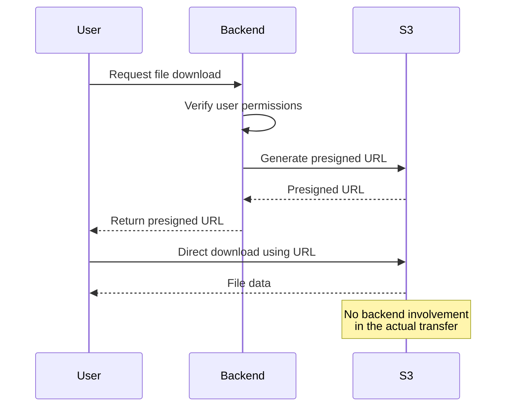

# How to Generate Presigned URLs for Temporary S3 Access

Author: [nawazdhandala](https://github.com/nawazdhandala)

Tags: AWS, S3, Presigned URLs, Security, Access Control

Description: Learn how to generate S3 presigned URLs to provide temporary, secure access to private objects without exposing your AWS credentials.

---

You've got a private S3 bucket full of files, and you need to let someone download one without giving them AWS credentials. Maybe it's a user downloading a report from your web app, or a partner accessing a shared document. Presigned URLs solve this elegantly - they encode your AWS credentials and permissions into a time-limited URL that anyone can use to access a specific object.

## How Presigned URLs Work

When you generate a presigned URL, you're essentially creating a URL that includes:

- The bucket and object key
- Your AWS access key ID (not the secret)
- An expiration timestamp
- A cryptographic signature

Anyone with the URL can access the object until it expires. After that, the URL returns an AccessDenied error. The URL's permissions are limited to the specific operation (GET or PUT) and the specific object you signed it for.

## Generating a Presigned URL for Downloads

The simplest use case - let someone download a file.

Using the AWS CLI:

```bash
# Generate a presigned URL valid for 1 hour (3600 seconds)
aws s3 presign s3://my-private-bucket/reports/monthly-report.pdf \
  --expires-in 3600
```

Using Python (more common in applications):

```python
import boto3

s3 = boto3.client('s3')

# Generate a presigned URL for downloading an object
url = s3.generate_presigned_url(
    'get_object',
    Params={
        'Bucket': 'my-private-bucket',
        'Key': 'reports/monthly-report.pdf'
    },
    ExpiresIn=3600  # URL valid for 1 hour
)

print(f"Download URL: {url}")
```

Using Node.js:

```javascript
const { S3Client, GetObjectCommand } = require('@aws-sdk/client-s3');
const { getSignedUrl } = require('@aws-sdk/s3-request-presigner');

const s3Client = new S3Client({ region: 'us-east-1' });

async function generateDownloadUrl(bucket, key, expiresIn = 3600) {
    const command = new GetObjectCommand({
        Bucket: bucket,
        Key: key,
    });

    // Generate presigned URL valid for 1 hour
    const url = await getSignedUrl(s3Client, command, { expiresIn });
    console.log(`Download URL: ${url}`);
    return url;
}

generateDownloadUrl('my-private-bucket', 'reports/monthly-report.pdf');
```

## Generating a Presigned URL for Uploads

You can also create presigned URLs that allow file uploads. This is great for letting users upload directly to S3 without routing the file through your backend.

```python
import boto3

s3 = boto3.client('s3')

# Generate a presigned URL for uploading
url = s3.generate_presigned_url(
    'put_object',
    Params={
        'Bucket': 'my-upload-bucket',
        'Key': 'user-uploads/photo-12345.jpg',
        'ContentType': 'image/jpeg'
    },
    ExpiresIn=900  # 15 minutes to upload
)

print(f"Upload URL: {url}")
```

The client then uploads using a simple HTTP PUT.

```bash
# Client uses the presigned URL to upload
curl -X PUT \
  -H "Content-Type: image/jpeg" \
  --upload-file photo.jpg \
  "https://my-upload-bucket.s3.amazonaws.com/user-uploads/photo-12345.jpg?X-Amz-Algorithm=..."
```

## Building a Download API Endpoint

Here's a complete example of a Flask endpoint that generates presigned URLs on demand.

```python
from flask import Flask, request, jsonify, abort
import boto3

app = Flask(__name__)
s3 = boto3.client('s3')

BUCKET = 'my-private-bucket'
URL_EXPIRY = 300  # 5 minutes

@app.route('/api/download-url', methods=['GET'])
def get_download_url():
    """
    Generate a temporary download URL for a file.
    Requires the user to be authenticated (middleware not shown).
    """
    file_key = request.args.get('file')
    if not file_key:
        abort(400, 'Missing file parameter')

    # Validate the user has permission to access this file
    # (your auth logic here)

    # Check that the object actually exists
    try:
        s3.head_object(Bucket=BUCKET, Key=file_key)
    except s3.exceptions.ClientError as e:
        if e.response['Error']['Code'] == '404':
            abort(404, 'File not found')
        raise

    # Generate the presigned URL
    url = s3.generate_presigned_url(
        'get_object',
        Params={
            'Bucket': BUCKET,
            'Key': file_key,
            'ResponseContentDisposition': f'attachment; filename="{file_key.split("/")[-1]}"'
        },
        ExpiresIn=URL_EXPIRY
    )

    return jsonify({
        'url': url,
        'expires_in': URL_EXPIRY
    })
```

## Setting Response Headers

You can override certain response headers in the presigned URL. This is useful for forcing downloads or setting content types.

```python
import boto3

s3 = boto3.client('s3')

# Generate URL that forces a download dialog
url = s3.generate_presigned_url(
    'get_object',
    Params={
        'Bucket': 'my-bucket',
        'Key': 'data/export.csv',
        # Force browser to download instead of displaying
        'ResponseContentDisposition': 'attachment; filename="export.csv"',
        # Override the content type
        'ResponseContentType': 'text/csv',
        # Set cache control
        'ResponseCacheControl': 'no-cache'
    },
    ExpiresIn=3600
)
```

## Request Flow

Here's how the typical presigned URL flow works in a web application.



## Security Best Practices

### Keep Expiration Times Short

The shorter the better. For downloads, 5-15 minutes is usually enough. For uploads, give just enough time for the transfer to complete.

```python
# Don't do this - URL valid for a week
url = s3.generate_presigned_url('get_object', Params={...}, ExpiresIn=604800)

# Do this - URL valid for 5 minutes
url = s3.generate_presigned_url('get_object', Params={...}, ExpiresIn=300)
```

### Use Specific Object Keys

Never generate presigned URLs dynamically based on user input without validation. An attacker could craft a request to access any object in your bucket.

```python
# BAD - user controls the full key
key = request.args.get('file')
url = s3.generate_presigned_url('get_object', Params={'Bucket': BUCKET, 'Key': key})

# GOOD - restrict to allowed prefix and validate
key = request.args.get('file')
if not key or '..' in key or key.startswith('/'):
    abort(400)
# Only allow files in the user's directory
safe_key = f"users/{current_user.id}/{key}"
url = s3.generate_presigned_url('get_object', Params={'Bucket': BUCKET, 'Key': safe_key})
```

### Restrict Upload Content Types

When generating upload URLs, specify the content type to prevent users from uploading unexpected file types.

```python
# Restrict uploads to specific content types
url = s3.generate_presigned_url(
    'put_object',
    Params={
        'Bucket': 'my-bucket',
        'Key': 'uploads/document.pdf',
        'ContentType': 'application/pdf'  # Must match when uploading
    },
    ExpiresIn=300
)
```

### Use Conditions to Limit Upload Size

For more control over uploads, use presigned POST instead of presigned PUT. See our post on [generating presigned POST requests for S3 uploads](https://oneuptime.com/blog/post/2026-02-12-generate-presigned-post-requests-s3-uploads/view) for details.

## Maximum Expiration Time

The maximum expiration time depends on how you generate the URL:

- **IAM user credentials**: Up to 7 days (604,800 seconds)
- **IAM role (temporary credentials)**: Limited to the remaining validity of the session token, which is typically 1-12 hours
- **STS temporary credentials**: Limited to the session duration

If you're running on EC2 or Lambda (which use role-based credentials), your presigned URLs can't exceed the role session duration.

## Troubleshooting Common Issues

**"Request has expired" error**: The URL has passed its expiration time. Generate a new one.

**"SignatureDoesNotMatch" error**: Usually means the client is modifying the URL or adding headers that weren't part of the signature. Make sure the Content-Type header matches exactly when uploading.

**"AccessDenied" error on valid URL**: The IAM principal that generated the URL might have lost permissions since signing. Presigned URLs are checked against current permissions at access time, not at generation time.

## Wrapping Up

Presigned URLs are one of the most useful S3 features for application developers. They let you keep your buckets private while still sharing specific objects securely, and they offload the actual file transfer from your servers to S3's infrastructure. Keep the expiration times short, validate all user input, and you'll have a solid pattern for secure file sharing.
