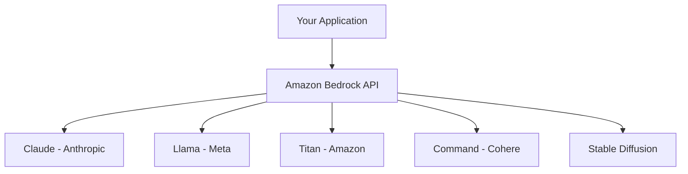

# How to Get Started with Amazon Bedrock

Author: [nawazdhandala](https://github.com/nawazdhandala)

Tags: AWS, Amazon Bedrock, Generative AI, Foundation Models, LLM

Description: A beginner-friendly guide to getting started with Amazon Bedrock for accessing foundation models, building generative AI applications, and integrating LLMs into your workflows.

---

If you've been watching the generative AI space and wondering how to integrate it into your AWS stack, Amazon Bedrock is the place to start. It gives you access to foundation models from multiple providers - Anthropic, Meta, Amazon, Cohere, and others - through a single API. No model hosting, no GPU management, no infrastructure to worry about. You just call an API and get responses.

This guide covers everything you need to go from zero to working Bedrock applications.

## What is Amazon Bedrock?

Bedrock is a fully managed service that provides API access to foundation models (FMs) for text generation, image generation, embeddings, and more. The key features:

- **Multiple model providers** - Access Claude, Llama, Titan, Cohere, and Stable Diffusion models through one API
- **Serverless** - No infrastructure to manage. Pay per token (input and output)
- **Private** - Your data isn't used to train the models
- **Customizable** - Fine-tune models on your data or use RAG (Retrieval-Augmented Generation)



## Setting Up Access

Before you can use Bedrock, you need to request access to the models you want. This is a one-time setup per AWS account per model.

```python
import boto3

# Check which models are available in your region
bedrock = boto3.client('bedrock', region_name='us-east-1')

# List all available foundation models
response = bedrock.list_foundation_models()

for model in response['modelSummaries']:
    print(f"{model['modelId']}: {model['modelName']}")
    print(f"  Provider: {model['providerName']}")
    print(f"  Input: {model['inputModalities']}")
    print(f"  Output: {model['outputModalities']}")
    print()
```

To request model access through the console: go to Amazon Bedrock, click "Model access" in the sidebar, and enable the models you want. Some models are available instantly, others require a brief approval.

You can also manage access programmatically.

```python
# Check your current model access
response = bedrock.list_foundation_models(
    byProvider='Anthropic'
)

for model in response['modelSummaries']:
    print(f"{model['modelId']}: {model.get('modelLifecycle', {}).get('status', 'unknown')}")
```

## Your First Bedrock API Call

The Bedrock Runtime client is what you use to actually invoke models. Let's make a simple text generation call.

```python
import boto3
import json

# Create the Bedrock Runtime client
bedrock_runtime = boto3.client('bedrock-runtime', region_name='us-east-1')

# Use the Converse API - works across all text models
response = bedrock_runtime.converse(
    modelId='anthropic.claude-3-sonnet-20240229-v1:0',
    messages=[
        {
            'role': 'user',
            'content': [
                {
                    'text': 'Explain what a load balancer does in 3 sentences.'
                }
            ]
        }
    ],
    inferenceConfig={
        'maxTokens': 256,
        'temperature': 0.7,
        'topP': 0.9
    }
)

# Extract the response text
output_text = response['output']['message']['content'][0]['text']
print(output_text)

# Check token usage
usage = response['usage']
print(f"\nTokens - Input: {usage['inputTokens']}, Output: {usage['outputTokens']}")
```

## Working with Different Models

One of Bedrock's strengths is that you can switch between models easily. The Converse API provides a unified interface across providers.

```python
# Same prompt, different models
models_to_try = [
    'anthropic.claude-3-sonnet-20240229-v1:0',
    'meta.llama3-8b-instruct-v1:0',
    'amazon.titan-text-express-v1',
]

prompt = 'What are the top 3 benefits of microservices architecture?'

for model_id in models_to_try:
    try:
        response = bedrock_runtime.converse(
            modelId=model_id,
            messages=[{
                'role': 'user',
                'content': [{'text': prompt}]
            }],
            inferenceConfig={
                'maxTokens': 300,
                'temperature': 0.5
            }
        )

        text = response['output']['message']['content'][0]['text']
        tokens = response['usage']

        print(f"\n{'='*60}")
        print(f"Model: {model_id}")
        print(f"Tokens: {tokens['inputTokens']} in, {tokens['outputTokens']} out")
        print(f"Response: {text[:200]}...")

    except Exception as e:
        print(f"\n{model_id}: {str(e)}")
```

## Streaming Responses

For better user experience in interactive applications, stream responses token by token instead of waiting for the full response.

```python
# Stream a response for faster time-to-first-token
response = bedrock_runtime.converse_stream(
    modelId='anthropic.claude-3-sonnet-20240229-v1:0',
    messages=[{
        'role': 'user',
        'content': [{'text': 'Write a short guide on setting up CloudWatch alarms.'}]
    }],
    inferenceConfig={
        'maxTokens': 500,
        'temperature': 0.7
    }
)

# Process the stream
full_response = ''
for event in response['stream']:
    if 'contentBlockDelta' in event:
        chunk = event['contentBlockDelta']['delta'].get('text', '')
        print(chunk, end='', flush=True)
        full_response += chunk

    if 'messageStop' in event:
        print('\n--- Stream complete ---')

    if 'metadata' in event:
        usage = event['metadata'].get('usage', {})
        print(f"Total tokens: {usage.get('inputTokens', 0)} in, {usage.get('outputTokens', 0)} out")
```

## Multi-Turn Conversations

Bedrock supports multi-turn conversations where you maintain context across messages.

```python
# Build a conversation with context
messages = []

# First turn
messages.append({
    'role': 'user',
    'content': [{'text': 'I want to set up monitoring for my AWS infrastructure. What should I monitor?'}]
})

response = bedrock_runtime.converse(
    modelId='anthropic.claude-3-sonnet-20240229-v1:0',
    messages=messages,
    inferenceConfig={'maxTokens': 500}
)

# Add the assistant's response to the conversation
assistant_response = response['output']['message']
messages.append(assistant_response)

print("Assistant:", assistant_response['content'][0]['text'][:200] + "...")

# Second turn - follow up
messages.append({
    'role': 'user',
    'content': [{'text': 'Can you give me a specific CloudWatch alarm configuration for EC2 CPU usage?'}]
})

response = bedrock_runtime.converse(
    modelId='anthropic.claude-3-sonnet-20240229-v1:0',
    messages=messages,
    inferenceConfig={'maxTokens': 500}
)

print("\nAssistant:", response['output']['message']['content'][0]['text'][:200] + "...")
```

## Generating Embeddings

Bedrock can also generate text embeddings for search, similarity, and RAG applications.

```python
# Generate embeddings with Amazon Titan
response = bedrock_runtime.invoke_model(
    modelId='amazon.titan-embed-text-v2:0',
    contentType='application/json',
    body=json.dumps({
        'inputText': 'How do I set up monitoring for my Kubernetes cluster?'
    })
)

result = json.loads(response['body'].read())
embedding = result['embedding']

print(f"Embedding dimensions: {len(embedding)}")
print(f"First 5 values: {embedding[:5]}")

# Generate embeddings for multiple texts for comparison
texts = [
    'How do I monitor Kubernetes?',
    'Setting up alerts for EKS clusters',
    'Best pizza restaurants in New York'
]

embeddings = []
for text in texts:
    resp = bedrock_runtime.invoke_model(
        modelId='amazon.titan-embed-text-v2:0',
        contentType='application/json',
        body=json.dumps({'inputText': text})
    )
    emb = json.loads(resp['body'].read())['embedding']
    embeddings.append(emb)

# Calculate cosine similarity
import numpy as np

def cosine_similarity(a, b):
    return np.dot(a, b) / (np.linalg.norm(a) * np.linalg.norm(b))

print("\nSimilarity matrix:")
for i, text_i in enumerate(texts):
    for j, text_j in enumerate(texts):
        sim = cosine_similarity(embeddings[i], embeddings[j])
        print(f"  '{text_i[:30]}' vs '{text_j[:30]}': {sim:.4f}")
```

## System Prompts

Use system prompts to control the model's behavior and persona.

```python
# Use a system prompt to set context and behavior
response = bedrock_runtime.converse(
    modelId='anthropic.claude-3-sonnet-20240229-v1:0',
    system=[{
        'text': """You are a DevOps expert who specializes in AWS infrastructure monitoring.
        Keep your answers practical and include code examples when relevant.
        Always recommend setting up proper alerting and monitoring."""
    }],
    messages=[{
        'role': 'user',
        'content': [{'text': 'My API is sometimes slow. How should I investigate?'}]
    }],
    inferenceConfig={
        'maxTokens': 500,
        'temperature': 0.3  # Lower temperature for more focused, technical responses
    }
)

print(response['output']['message']['content'][0]['text'])
```

## Cost Management

Bedrock charges per token (input and output), with different rates per model. Track your usage.

```python
# Track token usage across calls
class BedrockUsageTracker:
    def __init__(self):
        self.total_input_tokens = 0
        self.total_output_tokens = 0
        self.call_count = 0

    def invoke(self, bedrock_client, model_id, messages, **kwargs):
        self.call_count += 1

        response = bedrock_client.converse(
            modelId=model_id,
            messages=messages,
            **kwargs
        )

        usage = response.get('usage', {})
        self.total_input_tokens += usage.get('inputTokens', 0)
        self.total_output_tokens += usage.get('outputTokens', 0)

        return response

    def report(self):
        print(f"Total API calls: {self.call_count}")
        print(f"Total input tokens: {self.total_input_tokens}")
        print(f"Total output tokens: {self.total_output_tokens}")
        # Approximate cost for Claude Sonnet
        input_cost = self.total_input_tokens * 0.000003
        output_cost = self.total_output_tokens * 0.000015
        print(f"Estimated cost: ${input_cost + output_cost:.4f}")

# Usage
tracker = BedrockUsageTracker()
response = tracker.invoke(
    bedrock_runtime,
    'anthropic.claude-3-sonnet-20240229-v1:0',
    messages=[{'role': 'user', 'content': [{'text': 'Hello!'}]}],
    inferenceConfig={'maxTokens': 100}
)
tracker.report()
```

## Setting Up Guardrails

Bedrock Guardrails let you add safety controls to your generative AI applications.

```python
# Create a guardrail
response = bedrock.create_guardrail(
    name='content-safety-guardrail',
    description='Block harmful content and PII',
    contentPolicyConfig={
        'filtersConfig': [
            {
                'type': 'SEXUAL',
                'inputStrength': 'HIGH',
                'outputStrength': 'HIGH'
            },
            {
                'type': 'HATE',
                'inputStrength': 'HIGH',
                'outputStrength': 'HIGH'
            }
        ]
    },
    sensitiveInformationPolicyConfig={
        'piiEntitiesConfig': [
            {'type': 'EMAIL', 'action': 'ANONYMIZE'},
            {'type': 'PHONE', 'action': 'ANONYMIZE'},
            {'type': 'US_SOCIAL_SECURITY_NUMBER', 'action': 'BLOCK'}
        ]
    },
    blockedInputMessaging='Your request contains content that cannot be processed.',
    blockedOutputsMessaging='The response was blocked by our content policy.'
)

guardrail_id = response['guardrailId']
guardrail_version = response['version']

# Use the guardrail with your model call
response = bedrock_runtime.converse(
    modelId='anthropic.claude-3-sonnet-20240229-v1:0',
    messages=[{
        'role': 'user',
        'content': [{'text': 'Your prompt here'}]
    }],
    guardrailConfig={
        'guardrailIdentifier': guardrail_id,
        'guardrailVersion': guardrail_version
    }
)
```

## Wrapping Up

Amazon Bedrock is the simplest way to add generative AI capabilities to your AWS applications. The Converse API gives you a consistent interface across models, streaming support keeps your applications responsive, and guardrails help you deploy responsibly. Start with the basic text generation examples, then explore [Knowledge Bases for RAG](https://oneuptime.com/blog/post/2026-02-12-amazon-bedrock-knowledge-bases-rag/view) and [different foundation models](https://oneuptime.com/blog/post/2026-02-12-amazon-bedrock-foundation-models-claude-titan-llama/view) as your needs grow. And don't forget to monitor your Bedrock usage and costs through [OneUptime](https://oneuptime.com/blog/post/aws-cloudwatch-alerting/view) for full observability.
