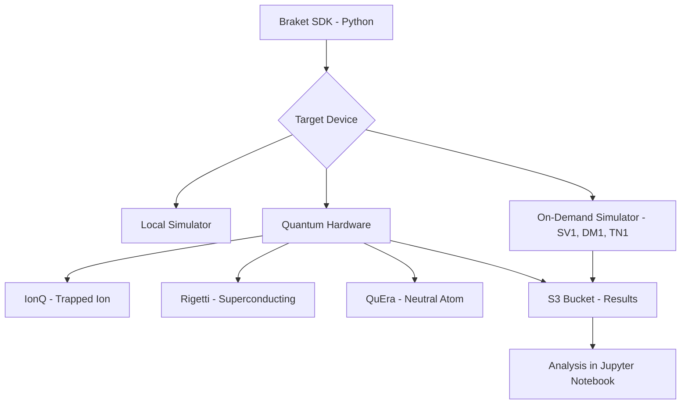

# How to Get Started with Amazon Braket for Quantum Computing

Author: [nawazdhandala](https://github.com/nawazdhandala)

Tags: AWS, Quantum Computing, Amazon Braket, Cloud Computing, Machine Learning, Innovation

Description: A hands-on introduction to Amazon Braket for running quantum computing experiments on real quantum hardware and simulators through AWS.

---

Quantum computing has been "five years away" for decades. But the reality is that you can run quantum circuits on real quantum hardware today, right from your AWS console. Amazon Braket is AWS's quantum computing service, and it makes experimenting with quantum algorithms surprisingly accessible.

You do not need a physics PhD to get started. If you can write Python code and understand basic linear algebra, you can build and run quantum circuits. This guide takes you from zero to running your first quantum job.

## What Is Amazon Braket?

Amazon Braket is a fully managed quantum computing service that lets you:

- Design quantum algorithms using a Python SDK
- Run them on simulators (for testing and debugging)
- Execute them on actual quantum hardware from providers like IonQ, Rigetti, and QuEra
- Analyze results using Jupyter notebooks in a managed environment

The name "Braket" comes from the Dirac bra-ket notation used in quantum mechanics (the angle brackets in quantum state notation like |0> and <1|).

## How Amazon Braket Fits Together



You write your circuits once using the Braket SDK, then target them to any available device - simulators or real quantum computers. Results always land in an S3 bucket you specify.

## Prerequisites

You will need:

- An AWS account
- Python 3.9+ installed locally
- Basic understanding of quantum computing concepts (qubits, gates, measurement)
- An S3 bucket to store results

Install the Braket SDK:

```bash
# Install the Amazon Braket SDK and local simulator
pip install amazon-braket-sdk amazon-braket-default-simulator
```

Set up your AWS credentials:

```bash
# Configure AWS credentials for Braket access
aws configure
```

Make sure your IAM user or role has the `AmazonBraketFullAccess` managed policy attached.

## Your First Quantum Circuit: Bell State

Let us start with the "hello world" of quantum computing - creating a Bell state. This demonstrates quantum entanglement, where two qubits become correlated in a way that has no classical equivalent.

```python
# Create a Bell state circuit - the quantum "hello world"
from braket.circuits import Circuit
from braket.aws import AwsDevice

# Build a two-qubit circuit
bell = Circuit()

# Apply Hadamard gate to qubit 0 (creates superposition)
bell.h(0)

# Apply CNOT gate with qubit 0 as control and qubit 1 as target
# This entangles the two qubits
bell.cnot(0, 1)

print(bell)
```

This prints the circuit diagram:

```
T  : |0|1|

q0 : -H-C-
         |
q1 : ---X-

T  : |0|1|
```

The Hadamard gate (H) puts qubit 0 into a superposition of |0> and |1>. The CNOT gate then entangles qubit 1 with qubit 0, so they always produce the same measurement result.

## Running on a Local Simulator

Before spending money on quantum hardware, test your circuits locally:

```python
# Run the Bell state circuit on the local simulator
from braket.devices import LocalSimulator

# Use the local simulator (free, runs on your machine)
local_sim = LocalSimulator()

# Run the circuit 1000 times to build up statistics
result = local_sim.run(bell, shots=1000).result()

# Get the measurement counts
counts = result.measurement_counts
print(f"Measurement results: {counts}")
# Expected output: {'00': ~500, '11': ~500}
```

You should see roughly equal counts of `00` and `11`, confirming the qubits are entangled. You will never see `01` or `10` because the qubits are perfectly correlated.

## Running on AWS Simulators

AWS offers three managed simulators, each optimized for different use cases:

- **SV1** - State vector simulator. Handles up to 34 qubits. Best for general-purpose circuit simulation.
- **DM1** - Density matrix simulator. Up to 17 qubits. Supports noise modeling.
- **TN1** - Tensor network simulator. Handles certain circuits with many more qubits. Best for sparse or structured circuits.

```python
# Run on the SV1 managed simulator
from braket.aws import AwsDevice

# Choose the SV1 state vector simulator
sv1 = AwsDevice("arn:aws:braket:::device/quantum-simulator/amazon/sv1")

# Specify S3 bucket for results
s3_location = ("my-braket-results-bucket", "bell-state-experiment")

# Submit the task
task = sv1.run(bell, s3_location, shots=1000)

# Wait for results (managed simulators are fast)
result = task.result()
print(f"SV1 results: {result.measurement_counts}")
```

## Running on Real Quantum Hardware

This is where it gets exciting. You can send your circuits to actual quantum processors:

```python
# Run on IonQ's trapped-ion quantum computer
ionq_device = AwsDevice("arn:aws:braket:us-east-1::device/qpu/ionq/Aria-1")

# Check device availability first
print(f"Device status: {ionq_device.status}")
print(f"Device is available: {ionq_device.is_available}")

# Submit the quantum task
s3_location = ("my-braket-results-bucket", "ionq-bell-state")
task = ionq_device.run(bell, s3_location, shots=1000)

# This may take minutes to hours depending on queue depth
print(f"Task ID: {task.id}")
print(f"Task status: {task.state()}")
```

Real quantum hardware introduces noise, so your results will not be as clean as the simulator. You might see small counts of `01` and `10` due to decoherence and gate errors.

## Building More Interesting Circuits

Let us try something more practical - a Grover's search algorithm that finds a marked item in an unsorted database:

```python
# Grover's algorithm for searching 2 qubits (4 items)
# Finds the marked state |11>
from braket.circuits import Circuit
import numpy as np

grover = Circuit()

# Step 1: Initialize superposition over all states
grover.h(range(2))

# Step 2: Oracle - marks the target state |11>
# Apply CZ gate (flips phase of |11>)
grover.cz(0, 1)

# Step 3: Diffusion operator (amplifies marked state)
grover.h(range(2))
grover.z(range(2))
grover.cz(0, 1)
grover.h(range(2))

# Run on local simulator
local_sim = LocalSimulator()
result = local_sim.run(grover, shots=1000).result()
print(f"Grover search results: {result.measurement_counts}")
# Expected: |11> has highest probability
```

## Using Amazon Braket Hybrid Jobs

For algorithms that mix classical and quantum computing (like variational algorithms), use Braket Hybrid Jobs:

```python
# Define a hybrid job that runs variational quantum eigensolver (VQE)
from braket.aws import AwsQuantumJob

# Create the job script
job = AwsQuantumJob.create(
    device="arn:aws:braket:::device/quantum-simulator/amazon/sv1",
    source_module="vqe_algorithm.py",
    entry_point="vqe_algorithm:main",
    hyperparameters={
        "n_qubits": "4",
        "max_iterations": "100",
        "learning_rate": "0.1"
    },
    wait_until_complete=False
)

print(f"Job ARN: {job.arn}")
```

Hybrid Jobs run your classical optimization loop on AWS infrastructure close to the quantum devices, reducing latency between iterations.

## Using Braket Notebooks

Amazon Braket includes managed Jupyter notebook instances pre-configured with the Braket SDK and example notebooks:

1. Open the Amazon Braket console
2. Click "Notebooks" in the left sidebar
3. Create a new notebook instance
4. Choose an instance type (ml.t3.medium works for experimentation)
5. Launch and open the notebook

The notebook comes with a collection of tutorials covering everything from basic circuits to advanced algorithms like QAOA and quantum machine learning.

## Cost Management

Quantum computing on Braket has specific pricing:

- **Simulators** - Charged per minute of simulation time. SV1 costs $0.075/minute.
- **Quantum hardware** - Per-task fee plus per-shot fee. IonQ charges $0.30/task + $0.01/shot. Rigetti charges $0.30/task + $0.00035/shot.
- **Notebooks** - Standard SageMaker notebook instance pricing.

A practical budget approach:

```python
# Always check costs before submitting to hardware
shots = 1000
per_shot_cost = 0.01  # IonQ pricing
per_task_cost = 0.30

total_cost = per_task_cost + (shots * per_shot_cost)
print(f"Estimated cost for this task: ${total_cost:.2f}")
# Output: Estimated cost for this task: $10.30
```

Develop and debug on local simulators (free), validate on managed simulators (cheap), and only go to hardware when you need real quantum results.

## Monitoring Braket Tasks

Track your quantum tasks programmatically:

```python
# Monitor a submitted quantum task
import time

while task.state() not in ['COMPLETED', 'FAILED', 'CANCELLED']:
    status = task.state()
    print(f"Task {task.id}: {status}")
    time.sleep(30)

if task.state() == 'COMPLETED':
    result = task.result()
    print(f"Results: {result.measurement_counts}")
else:
    print(f"Task failed with state: {task.state()}")
```

You can also monitor Braket usage through CloudWatch metrics. For broader infrastructure monitoring alongside your quantum workloads, [OneUptime](https://oneuptime.com) provides a unified view across all your AWS services.

## Practical Tips for Getting Started

1. **Start with simulators.** Real quantum hardware is expensive and has queue times. Develop everything on simulators first.

2. **Keep circuits shallow.** Current quantum hardware is noisy. Fewer gates means less accumulated error. Aim for the minimum circuit depth that solves your problem.

3. **Use error mitigation.** Techniques like zero-noise extrapolation and probabilistic error cancellation can improve results on real hardware.

4. **Pick the right hardware.** IonQ's trapped-ion machines have high gate fidelity but slower execution. Rigetti's superconducting processors are faster but noisier. Match the hardware to your circuit needs.

5. **Set budget alerts.** Create a CloudWatch billing alarm specifically for Braket charges so you do not get surprised.

## Wrapping Up

Amazon Braket makes quantum computing accessible without needing to build or maintain quantum hardware. You can go from writing your first circuit to running it on a real quantum processor in an afternoon.

The technology is still in its early days - current quantum computers are noisy and limited in qubit count. But learning quantum computing now puts you ahead of the curve. The algorithms and intuition you build today will transfer directly as the hardware improves.

Start with the Bell state example above, move on to Grover's algorithm, and then explore the variational algorithms in the Braket notebook tutorials. The quantum future is not five years away anymore - it is available right now through your AWS console.
