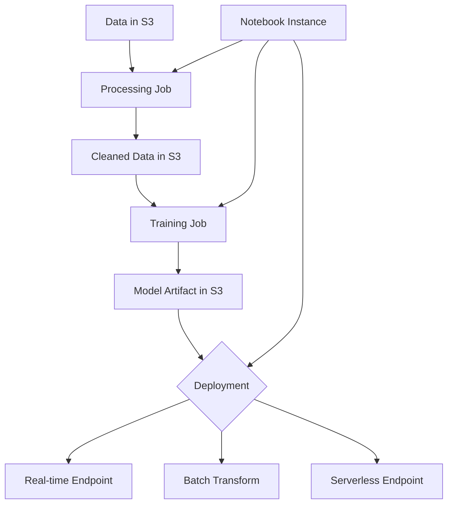

# How to Get Started with Amazon SageMaker

Author: [nawazdhandala](https://github.com/nawazdhandala)

Tags: AWS, SageMaker, Machine Learning, AI

Description: A beginner-friendly guide to getting started with Amazon SageMaker for machine learning, covering key concepts, components, and your first model training workflow.

---

Amazon SageMaker is AWS's fully managed machine learning platform. It handles the infrastructure for building, training, and deploying ML models so you can focus on the data science. If you've been doing ML on local machines or managing your own EC2 instances for training, SageMaker takes away most of the operational overhead.

But SageMaker is also a big service with many components. It's easy to get lost in the options. This guide will walk you through the core concepts and get you running your first training job.

## What SageMaker Actually Includes

SageMaker isn't one thing - it's a collection of tools. Here are the ones that matter most when you're starting out:

- **SageMaker Studio** - A web-based IDE for ML development
- **Notebook Instances** - Jupyter notebooks on managed EC2 instances
- **Training Jobs** - Managed infrastructure for model training
- **Endpoints** - Real-time model serving
- **Processing Jobs** - Data preprocessing at scale
- **Built-in Algorithms** - Pre-built ML algorithms ready to use
- **Feature Store** - Centralized storage for ML features

You don't need all of these to start. The typical beginner path is: Notebook Instance for experimentation, then Training Jobs for production training, then Endpoints for deployment.

## Setting Up Your Environment

First, you need an IAM role that SageMaker can assume:

```bash
# Create an IAM role for SageMaker
aws iam create-role \
  --role-name SageMakerExecutionRole \
  --assume-role-policy-document '{
    "Version": "2012-10-17",
    "Statement": [
      {
        "Effect": "Allow",
        "Principal": {
          "Service": "sagemaker.amazonaws.com"
        },
        "Action": "sts:AssumeRole"
      }
    ]
  }'

# Attach the SageMaker full access policy
aws iam attach-role-policy \
  --role-name SageMakerExecutionRole \
  --policy-arn arn:aws:iam::aws:policy/AmazonSageMakerFullAccess

# Also need S3 access for data
aws iam attach-role-policy \
  --role-name SageMakerExecutionRole \
  --policy-arn arn:aws:iam::aws:policy/AmazonS3FullAccess
```

Create an S3 bucket for your training data and model artifacts:

```bash
# Create an S3 bucket for SageMaker data
aws s3 mb s3://my-sagemaker-data-$(aws sts get-caller-identity --query Account --output text)
```

## Your First Training Job

Let's train a simple model using SageMaker's built-in XGBoost algorithm. We'll use the classic Iris classification dataset.

First, prepare and upload the training data:

```python
import boto3
import sagemaker
from sagemaker import get_execution_role
import pandas as pd
from sklearn.datasets import load_iris
from sklearn.model_selection import train_test_split
import csv
import os

# Get the SageMaker session and role
session = sagemaker.Session()
role = get_execution_role()
bucket = session.default_bucket()

# Load and prepare the Iris dataset
iris = load_iris()
df = pd.DataFrame(iris.data, columns=iris.feature_names)
df['target'] = iris.target

# SageMaker's XGBoost expects the target column first
cols = ['target'] + [c for c in df.columns if c != 'target']
df = df[cols]

# Split into training and validation sets
train_df, val_df = train_test_split(df, test_size=0.2, random_state=42)

# Save to CSV without headers (XGBoost format requirement)
train_df.to_csv('train.csv', header=False, index=False)
val_df.to_csv('validation.csv', header=False, index=False)

# Upload to S3
train_path = session.upload_data('train.csv', bucket=bucket, key_prefix='iris/train')
val_path = session.upload_data('validation.csv', bucket=bucket, key_prefix='iris/validation')

print(f"Training data: {train_path}")
print(f"Validation data: {val_path}")
```

Now train the model:

```python
from sagemaker.estimator import Estimator
from sagemaker import image_uris

# Get the XGBoost container image
container = image_uris.retrieve('xgboost', session.boto_region_name, version='1.7-1')

# Create the estimator
xgb = Estimator(
    image_uri=container,
    role=role,
    instance_count=1,
    instance_type='ml.m5.large',
    output_path=f's3://{bucket}/iris/output',
    sagemaker_session=session
)

# Set hyperparameters
xgb.set_hyperparameters(
    objective='multi:softmax',
    num_class=3,
    num_round=100,
    max_depth=5,
    eta=0.2,
    eval_metric='mlogloss'
)

# Define input channels
from sagemaker.inputs import TrainingInput

train_input = TrainingInput(train_path, content_type='csv')
val_input = TrainingInput(val_path, content_type='csv')

# Start the training job
xgb.fit({
    'train': train_input,
    'validation': val_input
})

print(f"Model artifact: {xgb.model_data}")
```

This kicks off a managed training job. SageMaker provisions the ml.m5.large instance, runs the training, saves the model to S3, and terminates the instance. You only pay for the training time.

## Deploying the Model

Once training is complete, deploy the model as a real-time endpoint:

```python
# Deploy the model to a real-time endpoint
predictor = xgb.deploy(
    initial_instance_count=1,
    instance_type='ml.t2.medium',  # Smaller instance for inference
    serializer=sagemaker.serializers.CSVSerializer()
)

# Make a prediction
test_sample = '5.1,3.5,1.4,0.2'  # A sample from the Iris dataset
result = predictor.predict(test_sample)
print(f"Prediction: {result}")
```

When you're done testing, delete the endpoint to stop charges:

```python
# Delete the endpoint to stop charges
predictor.delete_endpoint()
```

This is important - endpoints run continuously and charge by the hour. For the notebook guide, see our post on [creating a SageMaker notebook instance](https://oneuptime.com/blog/post/create-a-sagemaker-notebook-instance/view).

## Using SageMaker with Your Own Code

The built-in algorithms are great for quick experiments, but you'll often want to bring your own training scripts. SageMaker supports custom scripts through "script mode":

```python
# train.py - Your custom training script
import argparse
import os
import pandas as pd
from sklearn.ensemble import RandomForestClassifier
import joblib

def train(args):
    # SageMaker puts training data in /opt/ml/input/data/
    train_data = pd.read_csv(
        os.path.join(args.train, 'train.csv'),
        header=None
    )

    # First column is the target
    y_train = train_data.iloc[:, 0]
    X_train = train_data.iloc[:, 1:]

    # Train the model
    model = RandomForestClassifier(
        n_estimators=args.n_estimators,
        max_depth=args.max_depth,
        random_state=42
    )
    model.fit(X_train, y_train)

    # Save the model - SageMaker expects it in /opt/ml/model/
    joblib.dump(model, os.path.join(args.model_dir, 'model.joblib'))
    print(f"Model saved. Training accuracy: {model.score(X_train, y_train):.4f}")

if __name__ == '__main__':
    parser = argparse.ArgumentParser()

    # Hyperparameters
    parser.add_argument('--n-estimators', type=int, default=100)
    parser.add_argument('--max-depth', type=int, default=10)

    # SageMaker-specific arguments
    parser.add_argument('--model-dir', type=str, default=os.environ.get('SM_MODEL_DIR'))
    parser.add_argument('--train', type=str, default=os.environ.get('SM_CHANNEL_TRAIN'))

    args = parser.parse_args()
    train(args)
```

Then launch the training job using the SKLearn estimator:

```python
from sagemaker.sklearn import SKLearn

sklearn_estimator = SKLearn(
    entry_point='train.py',
    role=role,
    instance_count=1,
    instance_type='ml.m5.large',
    framework_version='1.2-1',
    hyperparameters={
        'n-estimators': 200,
        'max-depth': 15
    }
)

sklearn_estimator.fit({'train': train_path})
```

## Cost Management Tips

SageMaker can get expensive if you're not careful. Here are the key things to watch:

**Use the right instance types.** For experimentation, start with ml.t3.medium notebooks. For training, ml.m5.large is usually enough unless you're working with large datasets or deep learning.

**Stop notebook instances when not in use.** A running ml.t3.medium costs $0.05/hour. That's $36/month if left running. Use auto-stop configuration:

```bash
# Set up auto-stop lifecycle configuration
aws sagemaker create-notebook-instance-lifecycle-config \
  --notebook-instance-lifecycle-config-name auto-stop \
  --on-start '[{"Content": ""}]' \
  --on-create '[{"Content": ""}]'
```

**Delete endpoints after testing.** Endpoints charge continuously. Use serverless inference for infrequent predictions:

```python
# Serverless inference configuration (pay per request, not per hour)
from sagemaker.serverless import ServerlessInferenceConfig

serverless_config = ServerlessInferenceConfig(
    memory_size_in_mb=2048,
    max_concurrency=5
)

predictor = model.deploy(
    serverless_inference_config=serverless_config
)
```

**Use spot training for long jobs.** SageMaker managed spot training uses EC2 Spot instances and can save up to 90%:

```python
estimator = Estimator(
    image_uri=container,
    role=role,
    instance_count=1,
    instance_type='ml.m5.xlarge',
    use_spot_instances=True,           # Enable spot
    max_wait=7200,                      # Max time to wait for spot capacity
    max_run=3600,                       # Max training time
    checkpoint_s3_uri=f's3://{bucket}/checkpoints/'  # Save progress
)
```

## SageMaker Components Overview

Here's a visual overview of how the key components work together:



## Next Steps

Once you're comfortable with the basics, explore:

1. **SageMaker Pipelines** for automated ML workflows
2. **SageMaker Experiments** for tracking model iterations
3. **SageMaker Model Monitor** for detecting model drift in production
4. **SageMaker Feature Store** for reusable feature engineering

Start small with a notebook instance and a simple training job. Get familiar with the data flow (S3 to training to model artifact to endpoint), and then expand to more complex workflows.

For setting up your first notebook, head over to our guide on [creating a SageMaker notebook instance](https://oneuptime.com/blog/post/create-a-sagemaker-notebook-instance/view). And to keep your SageMaker costs under control, check out [creating a cost optimization strategy for AWS](https://oneuptime.com/blog/post/create-a-cost-optimization-strategy-for-aws/view).
