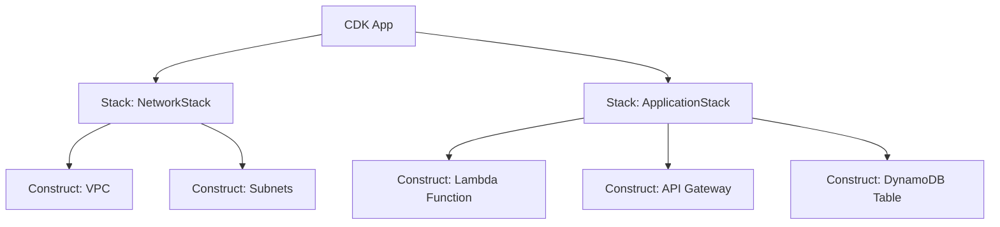

# How to Get Started with AWS CDK

Author: [nawazdhandala](https://github.com/nawazdhandala)

Tags: AWS, CDK, Infrastructure as Code, TypeScript

Description: A complete beginner's guide to AWS CDK covering installation, core concepts, your first deployment, and why CDK is changing how teams manage cloud infrastructure.

---

AWS CDK (Cloud Development Kit) lets you define cloud infrastructure using programming languages you already know - TypeScript, Python, Java, C#, or Go. Instead of writing hundreds of lines of YAML or JSON for CloudFormation, you write actual code with loops, conditions, and abstractions. Then CDK synthesizes it into CloudFormation templates and deploys them.

If you've been writing CloudFormation templates by hand, CDK is going to feel like a massive upgrade. You get IDE autocomplete, type checking, unit testing, and the full power of a programming language. Let's get started.

## Prerequisites

Before installing CDK, make sure you have these in place.

```bash
# Check that Node.js is installed (CDK requires Node.js 14.x or later)
node --version

# Check that npm is available
npm --version

# Verify your AWS CLI is configured
aws sts get-caller-identity
```

You'll need valid AWS credentials configured. CDK uses the same credential chain as the AWS CLI - environment variables, AWS profiles, or IAM roles.

## Installing CDK

Install the CDK CLI globally using npm.

```bash
# Install AWS CDK globally
npm install -g aws-cdk

# Verify the installation
cdk --version
```

That's it. The CDK CLI is a single npm package that handles everything - synthesizing templates, deploying stacks, and managing diffs.

## Core Concepts

Before creating anything, let's cover the key building blocks.

**App** - The root of your CDK application. An app contains one or more stacks.

**Stack** - Maps directly to a CloudFormation stack. A stack is a unit of deployment.

**Construct** - The basic building block. Every AWS resource is a construct. Constructs can be composed into higher-level abstractions.

**Synthesize** - The process of converting your CDK code into CloudFormation templates.

Here's how these relate visually.



## Bootstrapping Your AWS Account

Before your first deployment, you need to bootstrap your AWS account. This creates an S3 bucket and some IAM roles that CDK uses to deploy resources.

```bash
# Bootstrap the default account and region
cdk bootstrap

# Bootstrap a specific account and region
cdk bootstrap aws://123456789012/us-east-1

# Bootstrap with a custom qualifier (for multiple CDK deployments)
cdk bootstrap --qualifier myproject
```

You only need to bootstrap once per account/region combination. After that, all CDK apps can deploy to that account.

## Creating Your First CDK App

Let's create a simple app that provisions an S3 bucket.

```bash
# Create a new directory and initialize a CDK app
mkdir my-first-cdk-app
cd my-first-cdk-app

# Initialize with TypeScript (the most popular CDK language)
cdk init app --language typescript
```

This generates a project with the following structure.

```
my-first-cdk-app/
  bin/
    my-first-cdk-app.ts    # App entry point
  lib/
    my-first-cdk-app-stack.ts  # Your stack definition
  test/
    my-first-cdk-app.test.ts   # Tests
  cdk.json                      # CDK configuration
  package.json                  # Node.js dependencies
  tsconfig.json                 # TypeScript configuration
```

Open the stack file and add an S3 bucket.

```typescript
// lib/my-first-cdk-app-stack.ts
// Define a stack with a simple S3 bucket
import * as cdk from 'aws-cdk-lib';
import * as s3 from 'aws-cdk-lib/aws-s3';
import { Construct } from 'constructs';

export class MyFirstCdkAppStack extends cdk.Stack {
  constructor(scope: Construct, id: string, props?: cdk.StackProps) {
    super(scope, id, props);

    // Create an S3 bucket with versioning enabled
    const bucket = new s3.Bucket(this, 'MyFirstBucket', {
      versioned: true,
      removalPolicy: cdk.RemovalPolicy.DESTROY,
      autoDeleteObjects: true,
    });

    // Output the bucket name
    new cdk.CfnOutput(this, 'BucketName', {
      value: bucket.bucketName,
      description: 'The name of the S3 bucket',
    });
  }
}
```

Look at how clean that is. Three properties and you have a versioned S3 bucket with automatic cleanup. The equivalent CloudFormation template would be significantly longer and require manual setup of the custom resource for auto-deleting objects.

## The CDK Workflow

CDK has a simple development loop.

```bash
# Synthesize - generate the CloudFormation template
cdk synth

# Diff - compare your changes against what's deployed
cdk diff

# Deploy - create or update the stack
cdk deploy

# Destroy - tear down the stack
cdk destroy
```

Let's walk through each step.

**Synthesize** converts your code to CloudFormation JSON. You'll find the output in the `cdk.out` directory.

```bash
# Synthesize and view the generated template
cdk synth
```

**Diff** shows you exactly what will change before you deploy. This is incredibly useful for reviewing changes.

```bash
# See what changes will be deployed
cdk diff
```

The output looks like a git diff, showing resources that will be added, modified, or deleted.

**Deploy** pushes your changes to AWS.

```bash
# Deploy the stack
cdk deploy

# Deploy with auto-approval (skip the confirmation prompt)
cdk deploy --require-approval never

# Deploy a specific stack (if you have multiple)
cdk deploy MyFirstCdkAppStack
```

## Why CDK Over Raw CloudFormation

There are several reasons teams are moving to CDK.

**Smart defaults.** CDK L2 constructs set sensible defaults. An S3 bucket created with CDK automatically blocks public access by default. A Lambda function gets a properly scoped execution role without you writing any IAM policy.

**Composition.** You can create reusable constructs and share them across teams. Need a standard "API + Lambda + DynamoDB" pattern? Build it once as a construct and use it everywhere.

**Type safety.** Your IDE catches errors before deployment. Misspell a property name? TypeScript tells you immediately instead of waiting for a failed deployment.

**Loops and conditions.** Need 10 SQS queues with slightly different configs? Write a for loop. Need different settings per environment? Use if/else. No more copying YAML blocks.

```typescript
// Creating multiple SQS queues with a loop - try doing this in YAML
const queueNames = ['orders', 'payments', 'notifications', 'emails', 'analytics'];

for (const name of queueNames) {
  new sqs.Queue(this, `${name}Queue`, {
    queueName: `${props.environment}-${name}`,
    retentionPeriod: cdk.Duration.days(14),
    visibilityTimeout: cdk.Duration.seconds(30),
  });
}
```

## Next Steps

Once you're comfortable with the basics, there's a lot more to explore. You can dive deeper into [CDK constructs and the L1/L2/L3 abstraction levels](https://oneuptime.com/blog/post/understand-cdk-constructs-l1-l2-l3/view), learn about [CDK stacks and environments](https://oneuptime.com/blog/post/cdk-stacks-and-environments/view), or explore how to [write unit tests for your CDK stacks](https://oneuptime.com/blog/post/write-unit-tests-for-cdk-stacks/view).

CDK isn't perfect - the abstraction can sometimes hide what's really happening at the CloudFormation level, and debugging synthesis errors can be confusing at first. But for most teams, the productivity gains far outweigh the learning curve. Give it a try on a small project and see how it feels. You probably won't go back to raw CloudFormation.
