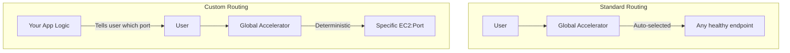

# How to Configure Global Accelerator Custom Routing

Author: [nawazdhandala](https://github.com/nawazdhandala)

Tags: AWS, Global Accelerator, Networking, Custom Routing

Description: Learn how to use AWS Global Accelerator custom routing accelerators to deterministically route users to specific EC2 instances for gaming, VoIP, and session-based apps.

---

Standard Global Accelerator routes traffic to the nearest healthy endpoint based on proximity and health. But some applications need deterministic routing - you need to send a specific user to a specific EC2 instance every time. Think multiplayer game servers, VoIP sessions, or any stateful workload where session affinity at the instance level matters. That's what custom routing accelerators are for.

## Standard vs Custom Routing

With standard routing, Global Accelerator picks the best endpoint based on proximity and health. You don't control which specific instance handles a request. With custom routing, your application maps each user to a specific EC2 instance and port, and Global Accelerator ensures traffic gets there through the optimized AWS backbone.



The custom routing accelerator provides a fixed mapping between its listener port range and your EC2 instances. Your application logic tells users which specific port to connect to, and Global Accelerator routes that traffic to the right instance.

## How the Port Mapping Works

Custom routing accelerators create a static mapping: each EC2 instance in your subnet gets assigned a range of ports on the accelerator. For example:

- Instance A gets ports 10000-10099
- Instance B gets ports 10100-10199
- Instance C gets ports 10200-10299

When a client connects to the accelerator on port 10150, traffic goes to Instance B. Your application is responsible for telling clients which port to use.

## Step 1: Create a Custom Routing Accelerator

```bash
# Create a custom routing accelerator
aws globalaccelerator create-custom-routing-accelerator \
  --name "game-server-routing" \
  --ip-address-type IPV4 \
  --enabled \
  --region us-west-2
```

This gives you two static anycast IPs, just like a standard accelerator.

## Step 2: Create a Listener with a Port Range

The listener port range must be large enough to cover all your instances and their application ports:

```bash
# Create a listener with a large port range for custom routing
aws globalaccelerator create-custom-routing-listener \
  --accelerator-arn arn:aws:globalaccelerator::123456789012:accelerator/abc-123 \
  --port-ranges '[{"FromPort": 10000, "ToPort": 20000}]' \
  --region us-west-2
```

Each EC2 instance consumes a block from this range. The block size depends on the destination port range you configure in the endpoint group.

## Step 3: Create an Endpoint Group

The endpoint group defines which VPC subnets contain your instances and what destination ports they listen on:

```bash
# Create a custom routing endpoint group
aws globalaccelerator create-custom-routing-endpoint-group \
  --listener-arn arn:aws:globalaccelerator::123456789012:accelerator/abc-123/listener/def-456 \
  --endpoint-group-region us-east-1 \
  --destination-configurations '[{
    "FromPort": 8080,
    "ToPort": 8090,
    "Protocols": ["UDP"]
  }]' \
  --region us-west-2
```

This says each EC2 instance listens on UDP ports 8080-8090 (11 ports). Each instance will get 11 ports mapped on the accelerator's listener port range.

## Step 4: Add Endpoint Subnets

Add the subnets containing your EC2 instances:

```bash
# Add subnets as endpoints
aws globalaccelerator add-custom-routing-endpoints \
  --endpoint-configurations '[
    {"EndpointId": "subnet-abc123"},
    {"EndpointId": "subnet-def456"}
  ]' \
  --endpoint-group-arn arn:aws:globalaccelerator::123456789012:accelerator/abc-123/listener/def-456/endpoint-group/ghi-789 \
  --region us-west-2
```

Global Accelerator discovers all EC2 instances in these subnets and creates port mappings automatically.

## Step 5: Allow Traffic to Specific Instances

By default, all traffic to custom routing endpoints is denied. You must explicitly allow traffic to specific instance/port combinations:

```bash
# Allow traffic to a specific EC2 instance on specific ports
aws globalaccelerator allow-custom-routing-traffic \
  --endpoint-group-arn arn:aws:globalaccelerator::123456789012:accelerator/abc-123/listener/def-456/endpoint-group/ghi-789 \
  --endpoint-id subnet-abc123 \
  --destination-addresses "10.0.1.50" \
  --destination-ports 8080 8081 8082 \
  --region us-west-2
```

Or allow all traffic to all instances in a subnet:

```bash
# Allow all traffic to all instances in the endpoint
aws globalaccelerator allow-custom-routing-traffic \
  --endpoint-group-arn arn:aws:globalaccelerator::123456789012:accelerator/abc-123/listener/def-456/endpoint-group/ghi-789 \
  --endpoint-id subnet-abc123 \
  --allow-all-traffic-to-endpoint \
  --region us-west-2
```

You can also deny traffic to specific instances:

```bash
# Deny traffic to an instance being decommissioned
aws globalaccelerator deny-custom-routing-traffic \
  --endpoint-group-arn arn:aws:globalaccelerator::123456789012:accelerator/abc-123/listener/def-456/endpoint-group/ghi-789 \
  --endpoint-id subnet-abc123 \
  --destination-addresses "10.0.1.50" \
  --region us-west-2
```

## Step 6: Get Port Mappings

Your application needs to know the port mapping to tell clients where to connect. Use the API to look up mappings:

```bash
# List all port mappings for an endpoint group
aws globalaccelerator list-custom-routing-port-mappings \
  --accelerator-arn arn:aws:globalaccelerator::123456789012:accelerator/abc-123 \
  --endpoint-group-arn arn:aws:globalaccelerator::123456789012:accelerator/abc-123/listener/def-456/endpoint-group/ghi-789 \
  --region us-west-2
```

This returns mappings like:

```json
{
  "PortMappings": [
    {
      "AcceleratorPort": 10000,
      "EndpointGroupArn": "...",
      "EndpointId": "subnet-abc123",
      "DestinationSocketAddress": {
        "IpAddress": "10.0.1.50",
        "Port": 8080
      },
      "DestinationTrafficState": "ALLOW",
      "Protocols": ["UDP"]
    },
    {
      "AcceleratorPort": 10001,
      "EndpointGroupArn": "...",
      "EndpointId": "subnet-abc123",
      "DestinationSocketAddress": {
        "IpAddress": "10.0.1.50",
        "Port": 8081
      },
      "DestinationTrafficState": "ALLOW",
      "Protocols": ["UDP"]
    }
  ]
}
```

Look up the mapping for a specific destination:

```bash
# Find the accelerator port for a specific instance and port
aws globalaccelerator list-custom-routing-port-mappings-by-destination \
  --endpoint-id subnet-abc123 \
  --destination-address "10.0.1.50" \
  --region us-west-2
```

## Application Integration Pattern

Here's how a game matchmaking service would use custom routing:

```python
import boto3

ga_client = boto3.client('globalaccelerator', region_name='us-west-2')

ACCELERATOR_IPS = ['75.2.60.1', '99.83.190.1']

def assign_player_to_server(player_id, game_server_ip, game_server_port):
    """Find the accelerator port for a specific game server."""

    # Look up the port mapping
    response = ga_client.list_custom_routing_port_mappings_by_destination(
        EndpointId='subnet-abc123',
        DestinationAddress=game_server_ip
    )

    # Find the mapping for the specific destination port
    for mapping in response['DestinationPortMappings']:
        if mapping['DestinationSocketAddress']['Port'] == game_server_port:
            accelerator_port = mapping['AcceleratorPort']

            # Tell the player to connect to the accelerator IP and port
            return {
                'server_ip': ACCELERATOR_IPS[0],
                'server_port': accelerator_port,
                'player_id': player_id
            }

    raise Exception(f"No mapping found for {game_server_ip}:{game_server_port}")


# Usage in matchmaking
connection_info = assign_player_to_server(
    player_id='player-123',
    game_server_ip='10.0.1.50',
    game_server_port=8080
)
# Returns: {'server_ip': '75.2.60.1', 'server_port': 10000, 'player_id': 'player-123'}
```

The player connects to `75.2.60.1:10000`, and Global Accelerator routes that UDP traffic through the AWS backbone to `10.0.1.50:8080`.

## Scaling Considerations

When you add new EC2 instances to the subnets, Global Accelerator automatically detects them and creates new port mappings. But remember:

- Each instance consumes ports from your listener range
- Make the listener port range large enough for your maximum expected capacity
- New instances start with traffic denied - you need to explicitly allow traffic

## Monitoring Custom Routing

```bash
# Check processed bytes
aws cloudwatch get-metric-statistics \
  --namespace AWS/GlobalAccelerator \
  --metric-name ProcessedBytesIn \
  --dimensions Name=Accelerator,Value=abc-123 \
  --start-time $(date -u -d '1 hour ago' +%Y-%m-%dT%H:%M:%S) \
  --end-time $(date -u +%Y-%m-%dT%H:%M:%S) \
  --period 300 \
  --statistics Sum \
  --region us-west-2
```

## Summary

Custom routing accelerators give you deterministic traffic routing through AWS's global network. Your application controls which specific EC2 instance each user connects to by leveraging the fixed port mappings. This is ideal for multiplayer gaming, real-time communications, and any workload that needs session-level affinity to specific servers. The setup involves creating the accelerator, defining port ranges, adding subnets, allowing traffic, and integrating the port mapping API into your application logic.
