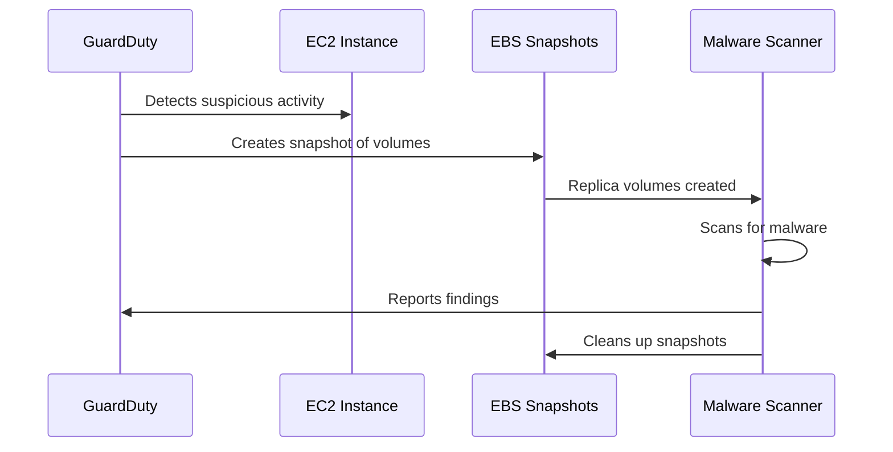

# How to Set Up GuardDuty Malware Protection for EC2

Author: [nawazdhandala](https://github.com/nawazdhandala)

Tags: AWS, GuardDuty, Security, EC2, Malware

Description: Configure Amazon GuardDuty Malware Protection to automatically scan EC2 instances for malware when suspicious activity is detected.

---

GuardDuty has been doing a solid job detecting threats in AWS environments for years - flagging things like unusual API calls, suspicious network traffic, and compromised credentials. But until Malware Protection was added, it couldn't actually look at what's running on your EC2 instances. If an attacker dropped a cryptominer or a trojan on an instance, GuardDuty would spot the network anomalies but couldn't confirm the malware itself.

GuardDuty Malware Protection changes that. When GuardDuty detects a suspicious finding related to an EC2 instance, it automatically creates a snapshot of the instance's EBS volumes and scans them for malware. No agents to install, no impact on the running instance. Let's set it up.

## How It Works

The flow goes like this: GuardDuty detects a threat finding involving an EC2 instance (like `CryptoCurrency:EC2/BitcoinTool.B!DNS`). Malware Protection then takes an EBS snapshot of the instance's volumes, creates replica volumes in a GuardDuty-managed account, scans them, and reports any malware findings. The snapshots and replica volumes are automatically cleaned up afterward.



The important thing to understand is that this is agentless. GuardDuty doesn't install anything on your instances. It works entirely through EBS snapshots, so there's zero performance impact on your workloads.

## Enabling Malware Protection

### Via the Console

The quickest way is through the console. Go to GuardDuty, click "Malware Protection" in the left nav, and enable it. But let's do it properly with CLI and IaC.

### Via AWS CLI

If GuardDuty isn't enabled yet, start there first:

```bash
# Enable GuardDuty (skip if already enabled)
aws guardduty create-detector --enable
```

Note the detector ID from the output. You'll need it.

Now enable Malware Protection on the detector. This command updates the detector to enable EBS malware scanning:

```bash
# Enable Malware Protection
aws guardduty update-detector \
  --detector-id abc123def456 \
  --features '[
    {
      "Name": "EBS_MALWARE_PROTECTION",
      "Status": "ENABLED"
    }
  ]'
```

Verify it's enabled:

```bash
# Check feature status
aws guardduty get-detector --detector-id abc123def456 \
  --query 'Features[?Name==`EBS_MALWARE_PROTECTION`]'
```

### Via Terraform

This Terraform configuration enables GuardDuty with Malware Protection activated:

```hcl
resource "aws_guardduty_detector" "main" {
  enable = true

  datasources {
    malware_protection {
      scan_ec2_instance_with_findings {
        ebs_volumes {
          enable = true
        }
      }
    }
  }
}
```

## Configuring Scan Options

By default, Malware Protection scans all EC2 instances when triggered. You can narrow this down with inclusion or exclusion tags.

### Using Inclusion Tags

Only scan instances that have a specific tag. This is useful when you only care about production workloads.

This configures Malware Protection to only scan instances tagged with "MalwareScan: true":

```bash
aws guardduty update-malware-scan-settings \
  --detector-id abc123def456 \
  --scan-resource-criteria '{
    "Include": {
      "EC2_INSTANCE_TAG": {
        "MapEquals": [
          {
            "Key": "MalwareScan",
            "Value": "true"
          }
        ]
      }
    }
  }'
```

### Using Exclusion Tags

Alternatively, scan everything except instances with a certain tag. Useful for dev/test instances you don't care about.

This excludes instances tagged with "Environment: development" from malware scans:

```bash
aws guardduty update-malware-scan-settings \
  --detector-id abc123def456 \
  --scan-resource-criteria '{
    "Exclude": {
      "EC2_INSTANCE_TAG": {
        "MapEquals": [
          {
            "Key": "Environment",
            "Value": "development"
          }
        ]
      }
    }
  }'
```

## Snapshot Retention

By default, GuardDuty deletes the EBS snapshots after scanning. If you want to keep snapshots when malware is found (for forensic analysis), enable snapshot retention.

This tells GuardDuty to keep snapshots when malware is detected, so your security team can investigate:

```bash
aws guardduty update-malware-scan-settings \
  --detector-id abc123def456 \
  --ebs-snapshot-preservation RETENTION_WITH_FINDING
```

The options are:
- `NO_RETENTION` - Always delete snapshots after scanning (default)
- `RETENTION_WITH_FINDING` - Keep snapshots only when malware is found

## On-Demand Scanning

You can also trigger scans manually without waiting for a GuardDuty finding. This is useful for periodic checks or after deploying new instances.

This initiates a malware scan on a specific EC2 instance right now:

```bash
# Start an on-demand scan
aws guardduty start-malware-scan \
  --resource-arn arn:aws:ec2:us-east-1:111111111111:instance/i-0abc123def456789
```

Check the scan status:

```bash
# List recent malware scans
aws guardduty describe-malware-scans \
  --detector-id abc123def456 \
  --filter-criteria '{
    "FilterCriterion": [
      {
        "CriterionKey": "SCAN_STATUS",
        "FilterCondition": {
          "EqualsValue": "RUNNING"
        }
      }
    ]
  }'
```

## Handling Findings

When malware is detected, GuardDuty creates findings with the prefix `Execution:EC2/MaliciousFile`. These contain details about what was found, including the file path, hash, and threat name.

This retrieves the latest malware-related findings:

```bash
# Get malware findings
aws guardduty list-findings \
  --detector-id abc123def456 \
  --finding-criteria '{
    "Criterion": {
      "type": {
        "Eq": ["Execution:EC2/MaliciousFile"]
      }
    }
  }'
```

Get full details on a specific finding:

```bash
aws guardduty get-findings \
  --detector-id abc123def456 \
  --finding-ids "finding-id-here"
```

## Automating Response

You'll want to automate your response when malware is found. Here's an EventBridge rule that triggers a Lambda function for remediation.

This EventBridge rule pattern matches GuardDuty malware findings:

```json
{
  "source": ["aws.guardduty"],
  "detail-type": ["GuardDuty Finding"],
  "detail": {
    "type": [{
      "prefix": "Execution:EC2/MaliciousFile"
    }]
  }
}
```

And here's a Lambda function that isolates the compromised instance by removing all security groups and attaching a quarantine group.

This Lambda function automatically quarantines an EC2 instance when malware is detected:

```python
import boto3
import json

ec2 = boto3.client('ec2')

def handler(event, context):
    # Extract instance ID from the GuardDuty finding
    finding = event['detail']
    instance_id = finding['resource']['instanceDetails']['instanceId']

    print(f"Quarantining instance: {instance_id}")

    # Get instance details
    instance = ec2.describe_instances(InstanceIds=[instance_id])
    vpc_id = instance['Reservations'][0]['Instances'][0]['VpcId']

    # Create or get quarantine security group
    quarantine_sg = get_or_create_quarantine_sg(vpc_id)

    # Replace all security groups with quarantine group
    ec2.modify_instance_attribute(
        InstanceId=instance_id,
        Groups=[quarantine_sg]
    )

    # Tag the instance
    ec2.create_tags(
        Resources=[instance_id],
        Tags=[
            {'Key': 'SecurityStatus', 'Value': 'QUARANTINED'},
            {'Key': 'QuarantineReason', 'Value': 'MalwareDetected'}
        ]
    )

    return {'statusCode': 200, 'body': f'Instance {instance_id} quarantined'}

def get_or_create_quarantine_sg(vpc_id):
    try:
        response = ec2.describe_security_groups(
            Filters=[
                {'Name': 'group-name', 'Values': ['quarantine-sg']},
                {'Name': 'vpc-id', 'Values': [vpc_id]}
            ]
        )
        if response['SecurityGroups']:
            return response['SecurityGroups'][0]['GroupId']
    except Exception:
        pass

    # Create quarantine SG with no inbound/outbound rules
    sg = ec2.create_security_group(
        GroupName='quarantine-sg',
        Description='Quarantine - no network access',
        VpcId=vpc_id
    )

    # Remove default outbound rule
    ec2.revoke_security_group_egress(
        GroupId=sg['GroupId'],
        IpPermissions=[{
            'IpProtocol': '-1',
            'IpRanges': [{'CidrIp': '0.0.0.0/0'}]
        }]
    )

    return sg['GroupId']
```

## Cost Considerations

Malware Protection charges per GB of data scanned. The first 500 GB per account per month is covered under the GuardDuty free trial. After that, you're looking at roughly $0.03 per GB. The EBS snapshots also incur standard snapshot costs, though they're usually short-lived.

To keep costs manageable, use exclusion tags for non-critical instances and be mindful of instances with very large volumes.

## Multi-Account Setup

If you're using GuardDuty with AWS Organizations, Malware Protection can be enabled across all member accounts from the delegated administrator account.

This enables Malware Protection as a default setting for all new organization members:

```bash
aws guardduty update-organization-configuration \
  --detector-id abc123def456 \
  --features '[
    {
      "Name": "EBS_MALWARE_PROTECTION",
      "AutoEnable": "ALL"
    }
  ]'
```

For related security monitoring, check out our guides on [GuardDuty S3 Protection](https://oneuptime.com/blog/post/guardduty-s3-protection/view) and [GuardDuty EKS Protection](https://oneuptime.com/blog/post/guardduty-eks-protection/view) to build comprehensive threat detection across your AWS environment. And consider pairing GuardDuty with [OneUptime](https://oneuptime.com) for unified alerting across all your security findings.
