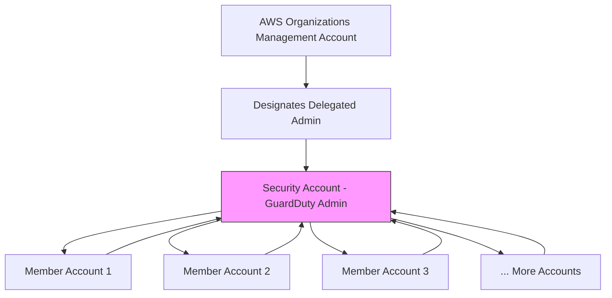

# How to Set Up GuardDuty Across Multiple AWS Accounts

Author: [nawazdhandala](https://github.com/nawazdhandala)

Tags: AWS, GuardDuty, Multi-Account, Organizations, Security

Description: Learn how to enable and manage Amazon GuardDuty across all AWS accounts in your organization using a delegated administrator for centralized threat detection.

---

Running GuardDuty in a single account is straightforward. Running it across 50 or 200 accounts is where things get interesting. You need centralized visibility, consistent configuration, and automatic enrollment for new accounts. Fortunately, GuardDuty's AWS Organizations integration handles most of this for you.

The pattern is simple: designate one account as the GuardDuty delegated administrator, and it manages GuardDuty for all member accounts. Findings from every account flow to the administrator, where your security team can see everything in one place.

## Architecture Overview



The management account designates a delegated administrator (typically your security or audit account). That administrator account then manages GuardDuty across all member accounts. Findings are aggregated in the administrator account.

## Step 1: Enable GuardDuty in the Management Account

First, enable GuardDuty in the Organizations management account if it isn't already.

```bash
# In the management account
aws guardduty create-detector --enable
```

## Step 2: Designate the Delegated Administrator

Choose a security-focused account as the delegated administrator. This should not be the management account itself - keeping the management account clean is a security best practice.

```bash
# In the management account - designate account 555555555555 as delegated admin
aws guardduty enable-organization-admin-account \
  --admin-account-id 555555555555
```

Verify it's set up.

```bash
# Check which account is the delegated admin
aws guardduty list-organization-admin-accounts
```

## Step 3: Configure Auto-Enable for Member Accounts

Switch to the delegated administrator account. Configure GuardDuty to automatically enable in all existing and future member accounts.

```bash
# In the delegated admin account (555555555555)
DETECTOR_ID=$(aws guardduty list-detectors --query 'DetectorIds[0]' --output text)

# Enable auto-enrollment for new accounts
aws guardduty update-organization-configuration \
  --detector-id $DETECTOR_ID \
  --auto-enable-organization-members ALL
```

The `ALL` option enables GuardDuty for all existing members and any new accounts that join the organization. You can also use `NEW` to only auto-enable for new accounts (useful if you want to manually handle existing ones).

## Step 4: Enable Protection Plans Across the Organization

Configure which protection plans should be enabled organization-wide.

```bash
# Enable S3 protection for all accounts
aws guardduty update-organization-configuration \
  --detector-id $DETECTOR_ID \
  --auto-enable-organization-members ALL \
  --features '[
    {
      "Name": "S3_DATA_EVENTS",
      "AutoEnable": "ALL"
    },
    {
      "Name": "EKS_AUDIT_LOGS",
      "AutoEnable": "ALL"
    },
    {
      "Name": "EBS_MALWARE_PROTECTION",
      "AutoEnable": "ALL"
    },
    {
      "Name": "RDS_LOGIN_EVENTS",
      "AutoEnable": "ALL"
    },
    {
      "Name": "LAMBDA_NETWORK_LOGS",
      "AutoEnable": "ALL"
    },
    {
      "Name": "EKS_RUNTIME_MONITORING",
      "AutoEnable": "ALL",
      "AdditionalConfiguration": [{
        "Name": "EKS_ADDON_MANAGEMENT",
        "AutoEnable": "ALL"
      }]
    }
  ]'
```

## Step 5: Verify Member Account Status

Check which accounts are enrolled and their status.

```bash
# List all member accounts and their status
aws guardduty list-members \
  --detector-id $DETECTOR_ID \
  --only-associated

# Get details for a specific member
aws guardduty get-member-detectors \
  --detector-id $DETECTOR_ID \
  --account-ids '["222222222222", "333333333333"]'
```

## Handling Existing Accounts

If you had accounts that already had GuardDuty enabled independently, they need to be associated as members. The auto-enable feature handles this for organization accounts, but you might need to manually create members for accounts that were previously standalone.

```bash
# Create member associations for existing accounts
aws guardduty create-members \
  --detector-id $DETECTOR_ID \
  --account-details '[
    {"AccountId": "222222222222", "Email": "account2@example.com"},
    {"AccountId": "333333333333", "Email": "account3@example.com"}
  ]'
```

## Viewing Cross-Account Findings

From the administrator account, you can see findings from all member accounts.

```bash
# Get high-severity findings from all accounts
aws guardduty list-findings \
  --detector-id $DETECTOR_ID \
  --finding-criteria '{
    "Criterion": {
      "severity": {"Gte": 7}
    }
  }'

# Get findings for a specific member account
aws guardduty list-findings \
  --detector-id $DETECTOR_ID \
  --finding-criteria '{
    "Criterion": {
      "accountId": {"Eq": ["222222222222"]}
    }
  }'
```

Get the actual finding details.

```bash
aws guardduty get-findings \
  --detector-id $DETECTOR_ID \
  --finding-ids '["finding-id-1", "finding-id-2"]'
```

## Terraform Configuration

Here's a Terraform setup for the full multi-account GuardDuty configuration.

```hcl
# In the management account
resource "aws_guardduty_detector" "management" {
  enable = true
}

resource "aws_guardduty_organization_admin_account" "admin" {
  admin_account_id = "555555555555"
}

# In the delegated admin account
resource "aws_guardduty_detector" "admin" {
  enable                       = true
  finding_publishing_frequency = "FIFTEEN_MINUTES"

  datasources {
    s3_logs {
      enable = true
    }
    kubernetes {
      audit_logs {
        enable = true
      }
    }
    malware_protection {
      scan_ec2_instance_with_findings {
        ebs_volumes {
          enable = true
        }
      }
    }
  }
}

resource "aws_guardduty_organization_configuration" "org" {
  auto_enable_organization_members = "ALL"
  detector_id                      = aws_guardduty_detector.admin.id

  datasources {
    s3_logs {
      auto_enable = true
    }
    kubernetes {
      audit_logs {
        enable = true
      }
    }
    malware_protection {
      scan_ec2_instance_with_findings {
        ebs_volumes {
          auto_enable = true
        }
      }
    }
  }
}
```

## Setting Up Cross-Account Notifications

Since findings aggregate in the administrator account, set up your [notification pipeline](https://oneuptime.com/blog/post/configure-guardduty-findings-notifications/view) there. EventBridge rules in the admin account will capture findings from all member accounts.

```bash
# In the admin account - capture all high-severity findings
aws events put-rule \
  --name org-guardduty-high-severity \
  --event-pattern '{
    "source": ["aws.guardduty"],
    "detail-type": ["GuardDuty Finding"],
    "detail": {
      "severity": [{"numeric": [">=", 7]}]
    }
  }'

# Route to SNS for immediate notification
aws events put-targets \
  --rule org-guardduty-high-severity \
  --targets "Id"="1","Arn"="arn:aws:sns:us-east-1:555555555555:security-critical"
```

## Managing Suppression Rules Centrally

Suppression rules created in the administrator account apply to findings from all member accounts. This lets you manage false positive suppression centrally.

```bash
# Suppress false positives from all accounts
aws guardduty create-filter \
  --detector-id $DETECTOR_ID \
  --name org-suppress-nat-gateway \
  --action ARCHIVE \
  --finding-criteria '{
    "Criterion": {
      "type": {
        "Eq": ["Recon:EC2/PortProbeUnprotectedPort"]
      },
      "resource.instanceDetails.tags.key": {
        "Eq": ["aws:cloudformation:logical-id"]
      },
      "resource.instanceDetails.tags.value": {
        "Eq": ["NatGateway"]
      }
    }
  }' \
  --description "Suppress port probe findings from NAT gateways across all accounts"
```

For more on suppression, see [suppressing GuardDuty false positives](https://oneuptime.com/blog/post/suppress-guardduty-false-positives/view).

## Multi-Region Considerations

GuardDuty is a regional service. The delegated administrator setup needs to be repeated in each region where you want threat detection. If you've enabled GuardDuty in `us-east-1`, it won't automatically cover `eu-west-1`.

The best approach is to enable GuardDuty in all regions, even ones you don't actively use. If an attacker uses compromised credentials to launch resources in `ap-southeast-1` and you're not monitoring there, you won't know.

```bash
# Loop through all regions to set up GuardDuty
for region in $(aws ec2 describe-regions --query 'Regions[].RegionName' --output text); do
  echo "Enabling GuardDuty admin in $region"
  aws guardduty enable-organization-admin-account \
    --admin-account-id 555555555555 \
    --region $region
done
```

## Cost Management

With GuardDuty running in every account, costs can add up. Monitor usage through the administrator account.

```bash
# Get usage statistics for the organization
aws guardduty get-usage-statistics \
  --detector-id $DETECTOR_ID \
  --usage-statistic-type SUM_BY_ACCOUNT \
  --usage-criteria '{
    "DataSources": ["CLOUD_TRAIL", "DNS_LOGS", "FLOW_LOGS", "S3_LOGS"]
  }'
```

This shows you which accounts are generating the most GuardDuty costs, so you can investigate whether the data volume is expected.

For the complete security picture, [integrate GuardDuty with Security Hub](https://oneuptime.com/blog/post/integrate-guardduty-security-hub/view) to see GuardDuty findings alongside Config rules, CloudTrail Insights, and other security services in one unified dashboard.
