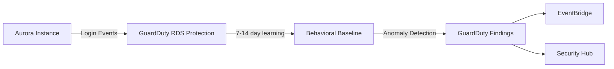

# How to Set Up GuardDuty RDS Protection

Author: [nawazdhandala](https://github.com/nawazdhandala)

Tags: AWS, GuardDuty, RDS, Database Security, Threat Detection

Description: Enable GuardDuty RDS Protection to monitor login activity on your Amazon Aurora databases and detect suspicious access patterns.

---

Databases are crown jewels. They hold your customer data, financial records, and business-critical information. Despite that, most teams don't have great visibility into who's actually logging into their databases and from where. CloudTrail tracks API calls to RDS (like creating or modifying instances), but it doesn't see the actual database login activity. That's where GuardDuty RDS Protection comes in.

RDS Protection monitors login attempts to your Amazon Aurora databases - both successful and failed - and uses machine learning to detect anomalous access patterns. Think brute force attacks, logins from unusual locations, and access from known malicious IPs.

## What Gets Monitored

GuardDuty RDS Protection currently supports Amazon Aurora (both MySQL-compatible and PostgreSQL-compatible editions). It monitors RDS login activity, which includes:

- Successful and failed login attempts
- The source IP of login attempts
- The database user being targeted
- Authentication method used
- Connection patterns over time

It does NOT monitor the actual SQL queries or data access. It's focused purely on the authentication layer.

## Finding Types

Here are the specific finding types RDS Protection generates:

- **CredentialAccess:RDS/AnomalousBehavior.SuccessfulLogin** - A user logged in from an unusual IP or in an unusual pattern
- **CredentialAccess:RDS/AnomalousBehavior.FailedLogin** - An unusual spike in failed login attempts (possible brute force)
- **CredentialAccess:RDS/MaliciousIPCaller.SuccessfulLogin** - Successful login from a known malicious IP
- **CredentialAccess:RDS/MaliciousIPCaller.FailedLogin** - Failed login attempts from a known malicious IP
- **CredentialAccess:RDS/AnomalousBehavior.SuccessfulBruteForce** - Successful login after a series of failed attempts from the same source
- **Discovery:RDS/MaliciousIPCaller** - RDS discovery API calls from a suspicious source

## Enabling RDS Protection

### Via CLI

This enables RDS login activity monitoring on your GuardDuty detector:

```bash
# Enable RDS Protection
aws guardduty update-detector \
  --detector-id abc123def456 \
  --features '[
    {
      "Name": "RDS_LOGIN_EVENTS",
      "Status": "ENABLED"
    }
  ]'
```

Verify the feature is active:

```bash
aws guardduty get-detector --detector-id abc123def456 \
  --query 'Features[?Name==`RDS_LOGIN_EVENTS`].{Name:Name,Status:Status}'
```

### Via Terraform

This creates a GuardDuty detector with RDS Protection enabled:

```hcl
resource "aws_guardduty_detector" "main" {
  enable = true

  datasources {
    # Note: RDS protection might be under a feature flag
    # depending on your Terraform AWS provider version
  }
}

# For newer provider versions, use the feature resource
resource "aws_guardduty_detector_feature" "rds_protection" {
  detector_id = aws_guardduty_detector.main.id
  name        = "RDS_LOGIN_EVENTS"
  status      = "ENABLED"
}
```

### Via CloudFormation

```yaml
AWSTemplateFormatVersion: '2010-09-09'
Resources:
  GuardDutyDetector:
    Type: AWS::GuardDuty::Detector
    Properties:
      Enable: true
      Features:
        - Name: RDS_LOGIN_EVENTS
          Status: ENABLED
```

## How It Works Under the Hood

When you enable RDS Protection, GuardDuty starts collecting login events from your Aurora instances automatically. There's nothing to install on the database side - no agents, no plugins, no changes to parameter groups. GuardDuty accesses the login event data through an internal mechanism that doesn't affect your database performance.

The service builds a behavioral baseline for each database over the first 7-14 days. During this learning period, you might see fewer findings because GuardDuty is still figuring out what "normal" looks like for your environment. After that, it starts flagging deviations.



## Querying RDS Findings

Find all RDS-related findings in your account:

```bash
# List RDS Protection findings
aws guardduty list-findings \
  --detector-id abc123def456 \
  --finding-criteria '{
    "Criterion": {
      "type": {
        "Eq": [
          "CredentialAccess:RDS/AnomalousBehavior.SuccessfulLogin",
          "CredentialAccess:RDS/AnomalousBehavior.FailedLogin",
          "CredentialAccess:RDS/MaliciousIPCaller.SuccessfulLogin",
          "CredentialAccess:RDS/AnomalousBehavior.SuccessfulBruteForce"
        ]
      }
    }
  }' \
  --sort-criteria '{
    "AttributeName": "severity",
    "OrderBy": "DESC"
  }'
```

Get details on a specific finding including database and login info:

```bash
aws guardduty get-findings \
  --detector-id abc123def456 \
  --finding-ids "finding-id" \
  --query 'Findings[0].{
    Type:Type,
    Severity:Severity,
    Database:Resource.RdsDbInstanceDetails,
    LoginDetails:Service.RdsDbUserDetails,
    RemoteIP:Service.Action.RdsLoginAttemptAction.RemoteIpDetails
  }'
```

## Setting Up Alerting

Route RDS findings to your security team through EventBridge and SNS.

This EventBridge rule pattern matches all RDS credential access findings:

```json
{
  "source": ["aws.guardduty"],
  "detail-type": ["GuardDuty Finding"],
  "detail": {
    "type": [{
      "prefix": "CredentialAccess:RDS/"
    }]
  }
}
```

Create the alert pipeline:

```bash
# Create EventBridge rule for RDS findings
aws events put-rule \
  --name guardduty-rds-alerts \
  --event-pattern '{
    "source": ["aws.guardduty"],
    "detail-type": ["GuardDuty Finding"],
    "detail": {
      "type": [{"prefix": "CredentialAccess:RDS/"}]
    }
  }'

# Target an SNS topic
aws events put-targets \
  --rule guardduty-rds-alerts \
  --targets '[{
    "Id": "sns-target",
    "Arn": "arn:aws:sns:us-east-1:111111111111:db-security-alerts"
  }]'
```

## Automated Response

When a brute force attack succeeds, you need to respond immediately. Here's a Lambda function that rotates the compromised database credentials.

This function triggers on successful brute force findings and initiates a password rotation through Secrets Manager:

```python
import boto3
import json

secretsmanager = boto3.client('secretsmanager')
sns = boto3.client('sns')

def handler(event, context):
    finding = event['detail']
    finding_type = finding['type']
    severity = finding['severity']

    # Extract database details
    rds_details = finding['resource']['rdsDbInstanceDetails']
    db_instance = rds_details['dbInstanceIdentifier']
    db_cluster = rds_details.get('dbClusterIdentifier', 'N/A')
    db_engine = rds_details['engine']

    # Get the targeted user
    rds_user = finding['service'].get('rdsDbUserDetails', {})
    username = rds_user.get('user', 'unknown')

    print(f"RDS finding: {finding_type}")
    print(f"Database: {db_instance}, User: {username}")

    # For successful brute force, rotate credentials
    if 'SuccessfulBruteForce' in finding_type:
        rotate_credentials(db_instance, username)

    # Alert the team
    sns.publish(
        TopicArn='arn:aws:sns:us-east-1:111111111111:db-security-alerts',
        Subject=f'[ALERT] RDS Suspicious Login: {db_instance}',
        Message=json.dumps({
            'finding_type': finding_type,
            'severity': severity,
            'database': db_instance,
            'cluster': db_cluster,
            'engine': db_engine,
            'user': username,
            'action_taken': 'credential_rotation' if 'SuccessfulBruteForce' in finding_type else 'alert_only'
        }, indent=2)
    )

    return {'statusCode': 200}

def rotate_credentials(db_instance, username):
    """Trigger credential rotation via Secrets Manager"""
    # Find the secret associated with this database
    secret_name = f"rds/{db_instance}/{username}"

    try:
        secretsmanager.rotate_secret(
            SecretId=secret_name,
            RotateImmediately=True
        )
        print(f"Initiated rotation for secret: {secret_name}")
    except secretsmanager.exceptions.ResourceNotFoundException:
        print(f"No Secrets Manager secret found for {secret_name}")
        print("Manual credential rotation required!")
```

## Multi-Account Organization Setup

Enable RDS Protection across your entire organization from the delegated admin account:

```bash
aws guardduty update-organization-configuration \
  --detector-id abc123def456 \
  --features '[
    {
      "Name": "RDS_LOGIN_EVENTS",
      "AutoEnable": "ALL"
    }
  ]'
```

This ensures all new accounts automatically get RDS Protection enabled.

## Complementary Security Measures

GuardDuty RDS Protection is detective - it tells you when something suspicious happens. Pair it with preventive controls:

**Network isolation.** Keep databases in private subnets. Don't assign public IPs to RDS instances. Use VPC endpoints for access.

**IAM authentication.** Where possible, use IAM database authentication instead of traditional passwords. It integrates with your IAM policies and provides better auditability.

**Security groups.** Restrict database security groups to only allow traffic from known application subnets.

**Secrets rotation.** Use Secrets Manager to automatically rotate database credentials on a regular schedule.

## Cost

RDS Protection pricing is based on the volume of RDS login events analyzed. For most workloads, this is very affordable since database logins happen far less frequently than, say, S3 API calls. Check your usage:

```bash
aws guardduty get-usage-statistics \
  --detector-id abc123def456 \
  --usage-statistic-type SUM_BY_DATA_SOURCE \
  --usage-criteria '{
    "DataSources": ["RDS_LOGIN_EVENTS"]
  }'
```

## Wrapping Up

RDS Protection fills a real gap in database security monitoring. Most teams had zero visibility into database login patterns before this feature. It takes seconds to enable, requires no changes to your databases, and gives you threat detection that would be very hard to build yourself. Combined with the other GuardDuty protection features like [S3 Protection](https://oneuptime.com/blog/post/guardduty-s3-protection/view) and [EKS Protection](https://oneuptime.com/blog/post/guardduty-eks-protection/view), you get comprehensive threat coverage. Route those findings into [OneUptime](https://oneuptime.com) for unified alerting, and you've got a solid security operations setup.
