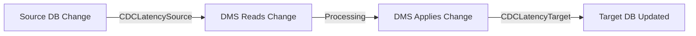

# How to Handle DMS CDC Latency Issues

Author: [nawazdhandala](https://github.com/nawazdhandala)

Tags: AWS, DMS, CDC, Database Migration, Performance Tuning, Latency

Description: Practical strategies to diagnose and fix CDC latency problems in AWS DMS replication tasks

---

You set up DMS, kicked off your replication task, and the full load completed fine. But now you are watching CDC latency climb steadily and you are not sure why. This is one of the most common DMS problems teams run into, and the root cause is rarely obvious.

CDC latency in DMS means that changes happening on your source database are taking longer and longer to appear on the target. In a migration scenario, this means your cutover window keeps growing. In a replication scenario, it means your read replicas are serving stale data. Neither is acceptable.

Let us walk through the systematic approach to diagnosing and fixing CDC latency.

## Understanding CDC Latency Metrics

DMS reports two separate latency numbers, and understanding the difference is critical.



**CDCLatencySource** measures the delay between a change happening on the source and DMS reading it. High source latency means DMS cannot keep up reading the transaction log.

**CDCLatencyTarget** measures the delay between DMS reading a change and successfully applying it to the target. High target latency means the target database or network is the bottleneck.

Knowing which metric is high tells you where to focus your investigation.

## Diagnosing the Problem

### Step 1: Check Which Latency Is High

```bash
# Compare source and target latency over the last hour
aws cloudwatch get-metric-data \
  --metric-data-queries '[
    {
      "Id": "source_latency",
      "MetricStat": {
        "Metric": {
          "Namespace": "AWS/DMS",
          "MetricName": "CDCLatencySource",
          "Dimensions": [
            {"Name": "ReplicationInstanceIdentifier", "Value": "my-instance"},
            {"Name": "ReplicationTaskIdentifier", "Value": "my-task"}
          ]
        },
        "Period": 300,
        "Stat": "Maximum"
      }
    },
    {
      "Id": "target_latency",
      "MetricStat": {
        "Metric": {
          "Namespace": "AWS/DMS",
          "MetricName": "CDCLatencyTarget",
          "Dimensions": [
            {"Name": "ReplicationInstanceIdentifier", "Value": "my-instance"},
            {"Name": "ReplicationTaskIdentifier", "Value": "my-task"}
          ]
        },
        "Period": 300,
        "Stat": "Maximum"
      }
    }
  ]' \
  --start-time $(date -u -v-1H +%Y-%m-%dT%H:%M:%S) \
  --end-time $(date -u +%Y-%m-%dT%H:%M:%S)
```

### Step 2: Check Replication Instance Resources

DMS replication instances have CPU, memory, and disk, just like EC2 instances. If any of these are maxed out, latency will climb.

```bash
# Check CPU utilization on the replication instance
aws cloudwatch get-metric-statistics \
  --namespace AWS/DMS \
  --metric-name CPUUtilization \
  --dimensions Name=ReplicationInstanceIdentifier,Value=my-instance \
  --start-time $(date -u -v-1H +%Y-%m-%dT%H:%M:%S) \
  --end-time $(date -u +%Y-%m-%dT%H:%M:%S) \
  --period 300 \
  --statistics Average Maximum
```

If CPU is above 80% consistently, you need a larger replication instance. If you are using DMS Serverless, increase the MaxCapacityUnits.

Also check `FreeableMemory` and `FreeStorageSpace`. DMS uses local disk to buffer transactions, and running out of storage can cause tasks to stall.

## Common Causes and Fixes

### Cause 1: Replication Instance Too Small

This is the most common cause. The fix is straightforward.

```bash
# Upgrade the replication instance to a larger size
aws dms modify-replication-instance \
  --replication-instance-arn arn:aws:dms:us-east-1:123456789012:rep:INSTANCE_ARN \
  --replication-instance-class dms.r5.2xlarge \
  --apply-immediately
```

For DMS Serverless, increase the maximum capacity:

```bash
# Increase max DCUs for serverless replication
aws dms modify-replication-config \
  --replication-config-arn arn:aws:dms:us-east-1:123456789012:replication-config:CONFIG_ARN \
  --compute-config '{"MaxCapacityUnits": 64}'
```

### Cause 2: LOB Column Processing

Large Object (LOB) columns are performance killers in DMS. By default, DMS uses "limited LOB mode" which reads each LOB value individually. For tables with many LOB columns and frequent updates, this creates enormous overhead.

```json
// Task settings to optimize LOB handling
{
  "TargetMetadata": {
    "LobChunkSize": 64,
    "LimitedSizeLobMode": true,
    "LobMaxSize": 32768
  }
}
```

If you can live with truncating LOBs to a maximum size, limited LOB mode is much faster than full LOB mode. Set `LobMaxSize` to the maximum size you need.

For tables where LOB data is not important, exclude those columns entirely in your table mappings:

```json
// Exclude the large_document column from replication
{
  "rules": [
    {
      "rule-type": "transformation",
      "rule-id": "1",
      "rule-name": "remove-lob-column",
      "rule-action": "remove-column",
      "rule-target": "column",
      "object-locator": {
        "schema-name": "myschema",
        "table-name": "documents",
        "column-name": "large_document"
      }
    }
  ]
}
```

### Cause 3: Target Database Write Bottleneck

If CDCLatencyTarget is high but CDCLatencySource is low, the target database is the bottleneck. Common fixes:

**Increase target database IOPS.** If your target is an RDS instance, check if you are hitting the IOPS limit. Upgrade storage type or provision more IOPS.

**Disable triggers and foreign keys during migration.** These add overhead to every write.

```sql
-- Temporarily disable all triggers on the target to speed up CDC applies
ALTER TABLE orders DISABLE TRIGGER ALL;
ALTER TABLE order_items DISABLE TRIGGER ALL;
```

**Tune the batch apply settings.** DMS can batch multiple changes into a single transaction:

```json
// Enable batch apply to reduce per-transaction overhead on the target
{
  "ChangeProcessingTuning": {
    "BatchApplyEnabled": true,
    "BatchApplyPreserveTransaction": true,
    "BatchSplitSize": 0,
    "MinTransactionSize": 1000,
    "CommitTimeout": 1,
    "MemoryLimitTotal": 1024,
    "MemoryKeepTime": 60,
    "StatementCacheSize": 50
  }
}
```

### Cause 4: Network Latency

If your source or target database is in a different region or on-premises, network latency compounds every transaction.

Use VPC peering or AWS Direct Connect for cross-region or hybrid scenarios. Measure the raw network latency between DMS and both endpoints:

```bash
# From a test instance in the DMS VPC, measure latency to both endpoints
ping -c 10 source-db.example.com
ping -c 10 target-db.example.com
```

If network latency is above 10ms to either endpoint, it will materially impact CDC performance for high-throughput workloads.

### Cause 5: Source Database Transaction Log Pressure

For high-volume source databases, the transaction log can grow faster than DMS reads it. This is especially common with Oracle redo logs and SQL Server transaction logs.

For Oracle sources, increase the number of parallel read threads:

```json
// Increase parallel threads for reading Oracle redo logs
{
  "ChangeProcessingDdlHandlingPolicy": {
    "HandleSourceTableDropped": true,
    "HandleSourceTableTruncated": true,
    "HandleSourceTableAltered": true
  },
  "ChangeProcessingTuning": {
    "BufferConditionOnSendStream": 10,
    "BufferConditionOnReadStream": 10
  }
}
```

For MySQL sources, make sure `binlog_row_image` is set to `MINIMAL` if you do not need before-image data. This dramatically reduces the volume of data DMS needs to read.

### Cause 6: High-Volume Batch Operations on Source

Large batch DELETE or UPDATE operations on the source generate enormous CDC volumes. A single `DELETE FROM orders WHERE created_at < '2020-01-01'` that affects millions of rows will create a spike that DMS needs to process.

Schedule batch operations during low-traffic periods, or break them into smaller batches:

```sql
-- Instead of one massive delete, process in smaller batches
DELETE FROM orders
WHERE created_at < '2020-01-01'
  AND order_id IN (
    SELECT order_id FROM orders
    WHERE created_at < '2020-01-01'
    LIMIT 10000
  );
```

## Monitoring Latency Recovery

After making changes, watch the latency metrics closely. A healthy recovery pattern shows latency gradually decreasing back to near-zero.

```bash
# Watch latency in near-real-time with 1-minute intervals
watch -n 60 'aws cloudwatch get-metric-statistics \
  --namespace AWS/DMS \
  --metric-name CDCLatencyTarget \
  --dimensions Name=ReplicationInstanceIdentifier,Value=my-instance \
               Name=ReplicationTaskIdentifier,Value=my-task \
  --start-time $(date -u -v-10M +%Y-%m-%dT%H:%M:%S) \
  --end-time $(date -u +%Y-%m-%dT%H:%M:%S) \
  --period 60 \
  --statistics Maximum \
  --query "Datapoints[0].Maximum"'
```

If latency stops decreasing and plateaus, you have not fully resolved the bottleneck. Go back through the causes above and look for the next limiting factor.

## Setting Up Proactive Alerts

Do not wait for latency to become a problem. Set up tiered alerts.

```yaml
# Warning alarm at 60 seconds, critical at 300 seconds
Resources:
  CDCLatencyWarning:
    Type: AWS::CloudWatch::Alarm
    Properties:
      AlarmName: dms-cdc-latency-warning
      Threshold: 60
      ComparisonOperator: GreaterThanThreshold
      EvaluationPeriods: 3
      Period: 300
      Namespace: AWS/DMS
      MetricName: CDCLatencyTarget
      Statistic: Maximum
      AlarmActions:
        - !Ref WarningTopic

  CDCLatencyCritical:
    Type: AWS::CloudWatch::Alarm
    Properties:
      AlarmName: dms-cdc-latency-critical
      Threshold: 300
      ComparisonOperator: GreaterThanThreshold
      EvaluationPeriods: 2
      Period: 300
      Namespace: AWS/DMS
      MetricName: CDCLatencyTarget
      Statistic: Maximum
      AlarmActions:
        - !Ref CriticalTopic
```

For comprehensive DMS monitoring beyond just latency, check out our guide on [monitoring DMS replication tasks](https://oneuptime.com/blog/post/monitor-dms-replication-tasks/view).

## Wrapping Up

CDC latency issues in DMS almost always come down to one of six root causes: undersized replication instance, LOB column overhead, target database bottleneck, network latency, source log pressure, or batch operation spikes. Work through them systematically, starting with the metrics to identify whether the bottleneck is on the source side or target side. Fix one thing at a time and watch the metrics recover before making additional changes.
