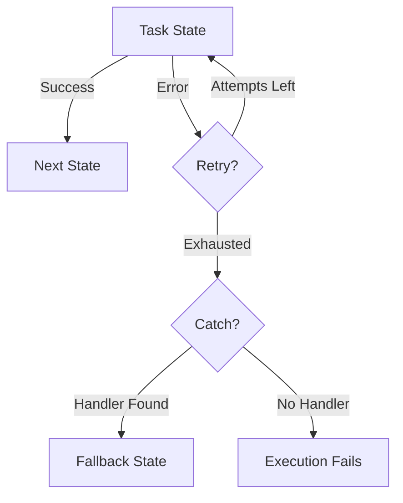

# Handle Errors and Retries in Step Functions

Author: [nawazdhandala](https://github.com/nawazdhandala)

Tags: AWS, Step Functions, Error Handling, Serverless

Description: Master error handling and retry strategies in AWS Step Functions with practical examples covering Catch, Retry, and fallback patterns.

---

Things fail in distributed systems. Lambda functions time out, downstream services go down, and APIs return unexpected responses. The question isn't whether your Step Functions workflow will encounter errors - it's whether you've planned for them.

Step Functions gives you two powerful mechanisms for handling failures: Retry (try again automatically) and Catch (do something different when retries are exhausted). Used together, they let you build workflows that recover gracefully from transient failures and handle permanent failures cleanly.

## Understanding Error Types

Before we configure retries, let's understand what errors look like in Step Functions. There are several built-in error types.

`States.ALL` matches any error. `States.TaskFailed` means the Lambda function threw an exception. `States.Timeout` fires when a state exceeds its timeout. `States.Permissions` indicates an IAM problem. You can also define custom error names by throwing errors with specific names in your Lambda functions.



## Configuring Retries

The Retry field tells Step Functions to automatically retry a failed state. You can specify different retry strategies for different error types.

This configuration retries transient failures with exponential backoff:

```json
{
  "ProcessPayment": {
    "Type": "Task",
    "Resource": "arn:aws:lambda:us-east-1:123456789:function:process-payment",
    "Retry": [
      {
        "ErrorEquals": ["ServiceUnavailableError", "ThrottlingError"],
        "IntervalSeconds": 2,
        "MaxAttempts": 5,
        "BackoffRate": 2.0
      },
      {
        "ErrorEquals": ["States.Timeout"],
        "IntervalSeconds": 10,
        "MaxAttempts": 2,
        "BackoffRate": 1.0
      }
    ],
    "Next": "SendConfirmation"
  }
}
```

Let's break down what happens with that first retry configuration. The initial retry waits 2 seconds. The second retry waits 4 seconds (2 x backoff rate of 2). The third waits 8 seconds. The fourth waits 16 seconds. The fifth waits 32 seconds. After 5 attempts, if it still fails, the retry is exhausted.

For timeout errors, we use a flat 10-second interval with only 2 attempts - if a Lambda times out twice, the problem probably isn't going away on its own.

## Retry Order Matters

Step Functions evaluates retry rules from top to bottom and uses the first match. Put specific errors before general ones.

This shows the correct ordering with specific errors first:

```json
{
  "CallExternalApi": {
    "Type": "Task",
    "Resource": "arn:aws:lambda:us-east-1:123456789:function:call-api",
    "Retry": [
      {
        "ErrorEquals": ["RateLimitError"],
        "IntervalSeconds": 30,
        "MaxAttempts": 10,
        "BackoffRate": 1.5
      },
      {
        "ErrorEquals": ["ConnectionError", "TimeoutError"],
        "IntervalSeconds": 5,
        "MaxAttempts": 3,
        "BackoffRate": 2.0
      },
      {
        "ErrorEquals": ["States.ALL"],
        "IntervalSeconds": 1,
        "MaxAttempts": 2,
        "BackoffRate": 1.0
      }
    ],
    "Next": "ProcessResponse"
  }
}
```

Rate limit errors get patient retries (30 seconds, scaling up). Connection and timeout errors get moderate retries. Everything else gets a quick 2-shot attempt.

## Configuring Catch Blocks

When retries are exhausted, Catch blocks kick in. They route the execution to a fallback state instead of failing the whole workflow.

This catches different error types and routes them to appropriate handlers:

```json
{
  "ChargeCustomer": {
    "Type": "Task",
    "Resource": "arn:aws:lambda:us-east-1:123456789:function:charge-customer",
    "Retry": [
      {
        "ErrorEquals": ["States.TaskFailed"],
        "IntervalSeconds": 3,
        "MaxAttempts": 3,
        "BackoffRate": 2.0
      }
    ],
    "Catch": [
      {
        "ErrorEquals": ["InsufficientFundsError"],
        "ResultPath": "$.error",
        "Next": "NotifyPaymentFailed"
      },
      {
        "ErrorEquals": ["CardExpiredError"],
        "ResultPath": "$.error",
        "Next": "RequestCardUpdate"
      },
      {
        "ErrorEquals": ["States.ALL"],
        "ResultPath": "$.error",
        "Next": "HandleUnexpectedError"
      }
    ],
    "Next": "PaymentSucceeded"
  }
}
```

The `ResultPath` field is important here. Setting it to `"$.error"` means the error information gets added to the state input under the `error` key, preserving the original input. Without this, the entire state input would be replaced by the error object.

## Writing Lambda Functions That Fail Well

Your Lambda functions need to throw meaningful errors that Step Functions can catch and route.

This function throws named errors that match Catch block configurations:

```javascript
// chargeCustomer.js - Throws specific errors for different failure modes
exports.handler = async (event) => {
  const { customerId, amount, paymentMethodId } = event;

  try {
    const result = await chargePaymentMethod(paymentMethodId, amount);

    return {
      ...event,
      transactionId: result.transactionId,
      chargedAt: new Date().toISOString()
    };
  } catch (err) {
    // Create specific error types for Step Functions to catch
    if (err.code === 'INSUFFICIENT_FUNDS') {
      const error = new Error('Customer has insufficient funds');
      error.name = 'InsufficientFundsError';
      throw error;
    }

    if (err.code === 'CARD_EXPIRED') {
      const error = new Error('Payment card has expired');
      error.name = 'CardExpiredError';
      throw error;
    }

    if (err.code === 'RATE_LIMITED') {
      const error = new Error('Payment provider rate limited us');
      error.name = 'RateLimitError';
      throw error;
    }

    // Unknown errors get a generic name
    throw err;
  }
};
```

## Building a Complete Error Handling Workflow

Let's put it all together with a realistic workflow that handles errors at every step.

This complete workflow definition includes retries, catches, and compensation logic:

```json
{
  "Comment": "Order workflow with comprehensive error handling",
  "StartAt": "ReserveInventory",
  "States": {
    "ReserveInventory": {
      "Type": "Task",
      "Resource": "arn:aws:lambda:us-east-1:123456789:function:reserve-inventory",
      "Retry": [
        {
          "ErrorEquals": ["States.TaskFailed"],
          "IntervalSeconds": 2,
          "MaxAttempts": 3,
          "BackoffRate": 2.0
        }
      ],
      "Catch": [
        {
          "ErrorEquals": ["OutOfStockError"],
          "ResultPath": "$.error",
          "Next": "NotifyOutOfStock"
        },
        {
          "ErrorEquals": ["States.ALL"],
          "ResultPath": "$.error",
          "Next": "HandleReservationError"
        }
      ],
      "Next": "ChargeCustomer"
    },
    "ChargeCustomer": {
      "Type": "Task",
      "Resource": "arn:aws:lambda:us-east-1:123456789:function:charge-customer",
      "Retry": [
        {
          "ErrorEquals": ["RateLimitError"],
          "IntervalSeconds": 10,
          "MaxAttempts": 5,
          "BackoffRate": 2.0
        }
      ],
      "Catch": [
        {
          "ErrorEquals": ["PaymentError"],
          "ResultPath": "$.error",
          "Next": "ReleaseInventory"
        },
        {
          "ErrorEquals": ["States.ALL"],
          "ResultPath": "$.error",
          "Next": "ReleaseInventory"
        }
      ],
      "Next": "FulfillOrder"
    },
    "FulfillOrder": {
      "Type": "Task",
      "Resource": "arn:aws:lambda:us-east-1:123456789:function:fulfill-order",
      "Retry": [
        {
          "ErrorEquals": ["States.ALL"],
          "IntervalSeconds": 5,
          "MaxAttempts": 3,
          "BackoffRate": 2.0
        }
      ],
      "Catch": [
        {
          "ErrorEquals": ["States.ALL"],
          "ResultPath": "$.error",
          "Next": "RefundAndRelease"
        }
      ],
      "Next": "OrderSucceeded"
    },
    "ReleaseInventory": {
      "Type": "Task",
      "Resource": "arn:aws:lambda:us-east-1:123456789:function:release-inventory",
      "Next": "NotifyPaymentFailed"
    },
    "RefundAndRelease": {
      "Type": "Parallel",
      "Branches": [
        {
          "StartAt": "RefundCustomer",
          "States": {
            "RefundCustomer": {
              "Type": "Task",
              "Resource": "arn:aws:lambda:us-east-1:123456789:function:refund",
              "End": true
            }
          }
        },
        {
          "StartAt": "ReleaseReservedInventory",
          "States": {
            "ReleaseReservedInventory": {
              "Type": "Task",
              "Resource": "arn:aws:lambda:us-east-1:123456789:function:release-inventory",
              "End": true
            }
          }
        }
      ],
      "Next": "NotifyFulfillmentFailed"
    },
    "NotifyOutOfStock": {
      "Type": "Task",
      "Resource": "arn:aws:lambda:us-east-1:123456789:function:send-notification",
      "Next": "OrderFailed"
    },
    "NotifyPaymentFailed": {
      "Type": "Task",
      "Resource": "arn:aws:lambda:us-east-1:123456789:function:send-notification",
      "Next": "OrderFailed"
    },
    "NotifyFulfillmentFailed": {
      "Type": "Task",
      "Resource": "arn:aws:lambda:us-east-1:123456789:function:send-notification",
      "Next": "OrderFailed"
    },
    "HandleReservationError": {
      "Type": "Task",
      "Resource": "arn:aws:lambda:us-east-1:123456789:function:send-notification",
      "Next": "OrderFailed"
    },
    "OrderSucceeded": {
      "Type": "Succeed"
    },
    "OrderFailed": {
      "Type": "Fail",
      "Error": "OrderProcessingFailed",
      "Cause": "See execution history for details"
    }
  }
}
```

The key pattern here is compensation. When `ChargeCustomer` fails, we release the inventory we reserved. When `FulfillOrder` fails, we refund the charge AND release inventory. Each step's error handler undoes the work of previous steps.

## Jitter for Retries

Step Functions doesn't have built-in jitter, but you can add it in your Lambda functions for retries against external services.

This adds jitter to avoid thundering herd problems:

```javascript
// Helper to add random jitter to wait times
function jitteredDelay(baseMs) {
  const jitter = Math.random() * baseMs * 0.5; // up to 50% jitter
  return new Promise(resolve => setTimeout(resolve, baseMs + jitter));
}

exports.handler = async (event) => {
  const maxRetries = 3;

  for (let attempt = 0; attempt < maxRetries; attempt++) {
    try {
      return await callExternalService(event);
    } catch (err) {
      if (attempt < maxRetries - 1 && isTransient(err)) {
        await jitteredDelay(1000 * Math.pow(2, attempt));
        continue;
      }
      throw err;
    }
  }
};
```

## Monitoring Error Rates

Keep an eye on your retry and catch rates. A sudden spike in retries might mean a downstream service is degrading. Set up CloudWatch alarms on `ExecutionsFailed` and `ExecutionsTimedOut` metrics. For comprehensive monitoring guidance, see our post on [monitoring Step Functions executions](https://oneuptime.com/blog/post/monitor-step-functions-executions-console/view).

## Wrapping Up

Error handling in Step Functions is declarative, which is its superpower. You define retry policies and error routes in your state machine definition, not buried in application code. This makes error behavior visible, testable, and easy to change. Combine Retry for transient failures, Catch for permanent failures, and compensation states for cleanup, and you've got a workflow that handles the messy reality of distributed systems gracefully.
