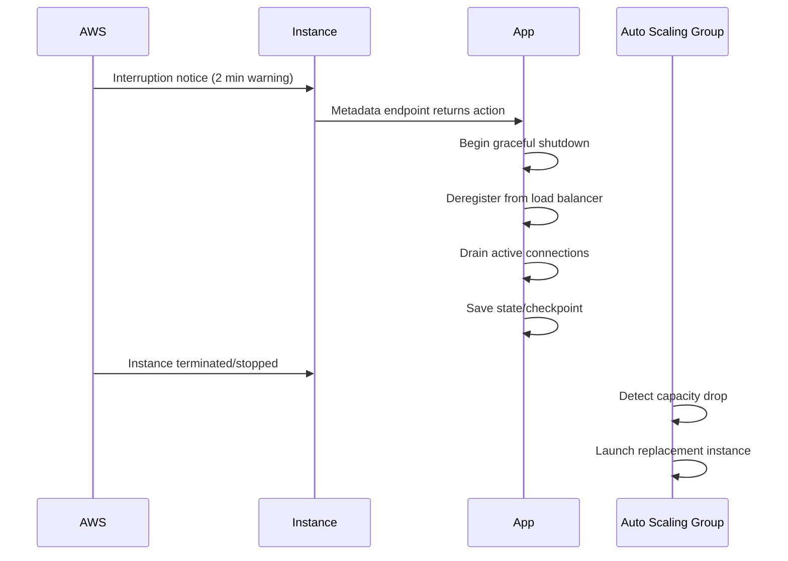

# How to Handle Spot Instance Interruptions Gracefully

Author: [nawazdhandala](https://github.com/nawazdhandala)

Tags: AWS, EC2, Spot Instances, Fault Tolerance, High Availability

Description: Practical strategies and code examples for handling EC2 Spot Instance interruptions gracefully so your applications stay reliable.

---

Spot Instances can save you up to 90% on EC2 costs, but there's a trade-off: AWS can reclaim them with just 2 minutes of notice. If you're not prepared for interruptions, you'll have a bad time. If you are prepared, they're barely noticeable.

This post covers everything you need to build robust interruption handling - from detecting the warning to gracefully draining connections and replacing capacity.

## The Interruption Timeline

When AWS needs your Spot capacity back, here's what happens:



You get exactly 2 minutes. That's enough time for most graceful shutdown procedures, but you need to have them automated and tested.

## Detecting Interruptions via Instance Metadata

The instance metadata service exposes the interruption notice at a specific endpoint. When no interruption is pending, the endpoint returns a 404. When one is issued, it returns a 200 with the action details.

This Python script polls the metadata endpoint and triggers a shutdown procedure when an interruption is detected:

```python
import requests
import time
import subprocess
import json
import logging

logging.basicConfig(level=logging.INFO)
logger = logging.getLogger("spot-monitor")

METADATA_URL = "http://169.254.169.254/latest/meta-data/spot/instance-action"
TOKEN_URL = "http://169.254.169.254/latest/api/token"
POLL_INTERVAL = 5  # seconds

def get_imds_token():
    """Get a token for IMDSv2."""
    response = requests.put(
        TOKEN_URL,
        headers={"X-aws-ec2-metadata-token-ttl-seconds": "300"},
        timeout=2
    )
    return response.text

def check_for_interruption(token):
    """Check if a Spot interruption notice has been issued."""
    try:
        response = requests.get(
            METADATA_URL,
            headers={"X-aws-ec2-metadata-token": token},
            timeout=2
        )
        if response.status_code == 200:
            return json.loads(response.text)
        return None
    except requests.exceptions.RequestException:
        return None

def graceful_shutdown():
    """Execute graceful shutdown procedures."""
    logger.info("Starting graceful shutdown...")

    # Step 1: Stop accepting new work
    subprocess.run(["/opt/scripts/stop-accepting-work.sh"], check=False)

    # Step 2: Deregister from load balancer
    subprocess.run(["/opt/scripts/deregister-from-lb.sh"], check=False)

    # Step 3: Wait for in-flight requests to complete (max 60 seconds)
    subprocess.run(["/opt/scripts/drain-connections.sh", "60"], check=False)

    # Step 4: Save application state
    subprocess.run(["/opt/scripts/save-checkpoint.sh"], check=False)

    logger.info("Graceful shutdown complete")

def main():
    token = get_imds_token()
    logger.info("Spot interruption monitor started")

    while True:
        action = check_for_interruption(token)

        if action:
            logger.warning(f"Interruption notice received: {action}")
            graceful_shutdown()
            break

        time.sleep(POLL_INTERVAL)

if __name__ == "__main__":
    main()
```

Run this script as a systemd service so it starts automatically with the instance.

## Using EventBridge for Fleet-Level Handling

Polling metadata works for individual instances, but if you're running a fleet, EventBridge gives you a centralized way to react to interruptions.

This CloudFormation snippet creates an EventBridge rule that captures Spot interruption warnings and sends them to a Lambda function:

```yaml
AWSTemplateFormatVersion: '2010-09-09'
Resources:
  SpotInterruptionRule:
    Type: AWS::Events::Rule
    Properties:
      Name: spot-interruption-handler
      Description: Capture Spot Instance interruption warnings
      EventPattern:
        source:
          - aws.ec2
        detail-type:
          - EC2 Spot Instance Interruption Warning
      State: ENABLED
      Targets:
        - Arn: !GetAtt SpotHandlerFunction.Arn
          Id: SpotHandlerLambda

  SpotHandlerFunction:
    Type: AWS::Lambda::Function
    Properties:
      FunctionName: spot-interruption-handler
      Runtime: python3.12
      Handler: index.handler
      Timeout: 60
      Role: !GetAtt LambdaRole.Arn
      Code:
        ZipFile: |
          import json
          import boto3

          def handler(event, context):
              instance_id = event['detail']['instance-id']
              action = event['detail']['instance-action']

              print(f"Spot interruption: {instance_id}, action: {action}")

              # Send notification
              sns = boto3.client('sns')
              sns.publish(
                  TopicArn='arn:aws:sns:us-east-1:123456789012:spot-alerts',
                  Subject='Spot Instance Interruption',
                  Message=json.dumps(event, indent=2)
              )

              # Optionally, proactively launch replacement
              # This is useful if you're not using Auto Scaling
              return {'statusCode': 200}
```

## EC2 Instance Rebalance Recommendation

AWS also provides an earlier warning called a "rebalance recommendation." This fires before the actual interruption notice, giving you more time to react. It's not a guarantee that the instance will be interrupted, but it's a strong signal.

Here's how to catch rebalance recommendations via EventBridge:

```json
{
  "source": ["aws.ec2"],
  "detail-type": ["EC2 Instance Rebalance Recommendation"]
}
```

Auto Scaling groups can be configured to automatically react to rebalance recommendations by proactively launching a replacement before the old instance gets interrupted:

```bash
# Enable capacity rebalancing on your ASG
aws autoscaling update-auto-scaling-group \
  --auto-scaling-group-name my-spot-asg \
  --capacity-rebalance
```

When capacity rebalancing is enabled, the ASG launches a new instance as soon as it receives a rebalance recommendation. Once the new instance passes health checks, the old one is terminated. This dramatically reduces the chance of running below desired capacity.

## Draining Connections from a Load Balancer

If your Spot instances sit behind a load balancer, you need to deregister them cleanly so in-flight requests aren't dropped.

This script deregisters an instance from its target group and waits for connections to drain:

```bash
#!/bin/bash
# deregister-from-lb.sh

INSTANCE_ID=$(curl -s http://169.254.169.254/latest/meta-data/instance-id)
TOKEN=$(curl -s -X PUT "http://169.254.169.254/latest/api/token" \
  -H "X-aws-ec2-metadata-token-ttl-seconds: 60")

INSTANCE_ID=$(curl -s -H "X-aws-ec2-metadata-token: $TOKEN" \
  http://169.254.169.254/latest/meta-data/instance-id)

REGION=$(curl -s -H "X-aws-ec2-metadata-token: $TOKEN" \
  http://169.254.169.254/latest/meta-data/placement/region)

# Find the target group this instance belongs to
TARGET_GROUPS=$(aws elbv2 describe-target-health \
  --region "$REGION" \
  --query "TargetHealthDescriptions[?Target.Id=='$INSTANCE_ID']" \
  --output json 2>/dev/null)

# Deregister from all target groups
for tg_arn in $(aws elbv2 describe-target-groups \
  --region "$REGION" \
  --query 'TargetGroups[].TargetGroupArn' \
  --output text); do

  aws elbv2 deregister-targets \
    --region "$REGION" \
    --target-group-arn "$tg_arn" \
    --targets "Id=$INSTANCE_ID" 2>/dev/null
done

echo "Deregistered $INSTANCE_ID from load balancer"

# Wait for deregistration delay (default 300s, but we only have 2 min)
sleep 30
echo "Connection draining complete"
```

Make sure your target group's deregistration delay is set to something less than 120 seconds. The default is 300 seconds, which is too long for Spot interruptions.

```bash
# Set deregistration delay to 30 seconds
aws elbv2 modify-target-group-attributes \
  --target-group-arn arn:aws:elasticloadbalancing:us-east-1:123456789012:targetgroup/my-tg/1234567890 \
  --attributes Key=deregistration_delay.timeout_seconds,Value=30
```

## Checkpointing Long-Running Jobs

For batch workloads, save progress periodically so you can resume after an interruption instead of starting over.

This Python example shows a basic checkpointing pattern for batch processing:

```python
import json
import boto3

s3 = boto3.client('s3')
CHECKPOINT_BUCKET = 'my-checkpoints'
CHECKPOINT_KEY = 'job-123/checkpoint.json'

def save_checkpoint(processed_items, last_offset):
    """Save processing progress to S3."""
    checkpoint = {
        'processed_items': processed_items,
        'last_offset': last_offset,
        'timestamp': str(time.time())
    }
    s3.put_object(
        Bucket=CHECKPOINT_BUCKET,
        Key=CHECKPOINT_KEY,
        Body=json.dumps(checkpoint)
    )

def load_checkpoint():
    """Load the last checkpoint, or return defaults."""
    try:
        response = s3.get_object(
            Bucket=CHECKPOINT_BUCKET,
            Key=CHECKPOINT_KEY
        )
        return json.loads(response['Body'].read())
    except s3.exceptions.NoSuchKey:
        return {'processed_items': 0, 'last_offset': 0}

def process_batch(items):
    checkpoint = load_checkpoint()
    start = checkpoint['last_offset']

    for i, item in enumerate(items[start:], start=start):
        process_item(item)

        # Checkpoint every 100 items
        if (i + 1) % 100 == 0:
            save_checkpoint(i + 1, i + 1)
```

## Testing Your Interruption Handling

AWS provides a way to trigger a fake interruption for testing. Use the Fault Injection Service (FIS) to simulate Spot interruptions:

```bash
# Create an FIS experiment template for Spot interruption
aws fis create-experiment-template \
  --description "Test Spot interruption handling" \
  --role-arn arn:aws:iam::123456789012:role/FISRole \
  --stop-conditions '[{"source": "none"}]' \
  --actions '{
    "interruptSpot": {
      "actionId": "aws:ec2:send-spot-instance-interruptions",
      "parameters": {
        "durationBeforeInterruption": "PT2M"
      },
      "targets": {
        "SpotInstances": "spotTargets"
      }
    }
  }' \
  --targets '{
    "spotTargets": {
      "resourceType": "aws:ec2:spot-instance",
      "resourceTags": {"Environment": "staging"},
      "selectionMode": "COUNT(1)"
    }
  }'
```

Test regularly. Don't wait for a real interruption to find out your handling is broken.

## Summary

Handling Spot interruptions isn't hard, but it requires planning. The key components are: monitoring for interruption notices via metadata or EventBridge, graceful shutdown procedures that drain connections and save state, capacity rebalancing in your Auto Scaling groups, and regular testing of your interruption handling. Get these pieces in place and Spot Instances become a reliable, cost-effective part of your infrastructure. For monitoring your Spot fleet health and getting alerts when interruptions happen, check out [OneUptime's monitoring tools](https://oneuptime.com/blog/post/ec2-spot-instances-save-compute/view).
