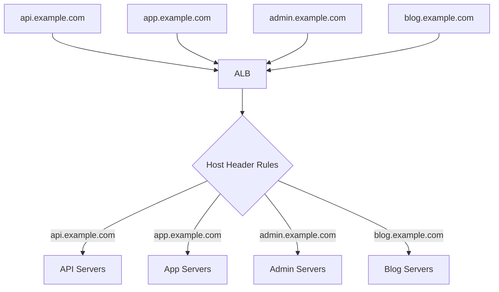

# How to Use Host-Based Routing with Application Load Balancer

Author: [nawazdhandala](https://github.com/nawazdhandala)

Tags: AWS, EC2, ALB, Host-Based Routing, Load Balancing, Multi-Tenant

Description: Learn how to configure host-based routing on an AWS Application Load Balancer to serve multiple domains and subdomains from a single load balancer.

---

Host-based routing lets you serve multiple websites or services from a single Application Load Balancer by routing requests based on the Host header - essentially the domain name in the URL. Point `api.example.com`, `app.example.com`, and `admin.example.com` all to the same ALB, and it'll route each to its respective backend.

This saves you from running separate load balancers for each domain, which reduces both cost and complexity.

## How Host-Based Routing Works

When a browser sends an HTTP request, it includes a `Host` header with the domain name. The ALB reads this header and matches it against your listener rules to determine where to send the request.



All four domains resolve to the same ALB via DNS, but each gets routed to different backend servers.

## DNS Setup

Point all your domains to the ALB using CNAME or Route 53 alias records:

```bash
# Using Route 53 - create alias records for each subdomain
for subdomain in api app admin blog; do
  aws route53 change-resource-record-sets \
    --hosted-zone-id Z1234567890 \
    --change-batch '{
      "Changes": [{
        "Action": "UPSERT",
        "ResourceRecordSet": {
          "Name": "'$subdomain'.example.com",
          "Type": "A",
          "AliasTarget": {
            "HostedZoneId": "Z35SXDOTRQ7X7K",
            "DNSName": "my-alb-123456.us-east-1.elb.amazonaws.com",
            "EvaluateTargetHealth": true
          }
        }
      }]
    }'
done
```

## SSL Certificate Setup

For HTTPS, you need an SSL certificate that covers all your domains. The easiest approach is a wildcard certificate:

```bash
# Request a wildcard certificate covering all subdomains
aws acm request-certificate \
  --domain-name example.com \
  --subject-alternative-names "*.example.com" \
  --validation-method DNS
```

Or if you need certificates for multiple unrelated domains, add them as additional certificates on the listener:

```bash
# Add additional certificates to the listener
aws elbv2 add-listener-certificates \
  --listener-arn $LISTENER_ARN \
  --certificates CertificateArn=arn:aws:acm:us-east-1:123456789012:certificate/cert-for-other-domain
```

The ALB uses SNI (Server Name Indication) to present the correct certificate based on the requested hostname.

## Creating Target Groups for Each Service

Set up separate target groups for each domain's backend:

```bash
# API service target group
API_TG=$(aws elbv2 create-target-group \
  --name api-service \
  --protocol HTTP --port 3000 \
  --vpc-id $VPC_ID \
  --health-check-path /health \
  --query 'TargetGroups[0].TargetGroupArn' --output text)

# Web app target group
APP_TG=$(aws elbv2 create-target-group \
  --name app-service \
  --protocol HTTP --port 80 \
  --vpc-id $VPC_ID \
  --health-check-path /health \
  --query 'TargetGroups[0].TargetGroupArn' --output text)

# Admin service target group
ADMIN_TG=$(aws elbv2 create-target-group \
  --name admin-service \
  --protocol HTTP --port 8080 \
  --vpc-id $VPC_ID \
  --health-check-path /admin/health \
  --query 'TargetGroups[0].TargetGroupArn' --output text)

# Blog service target group
BLOG_TG=$(aws elbv2 create-target-group \
  --name blog-service \
  --protocol HTTP --port 80 \
  --vpc-id $VPC_ID \
  --health-check-path / \
  --query 'TargetGroups[0].TargetGroupArn' --output text)
```

## Adding Host-Based Listener Rules

Create rules that match on the Host header:

```bash
# Route api.example.com to API servers
aws elbv2 create-rule \
  --listener-arn $LISTENER_ARN \
  --priority 10 \
  --conditions '[{
    "Field": "host-header",
    "HostHeaderConfig": {
      "Values": ["api.example.com"]
    }
  }]' \
  --actions '[{"Type": "forward", "TargetGroupArn": "'$API_TG'"}]'

# Route app.example.com to web app servers
aws elbv2 create-rule \
  --listener-arn $LISTENER_ARN \
  --priority 20 \
  --conditions '[{
    "Field": "host-header",
    "HostHeaderConfig": {
      "Values": ["app.example.com"]
    }
  }]' \
  --actions '[{"Type": "forward", "TargetGroupArn": "'$APP_TG'"}]'

# Route admin.example.com to admin servers
aws elbv2 create-rule \
  --listener-arn $LISTENER_ARN \
  --priority 30 \
  --conditions '[{
    "Field": "host-header",
    "HostHeaderConfig": {
      "Values": ["admin.example.com"]
    }
  }]' \
  --actions '[{"Type": "forward", "TargetGroupArn": "'$ADMIN_TG'"}]'

# Route blog.example.com to blog servers
aws elbv2 create-rule \
  --listener-arn $LISTENER_ARN \
  --priority 40 \
  --conditions '[{
    "Field": "host-header",
    "HostHeaderConfig": {
      "Values": ["blog.example.com"]
    }
  }]' \
  --actions '[{"Type": "forward", "TargetGroupArn": "'$BLOG_TG'"}]'
```

## Wildcard Host Patterns

You can use wildcards in host patterns for multi-tenant applications:

```bash
# Route all *.api.example.com to API servers
aws elbv2 create-rule \
  --listener-arn $LISTENER_ARN \
  --priority 5 \
  --conditions '[{
    "Field": "host-header",
    "HostHeaderConfig": {
      "Values": ["*.api.example.com"]
    }
  }]' \
  --actions '[{"Type": "forward", "TargetGroupArn": "'$API_TG'"}]'
```

This is useful for multi-tenant SaaS applications where each tenant has a subdomain (like `tenant1.app.example.com`, `tenant2.app.example.com`).

## Combining Host and Path Routing

The real power comes from combining host-based and path-based routing:

```bash
# Route api.example.com/v1/* to API v1 servers
aws elbv2 create-rule \
  --listener-arn $LISTENER_ARN \
  --priority 5 \
  --conditions '[
    {
      "Field": "host-header",
      "HostHeaderConfig": {"Values": ["api.example.com"]}
    },
    {
      "Field": "path-pattern",
      "PathPatternConfig": {"Values": ["/v1/*"]}
    }
  ]' \
  --actions '[{"Type": "forward", "TargetGroupArn": "'$API_V1_TG'"}]'

# Route api.example.com/v2/* to API v2 servers
aws elbv2 create-rule \
  --listener-arn $LISTENER_ARN \
  --priority 6 \
  --conditions '[
    {
      "Field": "host-header",
      "HostHeaderConfig": {"Values": ["api.example.com"]}
    },
    {
      "Field": "path-pattern",
      "PathPatternConfig": {"Values": ["/v2/*"]}
    }
  ]' \
  --actions '[{"Type": "forward", "TargetGroupArn": "'$API_V2_TG'"}]'
```

## Terraform Configuration

Here's the complete Terraform setup for host-based routing:

```hcl
resource "aws_lb" "main" {
  name               = "multi-domain-alb"
  internal           = false
  load_balancer_type = "application"
  security_groups    = [aws_security_group.alb.id]
  subnets            = var.public_subnet_ids
}

resource "aws_lb_listener" "https" {
  load_balancer_arn = aws_lb.main.arn
  port              = 443
  protocol          = "HTTPS"
  ssl_policy        = "ELBSecurityPolicy-TLS13-1-2-2021-06"
  certificate_arn   = aws_acm_certificate.wildcard.arn

  # Default action - return 404 for unrecognized hosts
  default_action {
    type = "fixed-response"
    fixed_response {
      content_type = "text/plain"
      message_body = "Not Found"
      status_code  = "404"
    }
  }
}

# Host-based rules
locals {
  services = {
    api   = { host = "api.example.com", tg = aws_lb_target_group.api.arn, priority = 10 }
    app   = { host = "app.example.com", tg = aws_lb_target_group.app.arn, priority = 20 }
    admin = { host = "admin.example.com", tg = aws_lb_target_group.admin.arn, priority = 30 }
    blog  = { host = "blog.example.com", tg = aws_lb_target_group.blog.arn, priority = 40 }
  }
}

resource "aws_lb_listener_rule" "host_routing" {
  for_each = local.services

  listener_arn = aws_lb_listener.https.arn
  priority     = each.value.priority

  condition {
    host_header {
      values = [each.value.host]
    }
  }

  action {
    type             = "forward"
    target_group_arn = each.value.tg
  }
}

# Additional certificate for another domain
resource "aws_lb_listener_certificate" "other_domain" {
  listener_arn    = aws_lb_listener.https.arn
  certificate_arn = aws_acm_certificate.other_domain.arn
}
```

## Redirecting Between Hosts

You can redirect from one hostname to another:

```bash
# Redirect www.example.com to example.com
aws elbv2 create-rule \
  --listener-arn $LISTENER_ARN \
  --priority 1 \
  --conditions '[{
    "Field": "host-header",
    "HostHeaderConfig": {"Values": ["www.example.com"]}
  }]' \
  --actions '[{
    "Type": "redirect",
    "RedirectConfig": {
      "Host": "example.com",
      "Protocol": "HTTPS",
      "Port": "443",
      "StatusCode": "HTTP_301"
    }
  }]'
```

This is useful for canonical domain redirects, domain migrations, and URL standardization.

## Security Considerations

With multiple services behind one ALB, security becomes important:

1. **Default deny** - Set the default action to return 404 or 403 for unrecognized hosts
2. **Restrict admin access** - Add IP-based conditions to admin host rules
3. **Monitor all hosts** - Track request metrics per host to detect abuse

Restrict admin access to specific IPs:

```bash
# Admin only from office IPs
aws elbv2 create-rule \
  --listener-arn $LISTENER_ARN \
  --priority 29 \
  --conditions '[
    {"Field": "host-header", "HostHeaderConfig": {"Values": ["admin.example.com"]}},
    {"Field": "source-ip", "SourceIpConfig": {"Values": ["203.0.113.0/24"]}}
  ]' \
  --actions '[{"Type": "forward", "TargetGroupArn": "'$ADMIN_TG'"}]'

# Block admin from other IPs
aws elbv2 create-rule \
  --listener-arn $LISTENER_ARN \
  --priority 30 \
  --conditions '[{
    "Field": "host-header",
    "HostHeaderConfig": {"Values": ["admin.example.com"]}
  }]' \
  --actions '[{
    "Type": "fixed-response",
    "FixedResponseConfig": {"StatusCode": "403", "ContentType": "text/plain", "MessageBody": "Forbidden"}
  }]'
```

## Rule Limits

ALBs have limits to be aware of:

- Maximum 100 rules per listener (excluding the default rule)
- Maximum 5 condition values per rule
- Maximum 5 conditions per rule

If you're hitting these limits, consider using multiple listeners on different ports or splitting into multiple ALBs.

## Summary

Host-based routing turns a single ALB into a multi-domain router. It's perfect for running multiple services, multi-tenant applications, or managing domain redirects - all without the overhead of separate load balancers per domain. Combine it with [path-based routing](https://oneuptime.com/blog/post/2026-02-12-path-based-routing-application-load-balancer/view) for granular control over where requests go. Use wildcards for tenant-based subdomains, set default deny for unrecognized hosts, and don't forget to add certificates for all your domains via SNI.
