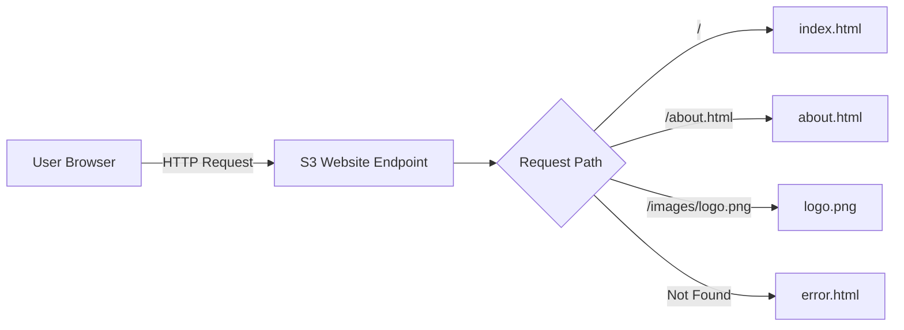

# How to Host a Static Website on S3

Author: [nawazdhandala](https://github.com/nawazdhandala)

Tags: AWS, S3, Static Website, Web Hosting

Description: A complete walkthrough for hosting a static website on Amazon S3, from bucket creation to deployment with custom error pages and routing rules.

---

Static websites don't need servers. They're just HTML, CSS, JavaScript, and maybe some images. S3 can serve all of that directly, and it's ridiculously cheap compared to running an EC2 instance or a container just to serve static files. You get built-in scalability (S3 handles any amount of traffic), high durability (99.999999999%), and you only pay for storage and bandwidth.

Let's set one up from scratch.

## Step 1: Create a Bucket

The bucket name should match your domain name if you plan to use a custom domain later. For now, any name works.

```bash
# Create the bucket
aws s3api create-bucket \
  --bucket my-static-site \
  --region us-east-1
```

## Step 2: Enable Static Website Hosting

Tell S3 to serve the bucket contents as a website. You specify the index document (loaded when someone visits the root) and an optional error document.

```bash
# Enable static website hosting
aws s3 website s3://my-static-site \
  --index-document index.html \
  --error-document error.html
```

Or using the API for more control:

```bash
aws s3api put-bucket-website \
  --bucket my-static-site \
  --website-configuration '{
    "IndexDocument": {
      "Suffix": "index.html"
    },
    "ErrorDocument": {
      "Key": "error.html"
    }
  }'
```

## Step 3: Configure Public Access

By default, S3 blocks all public access. For a public website, you need to open it up. First, disable the public access block.

```bash
# Remove the public access block
aws s3api put-public-access-block \
  --bucket my-static-site \
  --public-access-block-configuration '{
    "BlockPublicAcls": false,
    "IgnorePublicAcls": false,
    "BlockPublicPolicy": false,
    "RestrictPublicBuckets": false
  }'
```

Then add a bucket policy that allows public reads.

```json
{
  "Version": "2012-10-17",
  "Statement": [
    {
      "Sid": "PublicReadGetObject",
      "Effect": "Allow",
      "Principal": "*",
      "Action": "s3:GetObject",
      "Resource": "arn:aws:s3:::my-static-site/*"
    }
  ]
}
```

Apply the policy.

```bash
aws s3api put-bucket-policy \
  --bucket my-static-site \
  --policy file://website-policy.json
```

## Step 4: Create Your Website Files

Let's create a minimal website to test with.

index.html:

```html
<!DOCTYPE html>
<html lang="en">
<head>
    <meta charset="UTF-8">
    <meta name="viewport" content="width=device-width, initial-scale=1.0">
    <title>My Static Site</title>
    <link rel="stylesheet" href="styles.css">
</head>
<body>
    <header>
        <h1>Welcome to My Static Site</h1>
        <nav>
            <a href="/">Home</a>
            <a href="/about.html">About</a>
            <a href="/contact.html">Contact</a>
        </nav>
    </header>
    <main>
        <p>This site is hosted entirely on Amazon S3.</p>
    </main>
    <script src="app.js"></script>
</body>
</html>
```

error.html:

```html
<!DOCTYPE html>
<html lang="en">
<head>
    <meta charset="UTF-8">
    <title>Page Not Found</title>
    <link rel="stylesheet" href="styles.css">
</head>
<body>
    <h1>404 - Page Not Found</h1>
    <p>The page you're looking for doesn't exist.</p>
    <a href="/">Go back home</a>
</body>
</html>
```

## Step 5: Upload Your Website

Upload all the files to the bucket with appropriate content types.

```bash
# Upload the entire website directory
aws s3 sync ./website/ s3://my-static-site/ \
  --delete \
  --cache-control "max-age=3600"

# Verify the upload
aws s3 ls s3://my-static-site/ --recursive
```

For specific content types, you can set them per file type.

```bash
# Upload HTML files with correct content type
aws s3 sync ./website/ s3://my-static-site/ \
  --exclude "*" --include "*.html" \
  --content-type "text/html" \
  --cache-control "max-age=300"

# Upload CSS files
aws s3 sync ./website/ s3://my-static-site/ \
  --exclude "*" --include "*.css" \
  --content-type "text/css" \
  --cache-control "max-age=86400"

# Upload JavaScript files
aws s3 sync ./website/ s3://my-static-site/ \
  --exclude "*" --include "*.js" \
  --content-type "application/javascript" \
  --cache-control "max-age=86400"

# Upload images
aws s3 sync ./website/ s3://my-static-site/ \
  --exclude "*" --include "*.png" --include "*.jpg" --include "*.svg" \
  --cache-control "max-age=604800"
```

## Step 6: Access Your Website

Your website is now live at the S3 website endpoint:

```
http://my-static-site.s3-website-us-east-1.amazonaws.com
```

The exact URL format depends on your region:

- **US East**: `http://bucket-name.s3-website-us-east-1.amazonaws.com`
- **EU West**: `http://bucket-name.s3-website-eu-west-1.amazonaws.com`
- **AP Southeast**: `http://bucket-name.s3-website-ap-southeast-1.amazonaws.com`

Note: S3 website endpoints only support HTTP, not HTTPS. For HTTPS, you need CloudFront in front of S3. See our guide on [setting up S3 with CloudFront for a CDN-backed static site](https://oneuptime.com/blog/post/2026-02-12-s3-cloudfront-cdn-backed-static-site/view).

## Adding Routing Rules

S3 supports routing rules for redirects. This is useful for handling old URLs or implementing simple routing.

```bash
aws s3api put-bucket-website \
  --bucket my-static-site \
  --website-configuration '{
    "IndexDocument": {
      "Suffix": "index.html"
    },
    "ErrorDocument": {
      "Key": "error.html"
    },
    "RoutingRules": [
      {
        "Condition": {
          "KeyPrefixEquals": "old-blog/"
        },
        "Redirect": {
          "ReplaceKeyPrefixWith": "blog/",
          "HttpRedirectCode": "301"
        }
      },
      {
        "Condition": {
          "HttpErrorCodeReturnedEquals": "404",
          "KeyPrefixEquals": "docs/"
        },
        "Redirect": {
          "ReplaceKeyWith": "docs/index.html",
          "HttpRedirectCode": "302"
        }
      }
    ]
  }'
```

## Automating Deployment

Here's a deployment script that handles content types and cache invalidation.

```bash
#!/bin/bash
# deploy.sh - Deploy static site to S3

BUCKET="my-static-site"
SOURCE_DIR="./build"

echo "Deploying to s3://$BUCKET..."

# Sync all files, removing old ones
aws s3 sync "$SOURCE_DIR" "s3://$BUCKET" \
  --delete \
  --cache-control "max-age=31536000" \
  --exclude "*.html" \
  --exclude "service-worker.js"

# Upload HTML files with shorter cache
aws s3 sync "$SOURCE_DIR" "s3://$BUCKET" \
  --exclude "*" \
  --include "*.html" \
  --cache-control "no-cache" \
  --content-type "text/html"

# Upload service worker with no cache
aws s3 cp "$SOURCE_DIR/service-worker.js" "s3://$BUCKET/service-worker.js" \
  --cache-control "no-cache" \
  --content-type "application/javascript"

echo "Deployment complete!"
echo "Site URL: http://$BUCKET.s3-website-us-east-1.amazonaws.com"
```

## Using Python for Deployment

For more control, use the SDK directly.

```python
import boto3
import os
import mimetypes

s3 = boto3.client('s3')

BUCKET = 'my-static-site'
LOCAL_DIR = './build'

# Map file extensions to cache control settings
CACHE_RULES = {
    '.html': 'no-cache',
    '.css': 'max-age=86400',
    '.js': 'max-age=86400',
    '.png': 'max-age=604800',
    '.jpg': 'max-age=604800',
    '.svg': 'max-age=604800',
    '.ico': 'max-age=604800',
}

def deploy():
    """Upload all files in the build directory to S3."""
    uploaded = 0

    for root, dirs, files in os.walk(LOCAL_DIR):
        for filename in files:
            local_path = os.path.join(root, filename)
            s3_key = os.path.relpath(local_path, LOCAL_DIR)

            # Determine content type
            content_type, _ = mimetypes.guess_type(local_path)
            if content_type is None:
                content_type = 'application/octet-stream'

            # Determine cache control
            ext = os.path.splitext(filename)[1]
            cache_control = CACHE_RULES.get(ext, 'max-age=3600')

            # Upload
            s3.upload_file(
                local_path,
                BUCKET,
                s3_key,
                ExtraArgs={
                    'ContentType': content_type,
                    'CacheControl': cache_control,
                }
            )
            uploaded += 1
            print(f"Uploaded: {s3_key} ({content_type})")

    print(f"\nDeployed {uploaded} files to s3://{BUCKET}")

if __name__ == '__main__':
    deploy()
```

## Architecture Overview



## Cost Breakdown

For a typical static website with 10GB of content and 100,000 visitors per month:

- **Storage**: 10GB x $0.023/GB = $0.23/month
- **Requests**: ~500,000 GET requests x $0.0004/1000 = $0.20/month
- **Data Transfer**: ~50GB x $0.09/GB = $4.50/month

Total: roughly $5/month. Compare that to running an EC2 instance at $10-50/month minimum.

## Limitations

S3 static hosting has some limitations to be aware of:

- No HTTPS on the S3 endpoint (use CloudFront for SSL)
- No server-side processing (it's static only)
- No custom headers (use CloudFront for that)
- URL rewriting is limited to routing rules
- No gzip compression from S3 directly (pre-compress or use CloudFront)

For production sites, you'll almost always want CloudFront in front. Check our guide on [setting up S3 with CloudFront](https://oneuptime.com/blog/post/2026-02-12-s3-cloudfront-cdn-backed-static-site/view) for the full setup.

## Wrapping Up

S3 static website hosting is the simplest, cheapest way to get a static site online. The setup takes about five minutes, and once it's running, there's nothing to maintain. No servers to patch, no containers to update, no scaling to worry about. Upload your files, set the bucket policy, and you're done. For anything beyond a basic site, pair it with CloudFront for HTTPS, caching, and global distribution.
