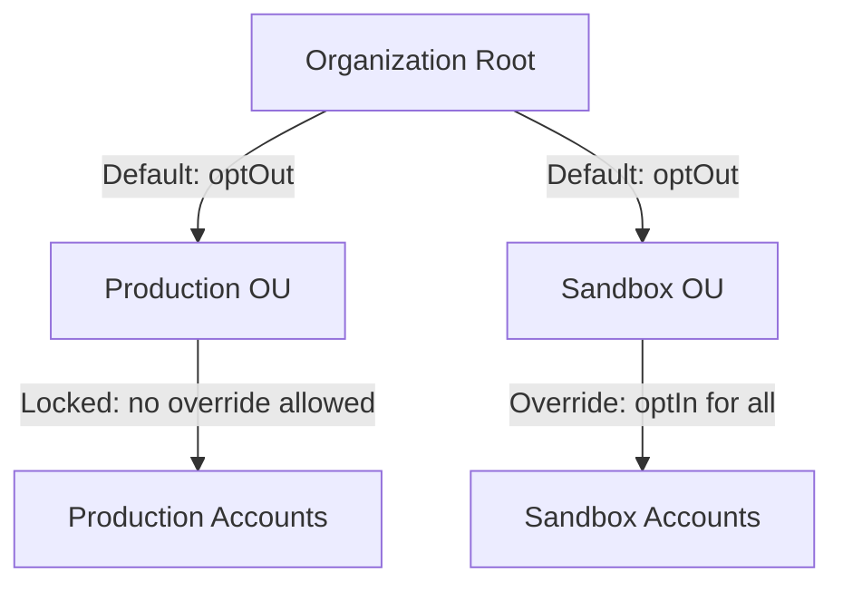

# How to Implement AWS Organizations AI Services Opt-Out Policies

Author: [nawazdhandala](https://github.com/nawazdhandala)

Tags: AWS, Organizations, AI, Privacy, Compliance, Governance

Description: Learn how to implement AI services opt-out policies in AWS Organizations to control how AWS uses your data for AI and machine learning service improvement.

---

When you use AWS AI services like Amazon Rekognition, Amazon Transcribe, or Amazon Comprehend, AWS may use the data you send to those services to improve and develop the quality of those services. For many organizations, particularly those in regulated industries, this data usage is a non-starter. AWS Organizations AI services opt-out policies give you a centralized way to opt out of this data usage across all accounts in your organization.

This guide covers what the opt-out policy controls, how to create and attach it, and how to verify it is working.

## What Does the AI Services Opt-Out Policy Control?

By default, AWS may store and use content processed by certain AI services to develop and improve those services and related technologies. This applies to services like:

- Amazon CodeGuru Profiler
- Amazon Comprehend
- Amazon Lex
- Amazon Polly
- Amazon Rekognition
- Amazon Textract
- Amazon Transcribe
- Amazon Translate

When you opt out, AWS will not store or use your content from these services for service improvement. The services still work exactly the same way for your workloads. The only difference is that AWS will not use your data to train or improve the underlying models.

This is separate from the data processing that happens to fulfill your requests. AWS still processes your data to return results. The opt-out only affects the secondary use of that data for service improvement.

## Why You Should Care

Even if your organization does not have strict regulatory requirements, there are good reasons to implement an opt-out policy:

1. **Data privacy** - Your customer data should not be used to improve services that your competitors also use
2. **Compliance** - Regulations like GDPR, HIPAA, and SOC 2 may require explicit control over data usage
3. **Customer trust** - Being able to demonstrate that customer data is not used for AI training builds trust
4. **Consistency** - Applying the policy at the organization level ensures no account is missed

## Prerequisites

- AWS Organizations with all features enabled
- AI services opt-out policy type enabled in Organizations
- Management account access or delegated administrator access

## Step 1: Enable AI Services Opt-Out Policies

First, enable this policy type in your organization:

```bash
# Get the root ID of your organization
ROOT_ID=$(aws organizations list-roots --query 'Roots[0].Id' --output text)

# Enable AI services opt-out policies
aws organizations enable-policy-type \
  --root-id $ROOT_ID \
  --policy-type AISERVICES_OPT_OUT_POLICY
```

Verify it was enabled:

```bash
# Check that the policy type is enabled
aws organizations list-roots \
  --query 'Roots[0].PolicyTypes[?Type==`AISERVICES_OPT_OUT_POLICY`]'
```

## Step 2: Create the Opt-Out Policy

The simplest approach is to opt out of all AI services at once. Here is the policy document:

```json
{
  "services": {
    "@@operators_allowed_for_child_policies": ["@@none"],
    "default": {
      "@@operators_allowed_for_child_policies": ["@@none"],
      "opt_out_policy": {
        "@@assign": "optOut"
      }
    }
  }
}
```

Let me break down this policy:

- **@@operators_allowed_for_child_policies: @@none** - Prevents child OUs or accounts from overriding this policy. This is important because it means nobody can opt back in at a lower level.
- **default** - Applies to all AI services. You can also target specific services.
- **opt_out_policy: optOut** - The actual opt-out setting.

Save this as `ai-opt-out-policy.json` and create the policy:

```bash
# Create the AI services opt-out policy
aws organizations create-policy \
  --name "AIServicesOptOut" \
  --description "Opt out of all AI service data usage for service improvement" \
  --type AISERVICES_OPT_OUT_POLICY \
  --content file://ai-opt-out-policy.json
```

## Step 3: Attach the Policy

Attach the policy to the organization root so it applies to all accounts:

```bash
# Get the policy ID from the previous command output, or list policies
POLICY_ID=$(aws organizations list-policies \
  --filter AISERVICES_OPT_OUT_POLICY \
  --query 'Policies[?Name==`AIServicesOptOut`].Id' \
  --output text)

# Attach to the organization root
aws organizations attach-policy \
  --policy-id $POLICY_ID \
  --target-id $ROOT_ID
```

## Step 4: Verify the Policy Is Applied

Check the effective policy for a specific account:

```bash
# Check the effective AI opt-out policy for an account
aws organizations describe-effective-policy \
  --policy-type AISERVICES_OPT_OUT_POLICY \
  --target-id 123456789012
```

The output should show `optOut` for all services.

## Selective Opt-Out: Per-Service Configuration

If you want to opt out of most services but keep data sharing enabled for specific ones (maybe you want to help improve a service you rely on), you can create a more granular policy:

```json
{
  "services": {
    "default": {
      "opt_out_policy": {
        "@@assign": "optOut"
      }
    },
    "rekognition": {
      "opt_out_policy": {
        "@@assign": "optIn"
      }
    }
  }
}
```

This opts out of all services by default but explicitly opts in for Amazon Rekognition.

## Selective Opt-Out: Per-OU Configuration

You might want different policies for different OUs. For example, sandbox accounts could stay opted in while production accounts are opted out:

```bash
# Create a strict policy for production
aws organizations create-policy \
  --name "AIOptOut-Production" \
  --description "Strict opt-out for production accounts" \
  --type AISERVICES_OPT_OUT_POLICY \
  --content '{
    "services": {
      "@@operators_allowed_for_child_policies": ["@@none"],
      "default": {
        "@@operators_allowed_for_child_policies": ["@@none"],
        "opt_out_policy": {
          "@@assign": "optOut"
        }
      }
    }
  }'

# Create a permissive policy for sandbox
aws organizations create-policy \
  --name "AIOptOut-Sandbox" \
  --description "Allow AI data usage in sandbox accounts" \
  --type AISERVICES_OPT_OUT_POLICY \
  --content '{
    "services": {
      "default": {
        "opt_out_policy": {
          "@@assign": "optIn"
        }
      }
    }
  }'
```

Then attach each policy to the appropriate OU:

```bash
# Attach strict policy to production OU
aws organizations attach-policy \
  --policy-id p-prod-xxxxxxx \
  --target-id ou-xxxx-prodxxxx

# Attach permissive policy to sandbox OU
aws organizations attach-policy \
  --policy-id p-sand-xxxxxxx \
  --target-id ou-xxxx-sandxxxx
```

## Policy Inheritance and Merging

Understanding how policies merge in the OU hierarchy is important:



When `@@operators_allowed_for_child_policies` is set to `@@none`, child policies cannot override the parent. This is how you enforce opt-out at the production level while allowing flexibility in sandbox.

## CloudFormation Deployment

For infrastructure as code, deploy the policy via CloudFormation:

```yaml
# CloudFormation template for AI opt-out policy
AWSTemplateFormatVersion: '2010-09-09'
Description: AI Services Opt-Out Policy for the organization

Resources:
  AIOptOutPolicy:
    Type: AWS::Organizations::Policy
    Properties:
      Name: AIServicesOptOut
      Description: Opt out of all AI service data usage
      Type: AISERVICES_OPT_OUT_POLICY
      TargetIds:
        - !Ref OrganizationRootId
      Content:
        services:
          "@@operators_allowed_for_child_policies":
            - "@@none"
          default:
            "@@operators_allowed_for_child_policies":
              - "@@none"
            opt_out_policy:
              "@@assign": optOut

Parameters:
  OrganizationRootId:
    Type: String
    Description: The root ID of your AWS Organization
```

## Monitoring and Compliance

To ensure the opt-out policy remains in effect, set up monitoring:

```bash
# Create a Config rule to check for the opt-out policy
# This checks that the policy is attached to the root
aws configservice put-organization-config-rule \
  --organization-config-rule-name "ai-opt-out-check" \
  --organization-custom-rule-metadata '{
    "LambdaFunctionArn": "arn:aws:lambda:us-east-1:123456789012:function:check-ai-opt-out",
    "OrganizationConfigRuleTriggerTypes": ["ScheduledNotification"],
    "MaximumExecutionFrequency": "TwelveHours"
  }'
```

You can also check manually at any time:

```bash
# List all policies of this type
aws organizations list-policies \
  --filter AISERVICES_OPT_OUT_POLICY

# List targets for a specific policy
aws organizations list-targets-for-policy \
  --policy-id p-xxxxxxxxxxxx
```

## What About New AI Services?

When AWS launches new AI services, they automatically fall under the "default" setting in your opt-out policy. If you set the default to "optOut", any new AI service will automatically be opted out. This is another reason to use the default setting rather than listing individual services.

## Common Questions

**Does opting out affect service functionality?**
No. The services work identically whether you are opted in or out. The only difference is whether AWS uses your data for service improvement behind the scenes.

**Is there a cost difference?**
No. There is no additional cost for opting out, and no discount for opting in.

**Does this apply to Amazon Bedrock?**
Amazon Bedrock has its own data handling policies. The AI services opt-out policy applies to the traditional AI services listed earlier, not to Bedrock foundation model usage.

**Can individual accounts override the policy?**
Only if your policy allows it. Using `@@operators_allowed_for_child_policies: @@none` prevents any overrides.

## Best Practices

1. **Apply at the root level.** Unless you have a specific reason not to, apply the opt-out to the entire organization. Consistency is easier to audit.

2. **Lock it down.** Use `@@operators_allowed_for_child_policies: @@none` to prevent teams from opting back in without central approval.

3. **Document your decision.** Record why you opted out (or in) as part of your compliance documentation.

4. **Review periodically.** As AWS adds new AI services, review the scope of the opt-out to ensure it still meets your needs.

5. **Combine with other governance controls.** The opt-out policy works alongside SCPs and other organization policies. Use them together for comprehensive governance.

## Wrapping Up

Implementing an AI services opt-out policy is one of the simplest but most impactful governance controls you can put in place. It takes five minutes to create and attach, it applies automatically to all current and future accounts, and it gives your compliance and legal teams confidence that customer data is not being used to improve AWS AI services. If you are in a regulated industry, this should be one of the first policies you set up after enabling AWS Organizations.
