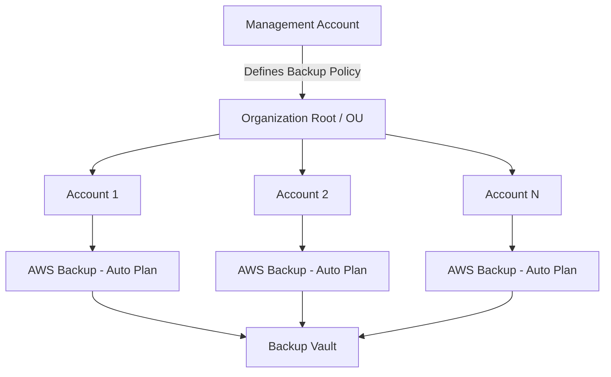

# How to Implement AWS Organizations Backup Policies

Author: [nawazdhandala](https://github.com/nawazdhandala)

Tags: AWS, Organizations, Backup, Disaster Recovery, Compliance, AWS Backup

Description: Learn how to implement centralized backup policies across your AWS organization to ensure consistent data protection and compliance across all accounts.

---

Data loss is one of those risks that everyone acknowledges but few organizations prepare for systematically. When you are managing dozens or hundreds of AWS accounts, ensuring that every team backs up their resources consistently becomes a real challenge. AWS Organizations backup policies solve this by letting you define backup rules centrally and enforce them across all accounts in your organization.

This guide walks through setting up organization-level backup policies, targeting specific resources, and monitoring compliance.

## What Are AWS Organizations Backup Policies?

Backup policies are a type of AWS Organizations policy that lets you define AWS Backup plans centrally in your management account (or delegated administrator account). These policies are inherited by member accounts based on their position in the organizational unit hierarchy.

When a backup policy is applied to an OU, all accounts in that OU automatically get backup plans that protect the resources you specify. Individual accounts cannot override or delete these centrally managed backup plans, which is exactly what you want for compliance.

## How It Works



The management account creates a backup policy JSON document and attaches it to the organization root, specific OUs, or individual accounts. AWS Backup in each member account then enforces the policy by creating and running the corresponding backup plans.

## Prerequisites

- AWS Organizations with all features enabled
- Backup policies enabled as a policy type in Organizations
- AWS Backup service enabled in your target regions
- IAM roles for AWS Backup in member accounts (can be provisioned via the policy)

## Step 1: Enable Backup Policies in Organizations

First, enable the backup policy type in your organization:

```bash
# Enable backup policies at the organization level
aws organizations enable-policy-type \
  --root-id r-xxxx \
  --policy-type BACKUP_POLICY
```

To find your root ID:

```bash
# Get your organization root ID
aws organizations list-roots \
  --query 'Roots[0].Id' \
  --output text
```

## Step 2: Create the Backup Policy Document

The backup policy is a JSON document that defines backup plans, rules, resource selections, and vault settings. Here is a comprehensive example:

```json
{
  "plans": {
    "OrgDailyBackupPlan": {
      "regions": {
        "@@assign": ["us-east-1", "us-west-2"]
      },
      "rules": {
        "DailyBackupRule": {
          "schedule_expression": {
            "@@assign": "cron(0 5 ? * * *)"
          },
          "start_backup_window_minutes": {
            "@@assign": "60"
          },
          "complete_backup_window_minutes": {
            "@@assign": "480"
          },
          "target_backup_vault_name": {
            "@@assign": "OrgBackupVault"
          },
          "lifecycle": {
            "delete_after_days": {
              "@@assign": "35"
            },
            "move_to_cold_storage_after_days": {
              "@@assign": "7"
            }
          },
          "copy_actions": {
            "arn:aws:backup:us-west-2:$account:backup-vault:OrgBackupVault": {
              "target_backup_vault_arn": {
                "@@assign": "arn:aws:backup:us-west-2:$account:backup-vault:OrgBackupVault"
              },
              "lifecycle": {
                "delete_after_days": {
                  "@@assign": "70"
                }
              }
            }
          }
        }
      },
      "selections": {
        "tags": {
          "BackupRequired": {
            "iam_role_arn": {
              "@@assign": "arn:aws:iam::$account:role/OrgBackupRole"
            },
            "tag_key": {
              "@@assign": "BackupPolicy"
            },
            "tag_value": {
              "@@assign": [
                "daily"
              ]
            }
          }
        }
      },
      "backup_plan_tags": {
        "ManagedBy": {
          "tag_key": {
            "@@assign": "ManagedBy"
          },
          "tag_value": {
            "@@assign": "OrgBackupPolicy"
          }
        }
      },
      "advanced_backup_settings": {
        "ec2": {
          "windows_vss": {
            "@@assign": "enabled"
          }
        }
      }
    }
  }
}
```

Key elements in this policy:

- **@@assign** - Sets a value that child OUs or accounts inherit
- **$account** - A variable that resolves to the member account ID
- **schedule_expression** - Cron expression for when backups run (daily at 5 AM UTC here)
- **lifecycle** - How long to keep backups and when to move to cold storage
- **copy_actions** - Cross-region backup copies for disaster recovery
- **selections/tags** - Resources tagged with `BackupPolicy: daily` get backed up

## Step 3: Create and Attach the Policy

```bash
# Create the backup policy in Organizations
aws organizations create-policy \
  --name "DailyBackupPolicy" \
  --description "Organization-wide daily backup policy for tagged resources" \
  --type BACKUP_POLICY \
  --content file://backup-policy.json
```

Now attach the policy to your target. You can attach it to the root (all accounts), a specific OU, or individual accounts:

```bash
# Attach to the organization root (applies to all accounts)
aws organizations attach-policy \
  --policy-id p-xxxxxxxxxxxx \
  --target-id r-xxxx

# Or attach to a specific OU
aws organizations attach-policy \
  --policy-id p-xxxxxxxxxxxx \
  --target-id ou-xxxx-xxxxxxxx

# Or attach to a specific account
aws organizations attach-policy \
  --policy-id p-xxxxxxxxxxxx \
  --target-id 123456789012
```

## Step 4: Set Up the Backup IAM Role in Member Accounts

The backup policy references an IAM role (`OrgBackupRole`) that needs to exist in each member account. Deploy this role using CloudFormation StackSets or CfCT:

```yaml
# CloudFormation template for the backup IAM role
AWSTemplateFormatVersion: '2010-09-09'
Description: IAM role for organization backup policy

Resources:
  OrgBackupRole:
    Type: AWS::IAM::Role
    Properties:
      RoleName: OrgBackupRole
      AssumeRolePolicyDocument:
        Version: '2012-10-17'
        Statement:
          - Effect: Allow
            Principal:
              Service: backup.amazonaws.com
            Action: sts:AssumeRole
      ManagedPolicyArns:
        - arn:aws:iam::aws:policy/service-role/AWSBackupServiceRolePolicyForBackup
        - arn:aws:iam::aws:policy/service-role/AWSBackupServiceRolePolicyForRestores
```

Deploy this across all accounts:

```bash
# Create a StackSet to deploy the backup role
aws cloudformation create-stack-set \
  --stack-set-name OrgBackupRole \
  --template-body file://backup-role.yaml \
  --permission-model SERVICE_MANAGED \
  --auto-deployment Enabled=true,RetainStacksOnAccountRemoval=false \
  --capabilities CAPABILITY_NAMED_IAM

# Deploy to all accounts in the organization
aws cloudformation create-stack-instances \
  --stack-set-name OrgBackupRole \
  --deployment-targets OrganizationalUnitIds=r-xxxx \
  --regions us-east-1
```

## Step 5: Create Backup Vaults

The backup policy references a vault named `OrgBackupVault`. Create this in each target region across your accounts:

```yaml
# CloudFormation template for backup vaults
AWSTemplateFormatVersion: '2010-09-09'
Description: Backup vault with encryption and access policy

Resources:
  OrgBackupVault:
    Type: AWS::Backup::BackupVault
    Properties:
      BackupVaultName: OrgBackupVault
      EncryptionKeyArn: !GetAtt BackupVaultKey.Arn
      AccessPolicy:
        Version: '2012-10-17'
        Statement:
          - Sid: DenyDelete
            Effect: Deny
            Principal: '*'
            Action:
              - backup:DeleteBackupVault
              - backup:DeleteRecoveryPoint
            Resource: '*'

  BackupVaultKey:
    Type: AWS::KMS::Key
    Properties:
      Description: KMS key for backup vault encryption
      KeyPolicy:
        Version: '2012-10-17'
        Statement:
          - Sid: AllowAdministration
            Effect: Allow
            Principal:
              AWS: !Sub 'arn:aws:iam::${AWS::AccountId}:root'
            Action: 'kms:*'
            Resource: '*'
          - Sid: AllowBackupService
            Effect: Allow
            Principal:
              Service: backup.amazonaws.com
            Action:
              - kms:Decrypt
              - kms:GenerateDataKey
            Resource: '*'
```

Notice the deny policy on the vault. This prevents anyone from deleting backups, which is critical for compliance.

## Step 6: Tag Resources for Backup

For the backup policy to protect resources, they need the matching tag. In this example, resources need the tag `BackupPolicy: daily`:

```bash
# Tag an RDS instance for daily backups
aws rds add-tags-to-resource \
  --resource-name arn:aws:rds:us-east-1:123456789012:db:my-database \
  --tags Key=BackupPolicy,Value=daily

# Tag an EBS volume for daily backups
aws ec2 create-tags \
  --resources vol-0123456789abcdef \
  --tags Key=BackupPolicy,Value=daily
```

## Step 7: Monitor Backup Compliance

Check that the backup policy is being enforced:

```bash
# View the effective backup policy for a specific account
aws organizations describe-effective-policy \
  --policy-type BACKUP_POLICY \
  --target-id 123456789012

# List backup jobs across accounts (from the management account)
aws backup list-backup-jobs \
  --by-state COMPLETED \
  --by-created-after 2026-02-01
```

For centralized monitoring, enable AWS Backup Audit Manager:

```bash
# Create a backup audit framework
aws backup create-framework \
  --framework-name "OrgBackupCompliance" \
  --framework-controls '[
    {
      "ControlName": "BACKUP_RESOURCES_PROTECTED_BY_BACKUP_PLAN",
      "ControlScope": {
        "ComplianceResourceTypes": ["AWS::RDS::DBInstance", "AWS::EC2::Instance", "AWS::EBS::Volume"]
      }
    },
    {
      "ControlName": "BACKUP_RECOVERY_POINT_MINIMUM_RETENTION_CHECK",
      "ControlInputParameters": [
        {"ParameterName": "requiredRetentionDays", "ParameterValue": "35"}
      ]
    }
  ]'
```

## Best Practices

1. **Use tag-based selection.** Require teams to tag resources that need backup. This is more manageable than trying to back up everything.

2. **Implement cross-region copies.** Always copy backups to a second region for disaster recovery purposes.

3. **Lock your backup vaults.** Use vault access policies to prevent deletion. For critical data, consider AWS Backup Vault Lock for WORM compliance.

4. **Test restores regularly.** A backup is only useful if you can restore from it. Schedule quarterly restore tests.

5. **Layer policies for different tiers.** Create separate policies for daily, weekly, and monthly backup schedules. Apply them to different OUs or use different tag values.

## Wrapping Up

AWS Organizations backup policies give you centralized, enforceable data protection across your entire multi-account environment. By defining backup rules at the organization level and using tag-based resource selection, you ensure that critical data is backed up consistently regardless of which team or account owns it. Combine this with vault lock policies and cross-region copies, and you have a robust disaster recovery foundation that meets most compliance requirements.
