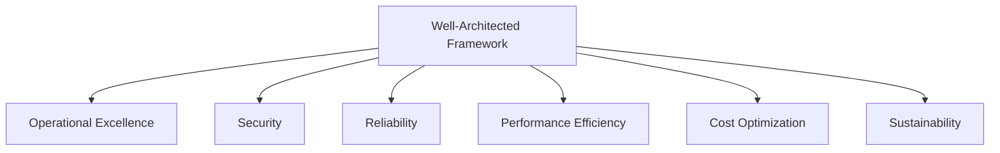

# How to Implement the AWS Well-Architected Framework

Author: [nawazdhandala](https://github.com/nawazdhandala)

Tags: AWS, Well-Architected Framework, Cloud Architecture, Best Practices

Description: A comprehensive guide to implementing the AWS Well-Architected Framework across its six pillars to build secure, reliable, and cost-effective cloud workloads.

---

The AWS Well-Architected Framework is a set of best practices for designing and operating workloads in the cloud. It's not a checklist you run through once and forget - it's an ongoing process for evaluating your architecture against proven standards. AWS built it from years of working with thousands of customers, and it distills that experience into six pillars: Operational Excellence, Security, Reliability, Performance Efficiency, Cost Optimization, and Sustainability.

If you're running anything meaningful on AWS, understanding this framework isn't optional. Let's break down what it actually means and how to put it into practice.

## The Six Pillars

Each pillar addresses a different aspect of cloud architecture:

These pillars aren't independent - they overlap and sometimes create tension. Security improvements might add latency (Performance), and high availability configurations cost more (Cost Optimization). The framework helps you make informed tradeoffs rather than ignoring entire dimensions.

## Pillar 1: Operational Excellence

Operational Excellence focuses on running and monitoring systems to deliver business value and continuously improving processes. The key principles:

**Run operations as code.** Everything from deployment to incident response should be automated. If you're SSHing into servers to deploy code or clicking through the console to scale resources, you're doing it wrong.

**Make frequent, small, reversible changes.** Deploy small changes often rather than large changes rarely. Use blue-green deployments, canary releases, and feature flags to limit blast radius.

**Anticipate failure.** Run game days, chaos engineering experiments, and fire drills. If you've never tested your disaster recovery plan, you don't have one - you have a wish.

**Learn from operational events.** Every incident should produce a postmortem. Not to blame people, but to improve systems.

In practice, this means using CloudFormation or Terraform for infrastructure, CodePipeline or similar for deployments, CloudWatch for monitoring, and Systems Manager for operational tasks.

## Pillar 2: Security

Security addresses protecting data, systems, and assets. The key principles:

**Implement a strong identity foundation.** Use the principle of least privilege. Every IAM role, policy, and user should have the minimum permissions needed. No wildcards unless absolutely necessary. See our deep dive on [implementing least privilege on AWS](https://oneuptime.com/blog/post/2026-02-12-implement-principle-least-privilege-aws/view).

**Enable traceability.** Log everything - API calls (CloudTrail), network traffic (VPC Flow Logs), DNS queries (Route 53 query logs). You can't investigate what you didn't record.

**Apply security at all layers.** Don't rely on a single perimeter. Use security groups, NACLs, WAF, encryption in transit and at rest, and application-level authentication.

**Automate security best practices.** Use AWS Config rules, GuardDuty, and Security Hub to automatically detect and remediate security issues.

**Protect data in transit and at rest.** Encrypt everything. Use KMS for key management, ACM for certificates, and enforce TLS everywhere.

## Pillar 3: Reliability

Reliability ensures a workload performs its intended function correctly and consistently. Key principles:

**Automatically recover from failure.** Use auto-scaling, health checks, and automated failover. Your system should self-heal without human intervention for common failure modes.

**Test recovery procedures.** Back up your data and actually test restoring from those backups. Run disaster recovery drills. A backup you've never restored from might as well not exist.

**Scale horizontally.** Distribute load across multiple small resources rather than relying on one large resource. This reduces the impact of any single failure.

**Stop guessing capacity.** Use auto-scaling to match capacity to demand. Over-provisioning wastes money; under-provisioning causes outages.

**Manage change in automation.** Infrastructure changes should go through the same CI/CD pipeline as application changes.

## Pillar 4: Performance Efficiency

Performance Efficiency is about using computing resources efficiently to meet requirements and maintaining that efficiency as demand changes. Key principles:

**Democratize advanced technologies.** Use managed services instead of running your own. Why manage a Kafka cluster when you can use MSK? Why run your own databases when RDS handles patching, backups, and failover?

**Go global in minutes.** Use CloudFront, Global Accelerator, and multi-region deployments to serve users from the nearest location.

**Use serverless architectures.** Lambda, Fargate, DynamoDB on-demand - these services eliminate the need to manage servers and scale automatically.

**Experiment more often.** AWS makes it easy to test different instance types, storage options, and architectures. Run benchmarks with real workloads.

**Consider mechanical sympathy.** Understand how the underlying systems work. Use the right tool for the job - don't use DynamoDB for complex relational queries, and don't use RDS for simple key-value lookups.

## Pillar 5: Cost Optimization

Cost Optimization is about running systems at the lowest price point while delivering business value. Key principles:

**Implement cloud financial management.** Someone should own cloud costs. Set up budgets, alerts, and regular cost reviews.

**Adopt a consumption model.** Pay only for what you use. Turn off development environments at night. Use spot instances for fault-tolerant workloads. Right-size your instances.

**Measure overall efficiency.** Track cost per transaction, cost per user, or cost per business outcome - not just total spend. If spending goes up but cost per transaction goes down, that might be fine.

**Stop spending money on undifferentiated heavy lifting.** Use managed services. The cost of managing your own database cluster (including the engineer hours) usually exceeds the price of RDS.

**Analyze and attribute expenditure.** Tag everything and use Cost Explorer to understand where money goes. You can't optimize what you can't measure.

## Pillar 6: Sustainability

Sustainability focuses on minimizing the environmental impact of your cloud workloads. Key principles:

**Understand your impact.** Use the AWS Customer Carbon Footprint Tool to measure your carbon emissions.

**Establish sustainability goals.** Set targets for resource utilization and efficiency improvements.

**Maximize utilization.** Right-size resources and use auto-scaling. An underutilized EC2 instance wastes energy.

**Use managed services.** AWS invests heavily in efficiency at scale. Managed services running on shared infrastructure are more energy-efficient than individual deployments.

**Reduce downstream impact.** Minimize the data you transfer and store. Compress data, use efficient formats, and clean up unused resources.

## Implementing the Framework in Practice

Knowing the pillars is one thing. Putting them into practice is another. Here's a practical approach:

### Step 1: Start with a Review

Use the AWS Well-Architected Tool (free in the AWS console) to assess your current workload against the framework. It asks specific questions and identifies high-risk issues.

### Step 2: Prioritize

You won't fix everything at once. Focus on high-risk items first, especially in Security and Reliability. A security breach or major outage hurts way more than suboptimal cost allocation.

### Step 3: Build It Into Your Process

Don't treat Well-Architected reviews as one-time events. Do them regularly - quarterly at minimum, or whenever you make significant architectural changes. Build the principles into your design reviews and code reviews.

### Step 4: Use AWS Tools

AWS provides tools for each pillar:

- **Security**: Security Hub, GuardDuty, IAM Access Analyzer, Config
- **Reliability**: Resilience Hub, Backup, Route 53 health checks
- **Performance**: Compute Optimizer, X-Ray, CloudWatch
- **Cost**: Cost Explorer, Budgets, Savings Plans, Trusted Advisor
- **Sustainability**: Carbon Footprint Tool, Compute Optimizer

### Step 5: Automate Compliance

Use AWS Config rules, CloudFormation Guard, and Terraform validation to automatically check that new resources comply with your architectural standards.

## Common Tradeoffs

The pillars sometimes conflict. Here are common tradeoffs:

- **Security vs. Performance**: Encryption adds latency. Mitigate with hardware-accelerated encryption (Nitro instances).
- **Reliability vs. Cost**: Multi-AZ and multi-region deployments cost more. Decide based on your actual availability requirements.
- **Performance vs. Cost**: The fastest instance type isn't always the most cost-effective. Benchmark with your actual workload.
- **Sustainability vs. Performance**: Running at higher utilization is greener but leaves less headroom for spikes.

The framework doesn't tell you which tradeoff to make - it ensures you're making them consciously.

## Summary

The Well-Architected Framework isn't a compliance checkbox. It's a way of thinking about cloud architecture that ensures you're not neglecting critical dimensions. Start with a review of your most important workload, address the high-risk items, and make the review process ongoing. For monitoring the operational health of your AWS workloads, check out our guide on [AWS infrastructure monitoring](https://oneuptime.com/blog/post/2026-02-02-pulumi-aws-infrastructure/view).
