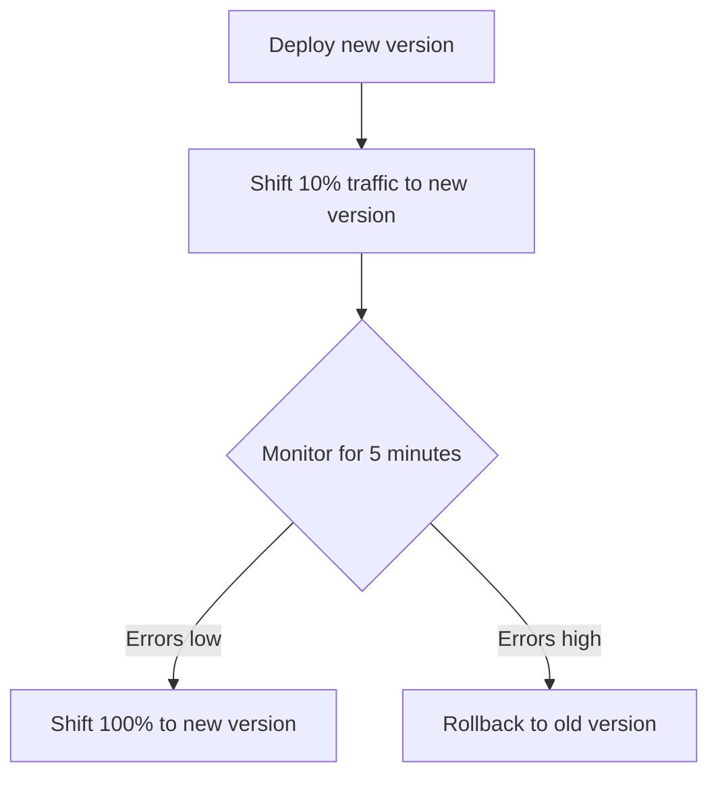

# How to Implement Canary Deployments for Lambda Functions

Author: [nawazdhandala](https://github.com/nawazdhandala)

Tags: AWS, Lambda, Canary Deployment, CodeDeploy, Serverless

Description: Implement automated canary deployments for AWS Lambda functions using CodeDeploy and SAM with automatic rollback based on CloudWatch alarms.

---

Deploying new code directly to all users is risky. If there's a bug, everyone is affected. Canary deployments solve this by sending a small percentage of traffic to the new version first, monitoring for problems, and only promoting to full traffic if things look healthy. If errors spike, it rolls back automatically.

AWS makes this straightforward with Lambda's built-in integration with CodeDeploy. You can set up canary deployments with just a few lines of SAM or CloudFormation configuration. Let's see how.

## How Canary Deployments Work

In a canary deployment, you shift a small percentage of traffic to the new version (the "canary"), monitor it for a set period, and then either shift the remaining traffic or roll back.



Lambda supports several traffic shifting strategies:

| Strategy | Description |
|---|---|
| Canary10Percent5Minutes | 10% for 5 minutes, then 100% |
| Canary10Percent10Minutes | 10% for 10 minutes, then 100% |
| Canary10Percent15Minutes | 10% for 15 minutes, then 100% |
| Canary10Percent30Minutes | 10% for 30 minutes, then 100% |
| Linear10PercentEvery1Minute | +10% every minute |
| Linear10PercentEvery2Minutes | +10% every 2 minutes |
| Linear10PercentEvery3Minutes | +10% every 3 minutes |
| Linear10PercentEvery10Minutes | +10% every 10 minutes |
| AllAtOnce | Immediate full deployment |

## Setup with SAM

The easiest way to implement canary deployments is with SAM (Serverless Application Model). Add a `DeploymentPreference` to your function:

```yaml
# template.yml - SAM template with canary deployment
AWSTemplateFormatVersion: '2010-09-09'
Transform: AWS::Serverless-2016-10-31

Resources:
  ApiFunction:
    Type: AWS::Serverless::Function
    Properties:
      FunctionName: my-api
      Runtime: nodejs20.x
      Handler: src/handler.handler
      MemorySize: 256
      Timeout: 30

      # AutoPublishAlias creates a new version and updates the alias
      # on every deployment
      AutoPublishAlias: live

      # Canary deployment configuration
      DeploymentPreference:
        Type: Canary10Percent5Minutes
        Alarms:
          # Roll back if these alarms fire during the canary period
          - !Ref ApiErrorAlarm
          - !Ref ApiLatencyAlarm
        Hooks:
          # Run these functions before and after traffic shifting
          PreTraffic: !Ref PreTrafficHook
          PostTraffic: !Ref PostTrafficHook

  # Alarm: roll back if error rate exceeds threshold
  ApiErrorAlarm:
    Type: AWS::CloudWatch::Alarm
    Properties:
      AlarmName: api-canary-errors
      MetricName: Errors
      Namespace: AWS/Lambda
      Statistic: Sum
      Period: 60
      EvaluationPeriods: 1
      Threshold: 5
      ComparisonOperator: GreaterThanThreshold
      Dimensions:
        - Name: FunctionName
          Value: !Ref ApiFunction
        - Name: Resource
          Value: !Sub "${ApiFunction}:live"

  # Alarm: roll back if p99 latency is too high
  ApiLatencyAlarm:
    Type: AWS::CloudWatch::Alarm
    Properties:
      AlarmName: api-canary-latency
      MetricName: Duration
      Namespace: AWS/Lambda
      ExtendedStatistic: p99
      Period: 60
      EvaluationPeriods: 1
      Threshold: 5000
      ComparisonOperator: GreaterThanThreshold
      Dimensions:
        - Name: FunctionName
          Value: !Ref ApiFunction
        - Name: Resource
          Value: !Sub "${ApiFunction}:live"
```

When you run `sam deploy`, SAM automatically:
1. Publishes a new version
2. Creates a CodeDeploy deployment
3. Shifts 10% of traffic to the new version
4. Monitors the CloudWatch alarms for 5 minutes
5. Shifts the remaining 90% if alarms stay green
6. Rolls back if any alarm triggers

## Pre-Traffic and Post-Traffic Hooks

Hooks let you run validation before and after traffic shifts. The pre-traffic hook runs a test against the new version before any traffic is sent to it:

```javascript
// PreTrafficHook - validates the new version before receiving traffic
const { CodeDeployClient, PutLifecycleEventHookExecutionStatusCommand } = require('@aws-sdk/client-codedeploy');
const { LambdaClient, InvokeCommand } = require('@aws-sdk/client-lambda');

const codedeploy = new CodeDeployClient({ region: 'us-east-1' });
const lambda = new LambdaClient({ region: 'us-east-1' });

exports.handler = async (event) => {
  const deploymentId = event.DeploymentId;
  const lifecycleEventHookExecutionId = event.LifecycleEventHookExecutionId;

  let status = 'Succeeded';

  try {
    // Invoke the new version to verify it works
    const response = await lambda.send(new InvokeCommand({
      FunctionName: process.env.NEW_VERSION_ARN,
      Payload: JSON.stringify({
        httpMethod: 'GET',
        path: '/health',
      }),
    }));

    const payload = JSON.parse(Buffer.from(response.Payload).toString());

    if (payload.statusCode !== 200) {
      console.error('Health check failed:', payload);
      status = 'Failed';
    } else {
      console.log('Health check passed');
    }
  } catch (error) {
    console.error('Pre-traffic validation failed:', error.message);
    status = 'Failed';
  }

  // Report the result back to CodeDeploy
  await codedeploy.send(new PutLifecycleEventHookExecutionStatusCommand({
    deploymentId,
    lifecycleEventHookExecutionId,
    status,
  }));
};
```

Add the hook functions to your template:

```yaml
# Pre-traffic hook function
PreTrafficHook:
  Type: AWS::Serverless::Function
  Properties:
    FunctionName: !Sub "CodeDeployHook_pre-traffic-${ApiFunction}"
    Handler: hooks/pre-traffic.handler
    Runtime: nodejs20.x
    Timeout: 60
    Policies:
      - Version: "2012-10-17"
        Statement:
          - Effect: Allow
            Action:
              - codedeploy:PutLifecycleEventHookExecutionStatus
            Resource: "*"
          - Effect: Allow
            Action:
              - lambda:InvokeFunction
            Resource: !Sub "${ApiFunction.Arn}:*"
    Environment:
      Variables:
        NEW_VERSION_ARN: !Ref ApiFunction.Version
```

## Custom Deployment Configuration

If the built-in strategies don't fit your needs, create a custom deployment configuration:

```bash
# Create a custom canary deployment: 5% for 10 minutes
aws deploy create-deployment-config \
  --deployment-config-name Canary5Percent10Minutes \
  --compute-platform Lambda \
  --traffic-routing-config '{
    "type": "TimeBasedCanary",
    "timeBasedCanary": {
      "canaryPercentage": 5,
      "canaryInterval": 10
    }
  }'
```

Or a linear deployment:

```bash
# Create a linear deployment: +5% every 5 minutes
aws deploy create-deployment-config \
  --deployment-config-name Linear5PercentEvery5Minutes \
  --compute-platform Lambda \
  --traffic-routing-config '{
    "type": "TimeBasedLinear",
    "timeBasedLinear": {
      "linearPercentage": 5,
      "linearInterval": 5
    }
  }'
```

Reference your custom config in SAM:

```yaml
DeploymentPreference:
  Type: Canary5Percent10Minutes
  Alarms:
    - !Ref ApiErrorAlarm
```

## Manual Canary with the AWS CLI

If you're not using SAM, you can implement canary deployments manually using Lambda alias routing:

```bash
# Step 1: Publish the new version
NEW_VERSION=$(aws lambda publish-version \
  --function-name my-api \
  --query 'Version' --output text)

echo "New version: $NEW_VERSION"

# Step 2: Get the current version from the production alias
CURRENT_VERSION=$(aws lambda get-alias \
  --function-name my-api \
  --name production \
  --query 'FunctionVersion' --output text)

echo "Current version: $CURRENT_VERSION"

# Step 3: Send 10% of traffic to the new version
aws lambda update-alias \
  --function-name my-api \
  --name production \
  --function-version "$CURRENT_VERSION" \
  --routing-config "{\"AdditionalVersionWeights\": {\"$NEW_VERSION\": 0.1}}"

echo "Canary started: 10% traffic on version $NEW_VERSION"

# Step 4: Wait and monitor
echo "Monitoring for 5 minutes..."
sleep 300

# Step 5: Check for errors (simplified example)
ERRORS=$(aws cloudwatch get-metric-statistics \
  --namespace AWS/Lambda \
  --metric-name Errors \
  --dimensions "Name=FunctionName,Value=my-api" "Name=Resource,Value=my-api:production" \
  --start-time "$(date -u -v-5M '+%Y-%m-%dT%H:%M:%SZ')" \
  --end-time "$(date -u '+%Y-%m-%dT%H:%M:%SZ')" \
  --period 300 \
  --statistics Sum \
  --query 'Datapoints[0].Sum' --output text)

if [ "$ERRORS" != "None" ] && [ "$(echo "$ERRORS > 5" | bc)" -eq 1 ]; then
  echo "Too many errors! Rolling back..."
  aws lambda update-alias \
    --function-name my-api \
    --name production \
    --function-version "$CURRENT_VERSION" \
    --routing-config '{}'
  exit 1
fi

# Step 6: Promote to 100%
echo "Canary healthy. Promoting to 100%..."
aws lambda update-alias \
  --function-name my-api \
  --name production \
  --function-version "$NEW_VERSION" \
  --routing-config '{}'

echo "Deployment complete!"
```

## Monitoring During Canary Deployments

During the canary window, watch these metrics closely:

- **Error count** - Should stay flat or near zero
- **Duration (p99)** - Should be comparable to the old version
- **Throttles** - Shouldn't increase
- **Iterator Age** (for stream triggers) - Shouldn't grow

Set up a dashboard:

```bash
# Create a CloudWatch dashboard for canary monitoring
aws cloudwatch put-dashboard \
  --dashboard-name lambda-canary \
  --dashboard-body '{
    "widgets": [
      {
        "type": "metric",
        "properties": {
          "metrics": [
            ["AWS/Lambda", "Errors", "FunctionName", "my-api", "Resource", "my-api:production"],
            ["AWS/Lambda", "Duration", "FunctionName", "my-api", "Resource", "my-api:production", {"stat": "p99"}]
          ],
          "period": 60,
          "title": "Canary Deployment Metrics"
        }
      }
    ]
  }'
```

For comprehensive monitoring, see our guide on [monitoring Lambda performance with CloudWatch](https://oneuptime.com/blog/post/2026-02-12-monitor-lambda-function-performance-with-cloudwatch/view).

## Wrapping Up

Canary deployments are the safest way to ship Lambda updates. By routing a fraction of traffic to the new version and watching for errors, you catch problems before they impact all users. SAM with CodeDeploy makes this nearly effortless - add a few lines to your template and you get automated traffic shifting with automatic rollback. For teams that ship frequently, it's a must-have safety net.
