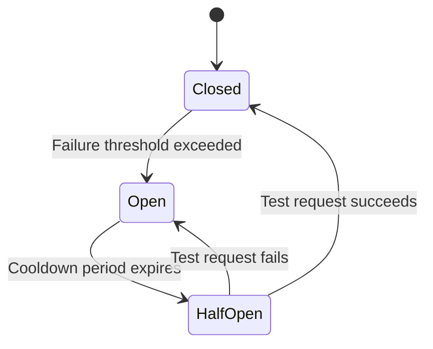

# How to Implement Circuit Breaker Pattern with Lambda and DynamoDB

Author: [nawazdhandala](https://github.com/nawazdhandala)

Tags: AWS, Lambda, Circuit Breaker, DynamoDB, Resilience, Serverless

Description: Build a circuit breaker pattern using AWS Lambda and DynamoDB to protect your services from cascading failures

---

When a downstream service goes down, the worst thing you can do is keep hammering it with requests. Your Lambda function retries, the downstream service stays overwhelmed, timeouts pile up, your Lambda concurrency spikes, and suddenly every service in your architecture is degraded. This is a cascading failure, and the circuit breaker pattern is the standard defense against it.

A circuit breaker tracks failures to a downstream service. When failures exceed a threshold, it "opens" the circuit and stops making calls, returning a fallback response immediately. After a cooldown period, it allows a few test requests through. If those succeed, the circuit closes and normal operation resumes.

## The Three States



- **Closed** - Normal operation. Requests flow through. Failures are counted.
- **Open** - Circuit is tripped. All requests return a fallback response immediately without calling the downstream service.
- **Half-Open** - A test request is allowed through. If it succeeds, the circuit closes. If it fails, the circuit opens again.

## DynamoDB as the State Store

In a serverless architecture, Lambda functions are stateless. Each invocation might run in a different execution environment. We need an external store for the circuit breaker state. DynamoDB is perfect for this: fast, serverless, and supports atomic updates.

### Table Structure

```bash
# Create the circuit breaker state table
aws dynamodb create-table \
  --table-name circuit-breakers \
  --attribute-definitions AttributeName=serviceName,AttributeType=S \
  --key-schema AttributeName=serviceName,KeyType=HASH \
  --billing-mode PAY_PER_REQUEST
```

Each item in the table represents a circuit breaker for one downstream service:

```json
{
  "serviceName": "payment-api",
  "state": "CLOSED",
  "failureCount": 0,
  "lastFailureTime": 0,
  "lastStateChange": 1707696000,
  "successCount": 0
}
```

## The Circuit Breaker Implementation

Here is a complete, production-ready circuit breaker for Lambda:

```python
# Circuit breaker implementation using DynamoDB for state management
import boto3
import time
import json
from functools import wraps

dynamodb = boto3.resource('dynamodb')
table = dynamodb.Table('circuit-breakers')

class CircuitBreakerOpen(Exception):
    """Raised when the circuit is open and calls are blocked."""
    pass

class CircuitBreaker:
    def __init__(self, service_name, failure_threshold=5, recovery_timeout=60,
                 success_threshold=2):
        self.service_name = service_name
        self.failure_threshold = failure_threshold
        self.recovery_timeout = recovery_timeout  # seconds before trying half-open
        self.success_threshold = success_threshold  # successes needed to close

    def get_state(self):
        """Read the current circuit breaker state from DynamoDB."""
        response = table.get_item(Key={'serviceName': self.service_name})

        if 'Item' not in response:
            # Initialize the circuit breaker
            item = {
                'serviceName': self.service_name,
                'state': 'CLOSED',
                'failureCount': 0,
                'lastFailureTime': 0,
                'lastStateChange': int(time.time()),
                'successCount': 0
            }
            table.put_item(Item=item)
            return item

        return response['Item']

    def should_allow_request(self):
        """Determine if a request should be allowed through."""
        state = self.get_state()
        current_time = int(time.time())

        if state['state'] == 'CLOSED':
            return True

        if state['state'] == 'OPEN':
            # Check if recovery timeout has elapsed
            if current_time - state['lastFailureTime'] >= self.recovery_timeout:
                # Transition to half-open
                self._transition_to_half_open()
                return True
            return False

        if state['state'] == 'HALF_OPEN':
            return True

        return False

    def record_success(self):
        """Record a successful call to the downstream service."""
        state = self.get_state()

        if state['state'] == 'HALF_OPEN':
            new_success_count = int(state.get('successCount', 0)) + 1
            if new_success_count >= self.success_threshold:
                # Enough successes in half-open, close the circuit
                self._transition_to_closed()
            else:
                table.update_item(
                    Key={'serviceName': self.service_name},
                    UpdateExpression='SET successCount = :sc',
                    ExpressionAttributeValues={':sc': new_success_count}
                )
        elif state['state'] == 'CLOSED':
            # Reset failure count on success
            if int(state.get('failureCount', 0)) > 0:
                table.update_item(
                    Key={'serviceName': self.service_name},
                    UpdateExpression='SET failureCount = :zero',
                    ExpressionAttributeValues={':zero': 0}
                )

    def record_failure(self):
        """Record a failed call to the downstream service."""
        state = self.get_state()
        current_time = int(time.time())

        if state['state'] == 'HALF_OPEN':
            # Any failure in half-open reopens the circuit
            self._transition_to_open(current_time)
            return

        # Increment failure count
        new_failure_count = int(state.get('failureCount', 0)) + 1

        if new_failure_count >= self.failure_threshold:
            self._transition_to_open(current_time)
        else:
            table.update_item(
                Key={'serviceName': self.service_name},
                UpdateExpression='SET failureCount = :fc, lastFailureTime = :lft',
                ExpressionAttributeValues={
                    ':fc': new_failure_count,
                    ':lft': current_time
                }
            )

    def _transition_to_open(self, failure_time):
        table.update_item(
            Key={'serviceName': self.service_name},
            UpdateExpression='SET #s = :state, lastFailureTime = :lft, lastStateChange = :lsc',
            ExpressionAttributeNames={'#s': 'state'},
            ExpressionAttributeValues={
                ':state': 'OPEN',
                ':lft': failure_time,
                ':lsc': int(time.time())
            }
        )

    def _transition_to_half_open(self):
        table.update_item(
            Key={'serviceName': self.service_name},
            UpdateExpression='SET #s = :state, successCount = :zero, lastStateChange = :lsc',
            ExpressionAttributeNames={'#s': 'state'},
            ExpressionAttributeValues={
                ':state': 'HALF_OPEN',
                ':zero': 0,
                ':lsc': int(time.time())
            }
        )

    def _transition_to_closed(self):
        table.update_item(
            Key={'serviceName': self.service_name},
            UpdateExpression='SET #s = :state, failureCount = :zero, successCount = :zero, lastStateChange = :lsc',
            ExpressionAttributeNames={'#s': 'state'},
            ExpressionAttributeValues={
                ':state': 'CLOSED',
                ':zero': 0,
                ':lsc': int(time.time())
            }
        )
```

## Using the Circuit Breaker as a Decorator

Wrap it in a decorator for clean usage:

```python
# Decorator that adds circuit breaker protection to any function
def circuit_protected(service_name, fallback_fn=None, **cb_kwargs):
    breaker = CircuitBreaker(service_name, **cb_kwargs)

    def decorator(func):
        @wraps(func)
        def wrapper(*args, **kwargs):
            if not breaker.should_allow_request():
                if fallback_fn:
                    return fallback_fn(*args, **kwargs)
                raise CircuitBreakerOpen(
                    f'Circuit breaker for {service_name} is open'
                )

            try:
                result = func(*args, **kwargs)
                breaker.record_success()
                return result
            except Exception as e:
                breaker.record_failure()
                if fallback_fn:
                    return fallback_fn(*args, **kwargs)
                raise

        return wrapper
    return decorator
```

### Using the Decorator in a Lambda Handler

```python
# Lambda function with circuit breaker protecting downstream payment API
import requests

def payment_fallback(order):
    """Fallback when payment service is unavailable."""
    return {
        'status': 'queued',
        'message': 'Payment service temporarily unavailable. Order queued for processing.'
    }

@circuit_protected(
    service_name='payment-api',
    failure_threshold=5,
    recovery_timeout=30,
    fallback_fn=payment_fallback
)
def call_payment_api(order):
    """Call the external payment API."""
    response = requests.post(
        'https://api.payment-provider.com/charges',
        json={
            'amount': order['amount'],
            'currency': order['currency'],
            'customer': order['customerId']
        },
        timeout=5
    )
    response.raise_for_status()
    return response.json()

def handler(event, context):
    order = json.loads(event['Records'][0]['body'])
    result = call_payment_api(order)
    return result
```

## Monitoring the Circuit Breaker

Publish circuit breaker state changes to CloudWatch for visibility:

```python
# Publish circuit breaker metrics to CloudWatch
import boto3

cloudwatch = boto3.client('cloudwatch')

def publish_circuit_metrics(service_name, state, failure_count):
    cloudwatch.put_metric_data(
        Namespace='Custom/CircuitBreaker',
        MetricData=[
            {
                'MetricName': 'CircuitState',
                'Dimensions': [
                    {'Name': 'ServiceName', 'Value': service_name}
                ],
                'Value': {'CLOSED': 0, 'HALF_OPEN': 1, 'OPEN': 2}.get(state, -1),
                'Unit': 'None'
            },
            {
                'MetricName': 'FailureCount',
                'Dimensions': [
                    {'Name': 'ServiceName', 'Value': service_name}
                ],
                'Value': failure_count,
                'Unit': 'Count'
            }
        ]
    )
```

Set up CloudWatch alarms to notify you when a circuit opens:

```bash
# Alarm when circuit breaker opens (state value = 2)
aws cloudwatch put-metric-alarm \
  --alarm-name circuit-breaker-payment-api-open \
  --namespace Custom/CircuitBreaker \
  --metric-name CircuitState \
  --dimensions Name=ServiceName,Value=payment-api \
  --statistic Maximum \
  --period 60 \
  --evaluation-periods 1 \
  --threshold 1.5 \
  --comparison-operator GreaterThanThreshold \
  --alarm-actions arn:aws:sns:us-east-1:123456789012:ops-alerts
```

## Tuning the Parameters

The right thresholds depend on your traffic patterns:

**failure_threshold**: How many failures before opening. Too low and transient errors trip it. Too high and you wait too long to protect the system. Start with 5 and adjust.

**recovery_timeout**: How long to wait before testing with half-open. Too short and you keep hitting a service that is still down. Too long and you delay recovery. Start with 30-60 seconds.

**success_threshold**: How many test successes before closing. Set to 1 for fast recovery, higher for more confidence. Start with 2.

## Handling Multiple Lambda Instances

Since Lambda functions are stateless and run concurrently, multiple instances share the same DynamoDB circuit breaker state. This is intentional - when the payment API is down, ALL Lambda instances should stop calling it, not just the ones that happened to experience the failure.

However, concurrent DynamoDB updates can cause race conditions. For most use cases, this is acceptable because the circuit breaker is a heuristic, not a precise counter. If you need exact counts, use DynamoDB atomic counters:

```python
# Atomic failure counter increment using DynamoDB
table.update_item(
    Key={'serviceName': self.service_name},
    UpdateExpression='SET failureCount = failureCount + :inc, lastFailureTime = :lft',
    ExpressionAttributeValues={
        ':inc': 1,
        ':lft': int(time.time())
    }
)
```

## Wrapping Up

The circuit breaker pattern is essential for building resilient serverless applications. Without it, a single downstream failure can cascade through your entire system. DynamoDB gives you a fast, scalable state store that all Lambda instances can share. The implementation is straightforward, and the payoff - preventing cascading failures - is enormous.

For another critical Lambda resilience pattern, check out our guide on [implementing idempotent Lambda functions](https://oneuptime.com/blog/post/2026-02-12-implement-idempotent-lambda-functions/view).
