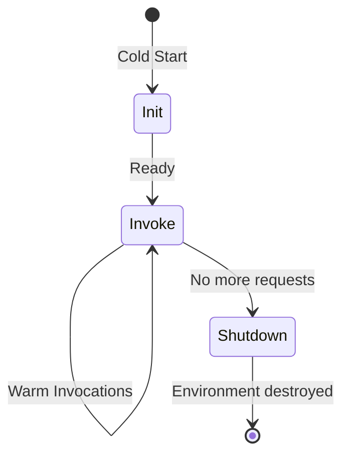

# How to Implement Graceful Shutdown in Lambda Functions

Author: [nawazdhandala](https://github.com/nawazdhandala)

Tags: AWS, Lambda, Graceful Shutdown, Serverless, Best Practices

Description: A practical guide to implementing graceful shutdown in AWS Lambda functions to clean up resources and flush data before termination

---

Lambda functions are ephemeral by design. AWS can freeze, thaw, or terminate your execution environment at any time. When a function instance is about to be shut down, you often have resources that need cleanup: database connections to close, buffered data to flush, metrics to send, or temporary files to remove.

Without graceful shutdown handling, these cleanup tasks simply do not happen. Database connection pools leak, metrics get lost, and buffered data vanishes. Lambda's runtime extensions API provides a mechanism to hook into the shutdown lifecycle and run cleanup code before the environment is destroyed.

In this guide, you will learn how graceful shutdown works in Lambda, how to implement it in different runtimes, and what you can realistically accomplish in the shutdown window.

## How Lambda Lifecycle Works

A Lambda execution environment goes through several phases.



- **Init**: Your function code is loaded and initialized. This is where global variables are set up, connections are opened, and extensions are registered.
- **Invoke**: Your handler function runs. This can happen many times on the same execution environment.
- **Shutdown**: Lambda is about to destroy the execution environment. Extensions and the runtime get a chance to clean up.

The shutdown phase is where graceful shutdown logic runs. You get up to 2 seconds (or 300ms for functions with 128MB memory) to complete cleanup tasks.

## Using SIGTERM in Lambda

When Lambda is about to shut down an execution environment, it sends a SIGTERM signal to your function process. You can register a signal handler to catch this and run cleanup code.

### Node.js Implementation

```javascript
// index.mjs - Lambda handler with graceful shutdown

// Resources initialized outside the handler (shared across invocations)
let dbConnection = null;
let metricsBuffer = [];

// Initialize resources on cold start
async function initResources() {
  if (!dbConnection) {
    const { Client } = await import('pg');
    dbConnection = new Client({
      host: process.env.DB_HOST,
      database: process.env.DB_NAME,
    });
    await dbConnection.connect();
    console.log('Database connection established');
  }
}

// Register the SIGTERM handler for graceful shutdown
process.on('SIGTERM', async () => {
  console.log('SIGTERM received, starting graceful shutdown');

  // Flush any buffered metrics
  if (metricsBuffer.length > 0) {
    console.log(`Flushing ${metricsBuffer.length} buffered metrics`);
    await flushMetrics(metricsBuffer);
    metricsBuffer = [];
  }

  // Close the database connection
  if (dbConnection) {
    console.log('Closing database connection');
    await dbConnection.end();
    dbConnection = null;
  }

  console.log('Graceful shutdown complete');
  process.exit(0);
});

async function flushMetrics(buffer) {
  // Send buffered metrics to CloudWatch or your metrics service
  const { CloudWatchClient, PutMetricDataCommand } = await import('@aws-sdk/client-cloudwatch');
  const cw = new CloudWatchClient({});

  const metricData = buffer.map(m => ({
    MetricName: m.name,
    Value: m.value,
    Unit: m.unit || 'Count',
    Timestamp: new Date(m.timestamp),
  }));

  await cw.send(new PutMetricDataCommand({
    Namespace: 'MyApp',
    MetricData: metricData,
  }));
}

// Main handler
export const handler = async (event) => {
  await initResources();

  // Process the event
  const result = await dbConnection.query('SELECT NOW()');

  // Buffer a metric instead of sending immediately
  metricsBuffer.push({
    name: 'InvocationProcessed',
    value: 1,
    timestamp: Date.now(),
  });

  // Flush metrics periodically (every 50 invocations)
  if (metricsBuffer.length >= 50) {
    await flushMetrics(metricsBuffer);
    metricsBuffer = [];
  }

  return {
    statusCode: 200,
    body: JSON.stringify({ time: result.rows[0].now }),
  };
};
```

### Python Implementation

```python
# handler.py - Lambda handler with graceful shutdown
import signal
import sys
import json
import os
import boto3

# Global resources
db_connection = None
metrics_buffer = []

def init_resources():
    """Initialize shared resources on cold start."""
    global db_connection
    if db_connection is None:
        import psycopg2
        db_connection = psycopg2.connect(
            host=os.environ['DB_HOST'],
            dbname=os.environ['DB_NAME'],
            user=os.environ['DB_USER'],
            password=os.environ['DB_PASSWORD']
        )
        print('Database connection established')


def flush_metrics(buffer):
    """Send buffered metrics to CloudWatch."""
    if not buffer:
        return

    cw = boto3.client('cloudwatch')
    metric_data = [
        {
            'MetricName': m['name'],
            'Value': m['value'],
            'Unit': m.get('unit', 'Count'),
        }
        for m in buffer
    ]

    # CloudWatch accepts max 1000 metrics per call
    for i in range(0, len(metric_data), 1000):
        cw.put_metric_data(
            Namespace='MyApp',
            MetricData=metric_data[i:i+1000]
        )
    print(f'Flushed {len(buffer)} metrics')


def shutdown_handler(signum, frame):
    """Handle SIGTERM for graceful shutdown."""
    global db_connection, metrics_buffer

    print('SIGTERM received, starting graceful shutdown')

    # Flush buffered metrics
    flush_metrics(metrics_buffer)
    metrics_buffer = []

    # Close database connection
    if db_connection:
        print('Closing database connection')
        db_connection.close()
        db_connection = None

    print('Graceful shutdown complete')
    sys.exit(0)


# Register SIGTERM handler
signal.signal(signal.SIGTERM, shutdown_handler)


def lambda_handler(event, context):
    """Main Lambda handler."""
    init_resources()

    # Process the event
    cursor = db_connection.cursor()
    cursor.execute('SELECT NOW()')
    result = cursor.fetchone()
    cursor.close()

    # Buffer a metric
    metrics_buffer.append({
        'name': 'InvocationProcessed',
        'value': 1,
    })

    # Periodic flush
    if len(metrics_buffer) >= 50:
        flush_metrics(metrics_buffer)
        metrics_buffer.clear()

    return {
        'statusCode': 200,
        'body': json.dumps({'time': str(result[0])}),
    }
```

## What You Can Do During Shutdown

The shutdown phase gives you a limited window. Here is what is realistic:

| Task | Feasible? | Notes |
|------|-----------|-------|
| Close database connections | Yes | Usually completes in milliseconds |
| Flush buffered metrics | Yes | Keep buffers small for fast flushing |
| Send final log entries | Yes | CloudWatch agent handles this |
| Write to S3 | Risky | Small objects are fine, large uploads may timeout |
| Complex HTTP calls | Risky | Keep it simple and fast |
| Database transactions | No | Not enough time for complex queries |

The shutdown window is not guaranteed to be long. Keep your cleanup fast and essential.

## Enabling Lambda Extensions for Enhanced Shutdown

Lambda Extensions run as separate processes alongside your function. They have their own shutdown hook and can perform cleanup tasks independently.

```bash
# Extensions receive their own SHUTDOWN event
# The extension lifecycle includes its own shutdown phase

# INIT phase: Extension registers
# INVOKE phase: Extension runs alongside handler
# SHUTDOWN phase: Extension gets up to 2 seconds for cleanup
```

If your cleanup needs are more complex, consider writing a Lambda Extension that handles resource cleanup. Extensions get their own 2-second shutdown window, separate from the function runtime.

## Monitoring Shutdown Behavior

You should verify that your graceful shutdown logic actually runs. Add logging to your shutdown handler and check CloudWatch Logs.

```python
# Look for these log lines in CloudWatch
# "SIGTERM received, starting graceful shutdown"
# "Flushed N metrics"
# "Closing database connection"
# "Graceful shutdown complete"
```

If you do not see shutdown logs, your function environments may not be getting recycled. This is normal for functions under steady load - Lambda keeps environments warm as long as they are needed.

To force a shutdown for testing, update your function configuration (like changing an environment variable). This causes Lambda to create new environments and shut down old ones.

## Common Patterns

### Connection Pool Cleanup

```python
# Close all connections in a pool during shutdown
def shutdown_handler(signum, frame):
    if connection_pool:
        connection_pool.closeall()
        print(f'Closed {connection_pool.maxconn} connections')
    sys.exit(0)
```

### Buffered Write Flushing

```python
# Flush a write buffer to DynamoDB
def shutdown_handler(signum, frame):
    if write_buffer:
        dynamodb = boto3.resource('dynamodb')
        table = dynamodb.Table('my-table')
        with table.batch_writer() as batch:
            for item in write_buffer:
                batch.put_item(Item=item)
        print(f'Flushed {len(write_buffer)} items to DynamoDB')
    sys.exit(0)
```

### Temporary File Cleanup

```python
# Clean up temporary files in /tmp
import glob

def shutdown_handler(signum, frame):
    tmp_files = glob.glob('/tmp/processing_*')
    for f in tmp_files:
        os.remove(f)
    print(f'Cleaned up {len(tmp_files)} temporary files')
    sys.exit(0)
```

## Limitations to Be Aware Of

1. **No guaranteed execution**: The shutdown handler is best-effort. If the execution environment crashes, your handler does not run.
2. **Limited time**: You have about 2 seconds. Do not try to do too much.
3. **No new invocations**: During shutdown, your function does not receive new invocations. This is cleanup only.
4. **Cold starts reset everything**: After a shutdown, the next invocation starts fresh. Your global state is gone.

## Testing Graceful Shutdown

Testing shutdown locally is straightforward. Run your function in a container and send SIGTERM.

```bash
# Run your function in a Docker container
docker run -d --name lambda-test lambda-image

# Send SIGTERM to trigger graceful shutdown
docker kill --signal=SIGTERM lambda-test

# Check the logs for shutdown messages
docker logs lambda-test
```

For more Lambda best practices, see our guide on [configuring Lambda reserved vs unreserved concurrency](https://oneuptime.com/blog/post/configure-lambda-reserved-vs-unreserved-concurrency/view).

## Wrapping Up

Graceful shutdown is one of those things that separates production-quality Lambda functions from prototypes. It is simple to implement - just register a SIGTERM handler and clean up your resources. The key is keeping your cleanup fast and focused on the essentials: close connections, flush buffers, and exit. Do not try to fit complex operations into the shutdown window. If you need more sophisticated cleanup, look into Lambda Extensions, which give you an independent shutdown lifecycle.
