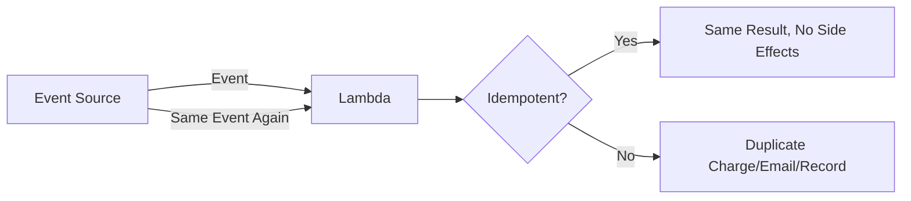
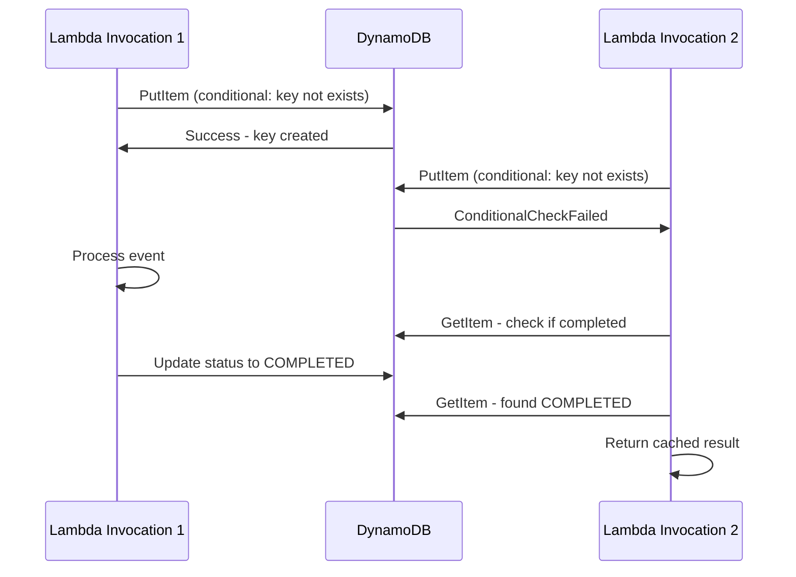

# How to Implement Idempotent Lambda Functions

Author: [nawazdhandala](https://github.com/nawazdhandala)

Tags: AWS, Lambda, Idempotency, Serverless, Best Practices, DynamoDB

Description: Learn how to make your AWS Lambda functions idempotent to handle retries and duplicate invocations safely

---

Lambda functions can be invoked more than once for the same event. SQS might deliver a message twice. Step Functions might retry a failed state. EventBridge might fire the same event again. API Gateway might resend a request due to a timeout. If your function charges a credit card, sends an email, or inserts a database record, running it twice for the same event is a real problem.

Idempotency means that running an operation multiple times produces the same result as running it once. Making your Lambda functions idempotent is not optional - it is a requirement for any production serverless application.

## Why Lambda Gets Invoked Multiple Times

Different event sources have different delivery guarantees:

| Event Source | Delivery Guarantee | Can Duplicate? |
|---|---|---|
| API Gateway | At-most-once | Rare, but timeout retries |
| SQS | At-least-once | Yes |
| SNS | At-least-once | Yes |
| Kinesis | At-least-once | Yes |
| DynamoDB Streams | At-least-once | Yes |
| EventBridge | At-least-once | Yes |
| S3 Events | At-least-once | Yes |
| Step Functions | Retry on failure | Yes, by design |



## The Idempotency Pattern

The pattern is straightforward:

1. Extract a unique identifier from the event (idempotency key)
2. Check if this key has been processed before
3. If yes, return the cached result
4. If no, process the event, store the result with the key, and return it

### Using DynamoDB as the Idempotency Store

DynamoDB is the most common choice for storing idempotency records because it supports conditional writes and TTL.

```python
# Idempotency decorator using DynamoDB for Lambda functions
import boto3
import json
import hashlib
import time
from functools import wraps

dynamodb = boto3.resource('dynamodb')
idempotency_table = dynamodb.Table('idempotency-store')

def idempotent(key_func):
    """Decorator that makes a Lambda handler idempotent.
    key_func extracts the idempotency key from the event."""

    def decorator(handler):
        @wraps(handler)
        def wrapper(event, context):
            # Step 1: Generate the idempotency key
            idempotency_key = key_func(event)

            # Step 2: Check if already processed
            try:
                response = idempotency_table.get_item(
                    Key={'idempotencyKey': idempotency_key}
                )
                if 'Item' in response:
                    item = response['Item']
                    if item['status'] == 'COMPLETED':
                        # Already processed, return cached result
                        return json.loads(item['result'])
                    elif item['status'] == 'IN_PROGRESS':
                        # Another execution is handling this
                        raise Exception('Concurrent execution detected')
            except dynamodb.meta.client.exceptions.ResourceNotFoundException:
                pass

            # Step 3: Mark as in-progress with conditional write
            try:
                idempotency_table.put_item(
                    Item={
                        'idempotencyKey': idempotency_key,
                        'status': 'IN_PROGRESS',
                        'ttl': int(time.time()) + 86400,  # 24-hour TTL
                        'startedAt': int(time.time())
                    },
                    ConditionExpression='attribute_not_exists(idempotencyKey)'
                )
            except dynamodb.meta.client.exceptions.ConditionalCheckFailedException:
                # Key already exists, another execution got here first
                response = idempotency_table.get_item(
                    Key={'idempotencyKey': idempotency_key}
                )
                if 'Item' in response and response['Item']['status'] == 'COMPLETED':
                    return json.loads(response['Item']['result'])
                raise Exception('Concurrent execution detected')

            # Step 4: Execute the handler
            try:
                result = handler(event, context)

                # Step 5: Store the result
                idempotency_table.update_item(
                    Key={'idempotencyKey': idempotency_key},
                    UpdateExpression='SET #s = :status, #r = :result',
                    ExpressionAttributeNames={'#s': 'status', '#r': 'result'},
                    ExpressionAttributeValues={
                        ':status': 'COMPLETED',
                        ':result': json.dumps(result)
                    }
                )
                return result

            except Exception as e:
                # Clean up the in-progress record so retries can proceed
                idempotency_table.delete_item(
                    Key={'idempotencyKey': idempotency_key}
                )
                raise

        return wrapper
    return decorator
```

### Using the Decorator

```python
# Payment processing Lambda with idempotency protection
@idempotent(key_func=lambda event: event['Records'][0]['messageId'])
def handler(event, context):
    record = json.loads(event['Records'][0]['body'])

    # This is safe to retry - will only execute once per messageId
    charge_result = charge_credit_card(
        customer_id=record['customerId'],
        amount=record['amount'],
        currency=record['currency']
    )

    send_receipt_email(
        email=record['email'],
        amount=record['amount'],
        transaction_id=charge_result['transactionId']
    )

    return {
        'transactionId': charge_result['transactionId'],
        'status': 'completed'
    }
```

## DynamoDB Table Setup

Create the idempotency table with TTL enabled:

```bash
# Create the idempotency store table with TTL
aws dynamodb create-table \
  --table-name idempotency-store \
  --attribute-definitions AttributeName=idempotencyKey,AttributeType=S \
  --key-schema AttributeName=idempotencyKey,KeyType=HASH \
  --billing-mode PAY_PER_REQUEST

# Enable TTL to auto-clean old records
aws dynamodb update-time-to-live \
  --table-name idempotency-store \
  --time-to-live-specification 'Enabled=true,AttributeName=ttl'
```

TTL is important. Without it, your idempotency table grows forever. A 24-hour TTL works for most use cases. Adjust based on how long you need duplicate protection.

## Using AWS Lambda Powertools

If you do not want to build the idempotency layer from scratch, AWS Lambda Powertools provides a battle-tested implementation:

```python
# Idempotency with AWS Lambda Powertools - much simpler
from aws_lambda_powertools.utilities.idempotency import (
    DynamoDBPersistenceLayer, idempotent
)
from aws_lambda_powertools.utilities.idempotency import IdempotencyConfig

persistence_layer = DynamoDBPersistenceLayer(table_name='idempotency-store')
config = IdempotencyConfig(
    event_key_jmespath='Records[0].messageId',
    expires_after_seconds=3600
)

@idempotent(config=config, persistence_store=persistence_layer)
def handler(event, context):
    record = json.loads(event['Records'][0]['body'])
    result = process_payment(record)
    return result
```

Powertools handles all the edge cases: concurrent executions, in-progress tracking, TTL, error handling, and more. It is the recommended approach for production use.

## Choosing the Right Idempotency Key

The key must uniquely identify the event. Different sources need different key strategies:

**SQS**: Use `messageId` - SQS guarantees unique message IDs.

```python
key_func = lambda event: event['Records'][0]['messageId']
```

**API Gateway**: Use a client-provided idempotency header.

```python
key_func = lambda event: event['headers'].get('Idempotency-Key', '')
```

**EventBridge**: Use a combination of detail-type and a unique field from the detail.

```python
key_func = lambda event: f"{event['detail-type']}:{event['detail']['orderId']}"
```

**S3 Events**: Use the object key and version ID.

```python
key_func = lambda event: f"{event['Records'][0]['s3']['object']['key']}:{event['Records'][0]['s3']['object']['sequencer']}"
```

**DynamoDB Streams**: Use the event ID.

```python
key_func = lambda event: event['Records'][0]['eventID']
```

## Handling Concurrent Executions

The trickiest scenario is when two Lambda invocations for the same event run simultaneously. The conditional write in DynamoDB handles this:



The `ConditionExpression='attribute_not_exists(idempotencyKey)'` ensures only one execution wins the race.

## Idempotency for Batch Processing

When processing SQS batches, each message needs its own idempotency check:

```python
# Process SQS batch with per-message idempotency
def handler(event, context):
    failed_ids = []

    for record in event['Records']:
        message_id = record['messageId']

        try:
            if is_already_processed(message_id):
                continue

            mark_in_progress(message_id)
            body = json.loads(record['body'])
            result = process_message(body)
            mark_completed(message_id, result)

        except Exception as e:
            failed_ids.append(record['messageId'])
            cleanup_in_progress(message_id)

    # Return failed items for SQS to retry
    return {
        'batchItemFailures': [
            {'itemIdentifier': msg_id} for msg_id in failed_ids
        ]
    }
```

Use SQS partial batch failure reporting so only failed messages get retried, not the entire batch.

## Testing Idempotency

Always test that your idempotency works:

```python
# Test that invoking the handler twice produces the same result
def test_idempotency():
    event = {
        'Records': [{
            'messageId': 'test-message-123',
            'body': json.dumps({'customerId': 'cust-1', 'amount': 50.00})
        }]
    }

    # First invocation
    result1 = handler(event, None)

    # Second invocation with same event
    result2 = handler(event, None)

    # Results should be identical
    assert result1 == result2

    # Side effects should have happened only once
    assert get_charge_count('cust-1') == 1
```

## Wrapping Up

Idempotency is a fundamental requirement for Lambda functions. Every event source can deliver duplicates, and your functions need to handle that gracefully. Use DynamoDB with conditional writes for the idempotency store, choose appropriate keys for each event source, and consider AWS Lambda Powertools to avoid reinventing the wheel.

For a related pattern that protects against cascading failures, see our guide on [implementing the circuit breaker pattern with Lambda and DynamoDB](https://oneuptime.com/blog/post/implement-circuit-breaker-pattern-with-lambda-and-dynamodb/view).
