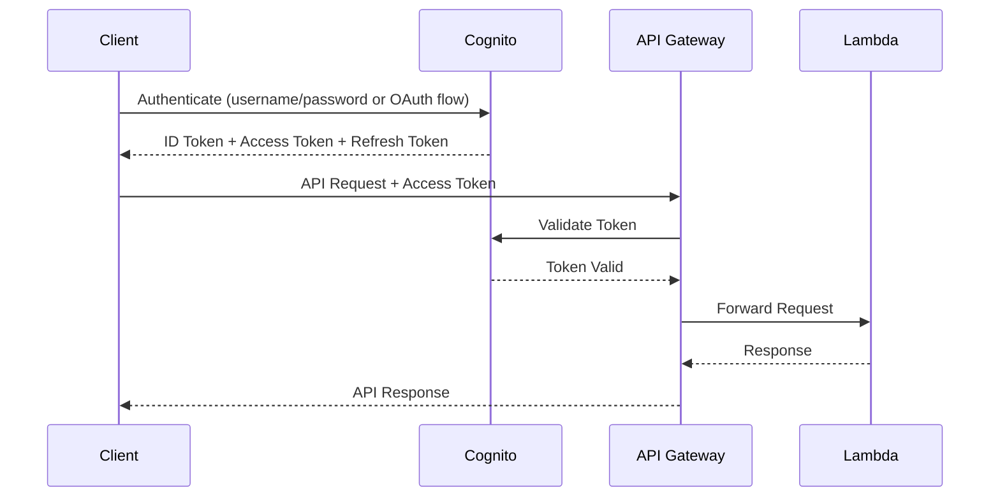

# How to Implement OAuth 2.0 with API Gateway and Cognito

Author: [nawazdhandala](https://github.com/nawazdhandala)

Tags: AWS, API Gateway, Cognito, Security, OAuth

Description: Complete guide to implementing OAuth 2.0 authentication for your APIs using AWS API Gateway and Amazon Cognito user pools.

---

Securing your API with OAuth 2.0 doesn't have to mean running your own authorization server. Amazon Cognito handles the heavy lifting - token issuance, refresh flows, user management - and API Gateway validates tokens automatically. Together they give you a production-grade OAuth 2.0 setup without managing any auth infrastructure.

## The Architecture

Here's how the pieces fit together. Cognito acts as the OAuth 2.0 authorization server. Clients authenticate with Cognito to get tokens, then pass those tokens to API Gateway. API Gateway validates the token against Cognito and forwards the request to your Lambda backend if the token checks out.



## Step 1: Create a Cognito User Pool

The user pool is your user directory. It stores user accounts and handles authentication.

Create a user pool with email-based sign-up:

```bash
# Create the user pool
aws cognito-idp create-user-pool \
  --pool-name "my-api-users" \
  --auto-verified-attributes email \
  --username-attributes email \
  --policies '{
    "PasswordPolicy": {
      "MinimumLength": 8,
      "RequireUppercase": true,
      "RequireLowercase": true,
      "RequireNumbers": true,
      "RequireSymbols": false
    }
  }' \
  --schema '[
    {
      "Name": "email",
      "Required": true,
      "Mutable": true,
      "AttributeDataType": "String"
    }
  ]'
```

Note the User Pool ID from the output - you'll need it throughout.

## Step 2: Create an App Client

The app client represents your application. Each client gets an ID and optionally a secret.

Create an app client with OAuth 2.0 settings:

```bash
# Create an app client
aws cognito-idp create-user-pool-client \
  --user-pool-id us-east-1_ABC123 \
  --client-name "my-api-client" \
  --generate-secret \
  --allowed-o-auth-flows "code" "implicit" \
  --allowed-o-auth-scopes "openid" "email" "profile" \
  --allowed-o-auth-flows-user-pool-client \
  --callback-urls "https://myapp.com/callback" \
  --logout-urls "https://myapp.com/logout" \
  --supported-identity-providers "COGNITO" \
  --explicit-auth-flows \
    "ALLOW_USER_PASSWORD_AUTH" \
    "ALLOW_REFRESH_TOKEN_AUTH" \
    "ALLOW_USER_SRP_AUTH"
```

## Step 3: Set Up a Domain for Cognito

Cognito needs a domain to host the OAuth 2.0 endpoints (authorize, token, etc).

Configure a Cognito domain:

```bash
# Use a Cognito-provided domain
aws cognito-idp create-user-pool-domain \
  --user-pool-id us-east-1_ABC123 \
  --domain "my-api-auth"

# This gives you: https://my-api-auth.auth.us-east-1.amazoncognito.com
```

For a custom domain:

```bash
# Use your own domain (requires ACM certificate)
aws cognito-idp create-user-pool-domain \
  --user-pool-id us-east-1_ABC123 \
  --domain "auth.yourcompany.com" \
  --custom-domain-config CertificateArn=arn:aws:acm:us-east-1:123456789012:certificate/abc-123
```

## Step 4: Define Custom Scopes (Optional)

Custom scopes let you control fine-grained access to different API resources.

Create a resource server with custom scopes:

```bash
# Create a resource server with custom scopes
aws cognito-idp create-resource-server \
  --user-pool-id us-east-1_ABC123 \
  --identifier "https://api.yourcompany.com" \
  --name "My API" \
  --scopes '[
    {"ScopeName": "read", "ScopeDescription": "Read access"},
    {"ScopeName": "write", "ScopeDescription": "Write access"},
    {"ScopeName": "admin", "ScopeDescription": "Admin access"}
  ]'

# Update the app client to use these scopes
aws cognito-idp update-user-pool-client \
  --user-pool-id us-east-1_ABC123 \
  --client-id abc123clientid \
  --allowed-o-auth-scopes \
    "openid" \
    "https://api.yourcompany.com/read" \
    "https://api.yourcompany.com/write"
```

## Step 5: Create the Cognito Authorizer in API Gateway

Now connect API Gateway to your Cognito user pool.

For REST API, create a Cognito authorizer:

```bash
# Create a Cognito authorizer on your REST API
aws apigateway create-authorizer \
  --rest-api-id abc123api \
  --name "CognitoAuth" \
  --type COGNITO_USER_POOLS \
  --provider-arns "arn:aws:cognito-idp:us-east-1:123456789012:userpool/us-east-1_ABC123" \
  --identity-source "method.request.header.Authorization"
```

For HTTP API, use a JWT authorizer:

```bash
# Create a JWT authorizer on your HTTP API
aws apigatewayv2 create-authorizer \
  --api-id abc123api \
  --name "CognitoJWT" \
  --authorizer-type JWT \
  --identity-source '$request.header.Authorization' \
  --jwt-configuration '{
    "Audience": ["your-app-client-id"],
    "Issuer": "https://cognito-idp.us-east-1.amazonaws.com/us-east-1_ABC123"
  }'
```

## Step 6: Attach the Authorizer to Routes

Apply the authorizer to the API methods that need protection.

For REST API:

```bash
# Attach authorizer to a specific method
aws apigateway update-method \
  --rest-api-id abc123api \
  --resource-id resource123 \
  --http-method GET \
  --patch-operations \
    op=replace,path=/authorizationType,value=COGNITO_USER_POOLS \
    op=replace,path=/authorizerId,value=auth123

# Don't forget to deploy the API after changes
aws apigateway create-deployment \
  --rest-api-id abc123api \
  --stage-name prod
```

For HTTP API with scope-based authorization:

```bash
# Attach authorizer with required scopes
aws apigatewayv2 update-route \
  --api-id abc123api \
  --route-id route123 \
  --authorization-type JWT \
  --authorizer-id auth123 \
  --authorization-scopes "https://api.yourcompany.com/read"
```

## Complete CloudFormation Template

Here's everything wired together in CloudFormation:

```yaml
Resources:
  UserPool:
    Type: AWS::Cognito::UserPool
    Properties:
      UserPoolName: my-api-users
      AutoVerifiedAttributes:
        - email
      UsernameAttributes:
        - email

  UserPoolClient:
    Type: AWS::Cognito::UserPoolClient
    Properties:
      UserPoolId: !Ref UserPool
      ClientName: my-api-client
      GenerateSecret: false
      AllowedOAuthFlows:
        - code
        - implicit
      AllowedOAuthScopes:
        - openid
        - email
        - profile
      AllowedOAuthFlowsUserPoolClient: true
      CallbackURLs:
        - https://myapp.com/callback
      SupportedIdentityProviders:
        - COGNITO

  UserPoolDomain:
    Type: AWS::Cognito::UserPoolDomain
    Properties:
      UserPoolId: !Ref UserPool
      Domain: my-api-auth

  ApiGateway:
    Type: AWS::ApiGateway::RestApi
    Properties:
      Name: my-secured-api

  CognitoAuthorizer:
    Type: AWS::ApiGateway::Authorizer
    Properties:
      Name: CognitoAuth
      Type: COGNITO_USER_POOLS
      RestApiId: !Ref ApiGateway
      IdentitySource: method.request.header.Authorization
      ProviderARNs:
        - !GetAtt UserPool.Arn

  ApiMethod:
    Type: AWS::ApiGateway::Method
    Properties:
      RestApiId: !Ref ApiGateway
      ResourceId: !GetAtt ApiGateway.RootResourceId
      HttpMethod: GET
      AuthorizationType: COGNITO_USER_POOLS
      AuthorizerId: !Ref CognitoAuthorizer
      Integration:
        Type: AWS_PROXY
        IntegrationHttpMethod: POST
        Uri: !Sub "arn:aws:apigateway:${AWS::Region}:lambda:path/2015-03-31/functions/${MyFunction.Arn}/invocations"
```

## Client-Side Authentication Flow

Here's how a client application authenticates and calls your API.

This Python example shows the full flow from login to API call:

```python
import boto3
import requests

cognito = boto3.client("cognito-idp", region_name="us-east-1")

# Step 1: Authenticate the user
auth_response = cognito.initiate_auth(
    ClientId="your-app-client-id",
    AuthFlow="USER_PASSWORD_AUTH",
    AuthParameters={
        "USERNAME": "user@example.com",
        "PASSWORD": "SecurePassword123",
    },
)

# Extract the tokens
id_token = auth_response["AuthenticationResult"]["IdToken"]
access_token = auth_response["AuthenticationResult"]["AccessToken"]
refresh_token = auth_response["AuthenticationResult"]["RefreshToken"]

# Step 2: Call the API with the token
api_url = "https://api.yourcompany.com/resources"
headers = {
    "Authorization": f"Bearer {access_token}",
    "Content-Type": "application/json",
}

response = requests.get(api_url, headers=headers)
print(f"Status: {response.status_code}")
print(f"Body: {response.json()}")
```

## Accessing User Info in Lambda

When API Gateway validates the token, it passes the user's claims to your Lambda function in the request context.

Extract user information from the Cognito token claims:

```python
import json


def lambda_handler(event, context):
    # For REST API with Cognito authorizer
    claims = event["requestContext"]["authorizer"]["claims"]

    user_email = claims.get("email")
    user_sub = claims.get("sub")  # Unique user ID
    groups = claims.get("cognito:groups", "")

    # Use the identity for authorization logic
    if "admin" not in groups:
        return {
            "statusCode": 403,
            "body": json.dumps({"error": "Admin access required"}),
        }

    return {
        "statusCode": 200,
        "body": json.dumps({
            "message": f"Hello, {user_email}",
            "user_id": user_sub,
        }),
    }
```

## Token Refresh Flow

Access tokens expire (default is 1 hour). Use the refresh token to get new access tokens without re-authenticating:

```python
def refresh_access_token(refresh_token, client_id):
    """Get a new access token using the refresh token."""
    cognito = boto3.client("cognito-idp")

    response = cognito.initiate_auth(
        ClientId=client_id,
        AuthFlow="REFRESH_TOKEN_AUTH",
        AuthParameters={
            "REFRESH_TOKEN": refresh_token,
        },
    )

    return {
        "access_token": response["AuthenticationResult"]["AccessToken"],
        "id_token": response["AuthenticationResult"]["IdToken"],
        # Note: refresh token is NOT returned - reuse the original
    }
```

For monitoring your OAuth 2.0 flows and catching authentication failures early, take a look at our post on [API monitoring strategies](https://oneuptime.com/blog/post/api-monitoring-best-practices/view).

## Wrapping Up

Cognito plus API Gateway gives you a fully managed OAuth 2.0 setup. Cognito handles user authentication and token management, while API Gateway validates tokens on every request. Custom scopes let you implement fine-grained access control, and the whole thing scales automatically. The biggest benefit is that you're not writing any token validation code yourself - API Gateway handles it before your Lambda function even gets invoked.
