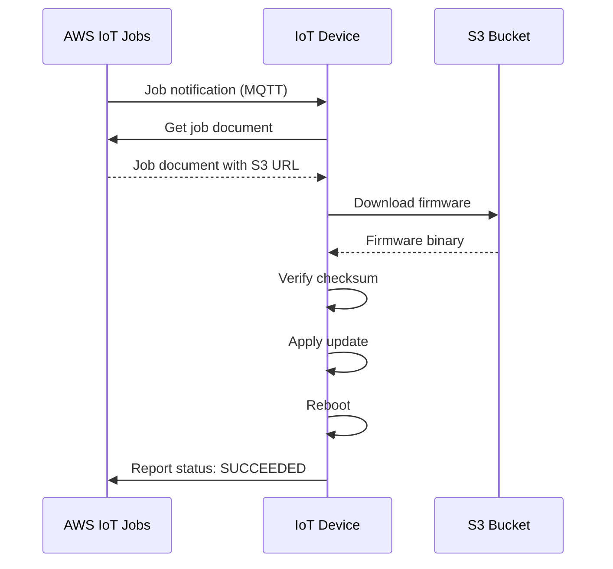

# How to Implement OTA Updates with IoT Core

Author: [nawazdhandala](https://github.com/nawazdhandala)

Tags: AWS, IoT, OTA Updates, IoT Core, Device Management, Firmware

Description: Learn how to implement over-the-air firmware updates for IoT devices using AWS IoT Core Jobs and best practices for safe fleet-wide rollouts.

---

Deploying firmware updates to IoT devices in the field is one of the most critical and nerve-wracking parts of IoT operations. A bad update can brick thousands of devices with no easy way to physically access them. A good OTA (over-the-air) update system needs to be reliable, resumable, verifiable, and capable of rolling back when things go wrong.

AWS IoT Core provides two main mechanisms for OTA updates: IoT Jobs for general-purpose remote operations, and the dedicated FreeRTOS OTA library for microcontroller-based devices. In this guide, we will focus on IoT Jobs since it works with any device platform.

## How IoT Jobs Work

IoT Jobs is a service within IoT Core that lets you define remote operations and target them at specific devices or groups. A "job" is essentially a document describing what the device should do, delivered to devices through MQTT.



The flow is:

1. You create a job targeting specific devices or thing groups
2. IoT Core notifies targeted devices via MQTT
3. Devices fetch the job document, which contains instructions (typically an S3 URL for the firmware)
4. Devices download the firmware, verify it, apply the update, and reboot
5. Devices report back their job execution status

## Step 1: Upload Firmware to S3

First, upload your firmware binary to S3 with proper versioning:

```bash
# Create a versioned S3 bucket for firmware
aws s3api create-bucket \
  --bucket my-iot-firmware \
  --region us-east-1

aws s3api put-bucket-versioning \
  --bucket my-iot-firmware \
  --versioning-configuration Status=Enabled

# Upload firmware with metadata
aws s3 cp firmware-v2.1.0.bin s3://my-iot-firmware/devices/sensor-hub/firmware-v2.1.0.bin \
  --metadata '{"version":"2.1.0","md5":"abc123def456"}'

# Generate a pre-signed URL for device download (valid for 24 hours)
aws s3 presign s3://my-iot-firmware/devices/sensor-hub/firmware-v2.1.0.bin \
  --expires-in 86400
```

## Step 2: Create the Job Document

The job document is a JSON file that tells devices what to do. It gets delivered to each targeted device through MQTT. You can include S3 pre-signed URLs using placeholder variables that IoT Jobs resolves at delivery time.

```json
// ota-job-document.json - instructions for the device-side update agent
{
  "operation": "firmwareUpdate",
  "version": "2.1.0",
  "previousVersion": "2.0.5",
  "firmwareUrl": "${aws:iot:s3-presigned-url:https://s3.amazonaws.com/my-iot-firmware/devices/sensor-hub/firmware-v2.1.0.bin}",
  "checksumAlgorithm": "SHA256",
  "checksum": "e3b0c44298fc1c149afbf4c8996fb92427ae41e4649b934ca495991b7852b855",
  "firmwareSize": 1048576,
  "releaseNotes": "Bug fixes for temperature sensor calibration and improved battery management",
  "rollbackVersion": "2.0.5",
  "rollbackUrl": "${aws:iot:s3-presigned-url:https://s3.amazonaws.com/my-iot-firmware/devices/sensor-hub/firmware-v2.0.5.bin}"
}
```

Upload this document to S3 as well:

```bash
# Upload the job document
aws s3 cp ota-job-document.json s3://my-iot-firmware/jobs/ota-job-document.json
```

The `${aws:iot:s3-presigned-url:...}` placeholder is important. IoT Jobs generates a fresh pre-signed URL for each device when they retrieve the job document, so each device gets a unique download URL that works for the configured duration.

## Step 3: Create the IoT Job

Now create the job, targeting either specific things or thing groups:

```bash
# Create a job targeting a thing group with rollout configuration
aws iot create-job \
  --job-id "firmware-update-v2.1.0-$(date +%Y%m%d%H%M%S)" \
  --targets "arn:aws:iot:us-east-1:123456789012:thinggroup/SensorHubs" \
  --document-source "https://s3.amazonaws.com/my-iot-firmware/jobs/ota-job-document.json" \
  --description "Firmware update to v2.1.0 - temperature calibration fixes" \
  --target-selection "SNAPSHOT" \
  --job-executions-rollout-config '{
    "maximumPerMinute": 10,
    "exponentialRate": {
      "baseRatePerMinute": 5,
      "incrementFactor": 2.0,
      "rateIncreaseCriteria": {
        "numberOfSucceededThings": 50
      }
    }
  }' \
  --abort-config '{
    "criteriaList": [
      {
        "failureType": "FAILED",
        "action": "CANCEL",
        "thresholdPercentage": 10,
        "minNumberOfExecutedThings": 20
      },
      {
        "failureType": "TIMED_OUT",
        "action": "CANCEL",
        "thresholdPercentage": 15,
        "minNumberOfExecutedThings": 20
      }
    ]
  }' \
  --timeout-config '{
    "inProgressTimeoutInMinutes": 30
  }'
```

There are several important configurations here:

**Rollout config** starts by updating 5 devices per minute, then doubles the rate each time 50 devices succeed. This gradual ramp-up catches problems early before they affect the whole fleet.

**Abort config** automatically cancels the job if more than 10% of executions fail or 15% time out (after at least 20 devices have been attempted). This is your safety net against bad firmware.

**Timeout config** sets a 30-minute window for each device to complete the update. Devices that do not finish in time are marked as timed out.

## Step 4: Device-Side Implementation

On the device side, you need an update agent that listens for job notifications, downloads the firmware, verifies it, and applies it. Here is a Python example for a Linux-based gateway device:

```python
# ota_agent.py - device-side OTA update agent
import json
import hashlib
import requests
import subprocess
from AWSIoTPythonSDK.MQTTLib import AWSIoTMQTTClient

THING_NAME = "sensor-hub-001"

def on_job_notify(client, userdata, message):
    """Called when a new job notification arrives."""
    payload = json.loads(message.payload)
    jobs = payload.get('jobs', {}).get('QUEUED', [])

    for job in jobs:
        job_id = job['jobId']
        print(f"New job available: {job_id}")
        # Request the full job document
        client.publish(
            f"$aws/things/{THING_NAME}/jobs/{job_id}/get",
            json.dumps({}),
            1
        )

def on_job_document(client, userdata, message):
    """Called when the full job document is received."""
    payload = json.loads(message.payload)
    doc = payload['execution']['jobDocument']

    if doc.get('operation') == 'firmwareUpdate':
        execute_firmware_update(client, payload['execution']['jobId'], doc)

def execute_firmware_update(client, job_id, doc):
    """Download, verify, and apply firmware update."""
    # Report IN_PROGRESS status
    update_job_status(client, job_id, "IN_PROGRESS",
                      {"step": "downloading"})

    try:
        # Download firmware
        firmware_url = doc['firmwareUrl']
        response = requests.get(firmware_url, stream=True)
        firmware_path = "/tmp/firmware_update.bin"

        with open(firmware_path, 'wb') as f:
            for chunk in response.iter_content(chunk_size=8192):
                f.write(chunk)

        # Verify checksum
        update_job_status(client, job_id, "IN_PROGRESS",
                          {"step": "verifying"})

        sha256 = hashlib.sha256()
        with open(firmware_path, 'rb') as f:
            for chunk in iter(lambda: f.read(4096), b''):
                sha256.update(chunk)

        if sha256.hexdigest() != doc['checksum']:
            update_job_status(client, job_id, "FAILED",
                              {"reason": "Checksum mismatch"})
            return

        # Apply update
        update_job_status(client, job_id, "IN_PROGRESS",
                          {"step": "applying"})

        # Platform-specific update logic here
        subprocess.run(["apply_firmware", firmware_path], check=True)

        update_job_status(client, job_id, "SUCCEEDED",
                          {"version": doc['version']})

    except Exception as e:
        update_job_status(client, job_id, "FAILED",
                          {"reason": str(e)})

def update_job_status(client, job_id, status, details):
    """Report job execution status back to IoT Core."""
    client.publish(
        f"$aws/things/{THING_NAME}/jobs/{job_id}/update",
        json.dumps({
            "status": status,
            "statusDetails": details
        }),
        1
    )
```

## Step 5: Monitoring the Rollout

Track the progress of your firmware update job:

```bash
# Check overall job progress
aws iot describe-job --job-id "firmware-update-v2.1.0-20260212120000"

# List executions by status
aws iot list-job-executions-for-job \
  --job-id "firmware-update-v2.1.0-20260212120000" \
  --status "FAILED"

# Get details for a specific device execution
aws iot describe-job-execution \
  --job-id "firmware-update-v2.1.0-20260212120000" \
  --thing-name "sensor-hub-001"
```

Set up CloudWatch alarms to watch for job failures. For comprehensive device monitoring, see our guide on [monitoring IoT devices with CloudWatch](https://oneuptime.com/blog/post/2026-02-12-monitor-iot-devices-with-cloudwatch/view).

## Best Practices for Safe OTA Updates

**Always start with a canary deployment.** Target a small group of test devices first, let the update bake for a few hours, then roll out to the broader fleet.

**Include rollback capability.** Your job document should include the rollback firmware URL. Devices should be able to detect a failed update on boot and automatically revert.

**Use code signing.** AWS IoT supports code signing for firmware images. This prevents unauthorized firmware from being installed on your devices.

**Keep the previous firmware version.** Never overwrite the running firmware during an update. Write the new firmware to a separate partition and switch only after verification.

**Set reasonable timeouts.** Consider your devices' connectivity patterns. If devices only connect once an hour, a 30-minute timeout will miss most of them. Set timeouts based on actual device behavior.

**Test the unhappy path.** Simulate network failures during download, corrupt firmware files, and devices that reboot mid-update. Your update agent needs to handle all of these gracefully.

## Wrapping Up

OTA updates are a critical capability for any IoT deployment. AWS IoT Jobs provides the server-side infrastructure - targeting, rollout control, abort conditions, and status tracking. The device-side agent is where you need to invest the most engineering effort, particularly around reliability, verification, and rollback. Get the safety mechanisms right first, then optimize for speed and efficiency.
