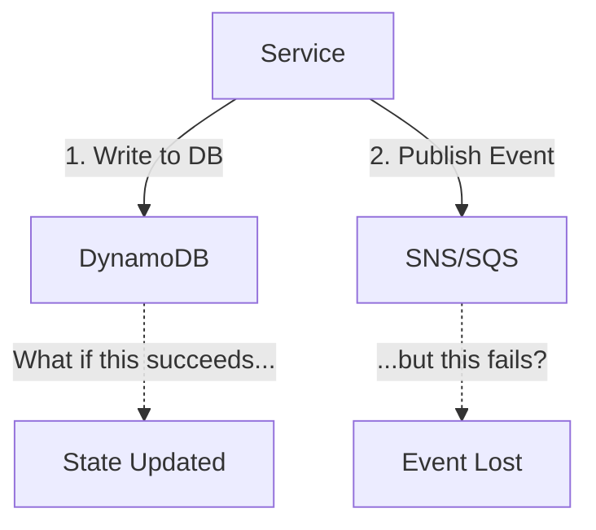
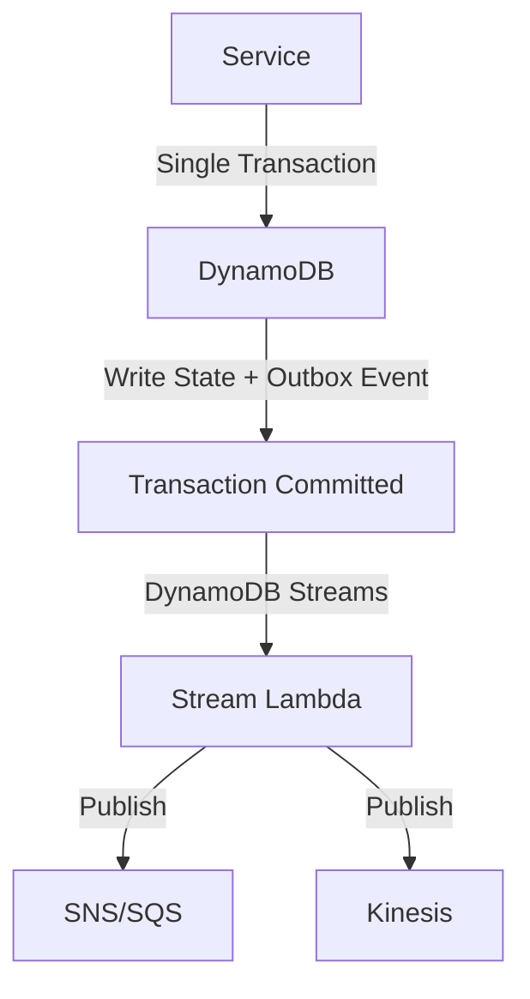

# How to Implement Outbox Pattern with DynamoDB Streams

Author: [nawazdhandala](https://github.com/nawazdhandala)

Tags: AWS, DynamoDB, Outbox Pattern, Event-Driven, Microservices, Streams

Description: Implement the transactional outbox pattern using DynamoDB Streams to reliably publish domain events from your microservices

---

In microservices architectures, you often need to update a database and publish an event at the same time. An order service updates the order status in DynamoDB and publishes an "OrderShipped" event to SNS. But what happens if the database write succeeds and the SNS publish fails? Or worse, the SNS publish succeeds but the database write fails? You end up with inconsistent state.

The outbox pattern solves this. Instead of publishing the event directly, you write the event to an "outbox" table (or an outbox attribute) in the same database transaction as your state change. A separate process reads the outbox and publishes the events. Since the state change and the event record are written atomically, you never have one without the other.

On AWS, DynamoDB Streams makes this pattern elegant. Write your event to DynamoDB alongside your state change using a transaction, and DynamoDB Streams automatically picks up the new record and triggers a Lambda function that publishes it.

## The Problem: Dual Write

Here is the problematic pattern that the outbox solves.



If step 2 fails after step 1 succeeds, downstream services never learn about the change. Retrying helps, but you still have a window of inconsistency, and crashes between step 1 and step 2 lose the event entirely.

## The Solution: Outbox Pattern



Both the state change and the event record are written in one atomic DynamoDB transaction. DynamoDB Streams reliably delivers the new records to a Lambda function, which handles the actual publishing. If the Lambda fails, DynamoDB Streams retries automatically.

## Step 1: Design the Outbox Table

You can use a separate outbox table or embed outbox events alongside your domain data. I prefer a separate table for clarity.

```bash
# Create the outbox table with DynamoDB Streams enabled
aws dynamodb create-table \
  --table-name Outbox \
  --attribute-definitions \
    AttributeName=pk,AttributeType=S \
    AttributeName=sk,AttributeType=S \
  --key-schema \
    AttributeName=pk,KeyType=HASH \
    AttributeName=sk,KeyType=RANGE \
  --billing-mode PAY_PER_REQUEST \
  --stream-specification StreamEnabled=true,StreamViewType=NEW_IMAGE \
  --tags Key=Purpose,Value=OutboxPattern
```

You also need a TTL on outbox records to clean them up after they have been processed.

```bash
# Enable TTL to auto-delete processed outbox events
aws dynamodb update-time-to-live \
  --table-name Outbox \
  --time-to-live-specification Enabled=true,AttributeName=ttl
```

## Step 2: Write State and Outbox Events Atomically

Use DynamoDB transactions to write the domain state change and the outbox event together.

```python
# order_service.py - Write state change and outbox event atomically
import boto3
import json
import uuid
import time
from datetime import datetime

dynamodb = boto3.client('dynamodb')

def ship_order(order_id, tracking_number):
    """
    Update order status to shipped AND write an outbox event
    in a single atomic transaction.
    """

    event_id = str(uuid.uuid4())
    timestamp = datetime.utcnow().isoformat()
    ttl = int(time.time()) + 86400  # Clean up after 24 hours

    # Build the outbox event
    outbox_event = {
        'eventType': 'OrderShipped',
        'entityId': order_id,
        'entityType': 'Order',
        'timestamp': timestamp,
        'data': {
            'orderId': order_id,
            'trackingNumber': tracking_number,
            'shippedAt': timestamp,
        }
    }

    # Execute both writes in a single transaction
    dynamodb.transact_write_items(
        TransactItems=[
            {
                # Update the order status
                'Update': {
                    'TableName': 'Orders',
                    'Key': {
                        'orderId': {'S': order_id}
                    },
                    'UpdateExpression': 'SET #status = :status, trackingNumber = :tn, updatedAt = :ts',
                    'ExpressionAttributeNames': {
                        '#status': 'status'
                    },
                    'ExpressionAttributeValues': {
                        ':status': {'S': 'shipped'},
                        ':tn': {'S': tracking_number},
                        ':ts': {'S': timestamp},
                    },
                    # Optimistic lock: only update if currently in 'processing' status
                    'ConditionExpression': '#status = :expected',
                    'ExpressionAttributeValues': {
                        ':status': {'S': 'shipped'},
                        ':tn': {'S': tracking_number},
                        ':ts': {'S': timestamp},
                        ':expected': {'S': 'processing'},
                    }
                }
            },
            {
                # Write the outbox event
                'Put': {
                    'TableName': 'Outbox',
                    'Item': {
                        'pk': {'S': f'ORDER#{order_id}'},
                        'sk': {'S': f'EVENT#{event_id}'},
                        'eventType': {'S': outbox_event['eventType']},
                        'entityId': {'S': order_id},
                        'entityType': {'S': 'Order'},
                        'eventData': {'S': json.dumps(outbox_event['data'])},
                        'timestamp': {'S': timestamp},
                        'ttl': {'N': str(ttl)},
                        'published': {'BOOL': False},
                    }
                }
            }
        ]
    )

    print(f"Order {order_id} shipped and outbox event created")
    return event_id
```

The transaction either both succeeds or both fails. There is no state where the order is shipped but the event is missing, or vice versa.

## Step 3: Process Outbox Events with DynamoDB Streams

The Lambda function connected to the DynamoDB Stream reads new outbox events and publishes them.

```python
# outbox_publisher.py - Publish outbox events from DynamoDB Streams
import boto3
import json

sns = boto3.client('sns')
TOPIC_ARN = 'arn:aws:sns:us-east-1:123456789012:domain-events'

def lambda_handler(event, context):
    """Process outbox events from DynamoDB Streams and publish them."""

    failed_items = []

    for record in event['Records']:
        # Only process new inserts to the outbox table
        if record['eventName'] != 'INSERT':
            continue

        try:
            new_image = record['dynamodb']['NewImage']

            event_type = new_image['eventType']['S']
            entity_id = new_image['entityId']['S']
            entity_type = new_image['entityType']['S']
            event_data = new_image['eventData']['S']
            timestamp = new_image['timestamp']['S']

            # Construct the domain event message
            domain_event = {
                'eventType': event_type,
                'entityId': entity_id,
                'entityType': entity_type,
                'timestamp': timestamp,
                'data': json.loads(event_data),
            }

            # Publish to SNS
            sns.publish(
                TopicArn=TOPIC_ARN,
                Message=json.dumps(domain_event),
                MessageAttributes={
                    'eventType': {
                        'DataType': 'String',
                        'StringValue': event_type,
                    },
                    'entityType': {
                        'DataType': 'String',
                        'StringValue': entity_type,
                    }
                }
            )

            print(f"Published {event_type} for {entity_type}:{entity_id}")

        except Exception as e:
            print(f"Error publishing event: {str(e)}")
            failed_items.append({
                'itemIdentifier': record['eventID']
            })

    if failed_items:
        return {'batchItemFailures': failed_items}

    return {'batchItemFailures': []}
```

## Step 4: Create the Event Source Mapping

Connect the Lambda function to the DynamoDB Stream.

```bash
# Create the event source mapping
aws lambda create-event-source-mapping \
  --function-name outbox-publisher \
  --event-source-arn arn:aws:dynamodb:us-east-1:123456789012:table/Outbox/stream/2024-01-01T00:00:00.000 \
  --starting-position LATEST \
  --batch-size 50 \
  --maximum-batching-window-in-seconds 5 \
  --maximum-retry-attempts 10 \
  --bisect-batch-on-function-error \
  --function-response-types "ReportBatchItemFailures" \
  --destination-config '{"OnFailure":{"Destination":"arn:aws:sqs:us-east-1:123456789012:outbox-dlq"}}'
```

Important settings:

- **maximum-retry-attempts**: Set higher than usual because losing an outbox event defeats the purpose of the pattern.
- **bisect-batch-on-function-error**: Helps isolate problematic records.
- **DLQ destination**: Events that fail all retries go to a dead-letter queue for manual investigation.

## Handling Idempotency

DynamoDB Streams guarantees at-least-once delivery, meaning your publisher Lambda may see the same event more than once. Downstream consumers must be idempotent.

Include a unique event ID in every published message so consumers can deduplicate.

```python
# Consumer-side deduplication
import boto3

dynamodb = boto3.resource('dynamodb')
processed_table = dynamodb.Table('ProcessedEvents')

def process_event(event):
    """Process an event only if we have not seen it before."""
    event_id = event['eventId']

    try:
        # Attempt to record this event as processed
        processed_table.put_item(
            Item={
                'eventId': event_id,
                'processedAt': datetime.utcnow().isoformat(),
                'ttl': int(time.time()) + 604800,  # Clean up after 7 days
            },
            ConditionExpression='attribute_not_exists(eventId)'
        )

        # If we get here, this is the first time processing this event
        handle_event(event)

    except dynamodb.meta.client.exceptions.ConditionalCheckFailedException:
        print(f"Event {event_id} already processed, skipping")
```

## Alternative: Single Table Outbox

Instead of a separate outbox table, you can write outbox events into the same table as your domain data using a different sort key prefix.

```python
# Single table approach - outbox events alongside domain data
dynamodb.transact_write_items(
    TransactItems=[
        {
            'Update': {
                'TableName': 'Orders',
                'Key': {'pk': {'S': f'ORDER#{order_id}'}, 'sk': {'S': 'METADATA'}},
                'UpdateExpression': 'SET #status = :status',
                'ExpressionAttributeNames': {'#status': 'status'},
                'ExpressionAttributeValues': {':status': {'S': 'shipped'}}
            }
        },
        {
            'Put': {
                'TableName': 'Orders',
                'Item': {
                    'pk': {'S': f'ORDER#{order_id}'},
                    'sk': {'S': f'OUTBOX#{event_id}'},
                    'eventType': {'S': 'OrderShipped'},
                    'eventData': {'S': json.dumps(event_data)},
                    'ttl': {'N': str(ttl)},
                }
            }
        }
    ]
)
```

The tradeoff is that your DynamoDB Stream Lambda needs to filter for outbox records (identified by the `OUTBOX#` prefix) and ignore regular data changes. You can use [Lambda event source mapping filters](https://oneuptime.com/blog/post/configure-lambda-event-source-mapping-filters/view) to handle this filtering efficiently.

## Monitoring the Outbox

Monitor these to ensure your outbox is healthy:

- **DynamoDB Stream IteratorAge**: If this grows, your publisher is falling behind.
- **Lambda Errors on the publisher**: Failed publishes mean events are stuck.
- **DLQ depth**: Any messages in the DLQ need manual attention.
- **Outbox table item count**: If TTL cleanup is working, this should stay bounded.

## Wrapping Up

The outbox pattern with DynamoDB Streams is one of the most reliable ways to publish domain events from a microservice. The atomic transaction guarantees you never lose an event, DynamoDB Streams provides reliable delivery to the publisher, and the at-least-once semantics (combined with consumer-side idempotency) ensure every downstream system eventually gets the event. The operational overhead is minimal - DynamoDB Streams and Lambda handle the plumbing. Focus on getting your event schema right and making your consumers idempotent.
