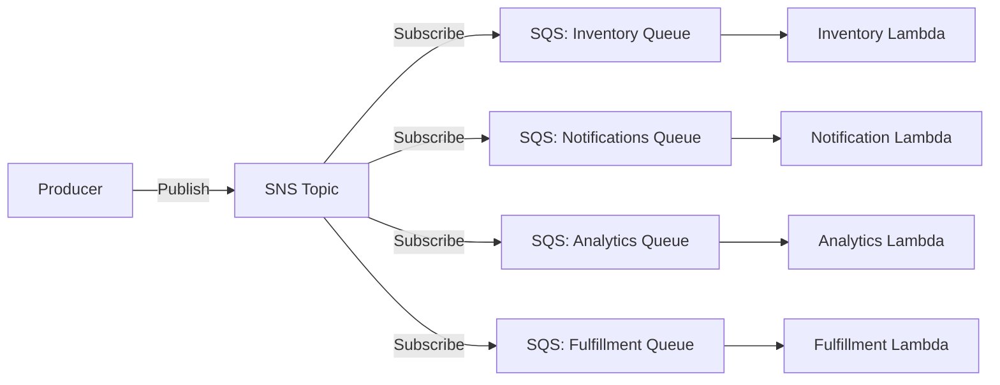

# How to Implement Parallel Fan-Out with SNS and SQS

Author: [nawazdhandala](https://github.com/nawazdhandala)

Tags: AWS, SNS, SQS, Fan-Out, Messaging, Serverless, Event-Driven

Description: Learn how to implement the fan-out pattern using Amazon SNS and SQS to process a single event in parallel across multiple independent consumers

---

The fan-out pattern is a fundamental building block of event-driven architectures. A single event needs to be processed by multiple independent systems. An order is placed, and simultaneously the inventory system updates stock, the notification system sends a confirmation email, the analytics system records the event, and the fulfillment system starts packing.

Amazon SNS and SQS together make fan-out straightforward on AWS. SNS acts as the broadcaster, pushing a copy of each message to multiple SQS queues. Each queue has its own consumer that processes the message independently. If one consumer fails or falls behind, it does not affect the others.

This guide walks through setting up a production-ready fan-out architecture with SNS and SQS.

## The Fan-Out Pattern



The producer publishes once. SNS delivers copies to all subscribers. Each SQS queue independently buffers messages for its consumer. This is decoupled, resilient, and scales naturally.

## Step 1: Create the SNS Topic

The SNS topic is the central broadcast point.

```bash
# Create the SNS topic
aws sns create-topic --name order-events

# Note the TopicArn from the output
# arn:aws:sns:us-east-1:123456789012:order-events
```

## Step 2: Create the SQS Queues

Create a queue for each consumer. Each queue should also have a dead-letter queue (DLQ) for messages that fail processing repeatedly.

```bash
# Create dead-letter queues first
aws sqs create-queue --queue-name inventory-dlq
aws sqs create-queue --queue-name notifications-dlq
aws sqs create-queue --queue-name analytics-dlq
aws sqs create-queue --queue-name fulfillment-dlq

# Create the main queues with DLQ configuration
aws sqs create-queue \
  --queue-name inventory-queue \
  --attributes '{
    "RedrivePolicy": "{\"deadLetterTargetArn\":\"arn:aws:sqs:us-east-1:123456789012:inventory-dlq\",\"maxReceiveCount\":\"3\"}",
    "VisibilityTimeout": "60",
    "MessageRetentionPeriod": "345600"
  }'

aws sqs create-queue \
  --queue-name notifications-queue \
  --attributes '{
    "RedrivePolicy": "{\"deadLetterTargetArn\":\"arn:aws:sqs:us-east-1:123456789012:notifications-dlq\",\"maxReceiveCount\":\"3\"}",
    "VisibilityTimeout": "30",
    "MessageRetentionPeriod": "345600"
  }'

aws sqs create-queue \
  --queue-name analytics-queue \
  --attributes '{
    "RedrivePolicy": "{\"deadLetterTargetArn\":\"arn:aws:sqs:us-east-1:123456789012:analytics-dlq\",\"maxReceiveCount\":\"3\"}",
    "VisibilityTimeout": "60",
    "MessageRetentionPeriod": "345600"
  }'

aws sqs create-queue \
  --queue-name fulfillment-queue \
  --attributes '{
    "RedrivePolicy": "{\"deadLetterTargetArn\":\"arn:aws:sqs:us-east-1:123456789012:fulfillment-dlq\",\"maxReceiveCount\":\"3\"}",
    "VisibilityTimeout": "120",
    "MessageRetentionPeriod": "345600"
  }'
```

Note the different `VisibilityTimeout` values. Each consumer has different processing times. The notification sender is fast (30s), while fulfillment processing takes longer (120s). Set the timeout to at least 6x your expected processing time.

## Step 3: Set Up Queue Policies

SQS queues need a resource policy that allows SNS to send messages to them.

```json
{
  "Version": "2012-10-17",
  "Statement": [
    {
      "Sid": "AllowSNSPublish",
      "Effect": "Allow",
      "Principal": {
        "Service": "sns.amazonaws.com"
      },
      "Action": "sqs:SendMessage",
      "Resource": "arn:aws:sqs:us-east-1:123456789012:inventory-queue",
      "Condition": {
        "ArnEquals": {
          "aws:SourceArn": "arn:aws:sns:us-east-1:123456789012:order-events"
        }
      }
    }
  ]
}
```

Apply this policy to each queue (updating the Resource ARN accordingly).

```bash
# Apply the policy to each queue
aws sqs set-queue-attributes \
  --queue-url https://sqs.us-east-1.amazonaws.com/123456789012/inventory-queue \
  --attributes '{"Policy": "{\"Version\":\"2012-10-17\",\"Statement\":[{\"Sid\":\"AllowSNSPublish\",\"Effect\":\"Allow\",\"Principal\":{\"Service\":\"sns.amazonaws.com\"},\"Action\":\"sqs:SendMessage\",\"Resource\":\"arn:aws:sqs:us-east-1:123456789012:inventory-queue\",\"Condition\":{\"ArnEquals\":{\"aws:SourceArn\":\"arn:aws:sns:us-east-1:123456789012:order-events\"}}}]}"}'
```

Repeat for each queue.

## Step 4: Subscribe Queues to the SNS Topic

Connect each queue to the topic.

```bash
# Subscribe each queue to the SNS topic
aws sns subscribe \
  --topic-arn arn:aws:sns:us-east-1:123456789012:order-events \
  --protocol sqs \
  --notification-endpoint arn:aws:sqs:us-east-1:123456789012:inventory-queue

aws sns subscribe \
  --topic-arn arn:aws:sns:us-east-1:123456789012:order-events \
  --protocol sqs \
  --notification-endpoint arn:aws:sqs:us-east-1:123456789012:notifications-queue

aws sns subscribe \
  --topic-arn arn:aws:sns:us-east-1:123456789012:order-events \
  --protocol sqs \
  --notification-endpoint arn:aws:sqs:us-east-1:123456789012:analytics-queue

aws sns subscribe \
  --topic-arn arn:aws:sns:us-east-1:123456789012:order-events \
  --protocol sqs \
  --notification-endpoint arn:aws:sqs:us-east-1:123456789012:fulfillment-queue
```

## Step 5: Publish Events

The producer publishes a single message to the SNS topic. All subscribers receive a copy.

```python
# publisher.py - Publish order events to SNS
import boto3
import json
from datetime import datetime

sns = boto3.client('sns')

TOPIC_ARN = 'arn:aws:sns:us-east-1:123456789012:order-events'

def publish_order_event(order):
    """Publish an order event to the fan-out topic."""

    message = {
        'eventType': 'ORDER_PLACED',
        'orderId': order['id'],
        'customerId': order['customer_id'],
        'items': order['items'],
        'totalAmount': order['total'],
        'timestamp': datetime.utcnow().isoformat(),
    }

    # Publish with message attributes for filtering
    response = sns.publish(
        TopicArn=TOPIC_ARN,
        Message=json.dumps(message),
        MessageAttributes={
            'eventType': {
                'DataType': 'String',
                'StringValue': 'ORDER_PLACED'
            },
            'orderAmount': {
                'DataType': 'Number',
                'StringValue': str(order['total'])
            }
        }
    )

    print(f"Published order event: {response['MessageId']}")
    return response['MessageId']
```

## Step 6: Write Consumer Lambda Functions

Each consumer processes messages independently.

```python
# inventory_consumer.py - Update inventory based on orders
import json

def lambda_handler(event, context):
    """Process order events and update inventory."""

    for record in event['Records']:
        # SNS wraps the message in its own envelope
        sns_message = json.loads(record['body'])
        order_data = json.loads(sns_message['Message'])

        order_id = order_data['orderId']
        items = order_data['items']

        print(f"Updating inventory for order {order_id}")

        for item in items:
            update_stock(item['sku'], item['quantity'])

    return {'statusCode': 200}


def update_stock(sku, quantity):
    """Decrement stock for an item."""
    print(f"Reducing stock for {sku} by {quantity}")
    # DynamoDB update logic here
```

```python
# notification_consumer.py - Send order confirmation
import json
import boto3

ses = boto3.client('ses')

def lambda_handler(event, context):
    """Send order confirmation emails."""

    for record in event['Records']:
        sns_message = json.loads(record['body'])
        order_data = json.loads(sns_message['Message'])

        order_id = order_data['orderId']
        customer_id = order_data['customerId']
        total = order_data['totalAmount']

        print(f"Sending confirmation for order {order_id} to {customer_id}")

        # Send email via SES
        send_confirmation_email(customer_id, order_id, total)

    return {'statusCode': 200}


def send_confirmation_email(customer_id, order_id, total):
    """Send an order confirmation email."""
    # Look up customer email and send via SES
    print(f"Email sent for order {order_id}, amount ${total}")
```

## Using SNS Message Filtering

Not every subscriber needs every message. SNS subscription filter policies let you route messages to specific queues based on message attributes.

```bash
# Only send high-value orders to the fulfillment priority queue
aws sns subscribe \
  --topic-arn arn:aws:sns:us-east-1:123456789012:order-events \
  --protocol sqs \
  --notification-endpoint arn:aws:sqs:us-east-1:123456789012:priority-fulfillment \
  --attributes '{
    "FilterPolicy": "{\"orderAmount\": [{\"numeric\": [\">\", 500]}]}"
  }'

# Only send specific event types to the analytics queue
aws sns set-subscription-attributes \
  --subscription-arn arn:aws:sns:us-east-1:123456789012:order-events:sub-uuid \
  --attribute-name FilterPolicy \
  --attribute-value '{"eventType": ["ORDER_PLACED", "ORDER_CANCELLED"]}'
```

Filter policies reduce noise for consumers and avoid wasting Lambda invocations on irrelevant messages. For more on event filtering, check out our guide on [configuring Lambda event source mapping filters](https://oneuptime.com/blog/post/configure-lambda-event-source-mapping-filters/view).

## FIFO Fan-Out

If you need ordered message delivery, use SNS FIFO topics with SQS FIFO queues.

```bash
# Create FIFO topic
aws sns create-topic \
  --name order-events.fifo \
  --attributes FifoTopic=true,ContentBasedDeduplication=true

# Create FIFO queues
aws sqs create-queue \
  --queue-name inventory-queue.fifo \
  --attributes '{"FifoQueue": "true", "ContentBasedDeduplication": "true"}'

# Subscribe FIFO queue to FIFO topic
aws sns subscribe \
  --topic-arn arn:aws:sns:us-east-1:123456789012:order-events.fifo \
  --protocol sqs \
  --notification-endpoint arn:aws:sqs:us-east-1:123456789012:inventory-queue.fifo
```

FIFO fan-out guarantees ordering within a message group and exactly-once delivery. The tradeoff is lower throughput (300 messages/second per message group, or 3,000 with batching).

## Monitoring the Fan-Out

Monitor each layer of the fan-out:

- **SNS**: NumberOfMessagesPublished, NumberOfNotificationsFailed
- **SQS**: ApproximateNumberOfMessagesVisible (queue depth), ApproximateAgeOfOldestMessage
- **Lambda**: Errors, Duration, Throttles per consumer function

The most important metric is `ApproximateAgeOfOldestMessage` on each queue. If a consumer falls behind, this metric grows. Set alarms on it.

```bash
# Alarm when inventory queue falls more than 5 minutes behind
aws cloudwatch put-metric-alarm \
  --alarm-name inventory-queue-age \
  --namespace AWS/SQS \
  --metric-name ApproximateAgeOfOldestMessage \
  --dimensions Name=QueueName,Value=inventory-queue \
  --statistic Maximum \
  --period 60 \
  --threshold 300 \
  --comparison-operator GreaterThanThreshold \
  --evaluation-periods 2 \
  --alarm-actions arn:aws:sns:us-east-1:123456789012:ops-alerts
```

## Wrapping Up

SNS-to-SQS fan-out is one of the most reliable patterns in AWS. It decouples producers from consumers completely. Adding a new consumer means creating a new queue and subscribing it - the producer does not change. Each consumer scales independently, fails independently, and processes at its own pace. When combined with Lambda, the entire pipeline is serverless with no infrastructure to manage. Start with this pattern whenever you need multiple systems to react to the same event.
