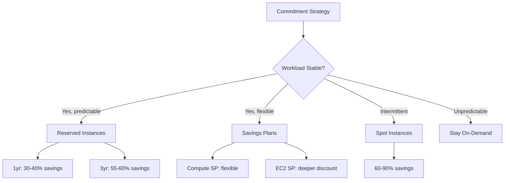

# How to Implement Post-Migration Optimization on AWS

Author: [nawazdhandala](https://github.com/nawazdhandala)

Tags: AWS, Migration, Optimization, Cost Optimization, Right-Sizing

Description: A hands-on guide to optimizing your AWS environment after migration including right-sizing instances, storage optimization, and architectural improvements.

---

The migration is done. Your applications are running on AWS. Now comes the part that most teams skip or delay indefinitely: optimization. The lift-and-shift approach gets you to the cloud fast, but it also means you are probably paying for resources you do not need and missing AWS-native features that could improve performance and reduce costs.

## Why Post-Migration Optimization Matters

Most organizations see their AWS bill increase 20-40% above estimates in the first few months after migration. This happens because:

- On-premises servers were over-provisioned, and those specs were carried over
- Instances run 24/7 even when workloads are intermittent
- Storage was allocated generously and never reclaimed
- No one has implemented auto-scaling yet
- Reserved Instances or Savings Plans have not been purchased

The good news is that 30-50% cost reduction is typical once you optimize properly.

## Phase 1: Right-Sizing Compute

This is usually the biggest win. Start here.

### Gather Utilization Data

Let your workloads run for at least 2 weeks on AWS before right-sizing. You need enough data to understand usage patterns.

```bash
# Use AWS Compute Optimizer to get recommendations
aws compute-optimizer get-ec2-instance-recommendations \
    --filters 'name=Finding,values=OVER_PROVISIONED' \
    --query 'instanceRecommendations[].{
        InstanceId: instanceArn,
        Current: currentInstanceType,
        Recommended: recommendationOptions[0].instanceType,
        CPUMax: utilizationMetrics[?name==`CPU_MAXIMUM`].value | [0],
        MemMax: utilizationMetrics[?name==`MEMORY_MAXIMUM`].value | [0],
        Savings: recommendationOptions[0].estimatedMonthlySavings.value
    }' \
    --output table
```

### Analyze CloudWatch Metrics

```python
import boto3
from datetime import datetime, timedelta

def get_instance_utilization(instance_id, days=14):
    """
    Get CPU and network utilization for an EC2 instance
    over the specified number of days.
    """
    cloudwatch = boto3.client('cloudwatch')
    end_time = datetime.utcnow()
    start_time = end_time - timedelta(days=days)

    # Get CPU utilization
    cpu_response = cloudwatch.get_metric_statistics(
        Namespace='AWS/EC2',
        MetricName='CPUUtilization',
        Dimensions=[{'Name': 'InstanceId', 'Value': instance_id}],
        StartTime=start_time,
        EndTime=end_time,
        Period=3600,  # hourly data points
        Statistics=['Average', 'Maximum']
    )

    datapoints = cpu_response['Datapoints']
    if datapoints:
        avg_cpu = sum(d['Average'] for d in datapoints) / len(datapoints)
        max_cpu = max(d['Maximum'] for d in datapoints)
    else:
        avg_cpu = max_cpu = 0

    return {
        'instance_id': instance_id,
        'avg_cpu': round(avg_cpu, 1),
        'max_cpu': round(max_cpu, 1),
        'data_points': len(datapoints)
    }

# Check all running instances
ec2 = boto3.client('ec2')
instances = ec2.describe_instances(
    Filters=[{'Name': 'instance-state-name', 'Values': ['running']}]
)

for reservation in instances['Reservations']:
    for instance in reservation['Instances']:
        iid = instance['InstanceId']
        itype = instance['InstanceType']
        util = get_instance_utilization(iid)

        # Flag instances with low utilization
        flag = ""
        if util['max_cpu'] < 40:
            flag = " << CANDIDATE FOR DOWNSIZING"

        print(f"{iid} ({itype}): avg={util['avg_cpu']}%, max={util['max_cpu']}%{flag}")
```

### Common Right-Sizing Patterns

| Pattern | Current | Recommended | Typical Savings |
|---------|---------|-------------|-----------------|
| Over-provisioned CPU | m5.2xlarge | m5.xlarge | 50% |
| Memory-heavy workload on general purpose | m5.4xlarge | r5.2xlarge | 30% |
| Burstable workload | m5.large | t3.large | 40% |
| Graviton eligible | m5.xlarge | m7g.xlarge | 20% |

## Phase 2: Storage Optimization

### EBS Volume Right-Sizing

```bash
# Find unattached EBS volumes (wasting money)
aws ec2 describe-volumes \
    --filters 'Name=status,Values=available' \
    --query 'Volumes[].{
        VolumeId: VolumeId,
        Size: Size,
        Type: VolumeType,
        Created: CreateTime
    }' \
    --output table
```

### EBS Volume Type Optimization

Many migrated workloads end up on gp2 volumes when gp3 would be cheaper and faster:

```bash
# Find gp2 volumes that should be converted to gp3
# gp3 is cheaper and has better baseline performance
aws ec2 describe-volumes \
    --filters 'Name=volume-type,Values=gp2' \
    --query 'Volumes[].{
        VolumeId: VolumeId,
        Size: Size,
        IOPS: Iops,
        AZ: AvailabilityZone
    }' \
    --output table

# Convert a gp2 volume to gp3
aws ec2 modify-volume \
    --volume-id vol-0123456789abcdef0 \
    --volume-type gp3 \
    --iops 3000 \
    --throughput 125
```

### S3 Storage Classes

If you migrated files to S3, implement lifecycle policies to move infrequently accessed data to cheaper storage classes:

```json
{
    "Rules": [
        {
            "ID": "OptimizeStorageClasses",
            "Status": "Enabled",
            "Filter": {"Prefix": ""},
            "Transitions": [
                {
                    "Days": 30,
                    "StorageClass": "STANDARD_IA"
                },
                {
                    "Days": 90,
                    "StorageClass": "GLACIER_IR"
                },
                {
                    "Days": 365,
                    "StorageClass": "DEEP_ARCHIVE"
                }
            ]
        }
    ]
}
```

## Phase 3: Implement Auto-Scaling

The single biggest advantage of cloud over on-premises is elasticity. If you are not auto-scaling, you are paying for peak capacity 24/7.

```bash
# Create an Auto Scaling group for your application tier
aws autoscaling create-auto-scaling-group \
    --auto-scaling-group-name app-tier-asg \
    --launch-template LaunchTemplateId=lt-0123456789abcdef0,Version='$Latest' \
    --min-size 2 \
    --max-size 10 \
    --desired-capacity 2 \
    --target-group-arns arn:aws:elasticloadbalancing:us-east-1:123456789012:targetgroup/app-tier/abc123 \
    --vpc-zone-identifier "subnet-abc123,subnet-def456"

# Add CPU-based scaling policy
aws autoscaling put-scaling-policy \
    --auto-scaling-group-name app-tier-asg \
    --policy-name cpu-target-tracking \
    --policy-type TargetTrackingScaling \
    --target-tracking-configuration '{
        "PredefinedMetricSpecification": {
            "PredefinedMetricType": "ASGAverageCPUUtilization"
        },
        "TargetValue": 60.0,
        "ScaleInCooldown": 300,
        "ScaleOutCooldown": 60
    }'
```

## Phase 4: Purchasing Commitments

Once your workloads are right-sized and stable, lock in savings with commitments.



```bash
# Analyze Savings Plans recommendations
aws cost-explorer get-savings-plans-purchase-recommendation \
    --savings-plans-type COMPUTE_SP \
    --term-in-years ONE_YEAR \
    --payment-option NO_UPFRONT \
    --lookback-period-in-days SIXTY_DAYS
```

## Phase 5: Architectural Improvements

After the immediate cost wins, consider architectural changes that leverage AWS-native services.

### Replace Self-Managed Services

| Self-Managed | AWS Managed | Benefit |
|-------------|-------------|---------|
| Redis on EC2 | ElastiCache | No patching, auto-failover |
| RabbitMQ on EC2 | Amazon MQ or SQS | No operational overhead |
| Elasticsearch on EC2 | OpenSearch Service | Managed scaling |
| Nginx load balancer | ALB/NLB | No server management |
| Cron jobs on EC2 | EventBridge + Lambda | Pay per execution |

### Implement Caching

```bash
# Create an ElastiCache Redis cluster for session/data caching
aws elasticache create-replication-group \
    --replication-group-id app-cache \
    --replication-group-description "Application cache" \
    --engine redis \
    --cache-node-type cache.r6g.large \
    --num-cache-clusters 2 \
    --automatic-failover-enabled \
    --cache-subnet-group-name my-cache-subnet-group \
    --security-group-ids sg-0123456789abcdef0
```

## Phase 6: Monitoring and Continuous Optimization

Optimization is not a one-time event. Set up ongoing monitoring to catch waste as it appears.

```bash
# Set up a Cost Anomaly Detection monitor
aws ce create-anomaly-monitor \
    --anomaly-monitor '{
        "MonitorName": "ServiceLevelMonitor",
        "MonitorType": "DIMENSIONAL",
        "MonitorDimension": "SERVICE"
    }'

# Create an alert for cost anomalies
aws ce create-anomaly-subscription \
    --anomaly-subscription '{
        "SubscriptionName": "CostAlerts",
        "MonitorArnList": ["arn:aws:ce::123456789012:anomalymonitor/abc123"],
        "Subscribers": [{"Address": "team@example.com", "Type": "EMAIL"}],
        "Threshold": 100,
        "Frequency": "DAILY"
    }'
```

For comprehensive monitoring of your AWS infrastructure, see our guide on [monitoring Route 53 DNS query logging](https://oneuptime.com/blog/post/2026-02-12-monitor-route-53-dns-query-logging/view).

## The Optimization Timeline

Do not try to do everything at once. Follow this timeline:

- **Week 1-2**: Gather utilization data, identify unattached resources
- **Week 3-4**: Right-size instances, clean up unused resources
- **Month 2**: Implement auto-scaling, convert storage types
- **Month 3**: Purchase Reserved Instances or Savings Plans
- **Month 4-6**: Evaluate managed service replacements
- **Ongoing**: Monthly cost reviews, continuous right-sizing

## Conclusion

Post-migration optimization is where you deliver on the cost savings promised in your migration business case. Start with the quick wins - right-sizing and cleaning up unused resources - then work toward architectural improvements that take full advantage of cloud elasticity. The organizations that treat optimization as an ongoing practice, not a one-time project, consistently achieve the best results.
