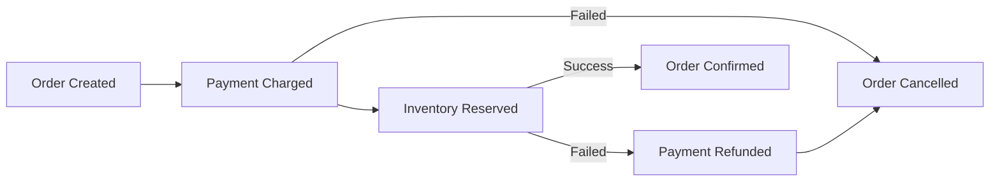

# How to Implement the Saga Pattern with SQS and SNS

Author: [nawazdhandala](https://github.com/nawazdhandala)

Tags: AWS, SQS, SNS, Saga Pattern, Microservices

Description: Learn how to implement the saga pattern for distributed transactions using AWS SQS and SNS to coordinate multi-step workflows across microservices.

---

Distributed transactions are one of the hardest problems in microservices. When a single business operation spans multiple services - like placing an order that needs inventory reservation, payment processing, and shipping coordination - you can't just wrap everything in a database transaction. Each service has its own database, and two-phase commits across services are fragile and slow.

The saga pattern solves this by breaking a distributed transaction into a sequence of local transactions. Each service performs its part and publishes an event. If something fails, compensating transactions undo the previous steps. SQS and SNS on AWS make an excellent foundation for implementing this.

## Understanding the Saga Pattern

There are two flavors of sagas:

**Choreography**: Each service listens for events and decides what to do next. There's no central coordinator. Services react to events and publish their own.

**Orchestration**: A central coordinator (the orchestrator) tells each service what to do and handles the flow logic.

We'll implement the choreography approach since it's a more natural fit for SNS and SQS. The orchestration approach works better with Step Functions, which is a separate topic entirely.

## Our Example: Order Processing

Let's build a saga for processing an e-commerce order with three steps:

1. **Order Service**: Creates the order
2. **Payment Service**: Charges the customer
3. **Inventory Service**: Reserves the items

If payment fails, we cancel the order. If inventory reservation fails, we refund the payment and cancel the order.



## Setting Up the Infrastructure

First, create the SNS topics and SQS queues. Each service gets its own queue, and we use SNS topics for the events.

This Terraform configuration sets up the topics and queues for the saga.

```hcl
# SNS Topics for saga events
resource "aws_sns_topic" "order_created" {
  name = "order-created"
}

resource "aws_sns_topic" "payment_charged" {
  name = "payment-charged"
}

resource "aws_sns_topic" "payment_failed" {
  name = "payment-failed"
}

resource "aws_sns_topic" "inventory_reserved" {
  name = "inventory-reserved"
}

resource "aws_sns_topic" "inventory_failed" {
  name = "inventory-failed"
}

resource "aws_sns_topic" "order_confirmed" {
  name = "order-confirmed"
}

resource "aws_sns_topic" "order_cancelled" {
  name = "order-cancelled"
}

# SQS Queues for each service
resource "aws_sqs_queue" "payment_service" {
  name                       = "payment-service"
  visibility_timeout_seconds = 60
  redrive_policy = jsonencode({
    deadLetterTargetArn = aws_sqs_queue.payment_dlq.arn
    maxReceiveCount     = 3
  })
}

resource "aws_sqs_queue" "payment_dlq" {
  name = "payment-service-dlq"
}

resource "aws_sqs_queue" "inventory_service" {
  name                       = "inventory-service"
  visibility_timeout_seconds = 60
  redrive_policy = jsonencode({
    deadLetterTargetArn = aws_sqs_queue.inventory_dlq.arn
    maxReceiveCount     = 3
  })
}

resource "aws_sqs_queue" "inventory_dlq" {
  name = "inventory-service-dlq"
}

resource "aws_sqs_queue" "order_service" {
  name                       = "order-service"
  visibility_timeout_seconds = 60
}

# Subscribe queues to relevant topics
resource "aws_sns_topic_subscription" "payment_listens_order_created" {
  topic_arn = aws_sns_topic.order_created.arn
  protocol  = "sqs"
  endpoint  = aws_sqs_queue.payment_service.arn
}

resource "aws_sns_topic_subscription" "inventory_listens_payment_charged" {
  topic_arn = aws_sns_topic.payment_charged.arn
  protocol  = "sqs"
  endpoint  = aws_sqs_queue.inventory_service.arn
}

# Compensating: order service listens for failures
resource "aws_sns_topic_subscription" "order_listens_payment_failed" {
  topic_arn = aws_sns_topic.payment_failed.arn
  protocol  = "sqs"
  endpoint  = aws_sqs_queue.order_service.arn
}

resource "aws_sns_topic_subscription" "order_listens_inventory_failed" {
  topic_arn = aws_sns_topic.order_cancelled.arn
  protocol  = "sqs"
  endpoint  = aws_sqs_queue.order_service.arn
}
```

## Implementing the Order Service

The order service kicks off the saga by creating an order and publishing the `order-created` event.

```python
import boto3
import json
import uuid
from datetime import datetime

sns = boto3.client("sns")
dynamodb = boto3.resource("dynamodb")
orders_table = dynamodb.Table("orders")

ORDER_CREATED_TOPIC = "arn:aws:sns:us-east-1:123456789:order-created"

def create_order(customer_id, items, total):
    """Create a new order and start the saga."""
    order_id = str(uuid.uuid4())

    # Step 1: Save the order locally with PENDING status
    orders_table.put_item(Item={
        "order_id": order_id,
        "customer_id": customer_id,
        "items": items,
        "total": str(total),
        "status": "PENDING",
        "created_at": datetime.utcnow().isoformat()
    })

    # Step 2: Publish the event to kick off the saga
    sns.publish(
        TopicArn=ORDER_CREATED_TOPIC,
        Message=json.dumps({
            "order_id": order_id,
            "customer_id": customer_id,
            "items": items,
            "total": total
        }),
        MessageAttributes={
            "event_type": {
                "DataType": "String",
                "StringValue": "order_created"
            }
        }
    )

    return order_id

def handle_compensation(event, context):
    """Lambda handler for compensating transactions."""
    for record in event["Records"]:
        body = json.loads(record["body"])
        message = json.loads(body["Message"])

        event_type = body.get("MessageAttributes", {}).get(
            "event_type", {}
        ).get("Value", "")

        if event_type in ("payment_failed", "order_cancelled"):
            # Cancel the order
            orders_table.update_item(
                Key={"order_id": message["order_id"]},
                UpdateExpression="SET #s = :status",
                ExpressionAttributeNames={"#s": "status"},
                ExpressionAttributeValues={":status": "CANCELLED"}
            )
            print(f"Order {message['order_id']} cancelled")
```

## Implementing the Payment Service

The payment service listens for `order-created` events, processes the payment, and publishes either `payment-charged` or `payment-failed`.

```python
import boto3
import json

sns = boto3.client("sns")
dynamodb = boto3.resource("dynamodb")
payments_table = dynamodb.Table("payments")

PAYMENT_CHARGED_TOPIC = "arn:aws:sns:us-east-1:123456789:payment-charged"
PAYMENT_FAILED_TOPIC = "arn:aws:sns:us-east-1:123456789:payment-failed"

def handle_order_created(event, context):
    """Lambda handler triggered by SQS when an order is created."""
    for record in event["Records"]:
        body = json.loads(record["body"])
        message = json.loads(body["Message"])

        order_id = message["order_id"]
        customer_id = message["customer_id"]
        total = message["total"]

        try:
            # Process payment (your payment logic here)
            charge_id = process_payment(customer_id, total)

            # Save the payment record
            payments_table.put_item(Item={
                "order_id": order_id,
                "charge_id": charge_id,
                "amount": str(total),
                "status": "CHARGED"
            })

            # Publish success event
            sns.publish(
                TopicArn=PAYMENT_CHARGED_TOPIC,
                Message=json.dumps({
                    "order_id": order_id,
                    "charge_id": charge_id,
                    "customer_id": customer_id,
                    "items": message["items"],
                    "total": total
                }),
                MessageAttributes={
                    "event_type": {
                        "DataType": "String",
                        "StringValue": "payment_charged"
                    }
                }
            )

        except PaymentError as e:
            # Publish failure event to trigger compensation
            sns.publish(
                TopicArn=PAYMENT_FAILED_TOPIC,
                Message=json.dumps({
                    "order_id": order_id,
                    "reason": str(e)
                }),
                MessageAttributes={
                    "event_type": {
                        "DataType": "String",
                        "StringValue": "payment_failed"
                    }
                }
            )

def refund_payment(event, context):
    """Compensating transaction - refund a payment."""
    for record in event["Records"]:
        body = json.loads(record["body"])
        message = json.loads(body["Message"])

        order_id = message["order_id"]
        payment = payments_table.get_item(Key={"order_id": order_id})["Item"]

        # Process refund
        process_refund(payment["charge_id"])

        payments_table.update_item(
            Key={"order_id": order_id},
            UpdateExpression="SET #s = :status",
            ExpressionAttributeNames={"#s": "status"},
            ExpressionAttributeValues={":status": "REFUNDED"}
        )
```

## Implementing the Inventory Service

The inventory service is the last step in the happy path.

```python
import boto3
import json

sns = boto3.client("sns")
dynamodb = boto3.resource("dynamodb")
inventory_table = dynamodb.Table("inventory")

INVENTORY_RESERVED_TOPIC = "arn:aws:sns:us-east-1:123456789:inventory-reserved"
INVENTORY_FAILED_TOPIC = "arn:aws:sns:us-east-1:123456789:inventory-failed"
ORDER_CANCELLED_TOPIC = "arn:aws:sns:us-east-1:123456789:order-cancelled"

def handle_payment_charged(event, context):
    """Reserve inventory after payment succeeds."""
    for record in event["Records"]:
        body = json.loads(record["body"])
        message = json.loads(body["Message"])

        order_id = message["order_id"]
        items = message["items"]

        try:
            # Try to reserve each item
            for item in items:
                reserve_item(item["sku"], item["quantity"])

            # All items reserved - publish success
            sns.publish(
                TopicArn=INVENTORY_RESERVED_TOPIC,
                Message=json.dumps({
                    "order_id": order_id,
                    "items": items
                }),
                MessageAttributes={
                    "event_type": {
                        "DataType": "String",
                        "StringValue": "inventory_reserved"
                    }
                }
            )

        except InsufficientStockError as e:
            # Rollback any partial reservations
            for item in items:
                release_item_safe(item["sku"], item["quantity"])

            # Trigger compensation chain
            sns.publish(
                TopicArn=ORDER_CANCELLED_TOPIC,
                Message=json.dumps({
                    "order_id": order_id,
                    "reason": str(e)
                }),
                MessageAttributes={
                    "event_type": {
                        "DataType": "String",
                        "StringValue": "order_cancelled"
                    }
                }
            )
```

## Handling Idempotency

Since SQS can deliver messages more than once, every handler must be idempotent. The simplest approach is to track processed events in DynamoDB.

This helper function ensures each saga step is only executed once per order.

```python
import boto3
from botocore.exceptions import ClientError

dynamodb = boto3.resource("dynamodb")
idempotency_table = dynamodb.Table("saga-idempotency")

def is_already_processed(order_id, step_name):
    """Check if this saga step was already processed for this order."""
    try:
        idempotency_table.put_item(
            Item={
                "pk": f"{order_id}#{step_name}",
                "order_id": order_id,
                "step": step_name
            },
            ConditionExpression="attribute_not_exists(pk)"
        )
        return False  # Not processed yet, we just claimed it
    except ClientError as e:
        if e.response["Error"]["Code"] == "ConditionalCheckFailedException":
            return True  # Already processed
        raise
```

Use it at the top of every handler:

```python
def handle_order_created(event, context):
    for record in event["Records"]:
        body = json.loads(record["body"])
        message = json.loads(body["Message"])

        if is_already_processed(message["order_id"], "payment"):
            print(f"Order {message['order_id']} payment already processed, skipping")
            continue

        # Process payment...
```

## Dead Letter Queue Monitoring

When saga steps fail repeatedly, messages end up in dead letter queues. You need to monitor these actively because a stuck message means a saga is incomplete - the customer's order is in limbo.

Set up CloudWatch alarms on your DLQs to get notified immediately when messages land there. For comprehensive monitoring strategies, see our post on [monitoring SNS with CloudWatch](https://oneuptime.com/blog/post/2026-02-12-monitor-sns-cloudwatch/view).

## Wrapping Up

The saga pattern with SQS and SNS gives you reliable distributed transactions without the brittleness of two-phase commits. Each service owns its data and its compensating logic. SNS handles the event distribution, and SQS provides the reliable buffering. The keys to success are idempotent handlers, thorough compensating transactions, and diligent DLQ monitoring. Start with a simple two-step saga to prove out the pattern, then extend it as your domain requires.
